# 🎬 Comment utiliser Seedance 2.5 pour le cinéma IA (Workflow complet)

> **Chaîne** : [Jack Vs. AI](https://www.youtube.com/@JackVsAI)  
> **Titre original** : `How to use Seedance 2.5 for AI Filmmaking (Full Workflow)`  
> **Lien YouTube** : [https://www.youtube.com/watch?v=YM_2PYIy0FA](https://www.youtube.com/watch?v=YM_2PYIy0FA)  
> **Date de publication** : 2026-08-07  
> **Durée** : 17m 40s (`1060s`)  
> **Identifiant vidéo** : `YM_2PYIy0FA`  
> **Fiche Web Interactive** : [2026-08-07_YT-YM_2PYIy0FA_Comment utiliser Seedance 2.5 pour le cinéma IA (Workflow complet)_by-whisper-v3-large-turbo+gemini-3.5-flash-lite.html](2026-08-07_YT-YM_2PYIy0FA_Comment utiliser Seedance 2.5 pour le cinéma IA (Workflow complet)_by-whisper-v3-large-turbo+gemini-3.5-flash-lite.html)  
> **Captures de démonstration clés** : `58 captures réelles (anti-talking-head)`  
> **Modèles utilisés** : Audio: `large-v3-turbo` (Faster-Whisper int8 VPS) | Vision: `gemini-3.5-flash-lite` (Google AI Studio API)  

---

## 📌 Synthèse Exécutive & Outils

### 📌 Résumé
La vidéo de Jack présente le déploiement majeur de SeaDance 2.5 (développé par ByteDance), un outil de pointe pour le cinéma par IA qui révolutionne la création de contenu vidéo grâce à une capacité de génération prolongée jusqu'à 30 secondes et l'intégration simultanée de jusqu'à 50 références (images, vidéos et audio). Jack démontre que cette mise à jour franchit le cap du simple gadget technologique pour devenir un véritable outil de production visuelle, offrant une cohérence narrative et un respect des prompts inédits. À travers le suivi narratif d'un "explorateur", il expose l'importance cruciale d'une pré-production rigoureuse (écriture de l'histoire, fiches de personnages, accessoires et décors) pour éviter que le modèle d'intelligence artificielle n'ait à deviner les intentions du créateur.

Le workflow complet s'articule autour de l'utilisation conjointe de modèles de langage comme Claude (ou ChatGPT, Gemini, Grok) pour transformer des idées narratives simples en prompts multi-plans techniques ultra-détaillés, intégrant des horodatages et des mouvements de caméra. Ces prompts sont ensuite exécutés sur la plateforme Higgsfield, qui permet d'exploiter SeaDance 2.5 sans contrainte de crédits. En taguant précisément les références visuelles aux moments clés de la génération, les créateurs obtiennent des séquences complexes — telles que des scènes de combat dynamiques, des poursuites fluides ou des transitions d'effets visuels spectaculaires — en une seule prise, évitant ainsi le fastidieux assemblage de multiples clips courts.

Cette avancée technologique offre aux créateurs de films par IA un contrôle sans précédent sur la mise en scène, le respect de la physique du monde et la continuité des personnages. Malgré quelques imperfections mineures relevées par l'analyste (comme de légers changements de couleur des yeux ou des artefacts de flou de mouvement), SeaDance 2.5 s'impose comme une solution incontournable pour professionnaliser la réalisation vidéo assistée par IA, réduisant drastiquement le temps de post-production et ouvrant la voie à des récits visuels ambitieux et immersifs.

### 🛠️ Outils, Modèles & Logiciels Présentés
* **SeaDance 2.5** (développé par ByteDance) : Modèle central de génération vidéo étendu à 30 secondes, capable de combiner jusqu'à 50 références d'images, de vidéos et d'audio pour un contrôle artistique accru.
* **Higgsfield** : Plateforme d'hébergement et d'exécution intégrant SeaDance 2.5 de manière illimitée, permettant aux créateurs de tester le modèle sans consommer de crédits.
* **Claude** (compatible avec ChatGPT, Gemini et Grok) : Assistant textuel doté d'une compétence personnalisée permettant de convertir une simple description narrative en un prompt multi-plans structuré avec horodatages et consignes de caméra.
* **Topaz** : Logiciel mentionné comme solution potentielle d'optimisation et d'amélioration de la résolution ou de la qualité des rendus vidéo finaux.
* **Flux** : Modèle de génération d'images (implicitement utilisé ou évoqué pour la création des fiches de référence visuelles en amont du workflow).

### 🔑 Points Clés & Enseignements Stratégiques
* **Ne jamais négliger la pré-production** : Rédiger l'idée sous forme d'histoire narrative permet d'identifier les incohérences en amont et de préparer des fiches de personnages, d'accessoires et de décors indispensables.
* **Éliminer la phase de devinette de l'IA** : Fournir un contexte visuel riche et structuré évite au modèle SeaDance 2.5 de deviner les éléments, garantissant des résultats plus rapides et conformes aux attentes.
* **Exploiter les assistants textuels pour le prompting** : Utiliser Claude (ou d'autres LLM avec des compétences spécialisées) pour transformer un synopsis en un prompt multi-plans technique intégrant des horodatages et des objectifs précis.
* **Maîtriser la génération longue durée** : Tirer profit de la limite de 30 secondes de SeaDance 2.5 pour concevoir des séquences continues (comme des combats ou des poursuites) sans avoir à assembler manuellement de multiples clips.
* **Utiliser le système de taggage de références** : Insérer la touche arobase (`@`) dans le prompt sur Higgsfield pour associer dynamiquement les fiches de référence (personnages, artefacts) aux moments précis de l'action.
* **Mettre à l'épreuve la compréhension du monde de l'IA** : Tester les capacités du modèle sur des scènes de poursuite complexes pour s'assurer qu'il respecte la logique spatiale (par exemple, maintenir un monstre strictement derrière le protagoniste).
* **Anticiper les transitions narratives** : Veiller à ce que les éléments clés de l'intrigue (comme un piège ou un trou) soient amorcés visuellement dans les plans précédents pour fluidifier le montage global.
* **Accepter les imperfections mineures du flux de mouvement** : Conscientiser que malgré les progrès majeurs, des artefacts de morphing lors de mouvements très intenses ou des variations mineures de détails (comme la couleur des yeux) peuvent encore survenir.
* **Maximiser l'utilisation des 50 références** : Tirer parti de la nouvelle limite d'importation massive (jusqu'à 50 éléments visuels, vidéo et audio) pour injecter une complexité méta et une cohérence accrue dans les décors.
* **Transformer l'IA en véritable outil de production** : Considérer SeaDance 2.5 non pas comme un simple gadget aléatoire, mais comme un instrument de réalisation capable de rivaliser avec des flux de travail VFX traditionnels.

---

## ⏱️ Chronologie & Transcription Complète Audio & Visuelle (Mot pour Mot)

### ⏱️ `[00:00:00 - 00:00:27]` | Segment #01

**🔊 Audio (Transcription Intégrale Mot pour Mot en Français) :**
> C-Dance 2.5 est enfin là, marquant un tournant majeur pour la réalisation de films par IA, car vous pouvez désormais générer des vidéos d'une durée maximale de 30 secondes et combiner jusqu'à 50 références d'images, de vidéos et d'audio, offrant aux utilisateurs un nouveau niveau de contrôle insensé. Je suis Jack, j'ai passé plus d'une décennie à créer des effets visuels pour certaines des plus grandes marques de la planète, et j'utilise maintenant l'IA pour réinventer les flux de travail créatifs.

**👁️ Analyse Visuelle d'Écran (gemini-3.5-flash-lite) :**
**Interface & Outils** : Présentation face caméra et affichage d'un extrait de vidéo générée par IA.

**Contenu textuel & Code** : Texte affiché à l'écran : "30 seconds in length" au centre de la vidéo générée.

**Action / Démonstration** : Le créateur parle face caméra tout en alternant avec un plan visuel illustratif généré par IA démontrant la durée de 30 secondes.

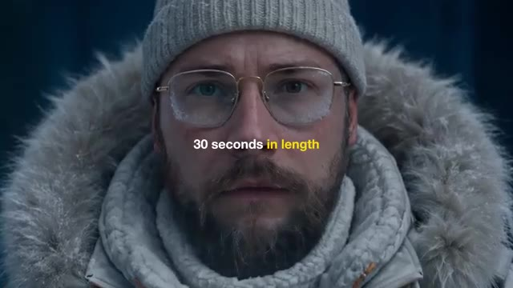
*Extrait vidéo généré montrant un personnage en gros plan avec une capuche et des lunettes givrées dans un décor hivernal, illustrant la génération de séquences vidéo par IA.*

---

### ⏱️ `[00:00:27 - 00:01:04]` | Segment #02

**🔊 Audio (Transcription Intégrale Mot pour Mot en Français) :**
> Dans la vidéo d'aujourd'hui, nous allons plonger en profondeur dans Sea Dance 2.5, pour que vous repartiez en sachant exactement comment obtenir les résultats les plus incroyables de ce nouveau nouvel outil. Si vous appréciez le contenu d'aujourd'hui, n'oubliez pas de lâcher un pouce bleu pour moi et pensez à vous abonner. Bon, passons aux choses sérieuses. Donc, plutôt que de vous balancer une série de tests aléatoires et décousus, j'ai voulu aborder la version 2.5 d'une manière unique. Vous avez déjà rencontré l'explorateur dans l'intro de cette vidéo, et je me suis dit que ce serait intéressant de continuer à raconter son histoire. Et avec chaque scène, nous testerons une nouvelle fonctionnalité ou une fonctionnalité améliorée qui est sortie avec Seedance 2.5. Et assurez-vous vraiment de rester dans les parages.

**👁️ Analyse Visuelle d'Écran (gemini-3.5-flash-lite) :**
**Interface & Outils** : Vidéo générée par IA (Seedance 2.5) illustrant une narration de science-fiction, avec incrustation PiP du créateur (Jack Vs. AI) dans l'image 3.

**Contenu textuel & Code** : Aucun texte ou prompt textuel visible à l'écran, uniquement les sous-titres automatiques en anglais ("we'll take a deep dive") sur l'image 1 et les animations d'appel à l'action (pouce bleu, abonnement) sur l'image 2.

**Action / Démonstration** : Démonstration visuelle des capacités de génération vidéo de Seedance 2.5 à travers une histoire narrative mettant en scène un explorateur dans différents environnements (grotte de glace, jungle).

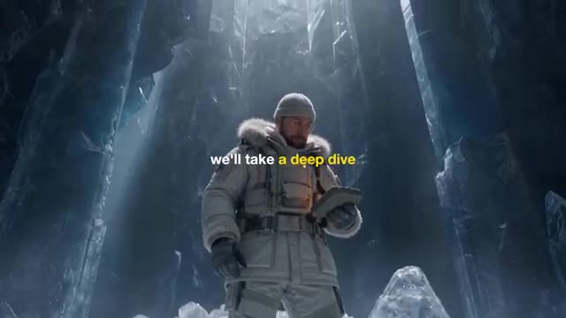
*Scène narrative générée par IA montrant un explorateur dans une caverne de glace avec une tablette à la main.*

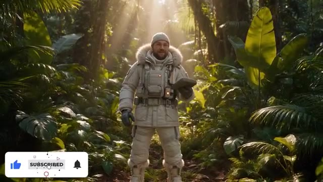
*Scène narrative générée par IA montrant l'explorateur dans une jungle luxuriante avec des rayons de soleil traversant la canopée.*

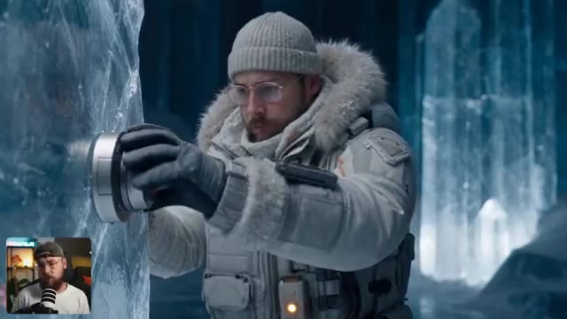
*Gros plan sur l'explorateur en train d'interagir avec un appareil technologique fixé sur un bloc de glace, avec le créateur en incrustation PiP dans le coin inférieur gauche.*

---

### ⏱️ `[00:01:04 - 00:01:39]` | Segment #03

**🔊 Audio (Transcription Intégrale Mot pour Mot en Français) :**
> jusqu'à la fin de la vidéo pour voir comment se termine l'histoire de l'explorateur. Mais d'abord, parlons d'une erreur que je vois beaucoup de nouveaux créateurs commettre, et c'est de se précipiter ou d'omettre la phase de pré-production. C'est vraiment là que vous posez les bases d'un projet réussi, je recommanderais donc d'abord d'écrire votre idée. Essayez de l'écrire comme une histoire car cela permettra de rendre évidentes toutes les lacunes ou incohérences afin que vous puissiez les résoudre maintenant plutôt que plus tard. Vous allez également identifier quels personnages, accessoires et décors vous aurez besoin pour raconter votre histoire.

**👁️ Analyse Visuelle d'Écran (gemini-3.5-flash-lite) :**
**Interface & Outils** : Notion (logiciel de prise de notes et gestion de projet) et écran de transition graphique.

**Contenu textuel & Code** : Texte à l'écran dans Notion détaillant le script du film : 'Scene 1: The artefact', 'We open on a brutal Arctic wasteland...', 'Scene 2: The natives', 'Scene 3: The chase', 'Scene 4: The truth'. Sur l'image 2 : 'step one pre-production'.

**Action / Démonstration** : Le créateur présente visuellement les différentes étapes de la pré-production en affichant son script rédigé sur Notion et des illustrations de son projet vidéo.

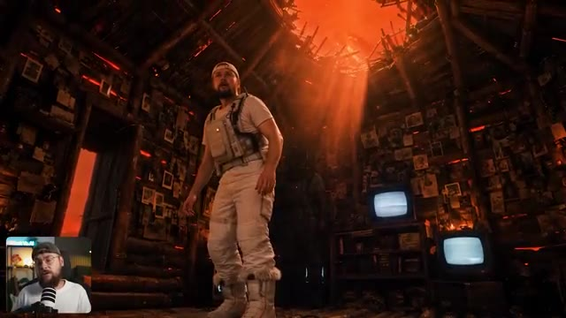
*Extrait de vidéo générée montrant un explorateur dans une cabane en bois sous un trou de toit percé par une lumière incandescente, avec une incrustation de Jack en bas à gauche.*

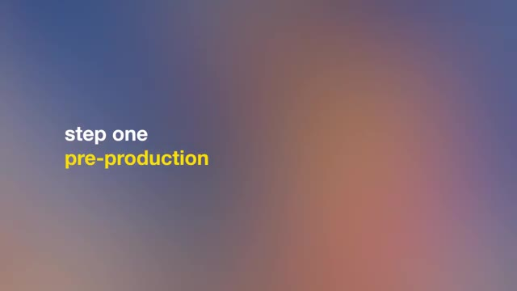
*Écran de transition textuel sur fond flou bleu et rose indiquant 'step one pre-production'.*

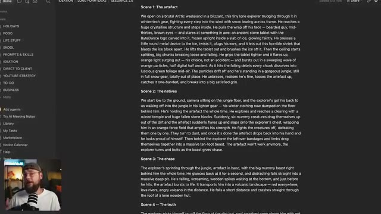
*Interface de l'application Notion affichant le scénario détaillé en plusieurs scènes ('Scene 1: The artefact', 'Scene 2: The natives', etc.) avec une vue miniature de Jack en bas à gauche.*

---

### ⏱️ `[00:01:39 - 00:02:12]` | Segment #04

**🔊 Audio (Transcription Intégrale Mot pour Mot en Français) :**
> Avec ces connaissances, vous pouvez aller de l'avant et créer une collection de fiches de personnages, de références d'accessoires et de photos de lieux. Tout cela fournira un niveau de contexte crucial pour C-Dance 2.5, ce qui signifie que vous obtiendrez les résultats souhaités plus rapidement car le modèle n'a pas à deviner. Le travail prépar étant fait, nous sommes prêts à commencer à générer nos vidéos. Pour mettre le nouvel outil de ByteDance à l'épreuve, je suis sur Higgsfield, qui vient d'ajouter C-Dance 2.5 de manière illimitée afin que vous puissiez exécuter le modèle sans dépenser vos crédits. Vous trouverez un lien en bas dans la description.

**👁️ Analyse Visuelle d'Écran (gemini-3.5-flash-lite) :**
**Interface & Outils** : Navigateur web affichant l'interface de la plateforme Higgsfield avec divers outils d'IA générative vidéo et image (Seedance 2.5, Seedance 2.0, Supercomputer, Cinema Studio 3.5).

**Contenu textuel & Code** : Textes visibles : "SEEDANCE 2.5 IS LIVE NOW", "SEEDANCE 2.5 & SEEDANCE 2.0 30% OFF 7-DAY UNLIMITED ACCESS", "Seedance 2.5 - The most advanced video model", "Describe the scene you imagine", "Seedream 5.0 Pro". Le créateur apparaît également en incrustation (Picture-in-Picture) dans le coin inférieur gauche.

**Action / Démonstration** : Navigation sur la plateforme web de Higgsfield pour présenter les différentes options du modèle Seedance 2.5 et ses offres d'accès illimité.

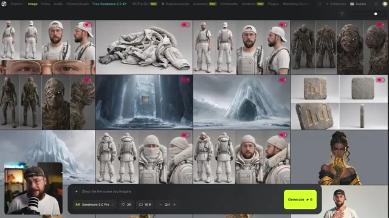
*Interface de la plateforme montrant une grille d'images de référence de personnages et de décors (fiches de personnages, accessoires, paysages enneigés).*

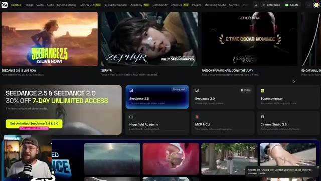
*Page d'accueil de la plateforme Higgsfield mettant en avant l'accès illimité à Seedance 2.5 et Seedance 2.0.*

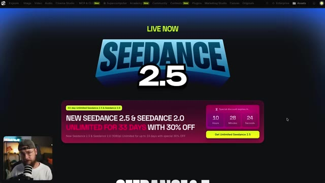
*Page de présentation de Seedance 2.5 avec une offre promotionnelle de réduction de 30 % pour un accès illimité.*

---

### ⏱️ `[00:02:12 - 00:02:46]` | Segment #05

**🔊 Audio (Transcription Intégrale Mot pour Mot en Français) :**
> si vous vouliez vraiment essayer cela et suivre en même temps. Donc avec 2.5 sélectionné, nous voulons d'abord importer des références qui peuvent être des fichiers image, vidéo et audio, mais pour cet exemple, nous allons commencer un peu plus simplement et nous en tenir aux images. J'ai donc importé ces feuilles de référence que j'ai générées plus tôt et nous devons maintenant commencer à travailler sur notre prompt. Je suis donc passé sur Claude et j'ai importé cette compétence personnalisée que j'ai créée aux côtés de ces mêmes références et ne vous inquiétez pas, vous pouvez télécharger cette compétence tout à fait gratuitement sur ma communauté School et elle sera également

**👁️ Analyse Visuelle d'Écran (gemini-3.5-flash-lite) :**
**Interface & Outils** : Interface web de Claude avec un champ de saisie, un fichier markdown ("Seedance_2.5_Multishot_Prompt_Skill_NEW.md") et plusieurs images de référence téléchargées.

**Contenu textuel & Code** : Texte visible : "Happy Friday, Jack", nom du fichier "Seedance_2.5_Multishot_Prompt_Skill_NEW.md", "type / for skills", "Opus 4.8 Medium".

**Action / Démonstration** : Jack montre l'interface de Claude où il a importé un fichier de compétence personnalisé et des images de référence pour préparer son prompt.

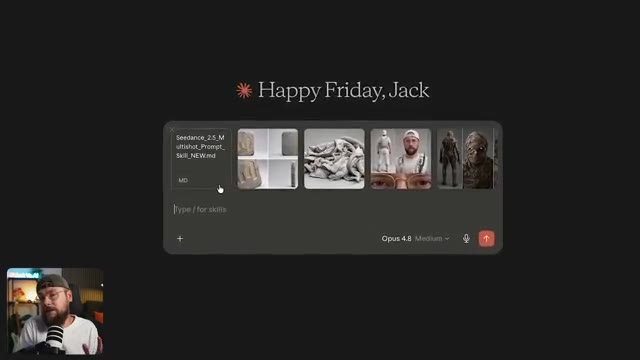
*Interface de l'outil Claude avec un encadré PiP montrant Jack dans son studio, affichant un fichier de compétence markdown importé ainsi que plusieurs images de référence.*

---

### ⏱️ `[00:02:46 - 00:03:15]` | Segment #06

**🔊 Audio (Transcription Intégrale Mot pour Mot en Français) :**
> travailler avec ChatGPT, Gemini et Grok. Alors qu'est-ce qu'on veut vraiment qu'il se passe dans cette scène ? Je pense que je vais générer une séquence de combat parce que ce sera un excellent exemple de la façon dont 2.5 gère les mouvements complexes, le respect des prompts et cette nouvelle longueur de génération de 30 secondes. J'ai rédigé une description approximative de ce que je veux qu'il se passe et je n'ai pas eu à m'inquiéter des détails techniques comme la longueur des plans ou les angles de caméra. Comme je l'ai dit plus tôt, je viens de l'écrire comme une histoire.

**👁️ Analyse Visuelle d'Écran (gemini-3.5-flash-lite) :**
**Interface & Outils** : Interface de l'assistant IA Claude (Anthropic, modèle Opus 4.8).

**Contenu textuel & Code** : Texte du prompt visible à l'écran : "Using the attached .md file write a prompt for the below scene... We start low to the ground, camera sitting on the jungle floor, and the explorer's got his back to us walking off into the jungle in his lighter gear — his winter clothing now dumped on the floor behind him. He's holding the artefact the whole time. He explores and reaches a clearing with a ruined temple and huge fallen stone blocks. Suddenly, six mummy creatures drag themselves out of the dirt and the artefact suddenly flares up and slaps onto the explorer's chest, wrapping him in an orange force field that amplifies his strength. He fights the creatures off, defeating them one by one. They turn to dust, and once it's done the artefact drops back into his hand and he looks proud of himself. Then behind the explorer the leftover bandages and limbs drag themselves together into a massive ten-foot beast. The artefact won't work anymore, the explorer turns and bolts as the beast gives chase." En haut, des fichiers joints incluant "Seedance_2.5_Multishot_Prompt_Skill_NEW.md" et plusieurs images de référence (artefact, vêtements, personnage, créatures).

**Action / Démonstration** : Le créateur montre son écran où il rédige et peaufine le prompt textuel dans Claude pour décrire la séquence narrative souhaitée, incluant les mouvements de caméra et l'action des personnages.

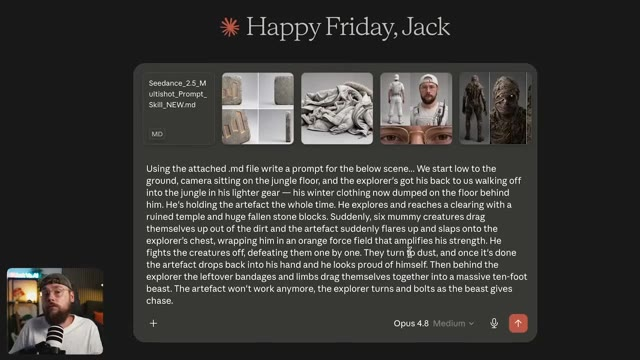
*Interface de Claude (version Opus 4.8) montrant une invite textuelle détaillée pour la génération d'une scène de combat dans la jungle avec des créatures momifiées, accompagnée de plusieurs fichiers joints et images de référence.*

---

### ⏱️ `[00:03:15 - 00:03:36]` | Segment #07

**🔊 Audio (Transcription Intégrale Mot pour Mot en Français) :**
> Et une fois que j'aurai envoyé ceci, Claude va le convertir en un prompt multi-plans, qui contient des horodatages, des objectifs, des mouvements de caméra et des descriptions de toutes les actions qui se déroulent. Donc une fois que nous avons notre prompt, nous pouvons le copier et le déposer dans Higgsfield. Je recommande également de taguer vos références en appuyant sur la touche arobase aux moments pertinents.

**👁️ Analyse Visuelle d'Écran (gemini-3.5-flash-lite) :**
**Interface & Outils** : Interface web de l'outil de génération de vidéo (Seedance 2.5) avec panneau de prompt textuel et zone de sélection des références visuelles.

**Contenu textuel & Code** : Texte du prompt visible décrivant un plan en contre-plongée avec un explorateur barbu s'éloignant dans une forêt tropicale. Mentions du modèle Seedance 2.5 et options "@ Elements".

**Action / Démonstration** : Le curseur de la souris survole le texte du prompt dans l'interface de l'outil de génération pendant que le créateur commente les instructions de tagging.

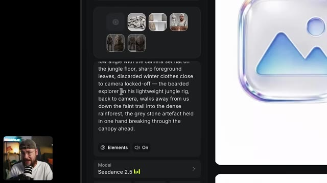
*Interface de l'outil de génération vidéo affichant un prompt textuel détaillé et la sélection du modèle Seedance 2.5, avec le créateur en incrustation (PiP).*

---

### ⏱️ `[00:03:36 - 00:04:25]` | Segment #08

**🔊 Audio (Transcription Intégrale Mot pour Mot en Français) :**
> Par exemple, la première fois que nous voyons l'explorateur, je vais taguer sa fiche de référence de personnage. La première fois que nous voyons l'artefact en pierre, je vais taguer la référence de celui-ci et ainsi de suite. Une fois que tout est configuré, nous pouvons aller de l'avant et cliquer sur générer, puis jeter un œil aux résultats. C'est donc une très belle démonstration de la version 2.5 ici.

**👁️ Analyse Visuelle d'Écran (gemini-3.5-flash-lite) :**
**Interface & Outils** : Démonstration vidéo de résultats générés par IA (Upscaling Topaz 4K) illustrant le tutoriel de l'outil de génération vidéo.

**Contenu textuel & Code** : Mention "Topaz 4k upscale" visible dans le coin inférieur droit des séquences vidéo générées par IA.

**Action / Démonstration** : Présentation à l'écran de clips vidéo générés par intelligence artificielle illustrant le processus de génération et d'amélioration d'échelle (upscaling) de scènes d'exploration dans la jungle.

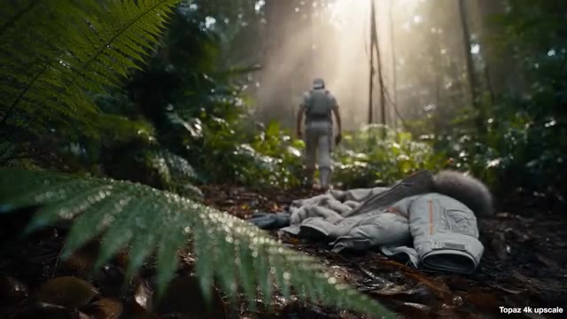
*Vidéo générée par IA montrant un explorateur marchant dans une jungle luxuriante sous des rayons de soleil traversant la canopée, avec une veste posée au premier plan sur le sol et la mention "Topaz 4k upscale" en bas à droite.*

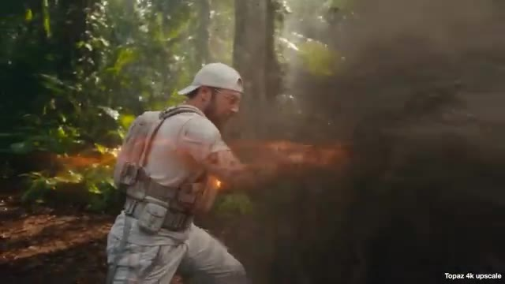
*Vidéo générée par IA montrant l'explorateur en tenue de baroudeur interagissant avec une paroi rocheuse dans une jungle, avec des effets de particules lumineuses et la mention "Topaz 4k upscale" en bas à droite.*

---

### ⏱️ `[00:04:25 - 00:04:46]` | Segment #09

**🔊 Audio (Transcription Intégrale Mot pour Mot en Français) :**
> La scène de combat elle-même semble fluide et dynamique et on ressent vraiment le poids de ces coups de pied et de poing. Il y a aussi des choses assez complexes qui se passieren avec l'artefact en pierre. La façon dont il se fixe sur la poitrine de l'explorateur. Le moment où l'explorateur le lance en l'air et où le logo atterrit effectivement dans le bon sens.

**👁️ Analyse Visuelle d'Écran (gemini-3.5-flash-lite) :**
**Interface & Outils** : Présentation de séquences vidéo générées par intelligence artificielle avec incrustation du créateur (PiP) en bas à gauche.

**Contenu textuel & Code** : Séquences vidéo d'une scène de combat dans la jungle et manipulation d'un artefact en pierre.

**Action / Démonstration** : L'explorateur réalise des mouvements de combat dynamiques puis manipule un artefact en pierre dans un environnement de jungle.

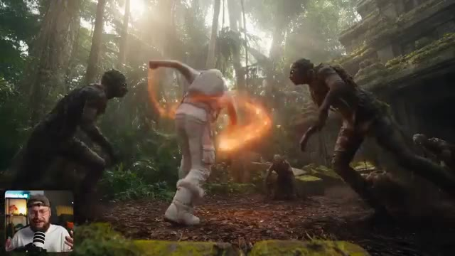
*Scène d'action générée par IA montrant un explorateur effectuant un mouvement de combat fluide avec des effets lumineux dans une jungle.*

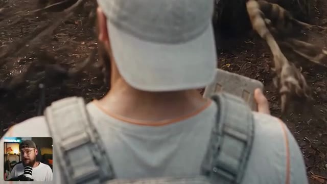
*Gros plan de dos sur l'explorateur tenant l'artefact en pierre dans une scène de jungle.*

---

### ⏱️ `[00:04:46 - 00:05:05]` | Segment #10

**🔊 Audio (Transcription Intégrale Mot pour Mot en Français) :**
> Le plan d'effet visuel où les momies vaincues se réassemblent pour former une sorte de version boss a l'air incroyable. Et j'adore vraiment la performance que donne l'explorateur lorsqu'il tape en quelque sorte l'artefact contre sa poitrine. Essayant de réactiver ses pouvoirs et malheureusement pour lui, sans y parvenir.

**👁️ Analyse Visuelle d'Écran (gemini-3.5-flash-lite) :**
**Interface & Outils** : Incrustation d'un extrait vidéo de démonstration (picture-in-picture) avec le présentateur Jack en bas à gauche.

**Contenu textuel & Code** : Aucun texte ou interface de logiciel visible, seulement la vidéo générée par IA présentant une créature monstrueuse composée de momies face à un explorateur de dos.

**Action / Démonstration** : L'explorateur fait face à la créature monstrueuse dans un décor de ruines de temple.

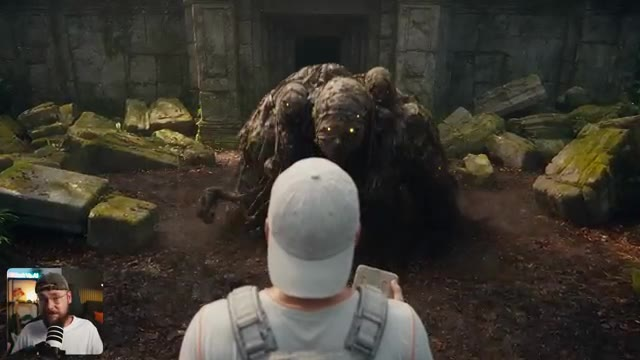
*Extrait vidéo montrant un explorateur de dos face à une imposante créature constituée de momies assemblées aux yeux luisants, avec un petit encadré PiP du présentateur en bas à gauche.*

---

### ⏱️ `[00:05:05 - 00:05:39]` | Segment #11

**🔊 Audio (Transcription Intégrale Mot pour Mot en Français) :**
> Si je veux être hypercritique, on dirait bien que la couleur de mes yeux change sur ce plan final. Ils ont l'air bleus pour moi alors qu'ils devraient être marron. Et il y a un peu de morphing pendant ces moments de flou de mouvement très intenses. Malgré tout, être capable de créer cette scène entière sans avoir à assembler plusieurs générations est vraiment impressionnant. C'est le genre d'avancée qui prouve que l'IA n'est plus un gadget mais bien un véritable outil de production. Le prochain test, je veux générer une séquence de poursuite et on va être un peu plus ambitieux avec ça.

**👁️ Analyse Visuelle d'Écran (gemini-3.5-flash-lite) :**
**Interface & Outils** : Incrustation vidéo (PiP) du créateur dans le coin inférieur gauche sur une scène générée par IA.

**Contenu textuel & Code** : Scène fantastique de jungle avec des créatures humanoïdes et un personnage effectuant un mouvement rapide avec un effet de traînée lumineuse.

**Action / Démonstration** : Le personnage exécute un mouvement de combat rapide généré par IA dans un décor tropical, illustrant le flou de mouvement mentionné dans le commentaire.

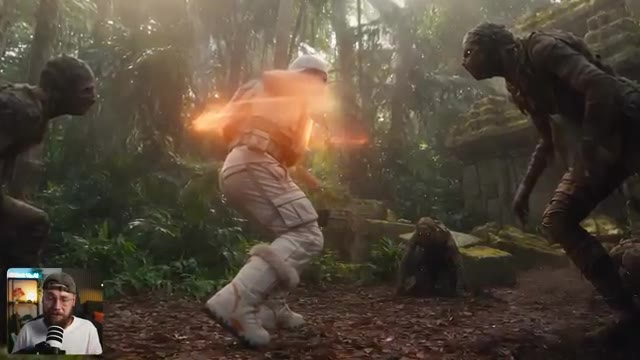
*Extrait vidéo généré par IA montrant un personnage en tenue claire affrontant des créatures dans une jungle, avec le créateur en incrustation PiP dans le coin inférieur gauche.*

---

### ⏱️ `[00:05:39 - 00:06:05]` | Segment #12

**🔊 Audio (Transcription Intégrale Mot pour Mot en Français) :**
> scène en voyant à quel point 2.5 peut appliquer la compréhension du monde. Je veux que l'explorateur soit poursuivi par cette immense momie, il est donc important que 2.5 garde toujours le monstre derrière l'explorateur. Je veux aussi que l'explorateur tombe dans un trou qui a été piégé, et bien que tout cela paraisse assez simple en surface, il y a beaucoup d'éléments mobiles ici et de choses qui peuvent mal tourner. L'adhésion au prompt est un autre facteur.

**👁️ Analyse Visuelle d'Écran (gemini-3.5-flash-lite) :**
**Interface & Outils** : Interface web d'un outil de génération d'images (type ChatGPT / GPT Image 2) avec un panneau latéral droit affichant le prompt, le modèle, la résolution et les options.

**Contenu textuel & Code** : Texte du prompt visible sur l'image #2 : "Photorealistic character reference sheet - four views on a neutral grey studio background. Hyper-realistic, shot on a full-frame camera with an 85mm lens, medium depth of field, sharp tactile detail - indistinguishable from a photograph of a...". Texte sur l'image #4 décrivant l'explorateur en équipement de survie. Paramètres : Modèle "GPT Image 2", Qualité "High", Taille "2688x1520".

**Action / Démonstration** : Le créateur présente des feuilles de référence de personnages générées par IA pour les besoins de sa démonstration vidéo.

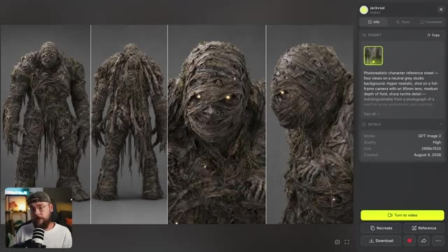
*Interface de génération d'images montrant une feuille de référence de personnage pour une momie monstrueuse.*

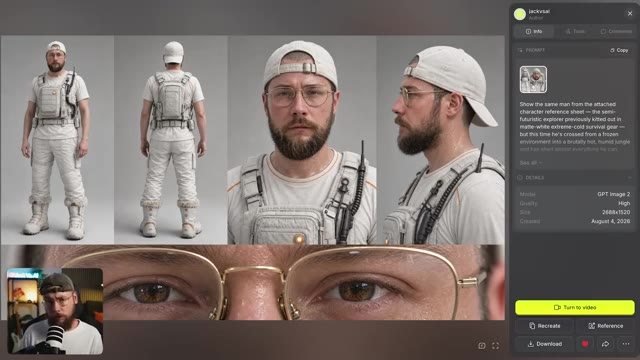
*Interface de génération d'images montrant une feuille de référence de personnage pour l'explorateur (Jack).*

---

### ⏱️ `[00:06:06 - 00:06:25]` | Segment #13

**🔊 Audio (Transcription Intégrale Mot pour Mot en Français) :**
> ByteDance dit qu'ils se sont améliorés, alors nous mettons cela à l'épreuve. Encore une fois, j'ai déposé ma description de la scène ainsi que mes références dans Claude. J'ai pris le prompt qu'il a écrit pour moi et je l'ai collé dans Higgsfield. J'ai également ajouté mes références d'images, que j'allais taguer tout au long du prompt. Alors cliquons sur générer et jetons un œil au résultat.

**👁️ Analyse Visuelle d'Écran (gemini-3.5-flash-lite) :**
**Interface & Outils** : Claude (avec incrustation PiP du créateur en bas à gauche)

**Contenu textuel & Code** : Texte affichant les différents plans horodatés de [00:00 - 00:03] jusqu'à [00:21 - 00:26] avec des descriptions détaillées de plans cinématographiques (objectifs, mouvements de caméra, descriptions de scènes avec balises de référence comme @55f69d03...). En bas, la barre de message de l'IA indique "Opus 4.8 Medium".

**Action / Démonstration** : Le créateur montre l'interface de Claude où le texte des prompts structurés a été généré pour la vidéo.

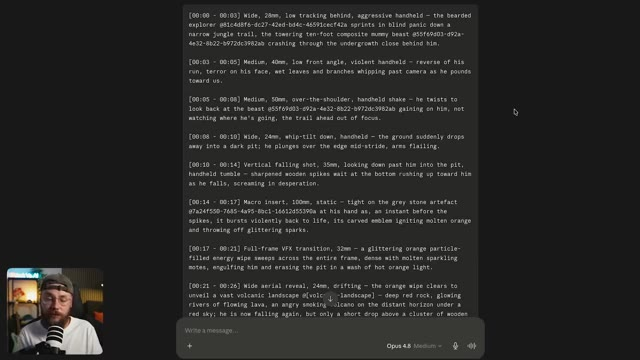
*Interface de l'application Claude affichant les prompts générés pour différentes séquences temporelles de la vidéo, avec la webcam du créateur incrustée en bas à gauche.*

---

### ⏱️ `[00:06:29 - 00:07:00]` | Segment #14

**🔊 Audio (Transcription Intégrale Mot pour Mot en Français) :**
> Une autre génération impressionnante ici qui correspond plutôt bien à ce que nous recherchons.

**👁️ Analyse Visuelle d'Écran (gemini-3.5-flash-lite) :**
**Interface & Outils** : Rendu vidéo généré par IA amélioré via Topopaz 4k upscale (aucune interface de logiciel visible, uniquement le rendu vidéo final).

**Contenu textuel & Code** : Rendu vidéo haute résolution de scènes fantastiques générées par intelligence artificielle (jungle, vortex cosmique, paysage volcanique).

**Action / Démonstration** : Démonstration visuelle de différents clips vidéo générés par IA illustrant les propos du créateur sur la qualité des générations.

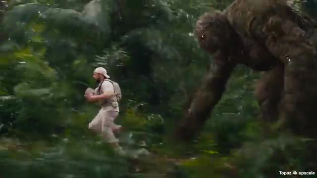
*Génération vidéo IA montrant un explorateur poursuivi par une créature monstrueuse dans la jungle, avec un watermark 'Topopaz 4k upscale' en bas à droite.*

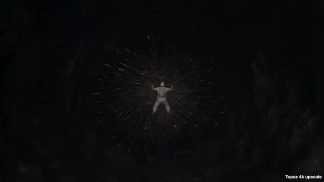
*Génération vidéo IA montrant un personnage flottant au centre d'un vortex de particules lumineuses, avec le watermark 'Topaz 4k upscale'.*

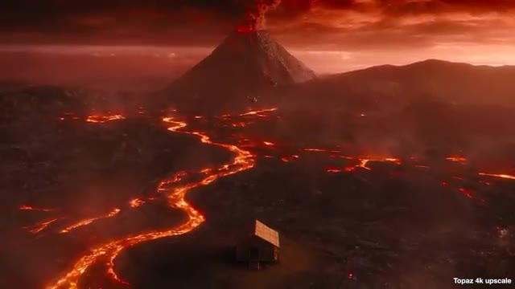
*Génération vidéo IA montrant un paysage volcanique avec des rivières de lave et un volcan en éruption surplombant une petite cabane, avec le watermark 'Topaz 4k upscale'.*

---

### ⏱️ `[00:07:00 - 00:07:28]` | Segment #15

**🔊 Audio (Transcription Intégrale Mot pour Mot en Français) :**
> 2,5 fonctionne bien avec nos prompts pour créer une scène qui donne envie d'être regardée et qui atteint tous ces moments clés. Cependant, dans le plan juste avant que l'explorateur ne tombe dans le trou, ça aurait été bien que 2,5 annonce un peu la couleur en montrant réellement le trou dans le plan précédent, car pour l'instant, ça coupe directement pour le retrouver tout au bord du trou. Je pense qu'on s'en sort assez bien simplement grâce à la rapidité de la scène. Ce n'est pas vraiment un problème rédhibitoire.

**👁️ Analyse Visuelle d'Écran (gemini-3.5-flash-lite) :**
**Interface & Outils** : Présentation vidéo avec incrustation Picture-in-Picture (PiP) du créateur (Jack) dans le coin inférieur gauche.

**Contenu textuel & Code** : Séquence vidéo générée par IA illustrant une scène d'action dans la jungle (explorateur poursuivi par un monstre puis tombant dans un gouffre).

**Action / Démonstration** : Le créateur commente la vidéo à l'écran tandis que les images de la scène générée s'enchaînent pour illustrer son propos sur la mise en scène et la continuité.

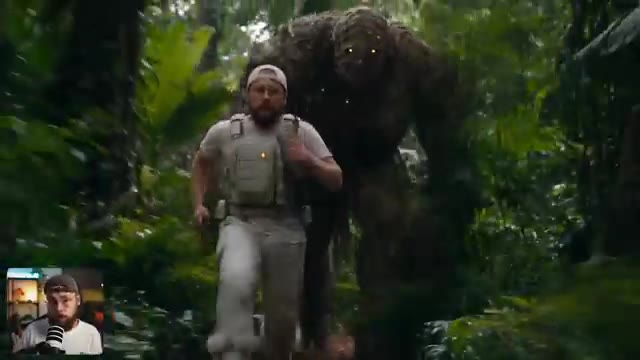
*Extrait vidéo de la scène générée montrant un explorateur poursuivi par une créature monstrueuse dans la jungle, avec un petit encadré PiP de Jack en bas à gauche.*

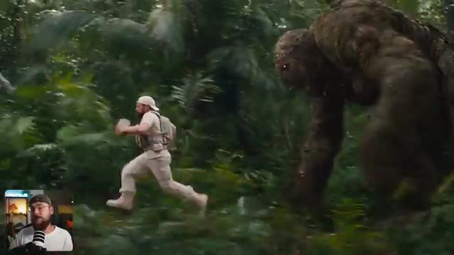
*Extrait vidéo montrant l'explorateur en train de courir à travers la végétation dense poursuivi par le monstre, avec Jack en incrustation PiP.*

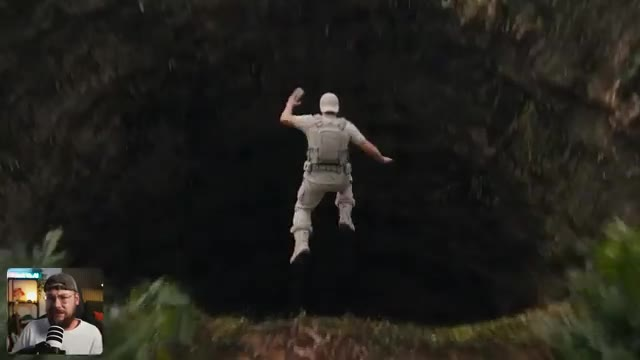
*Extrait vidéo montrant l'explorateur en train de tomber dans un grand trou noir dans la jungle, avec l'encadré PiP de Jack en bas à gauche.*

---

### ⏱️ `[00:07:28 - 00:07:49]` | Segment #16

**🔊 Audio (Transcription Intégrale Mot pour Mot en Français) :**
> Je ne suis pas non plus vraiment fan de la façon dont l'explorateur tient l'artefact dans ce gros plan, alors qu'il devrait en réalité s'y accrocher désespérément. Mais le côté VFX de la scène, y compris la transition vers ce paysage volcanique, est vraiment très réussi. La façon dont l'explorateur tombe puis s'écrase dans cette hutte est tout simplement incroyable.

**👁️ Analyse Visuelle d'Écran (gemini-3.5-flash-lite) :**
**Interface & Outils** : Présentation vidéo avec incrustation PiP du créateur en bas à gauche.

**Contenu textuel & Code** : Séquence vidéo générée montrant un personnage en tenue d'explorateur tombant sur le toit d'une hutte en bois, sur fond de ciel rouge orangé aux teintes volcaniques.

**Action / Démonstration** : Le personnage s'écrase sur la toiture de la cabane, illustrant la scène analysée par le créateur.

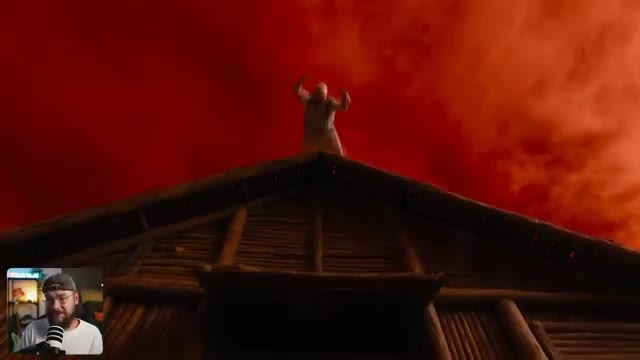
*Extrait vidéo montrant l'explorateur en train de s'écraser sur le toit d'une hutte sous un ciel volcanique rouge, avec le créateur incrusté en bas à gauche (PiP).*

---

### ⏱️ `[00:07:50 - 00:08:26]` | Segment #17

**🔊 Audio (Transcription Intégrale Mot pour Mot en Français) :**
> Et ça a toujours été le point fort de Sea Dance, de gérer ces séquences lourdes en effets visuels. Maintenant, comme je l'ai mentionné dans l'intro, nous pouvons désormais importer jusqu'à 50 images, vidéos et références audio à utiliser dans nos générations. Et j'ai eu une petite idée méta pour ce qui pourrait se passer à l'intérieur de la cabane où notre explorateur vient de tomber. Je veux qu'elle soit recouverte de photos provenant de différentes scènes du film, comme si l'explorateur avait été suivi tout le temps. Et je pense qu'on va même montrer une version alternative de l'explorateur qui est piégé dans ce paysage volcanique depuis des années.

**👁️ Analyse Visuelle d'Écran (gemini-3.5-flash-lite) :**
**Interface & Outils** : Interface web de génération d'image et vidéo par IA (style plateforme de création/partage avec panneau latéral d'informations, prompts et options comme "Turn to video", "Recreate", "Reference", "Download").

**Contenu textuel & Code** : Panneau latéral affichant les détails de génération ("Model: GPT Image 2", "Quality: High", "Size: 2688x1520", "Created: August 5, 2026") et des prompts textuels décrivant des rendus photographiques réalistes ("Take the attached image and render it as a single old, battered physical photographic print..." / "Character reference sheet — five views on a neutral grey background...").

**Action / Démonstration** : Le créateur présente à l'écran des exemples d'images générées par IA illustrant ses idées créatives pour le film, avec son flux vidéo en incrustation (PiP) dans le coin inférieur gauche.

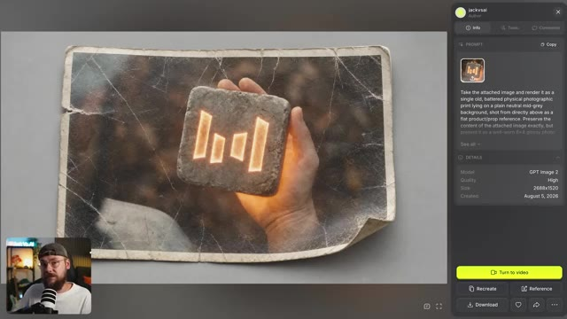
*Interface logicielle montrant une image générée d'une ancienne photo usée représentant des mains tenant une pierre lumineuse, avec le panneau de configuration latéral et le créateur incrusté en bas à gauche.*

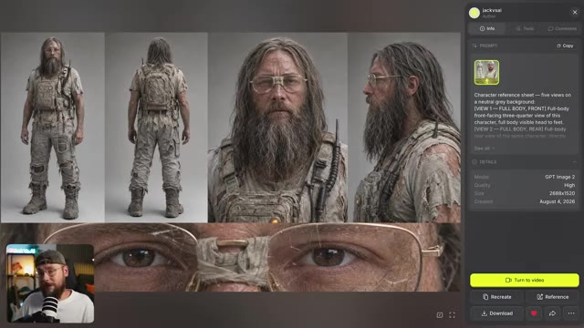
*Interface logicielle affichant une feuille de référence de personnage avec plusieurs vues (plein pied, dos, visages) d'un explorateur aux cheveux longs et barbu avec des lunettes et des vêtements déchirés.*

---

### ⏱️ `[00:08:26 - 00:09:04]` | Segment #18

**🔊 Audio (Transcription Intégrale Mot pour Mot en Français) :**
> Je veux que l'explorateur découvre que tout ce qui lui est arrivé était le résultat d'un prompt, donc il n'a jamais vraiment été maître de son propre destin. Ce que j'aime dans cette scène, c'est qu'elle va nous permettre de balancer une tonne de références différentes à 2.5, alors on va essayer de couvrir les murs de la cabane avec ces photos. Je vais aussi télécharger quelques clips vidéo de moi en train de travailler sur le film d'IA. Voyons si on peut les faire diffuser sur de petits écrans de télévision. J'ai une référence audio d'une chanson flippante que j'ai générée sur Suno et quelques lignes de dialogue que j'enregistrerais moi-même pour le...

**👁️ Analyse Visuelle d'Écran (gemini-3.5-flash-lite) :**
**Interface & Outils** : Interface logicielle de génération vidéo par IA (type Seedance / Kling) avec zone de prompt, panneaux d'éléments multimédias (miniatures vidéo et formes d'onde audio) et incrustation vidéo (PiP) du créateur.

**Contenu textuel & Code** : Texte visible dans le bloc Prompt : "[00:00 - 00:05] Interior, wide, 28mm, low angle, slow handheld rise — inside the rounded-log cabin 🍎 @Image 1 (use as environment reference only: do not use as a starting frame, do not inherit the composition, the angle or the colour — take only the space and the texture), hot red volcanic glow pouring through the smashed hole in the roof". Icônes d'éléments "@ Elements" et de son "🔊 On".

**Action / Démonstration** : Le créateur présente l'interface d'un outil de prompt vidéo, illustrant la configuration d'un plan avec des références d'environnement et des consignes textuelles précises.

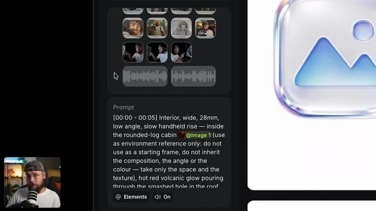
*Capture d'écran montrant l'interface d'un outil de génération vidéo par IA avec un champ de prompt textuel, des miniatures de clips et un encadré PiP de Jack en bas à gauche.*

---

### ⏱️ `[00:09:04 - 00:09:48]` | Segment #19

**🔊 Audio (Transcription Intégrale Mot pour Mot en Français) :**
> explorateur et sa variante charognard. Donc j'ai regroupé tout cela avec mon prompt Claude en étiquetant chaque référence là où c'est pertinent. Allons-y et cliquons sur générer pour voir ce qu'on obtient. Qu'est-ce que c'est ? Il nous fait un prompt. Il nous a toujours fait des prompts. Donc c'est plutôt cool mais là

**👁️ Analyse Visuelle d'Écran (gemini-3.5-flash-lite) :**
**Interface & Outils** : Interface de génération vidéo par IA (type Kling ou outil similaire) combinant des images de référence, des pistes audio et un prompt textuel détaillé.

**Contenu textuel & Code** : Texte du prompt visible : "[00:00 - 00:05] Interior, wide, 28mm, low angle, slow handheld rise — inside the rounded-log cabin @Image 1 (use as environment reference only: do not use as a starting frame, do not inherit the composition, the angle or the colour — take only the space and the texture), hot red volcanic glow pouring through the smashed hole in the roof".

**Action / Démonstration** : Le créateur montre l'interface de configuration du prompt vidéo avec des références visuelles et audio, puis lance la génération du résultat vidéo montrant différentes scènes cinématiques de l'astronaute dans la cabane.

*Interface montrant des vignettes de référence visuelle et audio, ainsi qu'un champ de prompt détaillé incluant des instructions de cadrage et de lumière.*

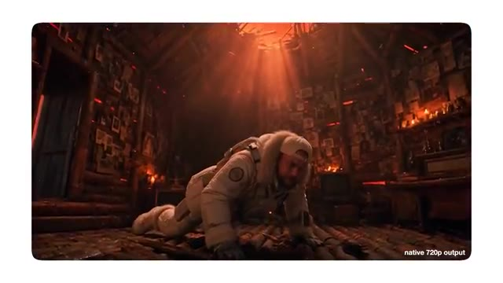
*Vidéo générée montrant un astronaute ramassant ou se déplaçant à quatre pattes à l'intérieur d'une cabane en bois aux lumières rouges volcaniques, avec la mention "native 720p output".*

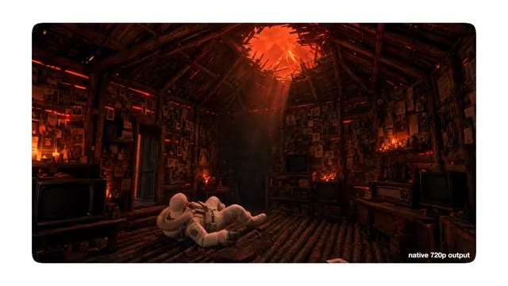
*Vidéo générée montrant un astronaute allongé au sol dans la cabane rustique sous un trou dans le toit baigné d'une lueur rouge, avec la mention "native 720p output".*

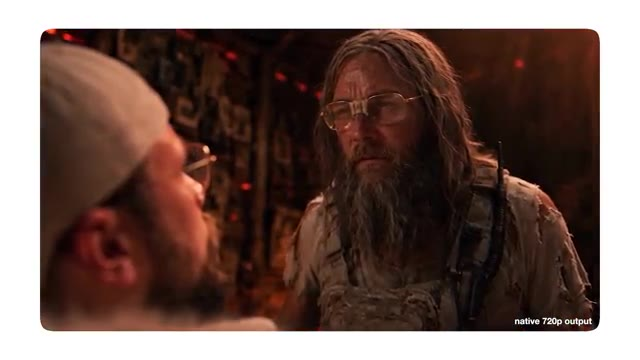
*Vidéo générée en gros plan montrant un personnage barbu avec des lunettes discutant avec l'astronaute, avec la mention "native 720p output".*

---

### ⏱️ `[00:09:48 - 00:10:23]` | Segment #20

**🔊 Audio (Transcription Intégrale Mot pour Mot en Français) :**
> Il y a vraiment des problèmes. Rappelez-vous juste que c'est un test assez brutal. La version 2.5 s'est un peu emmêlée les pinceaux avec nos références d'images et a fini par réintroduire la variante arctique du personnage. On n'a pas non plus la musique que j'avais demandé à 2.5 d'ajouter, et les voix utilisées ne me ressemblent pas non plus. Malheureusement, il nous manque aussi les images de moi sur ces écrans de télévision. Du côté positif, la scène est vraiment très cinématique et j'adore vraiment cet effet quand tous les écrans de télévision

**👁️ Analyse Visuelle d'Écran (gemini-3.5-flash-lite) :**
**Interface & Outils** : Présentation vidéo avec incrustation PiP (Picture-in-Picture) du créateur en bas à gauche.

**Contenu textuel & Code** : Génération vidéo IA montrant une scène cinématographique de type survival/sci-fi dans une cabane en bois rustique avec des moniteurs cathodiques et un personnage en combinaison arctique.

**Action / Démonstration** : Le personnage dans la vidéo générée se tient dans la cabane au milieu des téléviseurs.

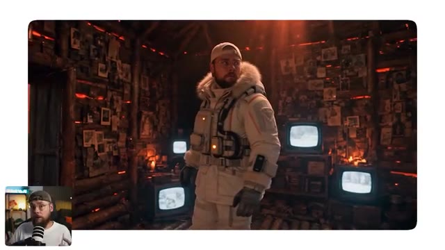
*Rendu vidéo généré montrant un personnage en combinaison arctique dans une cabane en bois remplie de téléviseurs, avec un encadré PiP du créateur en bas à gauche.*

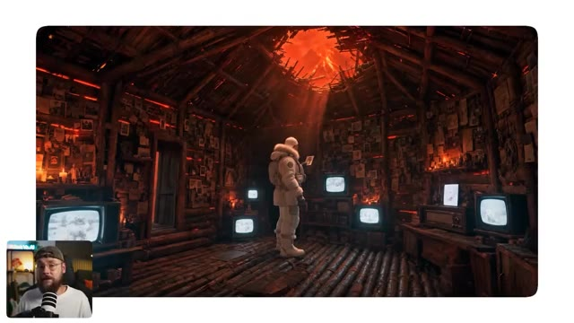
*Rendu vidéo montrant un plan large de la cabane en bois avec de multiples téléviseurs et un trou dans le toit, avec un encadré PiP du créateur en bas à gauche.*

---

### ⏱️ `[00:10:23 - 00:10:49]` | Segment #21

**🔊 Audio (Transcription Intégrale Mot pour Mot en Français) :**
> s'éteignent soudainement ensemble. C'était vraiment réussi. C'est aussi très impressionnant de voir comment la version 2.5 gère ce moment où le charognard enlève son masque pour révéler la version plus âgée de moi. Ça a l'air assez simple, mais c'est en fait un changement assez complexe pour qu'un outil d'IA puisse le comprendre. Régénérons avec le même prompt et les mêmes références pour voir si on obtient un meilleur résultat au deuxième essai.

**👁️ Analyse Visuelle d'Écran (gemini-3.5-flash-lite) :**
**Interface & Outils** : Interface de génération d'images/vidéos par IA (type plateforme de créateur avec panneau de prompt et options de transformation en vidéo).

**Contenu textuel & Code** : Texte du prompt visible dans le panneau latéral : "Character reference sheet — five views on a neutral grey background: [VIEW 1 — FULL BODY, FRONT] Full-body front-facing three-quarter view of this character, full body visible head to feet. [VIEW 2 — FULL BODY, REAR] Full-body rear view of the same character, directly..." Détails du modèle : Model: GPT Image 2, Quality: High, Size: 2688x1520, Created: August 4, 2026. Bouton jaune bien visible : "Turn to video".

**Action / Démonstration** : Le créateur montre l'interface présentant la feuille de référence du personnage barbu avec ses différentes vues et les options de régénération/conversion en vidéo.

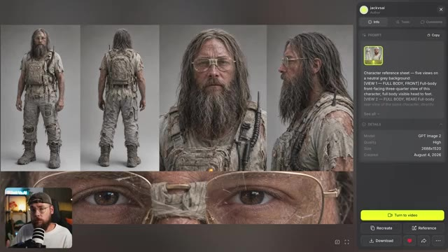
*Interface montrant une feuille de référence de personnage avec plusieurs vues (plein pied, dos, visage, gros plan des yeux) et un panneau latéral de détails de prompt.*

---

### ⏱️ `[00:11:06 - 00:11:41]` | Segment #22

**🔊 Audio (Transcription Intégrale Mot pour Mot en Français) :**
> Il nous a toujours guidés par ses prompts. C'est donc une nette amélioration. Nous avons maintenant la chanson effrayante que j'ai générée qui joue en arrière-plan de la scène et l'explorateur ramasse désormais également la bonne photographie. La scène en elle-même se déroule vraiment très bien. J'ai l'impression que la version 2.5 a une bonne compréhension de la façon de construire une séquence au rendu cinématographique. Il y a beaucoup de drame et de tension qui sont créés ici et

**👁️ Analyse Visuelle d'Écran (gemini-3.5-flash-lite) :**
**Interface & Outils** : Incrustation vidéo (PiP) du créateur (Jack) commentant la séquence vidéo générée par IA.

**Contenu textuel & Code** : Séquence vidéo générée par IA représentant un explorateur dans une cabane en bois de style rustique/tribal, remplie de téléviseurs et de photographies aux murs, avec une ambiance lugubre et un éclairage rouge dramatique.

**Action / Démonstration** : Le créateur montre une séquence vidéo cinématique générée par IA pour illustrer ses propos sur la qualité de mise en scène de la version 2.5.

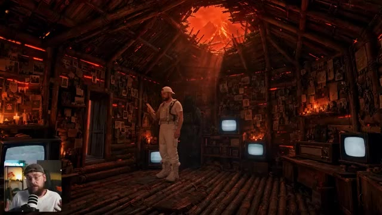
*Vue large dans une cabane sombre éclairée par une lumière rouge zénithale, avec Jack en incrustation PiP dans le coin inférieur gauche*

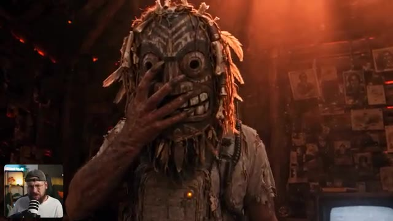
*Gros plan d'un personnage portant un masque tribal menaçant dans une cabane sombre, avec Jack en incrustation PiP dans le coin inférieur gauche*

---

### ⏱️ `[00:11:41 - 00:12:16]` | Segment #23

**🔊 Audio (Transcription Intégrale Mot pour Mot en Français) :**
> Je pense que beaucoup de cela est dû aux performances. Malheureusement, je n'ai toujours pas réussi à faire en sorte que les voix me ressemblent. J'ai relancé le même prompt et j'ai réussi à faire fonctionner ceci. Il nous donne des prompts. Il nous a toujours donné des prompts. Mais malheureusement, je n'ai pas vraiment aimé le reste de la génération, donc il semble bien que ce soit un peu aléatoire. Cependant, je pense que j'ai

**👁️ Analyse Visuelle d'Écran (gemini-3.5-flash-lite) :**
**Interface & Outils** : Séquence vidéo de démonstration générée par intelligence artificielle (résolution native 720p), avec incrustation PiP du créateur.

**Contenu textuel & Code** : Mention 'native 720p output' visible dans le coin inférieur droit de la vidéo générée.

**Action / Démonstration** : Le créateur illustre son propos en diffusant des extraits de vidéos générées par IA qui démontrent les résultats obtenus avec ses prompts.

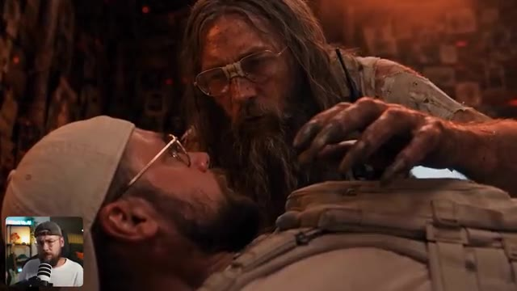
*Séquence vidéo générée par IA montrant un personnage barbu penché au-dessus de Jack allongé, avec un encadré PiP de Jack dans son studio.*

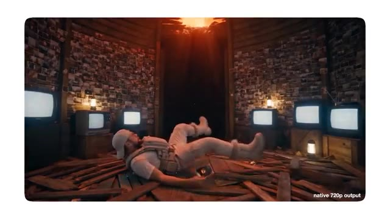
*Séquence vidéo générée par IA montrant Jack tombant à la renverse dans une pièce entourée de téléviseurs anciens, avec la mention 'native 720p output' en bas à droite.*

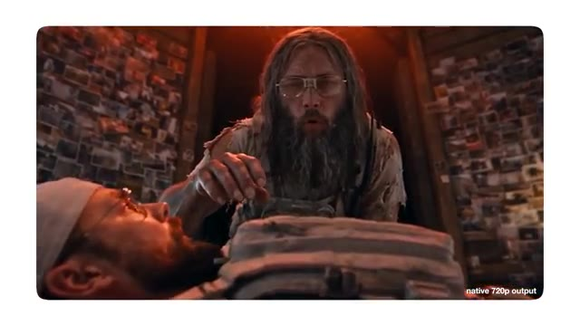
*Gros plan sur la vidéo générée par IA du personnage barbu examinant Jack, avec la mention 'native 720p output' en bas à droite.*

---

### ⏱️ `[00:12:16 - 00:14:39]` | Segment #24

**🔊 Audio (Transcription Intégrale Mot pour Mot en Français) :**
> a bien démontré jusqu'où nous pouvons pousser cette fonction de référence avant de commencer à rencontrer des problèmes, tout en soulignant qu'il y a de nombreuses tâches qu'elle gère vraiment bien. N'oublions pas que nos personnages, accessoires et décors sont restés bien cohérents dans chaque scène. Maintenant, j'ai pris soin d'assembler chaque génération distincte pour pouvoir raconter toute l'histoire de l'explorateur. Allons jeter un coup d'œil au film terminé. Donc, avec de très basiques

**👁️ Analyse Visuelle d'Écran (gemini-3.5-flash-lite) :**
**Interface & Outils** : Film ou court-métrage narratif généré par intelligence artificielle, diffusé en plein écran avec une incrustation vidéo (PiP) du présentateur Jack dans le coin inférieur gauche.

**Contenu textuel & Code** : Rendu visuel d'un court-métrage de science-fiction/aventure généré par IA, mettant en scène un personnage récurrent (l'explorateur) dans divers environnements (cabane en bois, jungle lumineuse) et tenant un artéfact mystérieux.

**Action / Démonstration** : Le film généré par IA est présenté à l'écran, illustrant la continuité des personnages et des accessoires assemblés pour former l'histoire complète de l'explorateur.

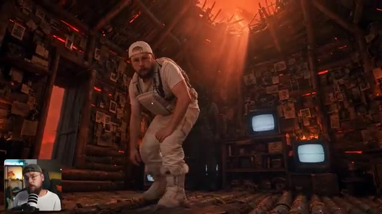
*Scène narrative générée par IA montrant le personnage de l'explorateur dans une cabane en bois rustique avec un éclairage zénithal, avec la miniature incrustée (PiP) du créateur Jack dans le coin inférieur gauche.*

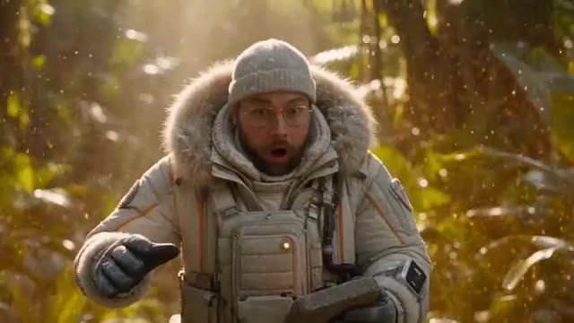
*Gros plan du personnage de l'explorateur en tenue polaire et bonnet, courant en forêt au milieu de particules lumineuses.*

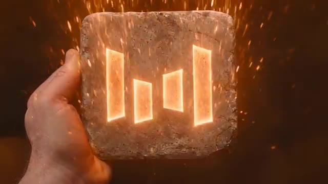
*Gros plan sur une main tenant une pierre rectangulaire gravée de symboles lumineux incandescents entourée d'étincelles.*

---

### ⏱️ `[00:14:39 - 00:15:14]` | Segment #25

**🔊 Audio (Transcription Intégrale Mot pour Mot en Français) :**
> en faisant le montage et parfois en combinant des générations séparées, nous obtenons un résultat comme celui-ci. Bien que ce ne soit pas parfait, nous avons ce sentiment de cohérence dans les personnages et les décors, et comme j'ai bien réfléchi au moment de diviser l'histoire en générations distinctes, tout assembler au montage a été simple et le résultat final semble naturel plutôt que forcé. Je dois dire que le film terminé a l'air vraiment cinématique, 2.5 gérant ces séquences d'effets visuels et de transitions mieux que n'importe quel autre outil d'IA sur le marché. Alors, après ce projet, quel est mon avis ?

**👁️ Analyse Visuelle d'Écran (gemini-3.5-flash-lite) :**
**Interface & Outils** : Vidéo de démonstration de court métrage généré par IA, avec incrustation incrustée (PiP) du créateur en coin (sur les images 2 et 3) et transition textuelle (sur l'image 4).

**Contenu textuel & Code** : Texte à l'écran sur l'image 4 : "conclusion / my honest take".

**Action / Démonstration** : Le créateur parle face caméra tout en illustrant ses propos avec des extraits de sa vidéo générée par IA montrant des personnages cohérents dans des décors variés (glace et jungle), puis introduit la conclusion.

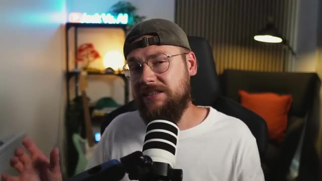
*Jack en plan fixe face caméra dans son studio en train de parler.*

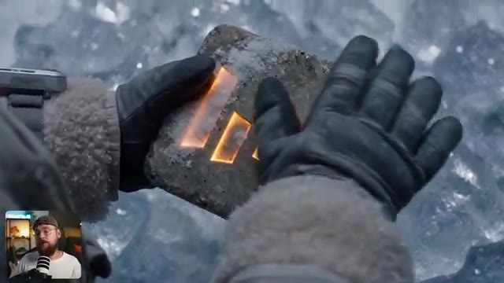
*Gros plan sur un personnage ganté manipulant un objet mystérieux émettant une lumière chaude, avec l'encadré PiP de Jack en bas à gauche.*

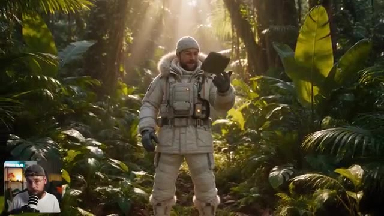
*Plan large d'un personnage en combinaison spatiale au milieu d'une jungle luxuriante, avec l'encadré PiP de Jack en bas à gauche.*

*Écran de transition affichant le titre de fin de section en texte blanc et jaune.*

---

### ⏱️ `[00:15:14 - 00:15:48]` | Segment #26

**🔊 Audio (Transcription Intégrale Mot pour Mot en Français) :**
> à propos de C-Dance 2.5 ? Eh bien, l'inconvénient évident est qu'il est limité à une résolution de 720p. Maintenant, cela peut convenir pour les réseaux sociaux, mais pour tout travail professionnel, cette résolution ne fera tout simplement pas l'affaire. Vous allez devoir faire ce que j'ai fait et utiliser un outil de mise à l'échelle comme Topaz, mais évidemment, cela a un coût supplémentaire. On a beaucoup insisté sur le fait que l'on peut ajouter 50 références d'images, de vidéos et audio à ses générations. En toute honnêteté, je ne pense vraiment pas qu'on ait besoin de 50 références lorsqu'on réalise des vidéos par IA. D'une manière générale, quelques images comme un personnage

**👁️ Analyse Visuelle d'Écran (gemini-3.5-flash-lite) :**
**Interface & Outils** : Vidéo générée par IA affichée à l'écran principal avec incrustation (PiP) du créateur dans le coin inférieur gauche.

**Contenu textuel & Code** : Texte affiché dans le coin inférieur droit : "native 720p output". Visuel d'un personnage de dos dans un décor rustique avec de vieux téléviseurs et des murs tapissés de photographies.

**Action / Démonstration** : Présentation d'un exemple de rendu vidéo généré par l'IA illustrant la résolution native de 720p discutée dans l'audio, pendant que le créateur parle en arrière-plan (encadré PiP).

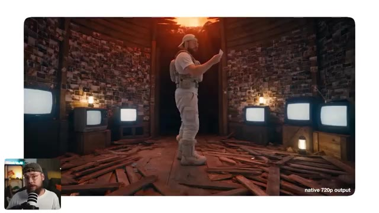
*Extrait vidéo généré par IA montrant un personnage dans une pièce en bois entourée de téléviseurs et de photos, avec la mention "native 720p output" en bas à droite et un encadré PiP du créateur en bas à gauche.*

---

### ⏱️ `[00:15:48 - 00:16:13]` | Segment #27

**🔊 Audio (Transcription Intégrale Mot pour Mot en Français) :**
> des feuilles et des photos d'emplacement ainsi que quelques références audio, cela suffira pour vous donner ce dont vous avez besoin. Je pense que 50 est un peu excessif. Je ne vois pas vraiment beaucoup de cas d'utilisation où vous auriez réellement besoin d'autant. Autre chose que j'aimerais aborder, c'est le piège des 30 secondes. Et c'est l'idée que ce n'est pas parce que vous pouvez utiliser 2.5 pour générer des séquences de 30 secondes de long que vous devez le faire.

**👁️ Analyse Visuelle d'Écran (gemini-3.5-flash-lite) :**
**Interface & Outils** : Logiciel ou interface web de génération vidéo par IA avec zone de prompt textuel et intégration de médias, ainsi qu'un écran de titre textuel minimaliste.

**Contenu textuel & Code** : Texte du prompt visible : '[00:00 - 00:05] Interior, wide, 28mm, low angle, slow handheld rise — inside the rounded-log cabin @Image 1 (use as environment reference only...)'. Texte à l'écran : 'the 30 second trap'.

**Action / Démonstration** : Le créateur montre l'interface de configuration d'un générateur de vidéo IA (avec gestion des prompts et références) puis illustre son propos avec un titre textuel à l'écran.

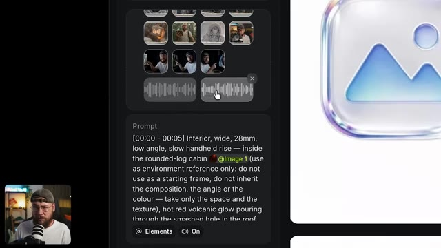
*Interface de génération vidéo montrant les paramètres de prompt avec des références audio et d'images, avec le créateur en incrustation PiP.*

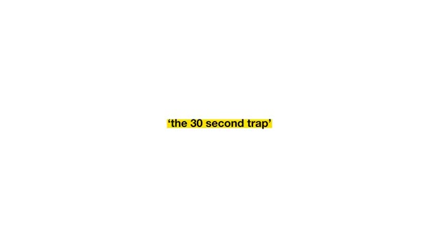
*Écran blanc minimaliste affichant le texte en surbrillance jaune 'the 30 second trap'.*

---

### ⏱️ `[00:16:13 - 00:16:49]` | Segment #28

**🔊 Audio (Transcription Intégrale Mot pour Mot en Français) :**
> Ce modèle n'est pas bon marché, surtout si vous générez des longueurs plus importantes, que vous rencontrez des problèmes et que vous devez régénérer pour les corriger. Le coût s'accumule très rapidement, alors profitez vraiment de cette offre illimitée sur Higgsfield pendant que vous le pouvez. Maintenant, je vais paraître un peu hypocrite ici, mais je pense aussi que les générations de 30 secondes sont la fonctionnalité la plus impressionnante livrée avec la version 2.5, purement en tant qu'exploit technique. Bien que vous n'ayez pas toujours besoin de générer des clips de cette longueur, le fait qu'un modèle d'IA en soit capable est vraiment

**👁️ Analyse Visuelle d'Écran (gemini-3.5-flash-lite) :**
**Interface & Outils** : Site web de Higgsfield (Seedance 2.5) avec interface de promotion et de tarification.

**Contenu textuel & Code** : "LIVE NOW", "SEEDANCE 2.5", "NEW SEEDANCE 2.5 & SEEDANCE 2.0 UNLIMITED FOR 33 DAYS WITH 30% OFF", décompte temporel.

**Action / Démonstration** : Le présentateur commente l'offre promotionnelle et les tarifs des abonnements pour les générations longues sur Seedance.

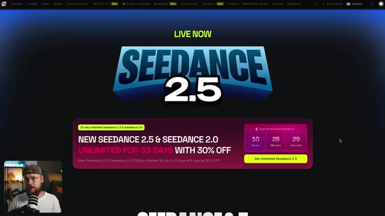
*Page web de Higgsfield montrant Seedance 2.5 avec une offre promotionnelle illimitée.*

---

### ⏱️ `[00:16:49 - 00:17:21]` | Segment #29

**🔊 Audio (Transcription Intégrale Mot pour Mot en Français) :**
> impressionnant. N'oublions pas qu'il y a des publicités télévisées qui durent 30 secondes au total, il est donc tout à fait possible de réaliser une publicité entière en une seule génération. Honnêtement, j'ai hâte d'explorer davantage la version 2.5 dans mon prochain contenu. Si vous souhaitez me voir continuer à pousser ce modèle dans ses retranchements, assurez-vous de lâcher un pouce bleu sur cette vidéo et pensez à vous abonner. N'hésitez pas à poser vos questions dans la section des commentaires ci-dessous et faites-moi également savoir quelles sont vos premières impressions sur Seedance 2.5. Merci beaucoup d'avoir regardé les gars et je vous retrouve dans la prochaine.

**👁️ Analyse Visuelle d'Écran (gemini-3.5-flash-lite) :**
**Interface & Outils** : Vidéo de démonstration en plein écran avec incrustation (Picture-in-Picture) de la webcam du créateur en bas à gauche

**Contenu textuel & Code** : Rendu visuel d'une génération vidéo par IA de type cinématique avec Seedance 2.5 (scènes fantastiques, exploration dans la jungle, artefact lumineux)

**Action / Démonstration** : Le créateur commente les capacités de génération vidéo de Seedance 2.5 tout en illustrant ses propos avec des extraits vidéo générés par l'IA et incrustés en PiP.

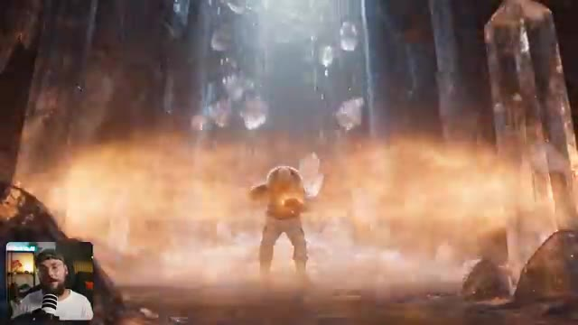
*Vidéo générée par IA montrant un personnage au milieu de cristaux et de poussière brillante avec incrustation du créateur (PiP)*

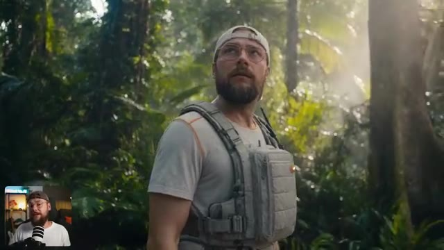
*Vidéo générée par IA montrant un personnage ressemblant au créateur dans une jungle luxuriante avec incrustation du créateur (PiP)*

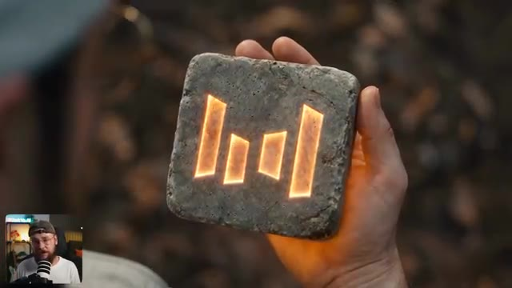
*Vidéo générée par IA montrant une main tenant une pierre gravée lumineuse avec incrustation du créateur (PiP)*

---
