# 🎬 Créer un studio de motion design solo avec l'IA

> **Chaîne** : [Jack Vs. AI](https://www.youtube.com/@JackVsAI)  
> **Titre original** : `How to Build a Solo Motion Graphics Studio with AI`  
> **Lien YouTube** : [https://www.youtube.com/watch?v=CBDaJb04FgU](https://www.youtube.com/watch?v=CBDaJb04FgU)  
> **Date de publication** : 2026-08-25  
> **Durée** : 09m 41s (`581s`)  
> **Identifiant vidéo** : `CBDaJb04FgU`  
> **Fiche Web Interactive** : [2026-08-25_YT-CBDaJb04FgU_Créer un studio de motion design solo avec l'IA_by-whisper-v3-large-turbo+gemini-3.5-flash-lite.html](2026-08-25_YT-CBDaJb04FgU_Créer un studio de motion design solo avec l'IA_by-whisper-v3-large-turbo+gemini-3.5-flash-lite.html)  
> **Captures d'écran clés** : `16 images sauvegardées`  
> **Modèles utilisés** : Audio: `large-v3-turbo` (Faster-Whisper int8 VPS) | Vision: `gemini-3.5-flash-lite` (Google AI Studio API)  

---

## 📌 Synthèse Exécutive & Outils

### 📌 Résumé
La vidéo de Jack Vs. AI démontre comment l'intelligence artificielle générative redéfinit le marché du motion design, permettant à un créateur solo de rivaliser avec des agences traditionnelles et de produire du contenu commercial haut de gamme sans budget pharaonique. En exploitant la puissance conjuguée des modèles de pointe, il est désormais possible de transformer instantanément des idées abstraites ou des briefs clients en animations soignées, qu'il s'agisse de publicités institutionnelles ou de contenus artistiques de marque.

La méthode repose sur un workflow hybride et structuré : l'utilisation d'une compétence personnalisée sur Claude pour concevoir des prompts ultra-détaillés, combinée à l'importation d'images de référence visuelles (personnages, produits, logos) dans la plateforme Higgsfield propulsée par le modèle Seedance 2.5. Cette approche par image de référence permet de s'affranchir du simple texte aléatoire et de garantir une cohérence parfaite des personnages et des produits du début à la fin de la vidéo.

À travers l'exploration de trois styles distincts — l'art vectoriel épuré pour des publicités dynamiques, le papier découpé artisanal pour se démarquer avec originalité, et l'esthétique rétro VHS pour capter l'attention par l'imperfection texturée —, Jack prouve que l'IA gère non seulement la génération visuelle mais aussi la création sonore synchronisée. Cette démocratisation technique offre une opportunité financière monumentale aux créateurs capables de maîtriser ces outils pour répondre aux exigences des entreprises.

### 🛠️ Outils, Modèles & Logiciels Présentés
* **Claude** : Assistant conversationnel doté d'une compétence personnalisée (custom skill) conçue par Jack pour générer des prompts de motion design ultra-détaillés et structurés à partir d'une simple idée textuelle.
* **Higgsfield** : Plateforme de création vidéo par IA sur laquelle est exécuté le workflow principal, offrant une interface intuitive pour paramétrer les générations.
* **Seedance 2.5** : Modèle de génération vidéo de pointe disponible en résolution 1080p, capable de maintenir une excellente cohérence visuelle et de générer automatiquement une musique personnalisée synchronisée.
* **Seedance 2** : Version précédente du modèle Seedance, mentionnée comme alternative économique pour réduire légèrement les coûts de génération tout en offrant d'excellents résultats.
* **Flux** : Outil ou modèle d'intelligence artificielle utilisé en amont pour générer des éléments graphiques et des images de référence personnalisées (comme la bouteille de sauce piquante ou le personnage vectoriel).
* **Logiciel de montage externe** : Mentionné pour le post-traitement optionnel (réduction de la fréquence d'images, ajout de filtres de lueur et de grain de pellicule pour accentuer l'effet VHS).

### 🔑 Points Clés & Enseignements Stratégiques
* **Maîtrise de la cohérence par image de référence** : L'utilisation d'une image de référence visuelle (personnage, produit ou logo) aux côtés du prompt textuel est indispensable pour garder un contrôle absolu sur les résultats et éviter les dérives stylistiques.
* **L'importance des prompts riches en directions** : Un bon prompt pour le motion design doit regorger de descriptions précises, notamment dans la section dédiée au style artistique, afin de donner un maximum de matière à exploiter pour le modèle Seedance.
* **Externalisation de la réflexion sur les prompts** : Utiliser un agent IA spécialisé (comme la compétence Claude fournie par Jack) permet d'automatiser la rédaction de prompts professionnels hautement techniques sans effort de rédaction complexe.
* **Diversification des styles visuels** : Savoir basculer entre des styles opposés — comme l'art vectoriel propre et corporate, le papier découpé brut et organique, ou le rétro VHS texturé — permet de répondre à des briefs clients radicalement différents.
* **Le minimalisme au service de l'efficacité** : En motion design IA, *"less is more"* ; les concepts épurés et les animations fluides fonctionnent généralement mieux et semblent plus professionnels que les scènes surchargées.
* **Exploitation des imperfections créatives** : Pour des styles spécifiques comme le VHS, il est crucial d'utiliser dès le départ des images de référence qui intègrent déjà cette esthétique (imperfections, textures) pour un résultat authentique.
* **Post-traitement pour parfaire l'esthétique** : Il est possible de pousser le réalisme d'un style rétro en important la vidéo générée dans un logiciel de montage pour y réduire la fréquence d'images (effet saccadé), accentuer les lueurs et ajouter du grain de pellicule.
* **Transitions fluides multi-images** : Pour raconter une histoire ou montrer un processus (comme la fabrication d'un expresso), l'utilisation séquentielle de plusieurs images de référence permet de guider Seedance 2.5 vers une transition fluide du début à la fin.
* **Gestion automatisée de l'ambiance sonore** : Seedance 2.5 intègre une capacité de génération de musique personnalisée qui évite la corvée fastidieuse de la recherche de morceaux libres de droits et de leur synchronisation manuelle.
* **Opportunité commerciale majeure** : Les entreprises recherchant des animations et des vidéos explicatives de marque à fort impact, l'adoption rapide de ces workflows permet à un créateur solo de monétiser très cher des compétences autrefois réservées aux agences.

---

## ⏱️ Chronologie & Transcription Complète Audio & Visuelle (Mot pour Mot)

### ⏱️ `[00:00:00 - 00:00:19]` | Segment #01

**🔊 Audio (Transcription Intégrale Mot pour Mot en Français) :**
> L'IA vient de vous confier les clés de votre propre studio de motion design. Les entreprises sont prêtes à dépenser des milliers de dollars en animations, vidéos explicatives et contenus de marque. Mais l'IA a fait basculer l'équilibre. Vous pouvez désormais passer d'une idée à un motion design soigné sans nécessiter un budget énorme ni des années d'expérience.

**👁️ Analyse Visuelle d'Écran (gemini-3.5-flash-lite) :**
**Interface & Outils** : Une vidéo d'animation insérée dans un cadre rectangulaire aux bords arrondis sur fond dégradé bleu foncé.

**Contenu textuel & Code** : En haut de l'écran, un sous-titre incrusté en blanc et turquoise : "explainers and branded content". Au centre, une illustration vectorielle au style épuré montrant un jeune homme barbu avec des lunettes et une casquette verte, tapant sur un ordinateur portable d'où s'échappe un avion en papier rouge, entouré d'éléments graphiques géométriques et sphériques flottants.

**Action / Démonstration** : L'illustration animée montre le personnage tapant activement sur son clavier tandis que des avions en papier et des formes abstraites flottent et se déplacent dynamiquement autour de lui.

---

### ⏱️ `[00:00:20 - 00:00:42]` | Segment #02

**🔊 Audio (Transcription Intégrale Mot pour Mot en Français) :**
> Dans cette vidéo, je vais vous apprendre à créer des motion graphics de qualité supérieure avec les meilleurs outils d'IA. Pour que vous puissiez réaliser un produit pour lequel les clients paieront réellement. Grâce à l'IA, un seul créateur peut faire le travail d'un studio entier. Et si vous apprenez à en profiter dès maintenant, il y a beaucoup d'argent à se faire. Si vous aimez le contenu d'aujourd'hui, n'oubliez pas de mettre un gros pouce bleu et de vous abonner.

**👁️ Analyse Visuelle d'Écran (gemini-3.5-flash-lite) :**
**Interface & Outils** : Une fenêtre vidéo centrale aux coins arrondis affichant un avatar stylisé, encadrée par un fond bleu dégradé. Un curseur de souris blanc en forme de flèche est visible dans le coin inférieur gauche de l'image.

**Contenu textuel & Code** : Un sous-titre textuel blanc et bleu affiché en haut de l'écran avec les mots « can do the work ». Visuel d'un personnage de type cartoon 3D barbu avec des lunettes et une casquette, détouré par une sélection en pointillés.

**Action / Démonstration** : Le personnage de synthèse subit une sélection ou une manipulation de détourage à l'aide d'un curseur de souris, illustrant l'idée du travail de studio automatisé.

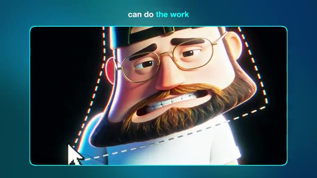

---

### ⏱️ `[00:00:42 - 00:01:03]` | Segment #03

**🔊 Audio (Transcription Intégrale Mot pour Mot en Français) :**
> Très bien, entrons dans le vif du sujet. Dans la vidéo d'aujourd'hui, nous allons explorer trois types uniques de motion design que vous pouvez créer grâce à l'IA. Et ils sont parfaits, que vous souhaitiez concevoir quelque chose pour vos propres projets créatifs ou que vous cherchiez à créer des éléments visuels que vous pourrez réellement vendre à un client ou à une marque. Le premier style que je veux examiner est l'art vectoriel (VectorArt).

**👁️ Analyse Visuelle d'Écran (gemini-3.5-flash-lite) :**
**Interface & Outils** : Écran de montage vidéo ou interface de présentation affichant un fond bleu uni avec trois fenêtres rectangulaires miniatures horizontales (générations de motion design pixélisées/floutées ou extraits vidéo numérotés 1, 2 et 3), et en bas à droite, une vignette incrustée montrant Jack face caméra dans son studio devant son micro.

**Contenu textuel & Code** : Trois grands chiffres bleus superposés sur les miniatures ("1", "2", "3").

**Action / Démonstration** : Jack s'adresse directement aux spectateurs face caméra tandis que des aperçus de styles de motion design numérotés de 1 à 3 apparaissent à l'écran sous forme de miniatures pour introduire la structure de la vidéo.

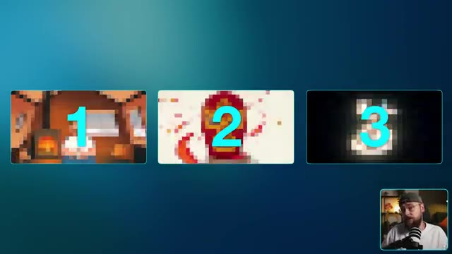

---

### ⏱️ `[00:01:03 - 00:01:25]` | Segment #04

**🔊 Audio (Transcription Intégrale Mot pour Mot en Français) :**
> C'est un type de motion design que vous avez beaucoup vu ces dernières années. C'est définitivement très tendance, et pour de bonnes raisons. Pour générer nos motion graphics par IA, je suis sur Higgsfield. Et si vous voulez suivre en même temps, vous trouverez un lien en bas dans la description. Sur la page d'accueil, je vais me rendre dans le coin supérieur gauche et sélectionner "Créer une vidéo".

**👁️ Analyse Visuelle d'Écran (gemini-3.5-flash-lite) :**
**Interface & Outils** : Navigateur web affichant la page d'accueil de la plateforme Higgsfield, avec un menu supérieur comprenant les onglets Explore, Image, Video, Audio, Edit, Layers, Cinema Studio, Marketing Studio, Viral Presets, MCP & CLI, Supercomputer, Academy, Community, Enterprise, Assets, ainsi que le flux vidéo de Jack dans un encadré incrusté en bas à droite.

**Contenu textuel & Code** : Éléments de l'interface de Higgsfield : la bannière supérieure avec divers onglets de navigation, le bloc "SUPERCOMPUTER" alimenté par GPT 5.6 Sol avec le bouton "Try now", divers modules de génération comme Seedance 2.5 (New), Nano Banana Pro, Higgsfield Academy, MCP & CLI, Cinema Studio 4.0 (New), Seedance 2.0, et une bannière promotionnelle en bas pour le "Higgsfield Global Film Festival" doté d'un prix de 1 000 000 $.

**Action / Démonstration** : La page d'accueil de Higgsfield est affichée à l'écran tandis que Jack parle face caméra dans l'encadré, avant d'orienter l'attention vers le coin supérieur gauche pour indiquer la sélection de l'option de création vidéo.

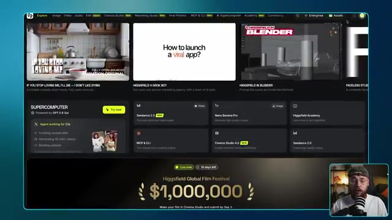

---

### ⏱️ `[00:01:25 - 00:02:02]` | Segment #05

**🔊 Audio (Transcription Intégrale Mot pour Mot en Français) :**
> Nous voulons d'abord sélectionner le modèle et pour la vidéo d'aujourd'hui, nous allons utiliser Seedance 2.5, qui est maintenant disponible en résolution 1080p. Ce flux de travail donnera également d'excellents résultats avec Seedance 2 si vous cherchez un moyen de réduire légèrement vos coûts. Maintenant, vous pouvez générer une vidéo par IA en utilisant seulement une invite textuelle, mais l'ajout d'une image de référence vous donne beaucoup plus de contrôle sur vos résultats. Je vais donc télécharger cette version de style art vectoriel de moi-même que j'ai générée plus tôt. En ce qui concerne l'invite elle-même, nous demandons une publicité de 15 secondes pour un Airbnb.

**👁️ Analyse Visuelle d'Écran (gemini-3.5-flash-lite) :**
**Interface & Outils** : Capture d'écran montrant l'interface d'un outil de génération vidéo par IA à gauche et un lecteur vidéo ou aperçu à droite. En bas à droite, on aperçoit Jack face caméra dans son studio avec un micro.

**Contenu textuel & Code** : Dans la zone "Add references", on trouve des icônes pour ajouter une image, une vidéo ou de l'audio. Dans le bloc "Prompt", le texte visible est le suivant : "[00:00 - 00:04] Wide full-frame layout on a soft warm off-white field, slow 2D parallax push in — the bearded man sits calmly in a simple flat vector chair, olive cap, gold glasses, mid-brown beard, white tee, a mug in hand; around him a clean flat-vector treehouse forms in the generous negative space, a round window...". En bas, des boutons indiquent "@ Elements" et un contrôle audio "On". Dans le bloc "Model", on lit "Seedance 2.5" avec une icône de performance.

**Action / Démonstration** : La souris navigue et survole le bloc de texte du prompt dans l'interface de génération vidéo, tandis que Jack apparaît en médaillon en bas à droite en train de parler et d'expliquer le processus.

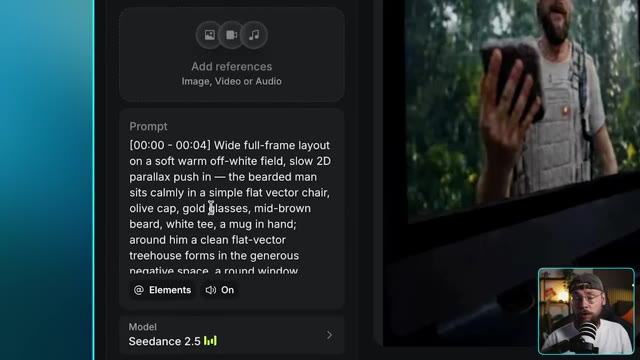

---

### ⏱️ `[00:02:02 - 00:02:42]` | Segment #06

**🔊 Audio (Transcription Intégrale Mot pour Mot en Français) :**
> style business. Et c'est un excellent exemple parce qu'on est en train de créer un contenu de marque qu'un client paierait réellement. Je vais vous expliquer exactement comment j'ai construit ce prompt dans un instant. Pour l'instant, je suis satisfait des paramètres, donc on peut cliquer sur générer et jeter un œil au résultat. Ouais, c'est sorti exactement comme je l'avais imaginé et c'est assez dingue de se dire que nous

**👁️ Analyse Visuelle d'Écran (gemini-3.5-flash-lite) :**
**Interface & Outils** : Une interface vidéo de style lecteur ou fenêtre graphique, montrant une animation 2D de Jack assis dans une chaise pliante, tenant une tasse, sur fond clair minimaliste avec un dégradé bleu en arrière-plan global.

**Contenu textuel & Code** : Animation vectorielle épurée représentant un personnage barbu avec une casquette et un t-shirt blanc, assis avec une tasse de café dans les mains, sur fond blanc épuré encadré.

**Action / Démonstration** : Jack présente un exemple d'animation 2D générée par IA, tandis que l'écran affiche l'illustration animée du personnage tenant une tasse dans un style graphique et publicitaire.

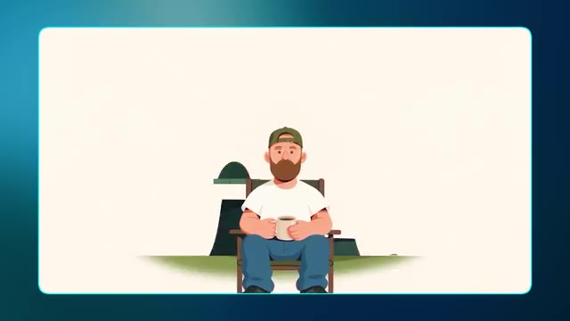

---

### ⏱️ `[00:02:42 - 00:03:18]` | Segment #07

**🔊 Audio (Transcription Intégrale Mot pour Mot en Français) :**
> j'ai construit cette publicité entière en combinant simplement une feuille de référence de personnage avec le bon prompt. En parlant de ça, pourquoi ce prompt fonctionne-t-il si bien ? C'est parce qu'il regorge de directions que C-Dance peut exploiter, et cette section en particulier qui décrit le style fait un travail considérable. Tous mes prompts sont construits en utilisant une compétence Claude que je vais partager avec vous tous tout à fait gratuitement. Il y a un lien en bas dans la description vers ma communauté school où vous pourrez télécharger ceci et c'est vraiment aussi simple que de télécharger la compétence en même temps que vos références.

**👁️ Analyse Visuelle d'Écran (gemini-3.5-flash-lite) :**
**Interface & Outils** : Capture d'écran principale affichant un bloc de texte noir structuré avec des lignes de code/prompts détaillés (séparé en plusieurs blocs temporels et catégories techniques), avec en bas à droite un encadré montrant Jack dans sa configuration de studio (face caméra, micro, portant une casquette).

**Contenu textuel & Code** : Affichage d'un prompt textuel complexe et structuré comprenant des séquences temporelles ([00:00 - 00:04], [00:04 - 00:07], etc.), des instructions de style ("Flat vector art animation", "bold flat colour fills", "crisp clean vector edges"), une palette de couleurs ("Soft warm off-white ground", "forest-green treehouse"), des verrous de style et de personnage ("Character lock - the bearded man"), ainsi que des consignes audio et des prompts négatifs détaillés en bas.

**Action / Démonstration** : Présentation à l'écran du prompt détaillé et structuré servant à la génération de la publicité, tandis que Jack commente et explique sa méthode d'ingénierie de prompt en direct.

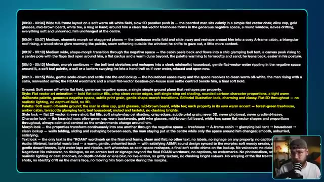

---

### ⏱️ `[00:03:18 - 00:03:54]` | Segment #08

**🔊 Audio (Transcription Intégrale Mot pour Mot en Français) :**
> et ensuite de décrire votre idée. Vous obtiendrez un prompt extrêmement détaillé comme celui-ci, il suffit de le copier et de le coller directement dans Higgs field et vous êtes prêts à commencer. Maintenant, j'ai conçu cette compétence Claude pour fonctionner avec une variété de styles de motion design, ce qui nous amène naturellement au deuxième style que je souhaite explorer, qui présente ce design en papier découpé. Alors que certaines marques et créateurs aiment que leur contenu soit épuré et sans effort, d'autres préfèrent quelque chose qui semble plus brut et imparfait. Donc, pour cet exemple, nous allons utiliser plusieurs références d'images. J'ai ces deux

**👁️ Analyse Visuelle d'Écran (gemini-3.5-flash-lite) :**
**Interface & Outils** : Jack face caméra dans son studio, assis devant un micro de type podcast, portant des lunettes et une casquette retournée. L'arrière-plan montre une étagère avec des objets de décoration et une lumière d'ambiance chaleureuse.

**Contenu textuel & Code** : Aucun texte ou paramètre technique visible à l'écran.

**Action / Démonstration** : Jack s'adresse directement au spectateur en parlant de manière animée et en gesticulant légèrement avec les mains pour illustrer son propos.

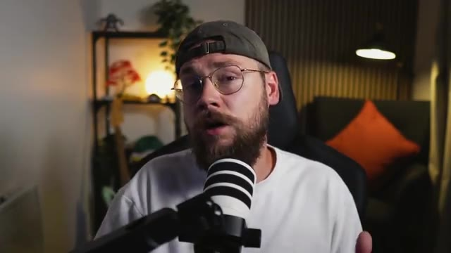

---

### ⏱️ `[00:03:54 - 00:04:35]` | Segment #09

**🔊 Audio (Transcription Intégrale Mot pour Mot en Français) :**
> des photos de moi-même aux côtés de cette bouteille de sauce piquante que j'ai générée un peu plus tôt avec cette illustration personnalisée vraiment sympa. Pour le prompt, je veux vraiment que cela ait un côté décalé et unique, pour pencher franchement vers ce style de découpage en papier. Je ne veux pas trop en révéler, allons-y, cliquons sur générer et voyons ce que nous obtenons. C'est ce que j'adore avec les graphismes animés. Chaque style est tellement unique.

**👁️ Analyse Visuelle d'Écran (gemini-3.5-flash-lite) :**
**Interface & Outils** : Interface web de Seedance 2.5 (logiciel/plateforme de génération vidéo par IA) sur grand écran. En bas à droite, incrustation vidéo (picture-in-picture) de Jack face caméra devant son micro.

**Contenu textuel & Code** : Modèle affiché : Seedance 2.5. Paramètres techniques visibles : Durée 15s, Format 16:9, Résolution 1080p, Bitrate réglé sur High, Coût de génération estimé à 135 crédits. Le prompt visible dans la zone de texte commence par : "[00:00 - 00:03] Wide collage layout on a bright cream paper ground with graph-paper hints and torn-red-paper confetti edges, static with playful stop-motion jitter — the bearded man's photographic cut-out sits centred looking curious and game, olive cap backwards, gold glasses, holding up a little cut-out taco in one hand and...". Dans la section "References", trois miniatures d'images sont affichées (une bouteille de sauce piquante, et deux portraits de Jack). Sur l'écran principal, un aperçu vidéo montre le personnage généré dans un style papier découpé.

**Action / Démonstration** : Jack est assis à son bureau et pointe du doigt l'écran de son ordinateur principal tout en commentant le prompt et le style de l'animation en motion graphics.

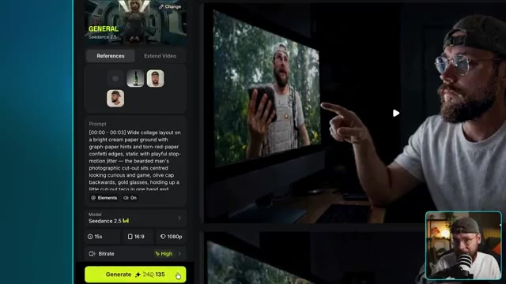

---

### ⏱️ `[00:04:36 - 00:05:12]` | Segment #10

**🔊 Audio (Transcription Intégrale Mot pour Mot en Français) :**
> Cela va avoir un effet tellement différent sur le spectateur par rapport au style d'art vectoriel que nous avons réalisé un peu plus tôt. Celui-là consistait à être simple et calme, mais celui-ci consiste à vouloir se démarquer. Ce qui est formidable si une marque ou un créateur cherche un moyen de se distinguer de la concurrence. Le produit reste également bien cohérent du début à la fin, tout comme moi en tant que personnage. Rien ne se dégrade vraiment ici et vous pourriez vraiment intégrer n'importe quel produit ou personnage que vous pouvez imaginer. J'ai également cet exemple ici qui met davantage l'accent sur la narration.

**👁️ Analyse Visuelle d'Écran (gemini-3.5-flash-lite) :**
**Interface & Outils** : Jack face caméra, dans son studio d'enregistrement personnel équipé d'un micro sur pied et d'un éclairage chaleureux d'arrière-plan.

**Contenu textuel & Code** : Aucun texte, prompt ou paramètre technique textuel n'est affiché à l'écran dans ce plan, qui se concentre uniquement sur la présentation face caméra de Jack.

**Action / Démonstration** : Jack s'adresse directement au spectateur en parlant de manière expressive, en bougeant légèrement la tête et les mains pour souligner son argumentation sur les styles visuels d'IA générative.

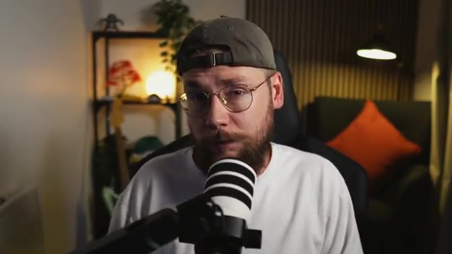

---

### ⏱️ `[00:05:12 - 00:05:42]` | Segment #11

**🔊 Audio (Transcription Intégrale Mot pour Mot en Français) :**
> plutôt que de promouvoir un produit. Ici, je m'affranchis en quelque sorte des chaînes d'être manipulé ou contrôlé par quelqu'un d'autre. Un concept un peu plus abstrait ici qui semble plus sérieux sur le plan du ton, mais qui fonctionne quand même très bien avec ce style de papier découpé. Maintenant, nous avons déjà exploré deux types de motion design qui semblent vraiment distinctifs, mais je veux maintenant m'intéresser à quelque chose d'un peu plus rétro. Nous allons donc nous pencher sur ce style de motion design VHS.

**👁️ Analyse Visuelle d'Écran (gemini-3.5-flash-lite) :**
**Interface & Outils** : Jack face caméra dans son studio, assis dans une chaise de bureau noire avec un micro podcast blanc et noir disposé au premier plan. En arrière-plan, une étagère en bois garnie de plantes et d'objets décoratifs, un mur à lamelles verticales en bois et une lampe murale allumée diffusant une lumière chaude, ainsi qu'un fauteuil avec un coussin orange.

**Contenu textuel & Code** : Aucun texte textuel, prompt ou paramètre technique visible à l'écran dans ce plan.

**Action / Démonstration** : Jack s'adresse directement aux spectateurs en gesticulant des mains pour illustrer ses propos sur les concepts abstraits et les styles de motion design.

---

### ⏱️ `[00:05:42 - 00:06:04]` | Segment #12

**🔊 Audio (Transcription Intégrale Mot pour Mot en Français) :**
> Il y a d'excellents exemples sur Instagram où des créateurs ont pris des logos modernes pour les transformer en style VHS. Et cela m'a vraiment inspiré à explorer ce type particulier d'animations graphiques. Encore une fois, c'est un excellent moyen pour un créateur ou une marque de se démarquer du lot.

**👁️ Analyse Visuelle d'Écran (gemini-3.5-flash-lite) :**
**Interface & Outils** : Interface web d'Instagram affichée dans un navigateur sur fond sombre, avec le panneau latéral gauche de navigation et la vue détaillée d'une publication vidéo au centre. En bas à droite, incrustation vidéo (picture-in-picture) montrant Jack face caméra avec son micro.

**Contenu textuel & Code** : Texte incrusté dans la vidéo Instagram : « 1. Create a design in Adobe Illustrator ». Texte de la publication par le compte @kxdgraphics : « Quick video on how I made this retro Netflix logo. I start in Adobe Illustrator to create a vector design, then import it into Adobe After Effects, that's where the magic happens. Once I'm happy with the animation, I put it on a CRT screen to get that cool, nostalgic effect. » Suivi de hashtags (#logo #retro #1980s #design #graphicdesign #branding #logodesigner #art #logodesigns #graphicdesigner #designer #logodesign #logos #brand #logotype #illustration #marketing #logomaker #illustrator #creative #graphic #photoshop #brandidentity #logoinspirations #design #logoinspiration #vector #graphics #typography #artwork). Dans le dock en bas de l'écran de la vidéo, les icônes des logiciels Adobe After Effects (Ae), Illustrator (Ai) et Photoshop (Ps) sont visibles.

**Action / Démonstration** : La vidéo Instagram est lue, montrant des extraits du processus de création d'un logo Netflix rétro avec les interfaces d'Adobe Illustrator et After Effects, tandis que Jack regarde et commente la vidéo depuis l'encadré en bas à droite.

---

### ⏱️ `[00:06:04 - 00:06:26]` | Segment #13

**🔊 Audio (Transcription Intégrale Mot pour Mot en Français) :**
> Et j'ai l'impression que cette tendance a vraiment été initiée par Stranger Things. Donc je veux en fait inventer deux exemples pour ce style. Donc on va commencer par quelque chose d'un peu plus simple, où j'ai pris les devants et j'ai inventé ce logo rétro pour moi-même. Maintenant, il est vraiment important de s'assurer d'avoir cette esthétique présente avec toutes les images de référence que vous allez utiliser.

**👁️ Analyse Visuelle d'Écran (gemini-3.5-flash-lite) :**
**Interface & Outils** : Le logiciel Seedance 2.5 (interface de génération vidéo par IA) est affiché en plein écran avec un panneau de configuration latéral gauche (Prompt, Model, paramètres de durée, résolution, bitrate, bouton Generate) et une zone d'affichage principale montrant les résultats vidéo générés. En bas à droite, une incrustation vidéo (Picture-in-Picture) montre Jack face caméra dans son studio, parlant dans un micro.

**Contenu textuel & Code** : Le prompt visible dans l'interface est : « [00:00 - 00:02] On deep black, the green striped sunburst shape from pops in first with a snappy elastic bounce and a slight overshoot, then the orange rounded-rectangle badge bounces in over it with a confident squash-and-settle, landing centred. » Les paramètres sélectionnés sont : Modèle « Seedance 2.5 », durée 5s, format 16:9, résolution 1080p, Bitrate « High ». Le modèle de génération affiche un coût de 45 crédits.

**Action / Démonstration** : L'interface présente la prévisualisation d'une génération vidéo en cours, avec le menu déroulant « Use as » ouvert au-dessus de la vignette de référence (montrant les options Reference, Start Frame, End Frame). En bas à droite, Jack parle face caméra dans sa propre configuration d'enregistrement.

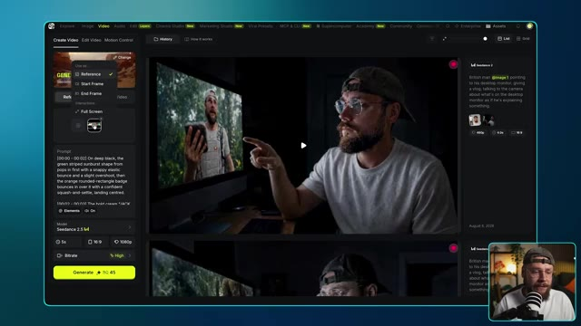

---

### ⏱️ `[00:06:26 - 00:06:59]` | Segment #14

**🔊 Audio (Transcription Intégrale Mot pour Mot en Français) :**
> Tu ne veux pas vraiment d'un beau logo bien propre pour ça. Tu veux quelque chose qui intègre déjà ce style VHS. Pour le prompt, je vais faire assez simple également. Je veux juste que chaque élément qui compose le logo s'assemble d'une manière satisfaisante. Générons cela et regardons. Ouais, j'adore vraiment ce style. Il a beaucoup de caractère et cela vient en grande partie de ce sentiment d'imperfection. Tu peux aussi pousser cela un peu

**👁️ Analyse Visuelle d'Écran (gemini-3.5-flash-lite) :**
**Interface & Outils** : Plan moyen fixe de Jack face caméra dans son studio, assis à son bureau devant un microphone monté sur bras articulé. Le décor d'arrière-plan comprend une étagère métallique avec des objets de décoration, une plante verte en hauteur, et un mur en relief acoustique éclairé par une lampe d'ambiance.

**Contenu textuel & Code** : Aucun texte, prompt ou paramètre technique n'est affiché à l'écran dans ce plan.

**Action / Démonstration** : Jack s'exprime en regardant l'objectif de la caméra et accompagne ses explications en gesticulant légèrement des mains, dans un format de type vlog ou tutoriel vidéo.

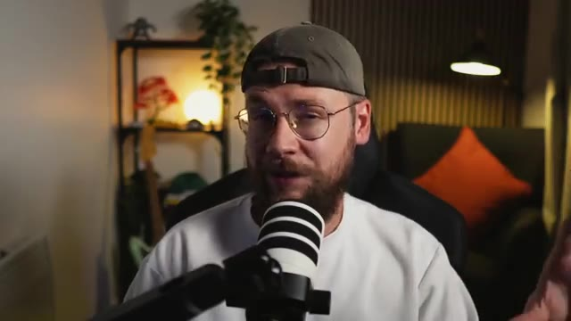

---

### ⏱️ `[00:06:59 - 00:07:33]` | Segment #15

**🔊 Audio (Transcription Intégrale Mot pour Mot en Français) :**
> aller plus loin si vous le souhaitez en important la génération par IA dans un logiciel de montage. Ici, j'ai réduit la fréquence d'images pour obtenir un style d'animation plus saccadé. J'ai amplifié la lueur en ajoutant quelques filtres supplémentaires ainsi qu'un grain de pellicule pour un peu plus de texture. Maintenant, je veux examiner un exemple plus complexe. Ce que j'ai fait, c'est que j'ai généré cinq images séparées qui ont toutes ce style VHS et se rapportent au processus de fabrication d'un expresso. L'image finale est vraiment magnifique

**👁️ Analyse Visuelle d'Écran (gemini-3.5-flash-lite) :**
**Interface & Outils** : L'interface affichée est celle d'un logiciel de montage vidéo (semblable à Adobe Premiere Pro) avec le panneau des effets et des propriétés de calque visible à l'écran, comprenant divers filtres et réglages. Dans le coin inférieur droit, on aperçoit une incrustation vidéo (PiP) de Jack face caméra, portant une casquette et s'exprimant devant un micro.

**Contenu textuel & Code** : On distingue les paramètres d'effets appliqués dans le panneau de contrôle : Speed (100.00%), Posterize Time, Frame Rate (10.0), Bokeh Blur, Wonder Glow, Brightness & Contrast, Noise (avec les sous-contrôles : Intensity à 50.0 %, Shadows à 75.0 %, Midtones à 75.0 %, Highlights à 75.0 %, Saturation à 50.0 %, Blend Mode réglé sur SoftLight, Master à 100.0 %, et l'option Preserve Alpha cochée). Des boutons d'action sont également visibles comme "Surprise Me!" et "Start Fresh". Plus bas, la section Audio avec le paramètre "Volume" est apparente.

**Action / Démonstration** : Le curseur de la souris (représenté par une flèche blanche) survole l'interface du logiciel de montage au niveau de l'option "Preserve Alpha", tandis que la vidéo montre l'application de modifications et de filtres pour ajuster le rendu visuel de la séquence générée par IA.

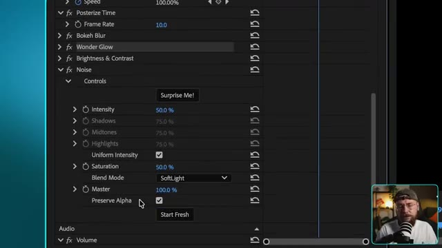

---

### ⏱️ `[00:07:33 - 00:08:08]` | Segment #16

**🔊 Audio (Transcription Intégrale Mot pour Mot en Français) :**
> logo minimaliste pour notre marque de café fictive nommée Roast. Pour le prompt, je demande à Seedance 2.5 de faire une transition fluide entre chaque image individuelle pour montrer le processus de fabrication de l'expresso et de terminer sur le nom de notre marque. Allons-y, cliquons sur générer et voyons ce que nous obtenons. Ce résultat est exactement ce

**👁️ Analyse Visuelle d'Écran (gemini-3.5-flash-lite) :**
**Interface & Outils** : Jack face caméra dans son studio, assis devant un micro de type podcast, portant une casquette à l'envers et des lunettes. En arrière-plan, on aperçoit une étagère avec des objets décoratifs, une plante verte et un luminaire au design chaleureux.

**Contenu textuel & Code** : Aucun texte ni interface logicielle n'est visible sur cette image fixe, l'écran montrant uniquement le présentateur de la chaîne Jack Vs. AI en train de s'exprimer.

**Action / Démonstration** : Jack s'adresse directement aux spectateurs en gesticulant légèrement pour appuyer ses explications sur l'utilisation de l'intelligence artificielle pour générer et animer le logo de la marque Roast.

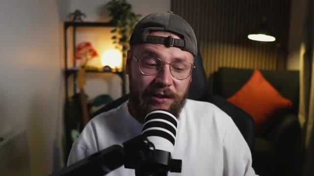

---

### ⏱️ `[00:08:08 - 00:08:45]` | Segment #17

**🔊 Audio (Transcription Intégrale Mot pour Mot en Français) :**
> J'espérais. D'une certaine manière, cela semble à la fois imparfait et satisfaisant. Vous remarquerez un thème un peu récurrent en matière d'animation graphique, c'est cette idée de minimalisme. La plupart du temps, less is more, et c'est un excellent exemple. J'adore aussi la musique personnalisée que C-Dance a générée pour ce contenu. Il peut être assez délicat de trouver le bon morceau de musique dans des bibliothèques de stock, par exemple, et de le faire correspondre à votre vidéo. Obtenir une synchronisation correcte et faire correspondre...

**👁️ Analyse Visuelle d'Écran (gemini-3.5-flash-lite) :**
**Interface & Outils** : Jack face caméra dans son studio personnel, équipé d'un micro podcast professionnel monté sur bras articulé, avec en arrière-plan une étagère décorée, une plante verte et un éclairage d'ambiance chaleureux.

**Contenu textuel & Code** : Aucun texte textuel incrusté ou prompt visible à l'écran, le plan se concentre sur l'intervenant s'exprimant directement aux spectateurs.

**Action / Démonstration** : Jack s'exprime face caméra en gesticulant légèrement pour appuyer ses propos tout en expliquant les aspects techniques et artistiques des animations graphiques et des bandes sonores générées par IA.

---

### ⏱️ `[00:08:45 - 00:09:20]` | Segment #18

**🔊 Audio (Transcription Intégrale Mot pour Mot en Français) :**
> l'ambiance de ce que vous recherchez peut être un véritable défi, mais C-Dance 2.5 a pour ainsi dire fait tout le travail difficile pour nous ici. Voilà donc. Trois styles de motion design très distincts, que vous pouvez tous personnaliser pour les adapter à n'importe quel projet créatif ou brief client. Juste un petit rappel, si vous souhaitez essayer mon générateur de prompts personnalisé, vous trouverez un lien dans la description vers ma communauté School. Vous pourrez y télécharger la compétence ainsi que tous mes prompts entièrement gratuitement. Si vous avez apprécié le contenu d'aujourd'hui, assurez-vous de lâcher un pouce bleu pour moi et envisagez

**👁️ Analyse Visuelle d'Écran (gemini-3.5-flash-lite) :**
**Interface & Outils** : Jack face caméra, dans son studio personnel équipé d'un micro de baladodiffusion blanc et noir, avec une étagère en arrière-plan contenant des plantes, des lumières d'ambiance et un coussin orange visible.

**Contenu textuel & Code** : Aucun texte ou paramètre technique affiché à l'écran dans cette vue.

**Action / Démonstration** : Jack s'adresse directement aux spectateurs en parlant face à la caméra dans son studio, en bougeant légèrement les mains ou la tête pour accompagner son discours de conclusion.

---

### ⏱️ `[00:09:20 - 00:09:31]` | Segment #19

**🔊 Audio (Transcription Intégrale Mot pour Mot en Français) :**
> de vous abonner. Je vais continuer à proposer d'autres contenus si vous souhaitez continuer à explorer tout ce qu'il est possible de faire avec les derniers outils d'intelligence artificielle. Et sur ce, je vous retrouve dans la prochaine vidéo.

**👁️ Analyse Visuelle d'Écran (gemini-3.5-flash-lite) :**
**Interface & Outils** : Fond uni abstrait aux teintes dégradées de bleu sombre, propre aux écrans de fin de vidéo YouTube ou d'intermède.

**Contenu textuel & Code** : Aucun texte, prompt, paramètre technique ou élément graphique particulier n'est affiché à l'écran.

**Action / Démonstration** : Écran vide statique ou transition visuelle de fin de séquence sur fond bleu uni, marquant la conclusion de la vidéo de la chaîne Jack Vs. AI.

---
