# 🎬 Créer un studio de motion design solo avec l'IA

> **Chaîne** : [Jack Vs. AI](https://www.youtube.com/@JackVsAI)  
> **Titre original** : `How to Build a Solo Motion Graphics Studio with AI`  
> **Lien YouTube** : [https://www.youtube.com/watch?v=CBDaJb04FgU](https://www.youtube.com/watch?v=CBDaJb04FgU)  
> **Date de publication** : 2026-08-25  
> **Durée** : 09m 41s (`581s`)  
> **Identifiant vidéo** : `CBDaJb04FgU`  
> **Fiche Web Interactive** : [2026-08-25_YT-CBDaJb04FgU_Créer un studio de motion design solo avec l'IA_by-whisper-v3-large-turbo+gemini-3.5-flash-lite.html](2026-08-25_YT-CBDaJb04FgU_Créer un studio de motion design solo avec l'IA_by-whisper-v3-large-turbo+gemini-3.5-flash-lite.html)  
> **Captures de démonstration clés** : `42 captures réelles (anti-talking-head)`  
> **Modèles utilisés** : Audio: `large-v3-turbo` (Faster-Whisper int8 VPS) | Vision: `gemini-3.5-flash-lite` (Google AI Studio API)  

---

## 📌 Synthèse Exécutive & Outils

### 📌 Résumé
L'intelligence artificielle générative redéfinit les frontières du motion design, permettant à un créateur solo de rivaliser avec des agences traditionnelles pour facturer des prestations de haute valeur ajoutée. Dans cette vidéo, Jack démontre comment concevoir de A à Z des animations graphiques de qualité professionnelle — allant des publicités d'entreprise épurées aux esthétiques rétro et narratives — en s'affranchissant des lourds budgets et des années d'apprentissage technique habituels. Grâce à l'association d'assistants textuels avancés et de moteurs vidéo de pointe, il devient possible de transformer de simples concepts en séquences fluides, cohérentes et prêtes pour le marché.

La méthode repose sur un pipeline de production hybride et structuré : l'utilisation d'une compétence sur mesure pour concevoir des prompts riches et détaillés, combinée à l'injection d'images de référence visuelles (personnages, produits, logos) dans des générateurs vidéo dopés à l'IA. Jack explore ainsi trois directions artistiques distinctes — l'art vectoriel minimaliste (VectorArt), le papier découpé artisanal (Paper Cut-out) et l'esthétique VHS nostalgique — tout en exploitant des fonctionnalités natives telles que la résolution 1080p et la génération sonore synchronisée pour automatiser la post-production.

Pour les créateurs de contenu et les freelances, cette approche représente une opportunité économique majeure. En maîtrisant ces nouveaux workflows, il est possible de multiplier par dix sa productivité, de proposer des contenus de marque sur-mesure ultra-rapidement et de répondre précisément aux briefs exigeants des clients. L'IA ne se contente plus d'assister la création ; elle offre les clés opérationnelles d'un studio complet géré par une seule personne.

### 🛠️ Outils, Modèles & Logiciels Présentés
* **Claude** : Utilisé comme assistant intelligent via une compétence personnalisée pour générer des prompts ultra-détaillés et structurés, adaptés spécifiquement aux exigences des moteurs vidéo.
* **Higgsfield** : Plateforme cloud de génération vidéo par IA servant d'interface principale pour exploiter les modèles de pointe et paramétrer les créations.
* **Seedance 2.5 (ou C-Dance)** : Modèle de génération vidéo de pointe fonctionnant en résolution 1080p, capable de maintenir la cohérence des personnages, d'enchaîner des transitions fluides entre plusieurs images et de générer automatiquement une musique de fond synchronisée.
* **Seedance 2** : Version alternative du modèle vidéo mentionnée pour les créateurs cherchant à optimiser et réduire légèrement leurs coûts de production.
* **Logiciel de montage externe** : Utilisé en option pour affiner la post-production, notamment en ajustant la fréquence d'images (pour un style haché), en renforçant les lueurs et en ajoutant du grain de pellicule.

### 🔑 Points Clés & Enseignements Stratégiques
* **Démocratisation du motion design** : L'IA permet à un créateur isolé de produire des animations publicitaires et institutionnelles haut de gamme, ouvrant la voie à la création d'un studio solo ultra-rentable.
* **Supériorité de l'approche multimodale** : Ne vous limitez pas à un simple prompt textuel ; associer une image de référence (personnage, produit ou logo) au texte garantit un contrôle précis et une excellente cohérence visuelle.
* **Ingénierie de prompt automatisée** : L'utilisation d'une "compétence Claude" dédiée permet d'injecter instantanément la structure stylistique idéale dans vos descriptions pour obtenir des résultats professionnels sans tâtonner.
* **Exploration du style VectorArt** : Idéal pour les publicités d'entreprise épurées, ce style mise sur la simplicité et le professionnalisme pour séduire des clients B2B à la recherche de contenus de marque soignés.
* **Impact visuel du Paper Cut-out** : Ce style texturé et artisanal insuffle une forte personnalité et un côté décalé, permettant aux marques de se démarquer immédiatement de leurs concurrents dans un paysage saturé.
* **Intégration de la narration (Storytelling)** : Le motion design par IA ne sert pas uniquement à promouvoir des produits ; il peut traduire des concepts abstraits et exprimer des récits profonds avec une cohérence narrative irréprochable.
* **Esthétique rétro VHS** : Inspirée par la culture pop (comme *Stranger Things*), cette direction artistique mise sur l'imperfection, le grain et le minimalisme pour captiver l'attention du spectateur.
* **Cohérence multi-images** : Pour des séquences complexes (comme un processus de fabrication), l'utilisation de plusieurs images de référence successives permet de guider l'IA à travers une transition fluide d'un point A à un point B.
* **Maîtrise du minimalisme** : En motion design, "moins c'est plus" ; les compositions épurées combinées à des mouvements maîtrisés donnent toujours un résultat plus élégant et professionnel.
* **Gestion audio automatisée** : L'utilisation de fonctionnalités natives comme celles de Seedance 2.5 permet de générer des pistes musicales personnalisées et synchronisées, éliminant la corvée de la recherche en banque de sons.
* **Personnalisation en post-production** : N'hésitez pas à importer vos clips générés par l'IA dans un logiciel de montage classique pour y appliquer des filtres, réduire la cadence d'images ou ajouter du grain afin de signer votre propre patte artistique.
* **Monétisation directe des compétences** : Les entreprises dépensent des milliers de dollars en animations ; maîtriser ces outils vous positionne immédiatement sur un marché ultra-lucratif de prestations freelance.

---

## ⏱️ Chronologie & Transcription Complète Audio & Visuelle (Mot pour Mot)

### ⏱️ `[00:00:00 - 00:00:19]` | Segment #01

**🔊 Audio (Transcription Intégrale Mot pour Mot en Français) :**
> L'intelligence artificielle vient de vous donner les clés de votre propre studio de motion design. Les entreprises sont prêtes à dépenser des milliers de dollars en animations, vidéos explicatives et contenus de marque. Mais l'IA a fait basculer la balance. Vous pouvez désormais passer d'une idée à des motion graphics soignés sans avoir besoin d'un énorme budget ni d'années d'expérience.

**👁️ Analyse Visuelle d'Écran (gemini-3.5-flash-lite) :**
**Interface & Outils** : Animations et illustrations graphiques intégrées dans la vidéo (motion design) avec sous-titrage du texte en haut de l'écran.

**Contenu textuel & Code** : Texte affiché en haut de l'écran : "explainers and branded content" (Image 2) et "without needing a huge budget" (Image 3). Illustrations animées en style 2D et collage vidéo.

**Action / Démonstration** : Présentation d'animations visuelles illustrant le propos sur la création de contenu par l'IA et la réduction des coûts.

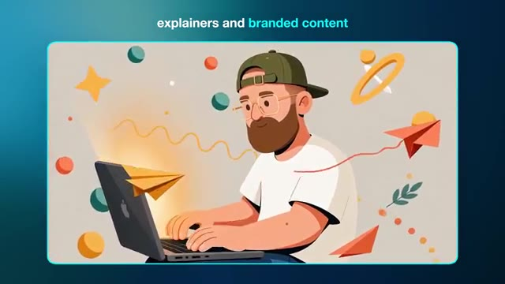
*Animation illustrative style dessin animé d'un créateur barbu avec une casquette tapant sur un ordinateur portable, entouré d'éléments graphiques colorés.*

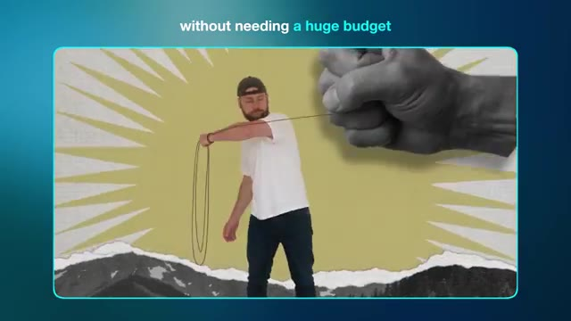
*Animation style collage où une grande main en noir et blanc tient une ficelle tirée par le personnage de Jack sur un fond texturé jaune et des montagnes en noir et blanc.*

---

### ⏱️ `[00:00:20 - 00:00:42]` | Segment #02

**🔊 Audio (Transcription Intégrale Mot pour Mot en Français) :**
> Dans cette vidéo, je vais vous apprendre à créer des graphiques animés de qualité supérieure avec les meilleurs outils d'IA. Pour que vous puissiez réaliser un produit pour lequel les clients paieront vraiment. Grâce à l'IA, un créateur unique peut faire le travail d'un studio entier. Et si vous apprenez à en profiter dès maintenant, il y a beaucoup d'argent à se faire. Si vous aimez le contenu d'aujourd'hui, n'oubliez pas de lâcher un pouce bleu pour moi et pensez à vous abonner.

**👁️ Analyse Visuelle d'Écran (gemini-3.5-flash-lite) :**
**Interface & Outils** : Présentation vidéo avec incrustation d'un rendu 3D animé et affichage d'un bouton d'appel à l'action "SUBSCRIBE" en bas à gauche.

**Contenu textuel & Code** : Rendu visuel d'éléments technologiques en 3D (console portable blanche, cartes électroniques, circuits) en lévitation sur fond sombre avec un contour lumineux bleu, et un encart "SUBSCRIBE" avec icône de pouce bleu et cloche de notification.

**Action / Démonstration** : Animation fluide de composants et d'appareils électroniques flottant et tournant sur eux-mêmes, illustrant les motion graphics créés par IA.

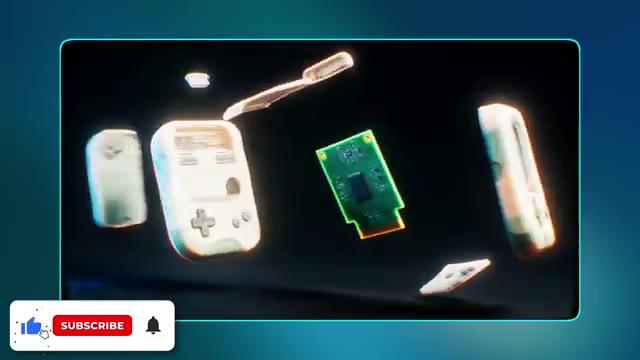
*Affichage d'une animation 3D générée par IA montrant des composants électroniques et des consoles portables rétro en lévitation dans l'espace.*

---

### ⏱️ `[00:00:42 - 00:01:03]` | Segment #03

**🔊 Audio (Transcription Intégrale Mot pour Mot en Français) :**
> Bon, entrons dans le vif du sujet. Dans la vidéo d'aujourd'hui, nous allons explorer trois types uniques d'animations graphiques que vous pouvez créer en utilisant l'IA. Et ils sont parfaits, que vous souhaitiez créer quelque chose pour vos propres projets créatifs ou que vous cherchiez à fabriquer des ressources que vous pourrez réellement vendre à un client ou à une marque. Le premier style que je veux examiner est le VectorArt.

**👁️ Analyse Visuelle d'Écran (gemini-3.5-flash-lite) :**
**Interface & Outils** : Écran de présentation vidéo avec incrustation caméra (PiP) du présentateur en bas à droite et affichage de texte animé.

**Contenu textuel & Code** : Texte affiché : numéros "1", "2", "3" sur les vignettes, puis le texte "style one\nvector art" sur l'image 3.

**Action / Démonstration** : Transition visuelle introduisant le premier style abordé dans la vidéo (Vector Art), illustré par des aperçus graphiques et du texte à l'écran.

*Affichage de trois vignettes numérotées représentant les trois styles de motion design présentés dans la vidéo, avec le présentateur en incrustation (PiP).*

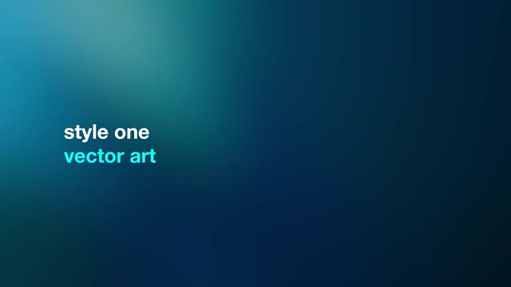
*Écran de transition affichant le texte "style one vector art" sur fond bleu dégradé.*

---

### ⏱️ `[00:01:03 - 00:01:25]` | Segment #04

**🔊 Audio (Transcription Intégrale Mot pour Mot en Français) :**
> C'est un type de graphisme en mouvement que vous avez beaucoup vu ces dernières années. C'est définitivement très tendance et pour une bonne raison. Pour générer nos graphismes en mouvement par IA, je suis sur Higgsfield. Et si vous voulez suivre en même temps, vous trouverez un lien en bas dans la description. Sur la page d'accueil, je vais me rendre dans le coin supérieur gauche et sélectionner créer une vidéo.

**👁️ Analyse Visuelle d'Écran (gemini-3.5-flash-lite) :**
**Interface & Outils** : Interface de la plateforme web Higgsfield (avec miniatures de vidéos, rubriques Explore, Image, Video, Cinema Studio, et encadré vidéo PiP du présentateur dans le coin inférieur droit).

**Contenu textuel & Code** : Textes visibles : "Explore", "Image", "Video", "Audio", "Edit", "Cinema Studio", "Marketing Studio", "Supercomputer", "Seedance 2.5", "Nano Banana Pro", "Higgsfield Global Film Festival $1,000,000".

**Action / Démonstration** : Le curseur de la souris survole et clique sur l'option "Video" dans le menu supérieur gauche de l'interface Higgsfield.

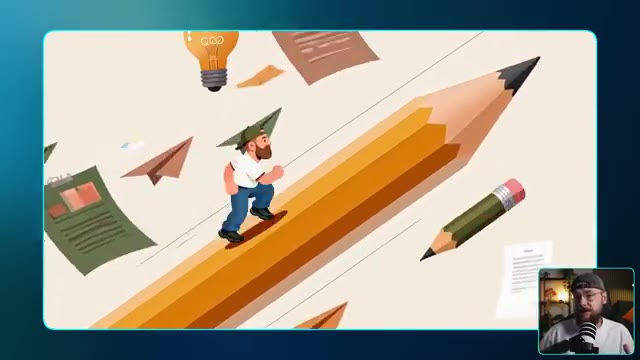
*Exemple d'animation graphique en mouvement montrant un personnage sur un crayon géant.*

*Page d'accueil de la plateforme Higgsfield affichant différents outils et options.*

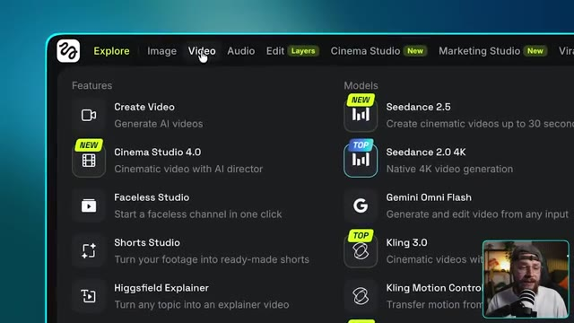
*Gros plan sur le menu supérieur gauche de l'interface de Higgsfield montrant les options de création.*

---

### ⏱️ `[00:01:25 - 00:02:02]` | Segment #05

**🔊 Audio (Transcription Intégrale Mot pour Mot en Français) :**
> Nous voulons d'abord sélectionner le modèle et pour la vidéo d'aujourd'hui, nous allons utiliser CDANCE 2.5, qui est maintenant disponible en résolution 1080p. Ce workflow donnera également d'excellents résultats avec CDANCE 2 si vous cherchez un moyen de réduire légèrement vos coûts. Maintenant, vous pouvez générer une vidéo par IA en utilisant uniquement un prompt textuel, mais l'ajout d'une image de référence vous donne beaucoup plus de contrôle sur vos résultats. Je vais donc télécharger cette version de moi-même au style art vectoriel que j'ai générée un peu plus tôt. En ce qui concerne le prompt lui-même, nous demandons une publicité de 15 secondes pour un Airbnb.

**👁️ Analyse Visuelle d'Écran (gemini-3.5-flash-lite) :**
**Interface & Outils** : Interface logicielle de génération vidéo par IA (type Seedance) avec panneau d'édition d'image et affichage de prompts textuels détaillés.

**Contenu textuel & Code** : Texte du prompt visible sur l'image 3 détaillant les plans, le style d'animation vectorielle 2D plate, la palette de couleurs, et les instructions de morphing pour une publicité de 15 secondes d'Airbnb. Sur l'image 2, aperçu d'un personnage vectoriel (homme barbu avec casquette et lunettes) sous différents angles.

**Action / Démonstration** : Le créateur montre l'importation de l'image de référence de son avatar vectoriel puis présente le prompt textuel détaillé utilisé pour générer la publicité de 15 secondes pour Airbnb.

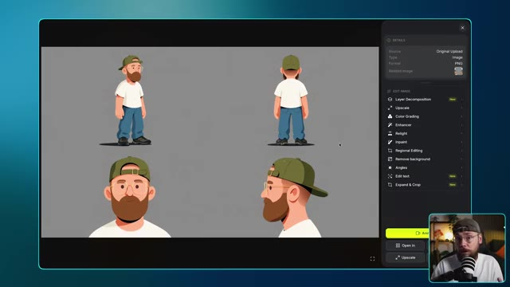
*Interface de l'outil de génération montrant une image de référence d'un personnage dans un style art vectoriel (plusieurs vues), avec des options d'édition d'image sur le panneau latéral droit.*

![Affichage d'un prompt textuel détaillé et structuré pour la génération de la publicité Airbnb, divisé en séquences temporelles ([00:00 - 00:04], etc.) avec des instructions de style et de palette.](screenshots/YT-CBDaJb04FgU/frame_010_00-02-00.jpg)
*Affichage d'un prompt textuel détaillé et structuré pour la génération de la publicité Airbnb, divisé en séquences temporelles ([00:00 - 00:04], etc.) avec des instructions de style et de palette.*

---

### ⏱️ `[00:02:02 - 00:02:42]` | Segment #06

**🔊 Audio (Transcription Intégrale Mot pour Mot en Français) :**
> style business. Et c'est un excellent exemple parce qu'on est en train de créer un contenu de marque qu'un client paierait réellement. Je vais vous expliquer exactement comment j'ai construit ce prompt dans une minute. Pour l'instant, je suis satisfait des paramètres, donc on peut y aller, cliquer sur générer et jeter un œil au résultat. Ouais, c'est sorti exactement comme je l'imaginais et c'est plutôt fou de penser qu'on

**👁️ Analyse Visuelle d'Écran (gemini-3.5-flash-lite) :**
**Interface & Outils** : Interface de Seedance (outil de génération de vidéo par IA) avec menu latéral, zone de prévisualisation, boîte de prompt et boutons de réglage (durée, format, résolution).

**Contenu textuel & Code** : Texte du prompt visible : « [00:00 - 00:04] Wide full-frame layout on a soft warm off-white field, slow 2D parallax push in... ». Modèle sélectionné : Seedance 2.5. Paramètres : 15s, 16:9, 1080p, Bitrate High. Bouton jaune de génération « Generate ».

**Action / Démonstration** : Le créateur montre l'interface de Seedance avec les paramètres saisis et lance la génération de la vidéo, puis le résultat animé est affiché.

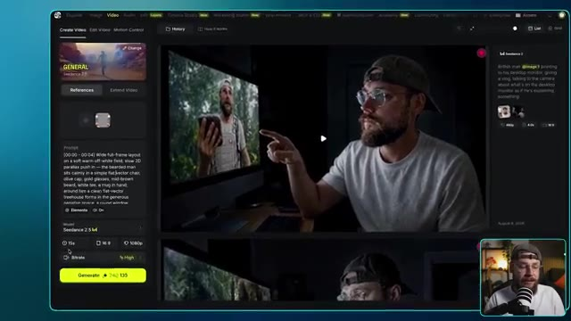
*Interface de Seedance montrant le panneau de configuration d'un prompt vidéo avec des options de génération et un retour visuel sur le moniteur.*

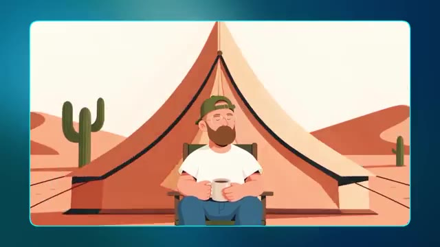
*Résultat de l'animation générée montrant un personnage de style vectoriel assis près d'une tente dans un paysage désertique avec des cactus.*

---

### ⏱️ `[00:02:42 - 00:03:18]` | Segment #07

**🔊 Audio (Transcription Intégrale Mot pour Mot en Français) :**
> J'ai construit cette publicité entière simplement en combinant une fiche de référence de personnage avec le bon prompt. En parlant de ça, pourquoi ce prompt fonctionne-t-il si bien ? C'est parce qu'il regorge d'indications à utiliser pour C-Dance et cette section en particulier décrivant le style fait un travail considérable. Tous mes prompts sont construits en utilisant une compétence Claude que je vais partager avec vous entièrement gratuitement. Il y a un lien dans la description vers ma communauté School où vous pourrez télécharger ceci et c'est vraiment aussi simple que de télécharger la compétence en même temps que vos références.

**👁️ Analyse Visuelle d'Écran (gemini-3.5-flash-lite) :**
**Interface & Outils** : Interface utilisateur de l'assistant IA Claude avec une invite textuelle et des pièces jointes de fichiers, ainsi que l'application de bureau affichant des instructions de prompts structurées.

**Contenu textuel & Code** : Textes visibles incluant : "Good afternoon, Jack", les blocs de prompts temporels ("[00:00 - 00:04] Wide full-frame layout..."), et le prompt de style vectoriel pour la marque "ROAM".

**Action / Démonstration** : Le créateur montre des exemples d'animation générée, détaille la structure des prompts textuels, puis présente l'interface de l'outil Claude où les fichiers de compétence et de référence sont téléchargés.

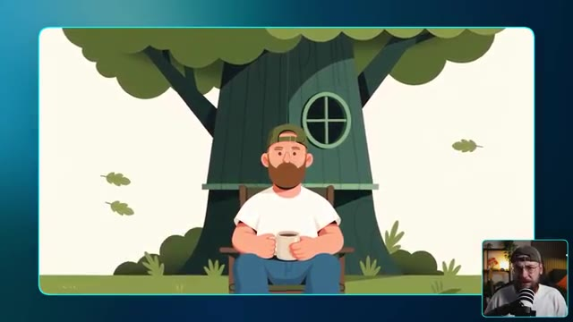
*Rendu visuel d'une animation 2D montrant un personnage barbu assis devant une cabane dans les arbres.*

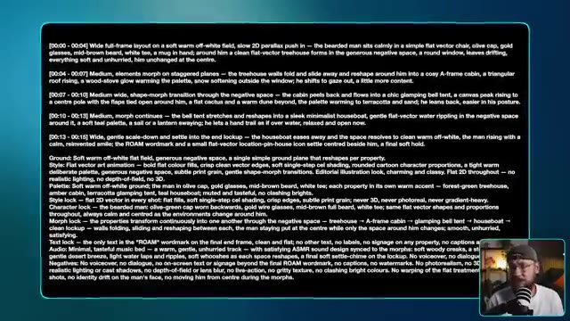
*Affichage de code ou de prompt détaillé avec des instructions temporelles et des indications de style.*

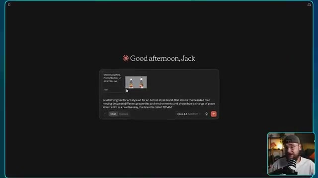
*Interface de l'outil Claude montrant une boîte de discussion avec le fichier de compétence et une image attachée.*

---

### ⏱️ `[00:03:18 - 00:03:54]` | Segment #08

**🔊 Audio (Transcription Intégrale Mot pour Mot en Français) :**
> et ensuite de décrire votre idée. Vous obtiendrez en retour un prompt riche et détaillé comme celui-ci, il vous suffit de le copier-coller directement dans Higgsfield et vous êtes prêt. Maintenant, j'ai conçu cette compétence Claude pour fonctionner pour une variété de styles de motion design, ce qui nous amène gentiment au deuxième style que je veux explorer, qui présente ce design en papier découpé. Alors que certaines marques et créateurs aiment que leur contenu semble propre et sans effort, d'autres préfèrent quelque chose qui semble plus brut et imparfait. Donc pour cet exemple, nous allons utiliser plusieurs références d'images. J'ai ces deux-là

**👁️ Analyse Visuelle d'Écran (gemini-3.5-flash-lite) :**
**Interface & Outils** : Interface sombre avec affichage de texte (prompt de génération) et incrustation vidéo PiP (Picture-in-Picture) de Jack dans son studio.

**Contenu textuel & Code** : Texte du prompt visible à l'écran : « A satisfying vector art style ad for an Airbnb style brand, that shows the bearded man moving between different properties and environments and shows how a change of place effects him in a positive way, the brand is called 'ROAM' » avec une icône de chargement « Untangling ».

**Action / Démonstration** : Le créateur montre un exemple de prompt textuel généré, puis bascule sur une vidéo de démonstration au style de papier découpé animée.

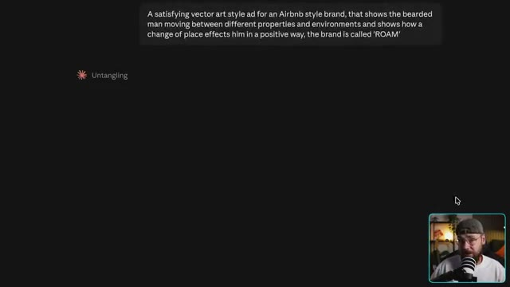
*Interface textuelle affichant un prompt détaillé pour une publicité dans un style d'art vectoriel inspiré d'Airbnb, avec un encadré PiP montrant Jack dans son studio.*

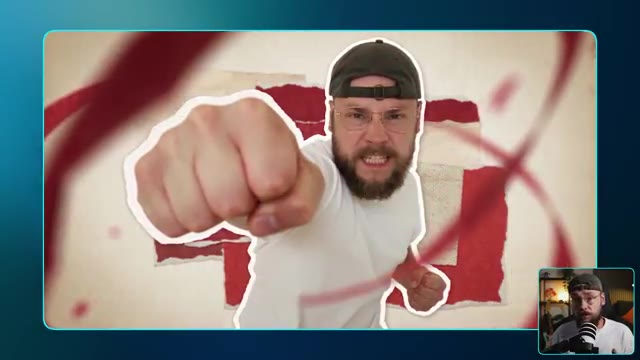
*Vidéo de démonstration au style de papier découpé montrant Jack effectuant un coup de poing face caméra avec un effet de découpage papier et des animations graphiques, avec un encadré PiP de Jack.*

---

### ⏱️ `[00:03:54 - 00:04:35]` | Segment #09

**🔊 Audio (Transcription Intégrale Mot pour Mot en Français) :**
> photos de moi-même aux côtés de cette bouteille de sauce piquante que j'ai générée plus tôt avec cette très jolie illustration personnalisée. Pour le prompt, je veux vraiment que cela donne une impression décalée et unique, pour vraiment pencher vers ce style de découpage en papier. Je ne veux pas trop en révéler, laissez-moi aller de l'avant et cliquer sur générer pour que nous puissions jeter un œil à ce que l'on obtient. C'est ce que j'adore dans le motion design. Chaque style est tellement unique.

**👁️ Analyse Visuelle d'Écran (gemini-3.5-flash-lite) :**
**Interface & Outils** : Interface logicielle de génération d'images/vidéos par IA avec panneau de configuration et options d'édition.

**Contenu textuel & Code** : Texte du prompt détaillé décrivant les plans, les styles (analog mixed-media collage animation), la palette de couleurs, le verrouillage du style et des personnages, ainsi que les consignes audio et négatives.

**Action / Démonstration** : Le créateur montre le flux de travail de génération d'IA, en passant de l'image source aux instructions textuelles détaillées jusqu'au résultat animé final.

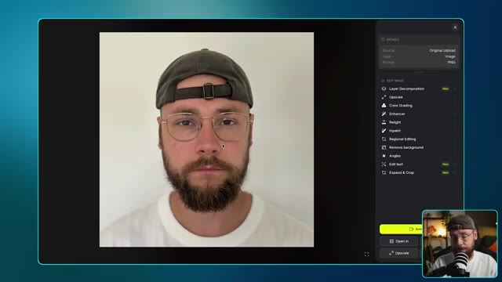
*Interface de l'outil d'IA montrant une image source de Jack avec des options d'édition sur le panneau latéral droit.*

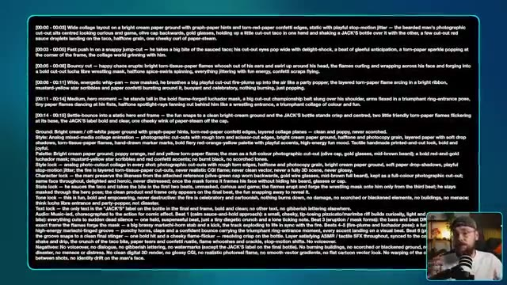
*Interface affichant un prompt textuel détaillé et structuré pour la génération vidéo en style papier découpé.*

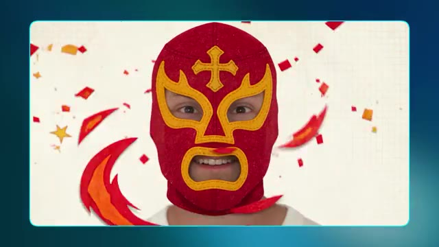
*Résultat visuel généré montrant Jack portant un masque de catcheur rouge et jaune dans un style papier découpé.*

---

### ⏱️ `[00:04:36 - 00:05:12]` | Segment #10

**🔊 Audio (Transcription Intégrale Mot pour Mot en Français) :**
> Cela va avoir un effet tellement différent sur le spectateur par rapport au style d'art vectoriel que nous avons fait plus tôt. C'était axé sur la simplicité et le calme, mais ici tout est question de vouloir se démarquer. Ce qui est formidable si une marque ou un créateur cherche un moyen de se séparer de la concurrence. Le produit reste également bien cohérent du début à la fin aux côtés de moi-même en tant que personnage. Rien ne se brise vraiment ici et on pourrait vraiment y brancher n'importe quel produit ou personnage qu'on peut imaginer. J'ai aussi cet exemple ici qui met davantage l'accent sur la narration.

**👁️ Analyse Visuelle d'Écran (gemini-3.5-flash-lite) :**
**Interface & Outils** : Présentation vidéo avec incrustation du créateur (PiP) en bas à droite et affichage d'animations graphiques générées par IA au centre.

**Contenu textuel & Code** : Inscription "JACK'S" visible sur la ceinture de catch dorée de l'illustration.
[DESC_IMAGE_4] Animation de narration visuelle montrant une marionnette humaine manipulée par des fils.

**Action / Démonstration** : Démonstration visuelle d'un style artistique alternatif plus percutant avec des animations de personnages et des éléments narratifs.

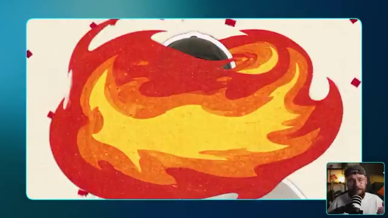
*Animation dynamique colorée avec des flammes de style dessin animé entourant le personnage de Jack.*

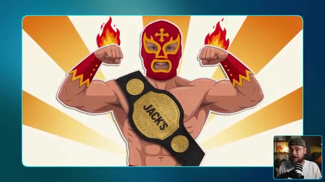
*Illustration stylisée d'un catcheur masqué musclé portant une ceinture de champion avec l'inscription "JACK'S".*

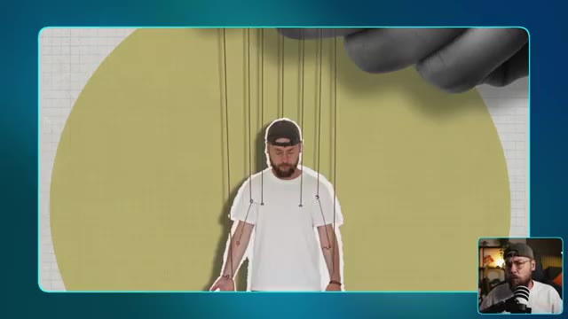
*Animation montrant le personnage de Jack suspendu par des fils de marionnette manipulés par une main géante en arrière-plan.*

---

### ⏱️ `[00:05:12 - 00:05:42]` | Segment #11

**🔊 Audio (Transcription Intégrale Mot pour Mot en Français) :**
> plutôt que de promouvoir un produit. Ici, je m'affranchis en quelque sorte des chaînes d'être manipulé ou contrôlé par quelqu'un d'autre. Un concept un peu plus abstrait ici, qui donne un ton plus sérieux mais qui fonctionne toujours très bien avec ce style de découpage en papier. Maintenant, nous avons déjà exploré deux types de motion design qui ont vraiment beaucoup de personnalité, mais je veux maintenant m'intéresser à quelque chose d'un peu plus rétro. Nous allons donc nous pencher sur ce style de motion design VHS.

**👁️ Analyse Visuelle d'Écran (gemini-3.5-flash-lite) :**
**Interface & Outils** : Présentation vidéo avec incrustation PiP (Picture-in-Picture) et écrans graphiques animés.

**Contenu textuel & Code** : Texte affiché à l'écran : "style three" et "vhs / retro".

**Action / Démonstration** : Le créateur illustre visuellement le concept abstrait avec une animation de style papier découpé (marionnette), puis présente le troisième style visuel (VHS/rétro) avec un titre textuel à l'écran.

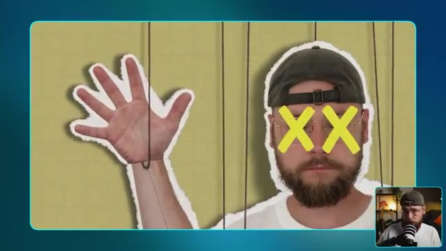
*Animation au style de découpage en papier montrant Jack sous forme de marionnette avec des fils et des croix jaunes sur les yeux, avec un encadré PiP de Jack en bas à droite.*

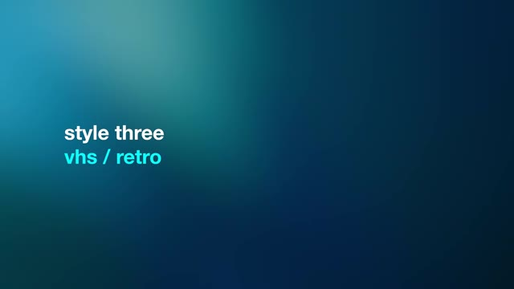
*Écran de transition ou de titre bleu dégradé affichant le texte "style three" et "vhs / retro".*

---

### ⏱️ `[00:05:42 - 00:06:04]` | Segment #12

**🔊 Audio (Transcription Intégrale Mot pour Mot en Français) :**
> Il y a d'excellents exemples sur Instagram où des créateurs ont pris des logos modernes et les ont en quelque sorte transformés dans ce style VHS. Et cela m'a vraiment inspiré pour explorer ce type particulier d'animation graphique. Encore une fois, c'est un excellent moyen pour un créateur ou une marque de se démarquer du lot.

**👁️ Analyse Visuelle d'Écran (gemini-3.5-flash-lite) :**
**Interface & Outils** : Interface d'Instagram affichant une vidéo Reels de @kxdgraphics sur le design d'un logo Netflix rétro, avec le créateur visible en incrustation PiP (Picture-in-Picture) dans le coin inférieur droit.

**Contenu textuel & Code** : Texte affiché à l'écran : « How I made this Retro Netflix Logo: » et « 1. Create a design in Adobe Illustrator », ainsi que les hashtags de la publication et les commentaires Instagram sur le panneau latéral droit.

**Action / Démonstration** : Le créateur montre un exemple de vidéo Instagram illustrant la création et l'animation rétro de logos modernes (style VHS/tube cathodique) pour inspirer le spectateur.

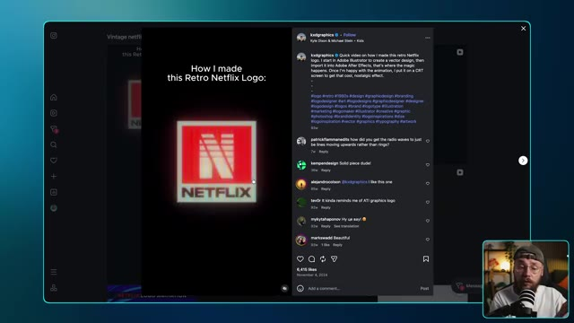
*Capture d'écran montrant une publication Instagram de @kxdgraphics affichant un logo rétro Netflix avec effet style VHS et tube cathodique, avec le créateur en incrustation PiP dans le coin inférieur droit.*

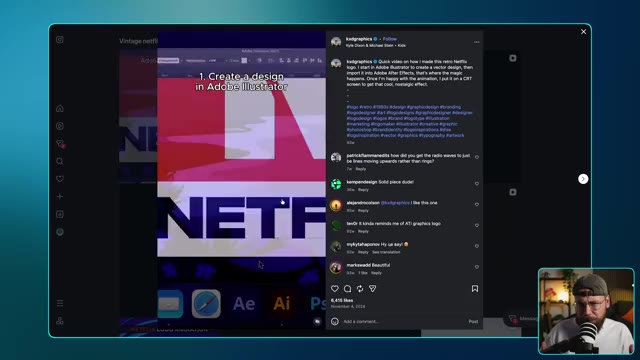
*Capture d'écran montrant le tutoriel de @kxdgraphics sur Instagram avec l'étape 1 de création sous Adobe Illustrator, et le créateur en incrustation PiP.*

---

### ⏱️ `[00:06:04 - 00:06:26]` | Segment #13

**🔊 Audio (Transcription Intégrale Mot pour Mot en Français) :**
> Et j'ai l'impression que cette tendance a vraiment été lancée par Stranger Things. Je veux donc en fait inventer deux exemples pour ce style. Nous allons donc commencer par quelque chose d'un peu plus simple, où j'ai pris les devants et créé ce logo rétro pour moi-même. Maintenant, il est vraiment important de s'assurer que vous avez cette esthétique présente avec toutes les images de référence que vous allez utiliser.

**👁️ Analyse Visuelle d'Écran (gemini-3.5-flash-lite) :**
**Interface & Outils** : Seedance 2.5 / Seedream 5.0 Pro (interface de génération et d'édition d'image/vidéo par IA).

**Contenu textuel & Code** : Sur l'image #2 : un prompt vidéo détaillé ("On deep black, the green striped sunburst shape from pops in first with a snappy elastic bounce..."), modèle Seedance 2.5 v4, paramètres 5s, 16:9, 1080p. Sur l'image #3 : logo rétro « JACK VS. AI » encadré de néons colorés, options de menu à droite (Layer Decomposition, Upscale, Color Grading, Enhancer, Relight, Inpaint, etc.).

**Action / Démonstration** : Le créateur montre l'interface de génération vidéo et l'image d'un logo rétro créé pour illustrer sa démonstration.

*Interface de Seedance 2.5 montrant une vidéo générée par IA avec un panneau de prompt détaillé et un aperçu vidéo, avec Jack en incrustation (PiP) en bas à droite.*

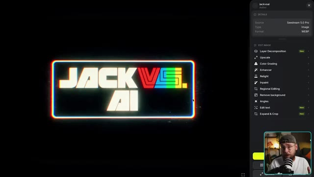
*Interface de Seedream 5.0 Pro affichant un logo rétro lumineux « JACK VS. AI » sur fond noir avec un panneau d'outils d'édition à droite.*

---

### ⏱️ `[00:06:26 - 00:06:59]` | Segment #14

**🔊 Audio (Transcription Intégrale Mot pour Mot en Français) :**
> Tu ne veux pas vraiment d'un logo beau et propre pour ça. Tu veux quelque chose qui intègre déjà ce style VHS. Pour le prompt, je vais faire assez simple également. Je veux juste que chaque élément qui compose le logo s'assemble d'une manière satisfaisante. Générons cela et regardons. Ouais, j'adore vraiment ce style. Il a beaucoup de caractère et cela vient en grande partie de ce sentiment d'imperfection. Tu peux aussi pousser cela un peu

**👁️ Analyse Visuelle d'Écran (gemini-3.5-flash-lite) :**
**Interface & Outils** : Présentation vidéo avec affichage d'éléments textuels (prompt) et de rendus visuels de logo, avec incrustation PiP du créateur.

**Contenu textuel & Code** : Texte du prompt décrivant l'animation du logo sur fond noir et les spécifications de style rétro CRT (scanlines, aberration chromatique RVB, bruit vidéo analogique, grain pixel lo-fi).

**Action / Démonstration** : Le créateur montre le prompt utilisé pour générer le logo, puis présente le résultat animé final à l'écran.

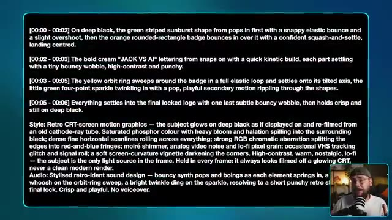
*Affichage à l'écran du prompt détaillé avec les instructions d'animation et de style rétro CRT du logo, avec Jack dans un petit encadré en bas à droite.*

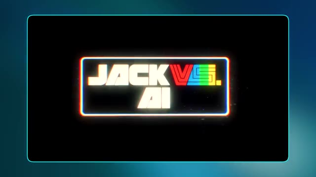
*Affichage du rendu final du logo rétro « JACK VS. AI » dans un style cathodique avec des effets de lueur et d'aberration chromatique.*

---

### ⏱️ `[00:06:59 - 00:07:33]` | Segment #15

**🔊 Audio (Transcription Intégrale Mot pour Mot en Français) :**
> De plus, si vous le souhaitez, en amenant la génération d'IA dans un logiciel de montage. Ici, j'ai réduit la fréquence d'images pour avoir un style d'animation plus haché. J'ai amplifié la lueur en ajoutant quelques filtres supplémentaires ainsi qu'un grain de pellicule pour un peu plus de texture. Maintenant, je veux examiner un exemple plus complexe. Donc ce que j'ai fait, c'est que j'ai généré cinq images séparées qui ont toutes ce style VHS et se rapportent au processus de fabrication d'un expresso. L'image finale est vraiment très belle

**👁️ Analyse Visuelle d'Écran (gemini-3.5-flash-lite) :**
**Interface & Outils** : Adobe Premiere Pro et Seedance 2.5 / 5.0 Pro.

**Contenu textuel & Code** : Dans Premiere Pro : panneau des effets (Time Remapping, Posterize Time à 10.0 fps, Wonder Glow avec intensité 30.0%). Dans Seedance : prompt "[00:00 - 00:03] On deep black, the glowing coffee bean @image 1 drifts in and rotates slowly on its axis...", modèle Seedance 2.5 Full, durée 15s, résolution 1080p. Image finale avec le texte "ROAST".

**Action / Démonstration** : Le créateur montre son écran de montage vidéo dans Premiere Pro pour ajuster la fréquence d'images et ajouter des effets visuels, puis présente une interface de génération vidéo par IA pour créer une séquence complexe en plusieurs étapes autour du café.

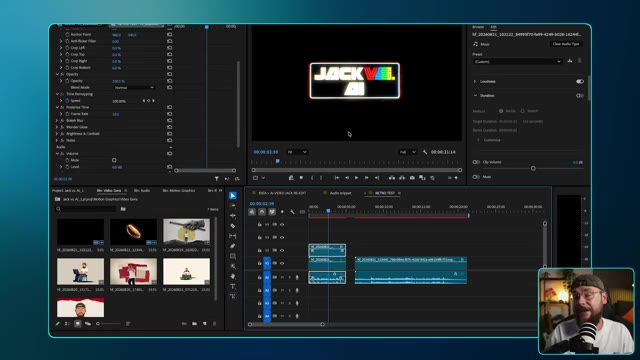
*Interface d'Adobe Premiere Pro montrant la timeline de montage et les effets appliqués sur les clips vidéo.*

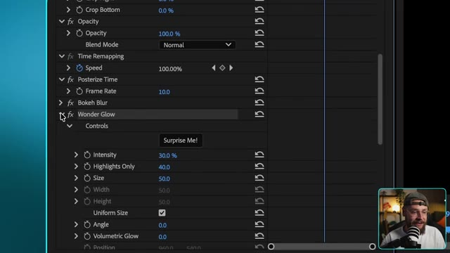
*Gros plan sur le panneau des effets d'Adobe Premiere Pro montrant les paramètres de Time Remapping et Wonder Glow.*

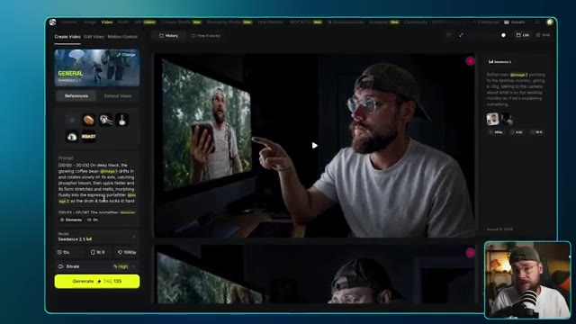
*Interface de l'outil de génération Seedance 2.5 affichant un prompt textuel lié à la fabrication d'un expresso et des références d'images.*

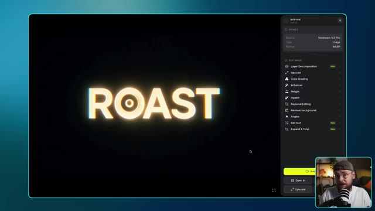
*Interface de Seedance 5.0 Pro montrant l'image générée avec le texte lumineux « ROAST » sur fond noir et les options d'édition.*

---

### ⏱️ `[00:07:33 - 00:08:08]` | Segment #16

**🔊 Audio (Transcription Intégrale Mot pour Mot en Français) :**
> logo minimaliste pour notre marque de café fictive nommée Roast. Pour le prompt, je demande à Seedance 2.5 d'effectuer une transition fluide entre chaque image individuelle pour montrer le processus de fabrication de l'expresso et de se terminer sur notre nom de marque. Allons-y, lançons la génération et voyons ce que nous obtenons. Ce résultat est exactement ce

**👁️ Analyse Visuelle d'Écran (gemini-3.5-flash-lite) :**
**Interface & Outils** : Interface de démonstration vidéo / éditeur de prompts avec affichage de rendus visuels générés par IA.

**Contenu textuel & Code** : Texte du prompt en anglais décrivant les séquences temporelles (00:00 à 00:15) pour les éléments @bean, @portafilter, @pour, @cup et @roast, avec le style "Retro CRT-screen motion graphics".

**Action / Démonstration** : Le créateur présente le prompt textuel complexe utilisé pour générer l'animation de la marque de café, puis montre le résultat visuel du porte-filtre généré par Seedance 2.5.

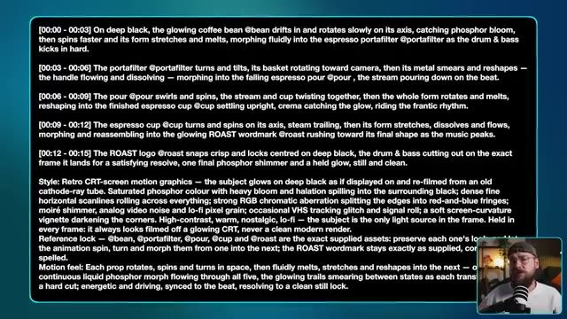
*Affichage du prompt textuel détaillé sur fond noir décrivant les étapes d'animation, le style CRT rétro et les consignes de mouvement.*

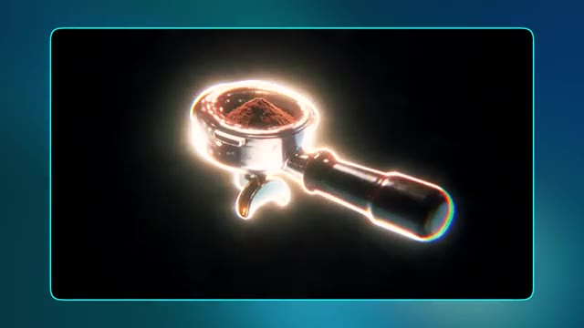
*Aperçu de la vidéo générée montrant un porte-filtre d'espresso brillant avec de la mouture de café dans un style graphique effet tube cathodique.*

---

### ⏱️ `[00:08:08 - 00:08:45]` | Segment #17

**🔊 Audio (Transcription Intégrale Mot pour Mot en Français) :**
> J'étais après. Cela semble à la fois imparfait et satisfaisant. Vous remarquerez un thème un peu récurrent en matière de motion design, et c'est cette idée de minimalisme. La plupart du temps, moins c'est plus, et c'est un excellent exemple. J'adore aussi la musique personnalisée que C-Dance a générée pour ce contenu. Il peut être assez délicat de trouver le bon morceau de musique dans des bibliothèques de stock, par exemple, et de le faire correspondre à votre vidéo. Obtenir une bonne synchronisation et faire correspondre

**👁️ Analyse Visuelle d'Écran (gemini-3.5-flash-lite) :**
**Interface & Outils** : Incrustation vidéo (Picture-in-Picture) avec Jack dans le coin inférieur droit, affichant des animations de motion design minimalistes centrées sur fond noir avec une bordure bleue.

**Contenu textuel & Code** : Animations graphiques minimalistes liées au café : une tasse fumante, un grain de café, et le texte "ROAST" en lettres lumineuses.

**Action / Démonstration** : Le créateur présente des exemples de motion graphics minimalistes générés par IA, illustrant ses propos sur la simplicité visuelle et la musique personnalisée.

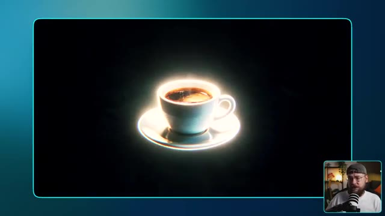
*Animation vidéo au centre montrant une tasse de café fumante entourée d'un halo lumineux, avec Jack en incrustation PiP dans le coin inférieur droit.*

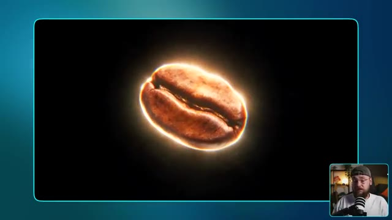
*Animation vidéo au centre montrant un grain de café détaillé entouré d'un halo lumineux, avec Jack en incrustation PiP dans le coin inférieur droit.*

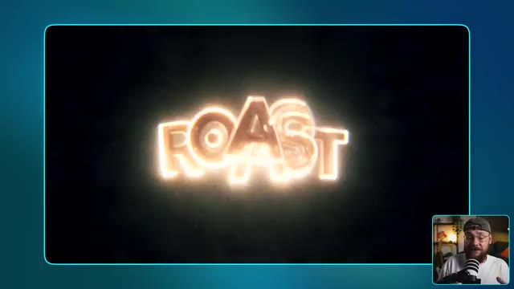
*Animation vidéo au centre affichant le mot "ROAST" en lettres lumineuses de style néon/doré, avec Jack en incrustation PiP dans le coin inférieur droit.*

---

### ⏱️ `[00:08:45 - 00:09:20]` | Segment #18

**🔊 Audio (Transcription Intégrale Mot pour Mot en Français) :**
> l'ambiance de ce que vous recherchez peut s'avérer un vrai défi mais C-Dance 2.5 a en quelque sorte fait tout le travail difficile pour nous ici. Voilà. Trois styles de motion design très distincts, que vous pouvez tous personnaliser pour correspondre à n'importe quel projet créatif ou brief client. Juste un petit rappel que si vous souhaitez essayer mon générateur de prompts personnalisé, vous trouverez un lien dans la description vers ma communauté School. Là-bas, vous pourrez télécharger la compétence ainsi que tous mes prompts de manière entièrement gratuite. Si vous avez apprécié le contenu d'aujourd'hui, assurez-vous de lâcher un pouce bleu pour moi et envisagez

**👁️ Analyse Visuelle d'Écran (gemini-3.5-flash-lite) :**
**Interface & Outils** : Interface de la plateforme Skool et aperçu de rendu vidéo d'IA.

**Contenu textuel & Code** : Texte affiché : « skool link in description » et publications de communauté sur Skool concernant des prompts et fichiers markdown.

**Action / Démonstration** : Le créateur montre des exemples de styles de motion design générés par IA puis présente sa communauté Skool en partageant son écran.

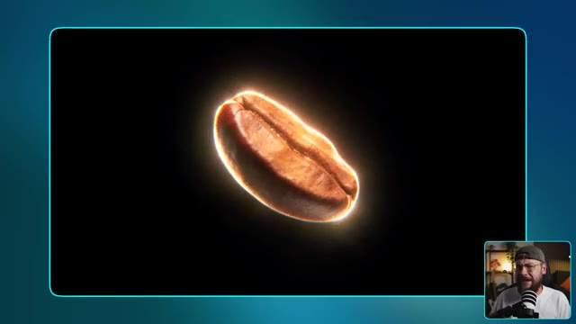
*Rendu vidéo d'un grain de café brillant généré par IA avec le créateur en incrustation PiP.*

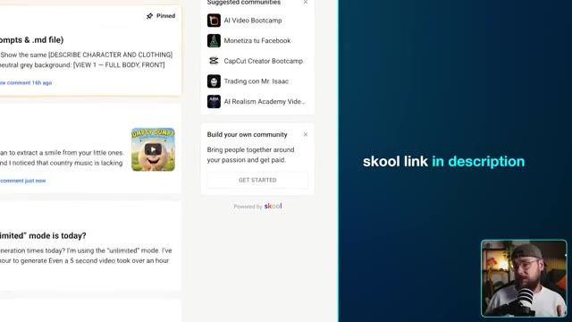
*Capture d'écran de la plateforme Skool montrant des discussions et des communautés de prompts IA.*

---

### ⏱️ `[00:09:20 - 00:09:31]` | Segment #19

**🔊 Audio (Transcription Intégrale Mot pour Mot en Français) :**
> de vous abonner. Je vais continuer à proposer d'autres contenus si vous souhaitez continuer à explorer tout ce qui est possible avec les derniers outils d'IA. Et cela étant dit, je vous retrouve dans la prochaine vidéo.

**👁️ Analyse Visuelle d'Écran (gemini-3.5-flash-lite) :**
**Interface & Outils** : Présentation face caméra sans partage d'écran

**Contenu textuel & Code** : Aucun contenu logiciel ou technique affiché à l'écran, uniquement un arrière-plan flou ou uni aux tons bleus.

**Action / Démonstration** : Le créateur conclut sa vidéo et s'adresse directement au public.

---
