# 🎬 Pipeline d'animation IA : Comment créer des films en style Claymation 100% avec l'IA

> **Chaîne** : [Jack Vs. AI](https://www.youtube.com/@JackVsAI)  
> **Titre original** : `AI Animation Pipeline: How to Make Claymation Style Movies 100% with AI`  
> **Lien YouTube** : [https://www.youtube.com/watch?v=Rj8BYbZCce0](https://www.youtube.com/watch?v=Rj8BYbZCce0)  
> **Date de publication** : 2026-09-05  
> **Durée** : 38m 03s (`2283s`)  
> **Identifiant vidéo** : `Rj8BYbZCce0`  
> **Fiche Web Interactive** : [2026-09-05_YT-Rj8BYbZCce0_Pipeline d'animation IA Comment créer des films en style Claymation 100% avec l'_by-whisper-v3-large-turbo+gemini-3.5-flash-lite.html](2026-09-05_YT-Rj8BYbZCce0_Pipeline d'animation IA Comment créer des films en style Claymation 100% avec l'_by-whisper-v3-large-turbo+gemini-3.5-flash-lite.html)  
> **Captures d'écran clés** : `71 images sauvegardées`  
> **Modèles utilisés** : Audio: `large-v3-turbo` (Faster-Whisper int8 VPS) | Vision: `gemini-3.5-flash-lite` (Google AI Studio API)  

---

## 📌 Synthèse Exécutive & Outils

### 📌 Résumé
La vidéo de Jack offre une masterclass technique sur la création de films en stop-motion (claymation) entièrement générés par intelligence artificielle, démocratisant un processus qui prenait autrefois des mois en une production de quelques minutes. En combinant des outils de pointe, Jack démontre qu'un créateur solo peut endosser les rôles de scénariste, réalisateur et animateur tout en gardant un contrôle créatif total. Son approche repose sur une pré-production rigoureuse, l'utilisation stratégique de modèles d'images spécialisés et une cohérence visuelle irréprochable entre les personnages, les accessoires et les décors.

La méthode étape par étape de Jack met en lumière l'importance d'une direction artistique itérative. Plutôt que de se contenter des premiers résultats, il utilise l'assistant textuel Claude pour affiner ses prompts, ajuster les textures et corriger les expressions des personnages afin d'éviter les rendus trop lisses ou inquiétants. Chaque élément visuel est pensé en amont — comme l'échelle exagérée d'une épée pour accentuer l'humour — et soigneusement organisé via des systèmes de favoris et d'actifs, garantissant un flux de travail fluide et sans friction créative.

Les bénéfices pour les créateurs de vidéo sont immenses : réduction drastique des coûts et des délais, accessibilité à des styles visuels complexes et tactiles, et surtout, l'acquisition de compétences fondamentales applicables à n'importe quel projet de réalisation cinématographique par IA. Cette approche permet non seulement d'obtenir des rendus uniques comparables à des productions professionnelles de type *Wallace et Gromit*, mais elle ouvre également la voie à une personnalisation poussée, incluant l'intégration de la voix originale des créateurs.

### 🛠️ Outils, Modèles & Logiciels Présentés
* **Claude** : Utilisé comme assistant textuel intelligent pour analyser les images générées, repérer les défauts artistiques et réécrire des prompts optimisés afin d'améliorer la direction artistique.
* **Higgsfield AI** : La plateforme centrale de production utilisée pour générer les images de référence, maintenir la cohérence des personnages et gérer l'organisation des actifs visuels (favoris).
* **Premiere Pro** : Logiciel de montage traditionnel mentionné pour l'assemblage final et la post-production des séquences animées.
* **Seedance** / **Seedance 2.5** : Modèles et outils d'animation par IA évoqués dans l'écosystème global des flux de travail vidéo.
* **Flux** : Modèle d'image ou de génération cité parmi les solutions technologiques de pointe du secteur.
* **GPT Image 2** : Modèle d'image par IA testé en premier lieu pour sa haute fidélité texturale, mais jugé trop prudent par rapport aux besoins du projet.
* **C Dream 5.0 Pro** : Modèle d'image par IA favorisé par Jack pour ses rendus stylisés et expressifs, parfaits pour l'esthétique loufoque de la pâte à modeler.

### 🔑 Points Clés & Enseignements Stratégiques
* **Établir une vision conceptuelle claire** : Définir dès le départ une histoire forte (ici, un père de famille malgré lui devenu chasseur de monstres) pour guider l'ensemble des choix de génération visuelle.
* **Investir du temps dans la pré-production** : Considérer la phase de création des personnages et des accessoires comme le socle indispensable qui conditionne toute la réussite du film.
* **Itérer intelligemment avec l'aide de Claude** : Ne pas hésiter à réinjecter les images insatisfaisantes dans un LLM pour identifier ce qui manque au style (ex: perte du côté excentrique) et obtenir des suggestions de prompts correctifs.
* **Assurer la cohérence stylistique des personnages** : Utiliser la première image de référence validée (comme le personnage principal) pour influencer et générer tous les autres protagonistes (le père, les monstres) afin qu'ils appartiennent au même univers.
* **Maîtriser l'échelle via la mise en scène des accessoires** : Faire tenir les objets (comme les épées) directement par les personnages dans les images de référence pour donner à l'IA une compréhension claire des proportions et accentuer l'effet comique.
* **Gérer rigoureusement ses actifs visuels** : Utiliser le système de favoris et l'onglet dédié des plateformes pour trier et archiver uniquement les meilleures générations, évitant ainsi d'être submergé par le volume brut de production.
* **Éviter les rendus trop réalistes ou effrayants** : Ajuster constamment les prompts pour que les personnages stylisés (claymation) restent attachants, abordables et expressifs, à la manière de productions professionnelles comme *Wallace et Gromit*.
* **Standardiser le processus de prompt** : Conserver une structure de prompt modulaire où seule la description spécifique du sujet change, garantissant une uniformité visuelle de bout en bout.
* **Anticiper l'animation dès l'étape fixe** : Penser chaque image fixe en fonction de son futur mouvement pour s'assurer que l'IA n'introduira pas de ruptures logiques ou de incohérences cinématiques.
* **Intégrer sa propre voix en post-production** : Conserver le contrôle total de la personnalité et de l'identité artistique de la vidéo en y injectant une voix off authentique, un détail souvent négligé mais crucial pour se démarquer.

---

## ⏱️ Chronologie & Transcription Complète Audio & Visuelle (Mot pour Mot)

### ⏱️ `[00:00:00 - 00:00:33]` | Segment #01

**🔊 Audio (Transcription Intégrale Mot pour Mot en Français) :**
> Vous pouvez désormais créer de magnifiques vidéos en pâte à modeler avec l'IA. Ce style en stop-motion prenait autrefois des mois pour obtenir seulement 60 secondes de séquences. Mais maintenant, des films entiers peuvent être créés en quelques minutes avec rien de plus qu'un ordinateur portable. Je m'appelle Jack, j'ai passé plus d'une décennie à créer des effets visuels pour de nombreuses plus grandes marques de la planète. Et maintenant, j'utilise l'IA pour réinventer les charges de travail créatives. L'animation en pâte à modeler a un réel charme. Elle semble excentrique, tactile et unique, ce qui la rend parfaite pour les courts métrages, les publicités pour des clients et

**👁️ Analyse Visuelle d'Écran (gemini-3.5-flash-lite) :**
**Interface & Outils** : Jack face caméra, filmé dans un studio personnel ou un bureau à domicile bien aménagé, assis dans un fauteuil gaming noir. Il porte un t-shirt blanc, une casquette verte portée à l'envers et des lunettes rondes. Un microphone de podcast blanc et noir à bandes est positionné juste devant lui. En arrière-plan, on aperçoit une étagère en métal garnie d'objets de décoration, de plantes vertes, d'une petite lampe sphérique allumée, ainsi qu'un mur en lamelles de bois lamellé et un fauteuil avec un coussin orange vif.

**Contenu textuel & Code** : Aucun texte incrusté, prompt ou paramètre technique visible à l'écran pour l'instant.

**Action / Démonstration** : Jack s'adresse directement aux spectateurs face caméra, gesticulant légèrement de manière expressive tout en parlant dans le microphone pour introduire le sujet de la vidéo.

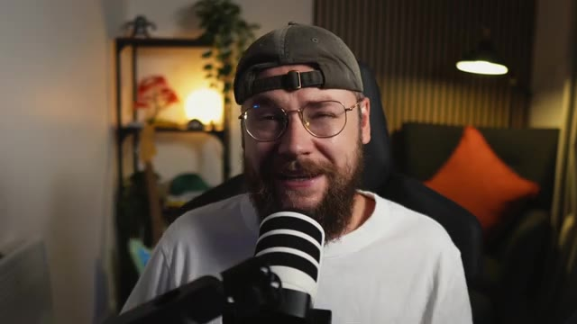

---

### ⏱️ `[00:00:33 - 00:01:10]` | Segment #02

**🔊 Audio (Transcription Intégrale Mot pour Mot en Français) :**
> même des clips musicaux. Aujourd'hui, je vais vous enseigner chaque étape du processus, y compris toutes les astuces et conseils que les autres créateurs ne vous disent pas. Ainsi, dès que vous aurez fini cette vidéo, vous pourrez commencer à créer votre propre projet à partir de zéro. Il ne s'agit pas seulement d'économiser du temps et de l'argent, il s'agit d'avoir un contrôle créatif total. Et d'acquérir les connaissances pour devenir à la fois scénariste, réalisateur et animateur en un seul homme. Si vous aimez le contenu d'aujourd'hui, n'hésitez pas à lâcher un pouce bleu pour moi et à vous abonner. Allez, entrons dans le vif du sujet. Maintenant, tout de suite, je tiens à préciser que nous allons entrer dans les détails techniques avec cette vidéo. Si vous voulez un aperçu rapide d'un flux de travail ou plus

**👁️ Analyse Visuelle d'Écran (gemini-3.5-flash-lite) :**
**Interface & Outils** : Lecteur vidéo plein écran affichant un plan cinématographique généré par IA, sans interface logicielle visible (pas de barre d'outils, de timecode ou de menus d'application).

**Contenu textuel & Code** : Un plan large cinématique présentant une créature géante humanoïde en roche et mousse dotée d'un unique œil géant au centre du torse, marchant à quatre pattes dans une prairie sous un ciel bleu nuageux. Face à elle, au premier plan, se tient un petit guerrier miniature brandissant une épée. Au centre de l'écran, des sous-titres en caractères gras jaunes s'affichent sur deux lignes : « and building the knowledge to become ».

**Action / Démonstration** : Lecture d'un clip vidéo généré par intelligence artificielle montrant le déplacement dynamique du monstre rocheux qui avance en soulevant de la poussière et des débris de terre au sol, tandis que la caméra adopte un angle en plongée pour souligner la disproportion de taille entre les personnages.

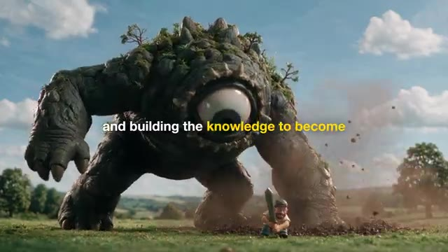

---

### ⏱️ `[00:01:10 - 00:01:45]` | Segment #03

**🔊 Audio (Transcription Intégrale Mot pour Mot en Français) :**
> d'un aperçu condensé, il y a plein d'autres vidéos de ce genre sur ma chaîne ou d'autres créateurs dans le domaine. Mais dans cette vidéo, je veux explorer chaque étape de la production vidéo par IA en détail. Et bien que cela soit axé sur notre concept de pâte à modeler, vous allez apprendre beaucoup de principes fondamentaux que vous pouvez appliquer à n'importe quel projet de réalisation de films par IA. Et assurez-vous de rester jusqu'à la fin du tutoriel parce que je vais vous apprendre à mettre réellement votre propre voix dans vos vidéos par IA. C'est une excellente façon d'ajouter un peu de personnalité supplémentaire à votre travail et ce n'est pas quelque chose que je

**👁️ Analyse Visuelle d'Écran (gemini-3.5-flash-lite) :**
**Interface & Outils** : Plan fixe montrant Jack face caméra, portant une casquette retournée, des lunettes et un t-shirt blanc, installé dans son studio personnel devant un bureau et une étagère décorée avec une lampe d'ambiance et une plante verte. Un microphone est placé juste devant lui au premier plan.

**Contenu textuel & Code** : Aucun texte, prompt ou paramètre technique n'est affiché à l'écran dans ce plan.

**Action / Démonstration** : Jack s'adresse directement aux spectateurs en face caméra, en parlant de manière engagée tout en bougeant légèrement la tête et en articulant pour introduire le sujet principal du tutoriel sur la production vidéo par IA.

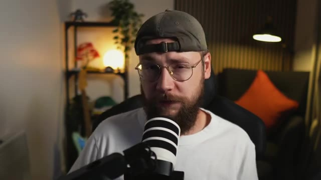

---

### ⏱️ `[00:01:45 - 00:02:21]` | Segment #04

**🔊 Audio (Transcription Intégrale Mot pour Mot en Français) :**
> voir beaucoup d'autres créateurs en parler alors même que cela vous donne beaucoup plus de contrôle. Commençons par le commencement avec notre pré-production. C'est ici que nous allons établir notre concept, puis construire tous les éléments dont nous avons besoin pour donner vie à notre projet. Pour mon idée très loufoque et aléatoire, je vais être le personnage principal qui est contraint de devenir un chasseur de monstres et d'apprendre à concilier cette nouvelle vocation tout en étant mari et père. Et pour ajouter un peu plus de profondeur, il s'avérera que mon père était lui aussi un peu un chasseur de monstres secret depuis le début.

**👁️ Analyse Visuelle d'Écran (gemini-3.5-flash-lite) :**
**Interface & Outils** : Jack face caméra dans son studio, assis dans un fauteuil gaming noir, parlant devant un microphone sur pied noir et blanc rayé. En arrière-plan, on aperçoit une étagère en bois garnie d'objets décoratifs, une plante verte, une guitare, un mur à lamelles en bois et une lampe d'ambiance avec un coussin orange.

**Contenu textuel & Code** : Aucun texte, prompt ou paramètre technique n'est affiché à l'écran.

**Action / Démonstration** : Jack s'exprime face caméra en parlant activement, avec des mouvements de tête et des expressions faciales expressives pour illustrer son propos sur la phase de pré-production et le scénario de son projet.

---

### ⏱️ `[00:02:22 - 00:02:44]` | Segment #05

**🔊 Audio (Transcription Intégrale Mot pour Mot en Français) :**
> Et cet appel est un peu une histoire de famille. Une grande partie de l'humour va venir du fait que je suis juste un père de famille normal et fatigué qui n'a pas vraiment envie de sortir pour combattre ces monstres. Donc, comme vous pouvez le voir, tout ce projet a été construit sur Higgsfield AI. Et si vous voulez suivre tout ça, vous trouverez un lien juste en dessous dans la description.

**👁️ Analyse Visuelle d'Écran (gemini-3.5-flash-lite) :**
**Interface & Outils** : Une fenêtre vidéo principale au format 16:9 représentant une scène animée en stop-motion/pâte à modeler (claymation), avec en bas à droite un encadré rectangulaire incrusté (Picture-in-Picture) montrant le visage du présentateur Jack dans son studio face caméra avec son micro.

**Contenu textuel & Code** : Aucun texte ou prompt textuel n'est affiché à l'écran dans cette séquence ; l'image montre le personnage principal en pâte à modeler assis à une table en bois dans une cuisine lumineuse, tenant un smartphone de la main droite et une tasse de café de la main gauche, avec des clés posées sur la table.

**Action / Démonstration** : Le personnage animé en pâte à modeler regarde l'écran de son smartphone tout en étant assis à table dans une cuisine, tandis que dans l'encadré en bas à droite, Jack s'exprime et présente le projet.

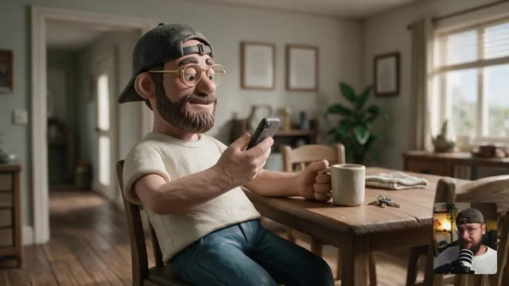

---

### ⏱️ `[00:02:44 - 00:03:05]` | Segment #06

**🔊 Audio (Transcription Intégrale Mot pour Mot en Français) :**
> La première priorité était d'établir le personnage principal, qui, comme je l'ai dit, est cette version en pâte à modeler de moi-même. Donc ce que j'ai fait, c'est que j'ai téléchargé cette image de référence de moi-même aux côtés de ce prompt particulier, qui intègre le style pâte à modeler et demande à l'IA de construire une feuille de référence de personnage.

**👁️ Analyse Visuelle d'Écran (gemini-3.5-flash-lite) :**
**Interface & Outils** : Interface sombre d'une application ou d'une plateforme web de gestion d'images, comportant un panneau latéral à droite affichant les détails du fichier (Source, Type, Format) et une incrustation vidéo (PiP) de Jack face caméra avec son micro dans le coin inférieur droit.

**Contenu textuel & Code** : Dans le panneau "DETAILS" : "Source: Original Upload", "Type: Image", "Format: PNG". Au centre, deux photos de référence d'un homme barbu portant des lunettes et une casquette à l'envers (une vue de profil gauche et une vue de face).

**Action / Démonstration** : L'écran affiche l'interface de visualisation des images téléchargées avec le panneau latéral ouvert montrant les métadonnées, tandis qu'en bas à droite Jack parle face caméra.

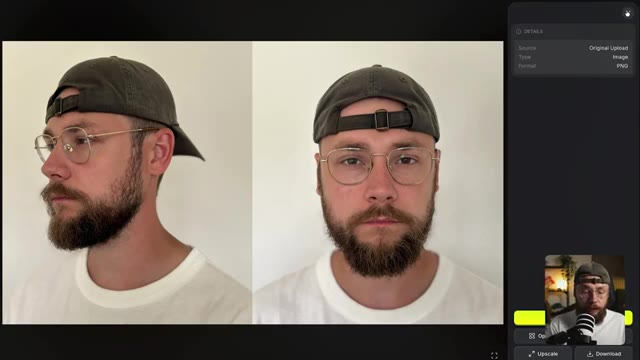

---

### ⏱️ `[00:03:05 - 00:03:30]` | Segment #07

**🔊 Audio (Transcription Intégrale Mot pour Mot en Français) :**
> Le premier modèle d'image par IA que j'ai essayé était GPT Image 2, qui est largement considéré comme le meilleur modèle sur le marché actuellement. Laissez-moi vous montrer le résultat que j'ai obtenu. Donc, la fidélité texturale est là, mais je ne sais pas, cela semblait juste un peu trop prudent. Et ce que j'ai fini par faire, c'est d'utiliser exactement la même référence et le même prompt, mais en passant à C Dream 5.0 Pro.

**👁️ Analyse Visuelle d'Écran (gemini-3.5-flash-lite) :**
**Interface & Outils** : Interface de génération d'images par IA avec un panneau latéral d'informations et de paramètres à droite, une image principale affichée au centre représentant quatre vues d'un personnage en argile, et un encart vidéo montrant le visage de Jack en bas à droite.

**Contenu textuel & Code** : Le prompt visible dans le panneau latéral est : « Show the same bearded man, white oversized t-shirt, blue baggy jeans, dark unbranded gorp core trainers. Character reference sheet — four views on a neutral grey background: [VIEW 1 — FULL BODY, FRONT] Full-body front-facing three-quarter view of this character, full body ». Les paramètres techniques affichés dans la section « DETAILS » incluent : le modèle « GPT Image 2 », la qualité « High », la taille « 2688x1520 », et la date de création « August 27, 2026 at 10:45 AM ».

**Action / Démonstration** : L'écran présente l'image générée avec ses différentes vues sous forme de planche de référence, tandis que le panneau latéral de droite détaille les paramètres de génération et que la webcam de Jack apparaît en médaillon dans le coin inférieur droit.

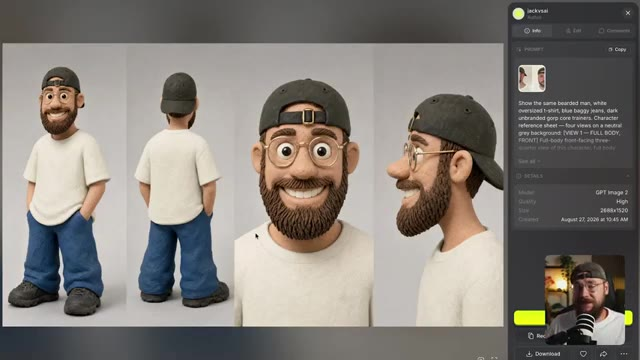

---

### ⏱️ `[00:03:30 - 00:03:55]` | Segment #08

**🔊 Audio (Transcription Intégrale Mot pour Mot en Français) :**
> Et cela m'a donné un résultat bien plus intéressant. Je me suis vraiment attaché à ce modèle d'image par IA ces derniers temps. Je pense en fait qu'il est vraiment très bon, surtout si vous cherchez des rendus plus stylisés, ce que je faisais bien sûr avec ce projet. Pour moi, cela a immédiatement fait penser au type de personnage qui serait parfaitement à sa place dans un film ou une série de type Wallace et Gromit.

**👁️ Analyse Visuelle d'Écran (gemini-3.5-flash-lite) :**
**Interface & Outils** : Jack face caméra, assis dans son studio, avec un microphone placé devant lui. Aucun logiciel ou site web n'est affiché à l'écran.

**Contenu textuel & Code** : Aucun texte, prompt ou paramètre technique visible à l'écran dans ce plan.

**Action / Démonstration** : Jack s'adresse directement aux spectateurs face caméra, en parlant de manière expressive et en bougeant légèrement les mains pour illustrer ses propos.

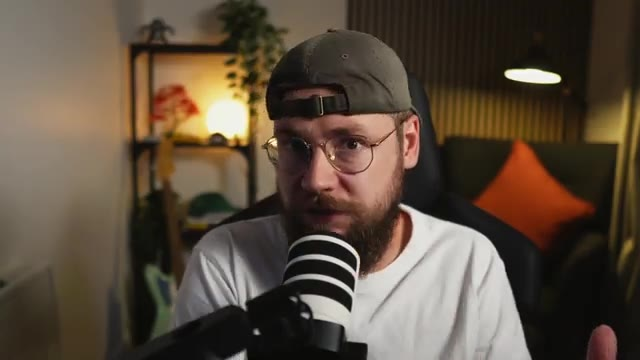

---

### ⏱️ `[00:03:56 - 00:04:31]` | Segment #09

**🔊 Audio (Transcription Intégrale Mot pour Mot en Français) :**
> Ses proportions sont un peu légèrement exagérées et il a l'air assez unique sans pour autant frôler le grotesque ou le genre flippant. Donc pour moi, une fois que j'ai généré cette image ici, je savais que j'étais prêt à commencer. Ça semblait correct. Et le top aussi, c'est que vous pouvez carrément utiliser exactement ce même prompt si vous le voulez. Vous pouvez juste remplacer votre propre référence et le début des prompts pour décrire le personnage que vous cherchez. Comme toujours, tous mes prompts et documents sont disponibles gratuitement sur ma page School.

**👁️ Analyse Visuelle d'Écran (gemini-3.5-flash-lite) :**
**Interface & Outils** : Interface utilisateur de type galerie de génération d'images avec un panneau latéral droit de détails et d'édition. En bas à droite de l'écran, une incrustation vidéo (picture-in-picture) montre le créateur (Jack) face caméra devant son micro.

**Contenu textuel & Code** : Affichage d'une grille de quatre vues d'un personnage de type stop-motion en argile (style pâte à modeler) représentant un homme barbu avec une casquette à l'envers, des lunettes, un t-shirt blanc et un jean. Dans le panneau latéral droit, le prompt affiché est : "Show the same bearded man, white oversized t-shirt, blue baggy jeans, dark unbranded gorpcore trainers. Character reference sheet — four views on a neutral grey seamless studio background: [VIEW 1 — FULL BODY, FRONT] Full-body front-facing three-quarter view of this...". Les détails techniques indiquent : Modèle "Seedream 5.0 Pro", Qualité "2k", Taille "2720x1536", Date "August 27, 2026 at 10:52 AM". Le nom d'auteur "jackvsai" est visible en haut du panneau.

**Action / Démonstration** : Le curseur de la souris (pointeur) survole le texte du prompt dans le panneau latéral droit, précisément sur le bouton "See all" permettant d'afficher l'intégralité du texte descriptif.

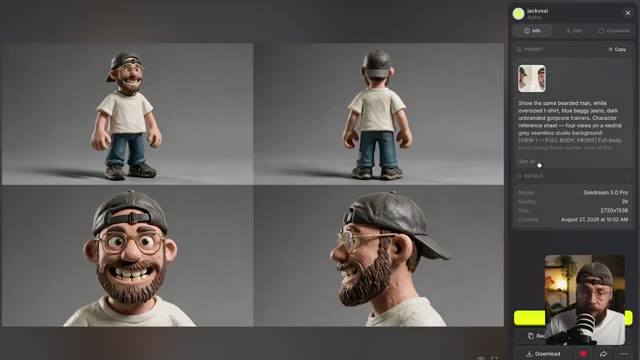

---

### ⏱️ `[00:04:31 - 00:05:07]` | Segment #10

**🔊 Audio (Transcription Intégrale Mot pour Mot en Français) :**
> communauté. Je mettrai également un lien vers cela en bas dans la description. Maintenant, je ne saurais trop insister sur l'importance de réussir cette première étape car elle influence chaque partie du projet qui suit. Et je le dis tout à fait littéralement car si nous continuons à examiner d'autres personnages que j'ai générés, y compris le personnage de mon père, il a été construit en utilisant cette image originale comme référence. Pour faire cela dans Higgsfield, il vous suffit de survoler une image et de cliquer sur cette icône ici, et cela va alors influencer ce que vous êtes en train de générer. Vraiment important pour moi.

**👁️ Analyse Visuelle d'Écran (gemini-3.5-flash-lite) :**
**Interface & Outils** : L'interface affichée est celle de la plateforme web de génération d'IA générative Higgsfield (vue de la galerie d'images et des feuilles de référence de personnages). On y aperçoit également, dans un encart vidéo circulaire incrusté en bas à droite de l'écran, le visage du créateur de la chaîne Jack Vs. AI installé devant son microphone.

**Contenu textuel & Code** : Le prompt de génération visible dans une infobulle est le suivant : « Show the same bearded man, white oversized t-shirt, blue baggy jeans, dark unbranded gorp core trainers. Character reference sheet — four views on a neutral grey background: [VIEW 1 — FULL BODY, FRONT] Full-body front-facing three-quarter view of this character, full body visible head to feet. [VIEW 2 — FULL BODY, REAR] Full-body rear view of the same character, directly from behind. Full body visible head to feet. [VIEW 3 — FRONT CLOSE-UP] Head and shoulders close-up, straight-on front view. Sharp detail on skin texture, accessories, and costume surface detail. Chest and shoulder armour/clothing visible at the bottom of frame. [VIEW 4 — PROFILE CLOSE-UP] Head and shoulders close-up, 90-degree left profile view. Neck and upper shoulder visible. Lighting & presentation: Clean studio lighting — soft key light upper left, gentle fill from the right. Consistent character identity, proportions, and costume details across all four views. No text, no watermarks, no extra figures, no background environment. In the below style... Classic Aardman-style claymation with hand-sculpted plasticine characters, visible thumbprints and tool marks, toothy wide grins and big round eyes ». On distingue aussi les paramètres techniques : le modèle de génération « GPT Image 2 », le niveau de détail « High », les compteurs « 2K » et « 16:9 », le sélecteur « 1/4 », ainsi qu'un bouton jaune « Generate 8.5 ».

**Action / Démonstration** : Le curseur de la souris survole une image spécifique d'une grille de personnages 3D en pâte à modeler de style Aardman, faisant apparaître un menu contextuel flottant avec des options d'interaction et d'utilisation de l'image comme référence.

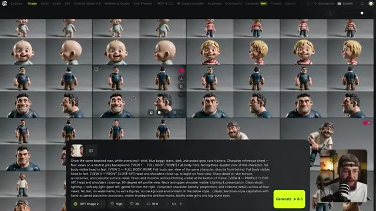

---

### ⏱️ `[00:05:07 - 00:05:39]` | Segment #11

**🔊 Audio (Transcription Intégrale Mot pour Mot en Français) :**
> parce que cela a gardé le style cohérent pour tous ces différents personnages, y compris tous les monstres dont nous parlerons tout à l'heure, ils ont tous l'impression de faire partie du même monde, il n'y a pas de rupture de style ou de logique à aucun moment. Maintenant, c'est aussi un processus d'itération et cela vaut vraiment la peine de prendre son temps pour que tous les personnages ressemblent à ce que vous imaginez. Un excellent exemple de cela est mon père dans le rôle de ce personnage particulier, donc la première image que j'ai générée, j'ai eu l'impression que...

**👁️ Analyse Visuelle d'Écran (gemini-3.5-flash-lite) :**
**Interface & Outils** : Jack face caméra dans son studio, assis dans un fauteuil noir, portant une casquette kaki à l'envers, des lunettes rondes et un t-shirt blanc, s'exprimant devant un microphone professionnel suspendu. En arrière-plan, une étagère en bois éclairée présente des objets décoratifs et une plante verte, et un fauteuil muni d'un coussin orange est visible à droite.

**Contenu textuel & Code** : Aucun texte, prompt ou paramètre technique n'est affiché à l'écran dans ce plan.

**Action / Démonstration** : Jack est filmé de face, parlant directement à l'audience en gesticulant légèrement avec son micro et en maintenant le regard vers la caméra.

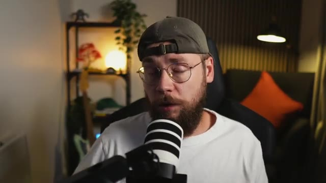

---

### ⏱️ `[00:05:39 - 00:06:03]` | Segment #12

**🔊 Audio (Transcription Intégrale Mot pour Mot en Français) :**
> On a en quelque sorte perdu un peu de ce côté loufoque de la pâte à modeler et je pense qu'il est vraiment très important de garder ça. Donc ce que vous allez voir souvent dans ce processus, c'est qu'en fait je retourne sur une discussion que j'ai eue avec Claude. Ce que j'ai fait, c'est que j'ai téléchargé cette image comme référence et j'ai dit à Claude : « Il me semble qu'on a perdu un peu du style excentrique de l'original, tu ne trouves pas ? »

**👁️ Analyse Visuelle d'Écran (gemini-3.5-flash-lite) :**
**Interface & Outils** : L'écran affiche l'interface sombre du navigateur web du modèle de langage Claude. En bas à droite, une incrustation vidéo (picture-in-picture) montre Jack face caméra dans son studio, portant une casquette et s'exprimant devant un micro de studio.

**Contenu textuel & Code** : On distingue dans la bulle de chat de l'utilisateur le texte : « Seems like we've lost some of the eccentric style of the original, don't you think? Also, let's lose the pencil behind the ear, not necessary. » En dessous, la réponse détaillée de l'IA analyse les caractéristiques perdues (style plastique, modelé, proportions) et propose un nouveau prompt de génération textuelle très précis pour recréer l'aspect de la pâte à modeler et les imperfections artisanales du style Aardman.

**Action / Démonstration** : L'écran présente un retour visuel sur l'historique des prompts et des analyses textuelles de l'utilisateur avec l'intelligence artificielle Claude, servant d'étape intermédiaire pour corriger le style artistique avant la génération vidéo.

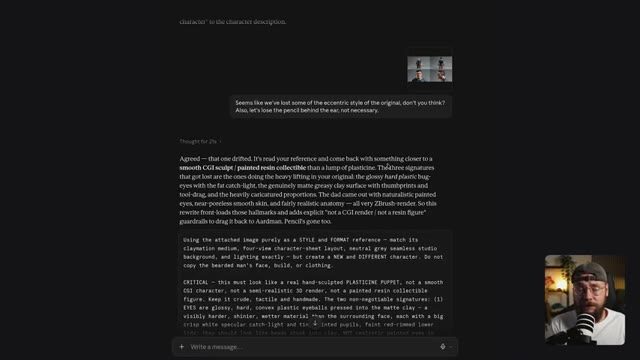

---

### ⏱️ `[00:06:03 - 00:06:41]` | Segment #13

**🔊 Audio (Transcription Intégrale Mot pour Mot en Français) :**
> En plus, enlevons le crayon derrière l'oreille, je trouvais juste que ce n'était pas un accessoire nécessaire. Et ensuite Claude m'a redonné ce prompt révisé, et donc j'aurais réinjecté ça dans Higgsfield une fois de plus pour finir par obtenir un résultat comme celui-ci. Donc à ce stade, j'ai téléchargé cette image, je suis retourné sur Claude une fois de plus et je lui ai dit que ça fonctionne mieux maintenant. Je me demande si on peut le rendre un peu moins effrayant ou flippant parce que je veux que le genre de personnage de père, mon père dans le film, soit abordable. Et en utilisant ce prompt révisé de Claude, j'ai récupéré ce résultat ici.

**👁️ Analyse Visuelle d'Écran (gemini-3.5-flash-lite) :**
**Interface & Outils** : L'interface affichée est une capture de l'application de chat web de Claude (Anthropic), avec un design épuré sur fond sombre. En bas à droite de l'écran, une incrustation vidéo (picture-in-picture) montre le créateur Jack face caméra, portant une casquette et des lunettes, installé devant son micro. En haut à droite, une petite vignette montre des planches de character-sheet (model sheet) du personnage. Le curseur de la souris (flèche blanche) est visible au centre de l'écran.

**Contenu textuel & Code** : Le contenu textuel affiché dans l'interface de chat comprend les messages échangés : un message de l'utilisateur disant « Nice that's working much better now, I wonder - can we make him look a little bit less scary/creepy? » accompagné d'une petite image en miniature en haut. La réponse de Claude commence par un bloc « Thought for 8s », suivi d'une analyse textuelle détaillée : « Yeah, I see it — and it's not the sculpt, it's almost entirely the expression. Three things are making him read as menacing... » et propose un prompt complet très détaillé pour générer un nouveau personnage en pâte à modeler (claymation) avec un visage plus chaleureux (« Using the attached image purely as a STYLE and FORMAT reference... »). En bas, un champ de saisie avec le texte « Write a message... ».

**Action / Démonstration** : L'écran présente un historique de conversation textuelle avec une IA générative (Claude) dans le cadre d'un processus itératif de prompting pour concevoir l'apparence d'un personnage en pâte à modeler (stop-motion / claymation), tandis que le curseur de la souris survole la zone de texte centrale.

---

### ⏱️ `[00:06:41 - 00:07:00]` | Segment #14

**🔊 Audio (Transcription Intégrale Mot pour Mot en Français) :**
> ce qui, à mes yeux, était parfait. Vous remarquerez également que, puisque j'étais satisfait de cette image, j'ai cliqué sur cette icône de favori ici. Et au fur et à mesure que je parcours toutes ces images, vous verrez qu'il y a beaucoup de générations, mais seulement quelques-unes qui ont réellement été mises en favoris.

**👁️ Analyse Visuelle d'Écran (gemini-3.5-flash-lite) :**
**Interface & Outils** : Interface sombre d'une application de génération d'images par IA, comportant un panneau latéral avec des métadonnées, des boutons d'action (Turn to video, Recreate, Reference, Download) et une icône de cœur rouge (favori). En bas à droite, on aperçoit Jack face caméra avec son micro.

**Contenu textuel & Code** : Dans le panneau de métadonnées : Model: Seedream 5.0 Pro, Quality: 2k, Size: 2720x1536, Created: August 28, 2026 at 2:28 PM. Boutons : "Turn to video" en jaune fluo, "Recreate", "Reference", "Download", une icône de cœur rouge, de partage et de menu contextuel (trois points). À gauche, un aperçu d'une image générée représentant la nuque et les cheveux d'un personnage modélisé (style figurine en argile/stop-motion).

**Action / Démonstration** : Jack commente la sélection de ses images générées favorites, montrant à l'écran l'icône de cœur activée pour indiquer qu'il a gardé cette image précise parmi de nombreuses autres générations.

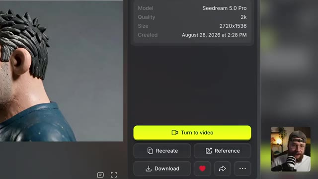

---

### ⏱️ `[00:07:00 - 00:07:19]` | Segment #15

**🔊 Audio (Transcription Intégrale Mot pour Mot en Français) :**
> Et c'est parce que je veux seulement utiliser ceux qui, selon moi, fonctionnent vraiment très bien. Je trouve également cela incroyablement utile du point de vue de l'organisation, car si nous nous dirigeons vers l'onglet des actifs, que vous pouvez trouver dans le coin supérieur droit ici, j'ai tous mes favoris instantanément accessibles.

**👁️ Analyse Visuelle d'Écran (gemini-3.5-flash-lite) :**
**Interface & Outils** : Interface web d'un outil de création ou d'une plateforme d'intelligence artificielle vidéo affichant une grille de miniatures. En bas à droite, incrustation vidéo (PiP) de Jack face caméra devant un microphone.

**Contenu textuel & Code** : Menus de navigation en haut incluant des options telles que Video, Audio, Edit, Cinema Studio 4.0, Marketing Studio, Viral Presets, MCP & CLI, Supercomputer, Academy, Community, Controls, Plugins, Credits, Enterprise et Assets. Barre de recherche ou de prompt semi-masquée en bas avec un bouton de génération jaune. Un petit compteur de favoris (icône de cœur avec le chiffre 1) est visible sur l'une des miniatures de la grille.

**Action / Démonstration** : Affichage d'une grille dense de prévisualisations d'assets visuels et de personnages 3D en style stop-motion sous différents angles, tandis que l'utilisateur explique l'organisation et l'accès rapide aux favoris via l'onglet des actifs.

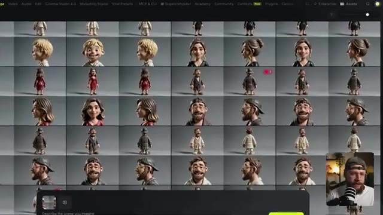

---

### ⏱️ `[00:07:19 - 00:07:42]` | Segment #16

**🔊 Audio (Transcription Intégrale Mot pour Mot en Français) :**
> Donc je ne suis pas submergé par le volume considérable de tout ce que j'ai généré, qui a pu fonctionner ou non. Ce sont simplement les images et les vidéos avec lesquelles je suis vraiment très heureux. Donc cette étape du processus consiste à constituer une vaste collection de différents actifs visuels que nous allons utiliser pour notre film achevé.

**👁️ Analyse Visuelle d'Écran (gemini-3.5-flash-lite) :**
**Interface & Outils** : Interface utilisateur d'une plateforme de génération et gestion d'actifs par IA, avec un menu supérieur (Explore, Image, Video, Audio, Edit, Cinema Studio 4.0, Marketing Studio, etc.) et une barre latérale à gauche affichant des filtres ("All Assets", "Favorites", outils de tri et dossiers de projets). Dans le coin inférieur droit, une incrustation vidéo (PiP) montre Jack face caméra parlant dans un microphone.

**Contenu textuel & Code** : On aperçoit une grille d'actifs visuels classés par dates (notamment "August 30, 2026", "August 28, 2026", "August 27, 2026"), constituée de miniatures d'images et de clips vidéo générés par IA, la plupart marqués d'un cœur rouge indiquant qu'ils sont likés/favoris. Les images montrent divers personnages fantastiques, monstres, créatures et plans cinématographiques. Le panneau latéral liste des projets et dossiers ("Jack Kennedy", "Times Square Wo...", "HOPE (Sci-Fi)", "My Team 5", "Motion Graphics", etc.).

**Action / Démonstration** : L'écran présente la bibliothèque de favoris ("Liked") organisée par catégories chronologiques, mettant en valeur la sélection et le tri des meilleurs assets visuels générés par le créateur.

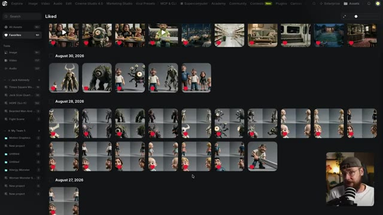

---

### ⏱️ `[00:07:42 - 00:08:00]` | Segment #17

**🔊 Audio (Transcription Intégrale Mot pour Mot en Français) :**
> Et juste pour vous donner un tas d'exemples différents, nous avons cette image fixe ici de moi tenant la grande épée, qui est un accessoire vraiment important dans notre film. La raison pour laquelle j'ai généré cette image fixe de moi tenant l'accessoire plutôt que de simplement montrer l'accessoire sur un fond uni est de donner à l'IA une compréhension de l'échelle.

**👁️ Analyse Visuelle d'Écran (gemini-3.5-flash-lite) :**
**Interface & Outils** : Interface utilisateur d'une application de génération d'images par IA avec un panneau latéral d'inspection et de métadonnées, intégrant un encart vidéo de Jack face caméra dans le coin inférieur droit.

**Contenu textuel & Code** : Image fixe centrale montrant un personnage en pâte à modeler (claymation) inspiré de Jack, portant une casquette à l'envers, des lunettes, un t-shirt blanc et un jean, tenant à deux mains une grande épée. Dans le panneau latéral : prompt visible « Using the attached character reference, generate a single full-body front-facing three-quarter shot of the same bearded man... », modèle « Seedream 5.0 Pro », résolution « 2720x1536 », et date « August 28, 2026 at 2:15 PM ».

**Action / Démonstration** : L'image fixe générée est affichée en grand sur la zone principale de l'écran tandis que Jack commente et explique son choix de mise en scène dans l'encart vidéo en bas à droite.

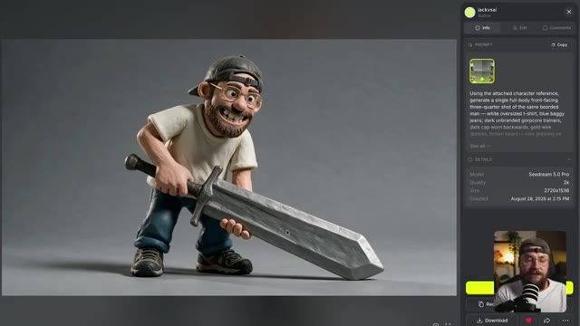

---

### ⏱️ `[00:08:01 - 00:08:21]` | Segment #18

**🔊 Audio (Transcription Intégrale Mot pour Mot en Français) :**
> Je voulais que les épées soient presque trop grandes pour que je puisse les tenir, parce que ça fait partie du côté comique. J'essaie de voir vraiment très loin à l'avance quand il s'agit de générer mes vidéos. Je ne veux pas que les outils aient à deviner la taille et le design de l'épée, ni sa taille par rapport à moi en tant que personnage.

**👁️ Analyse Visuelle d'Écran (gemini-3.5-flash-lite) :**
**Interface & Outils** : Une interface de génération d'images/vidéos (type Seedream ou Midjourney) avec un panneau latéral à droite affichant les détails de génération, un panneau contextuel en bas à droite montrant Jack face caméra avec son micro, et une zone principale affichant l'image générée en grand format.

**Contenu textuel & Code** : Dans le panneau de droite, on aperçoit une image miniature de référence, le prompt de génération : « Using the attached character reference, generate a single full-body front-facing three-quarter shot of the same bearded man — white oversized t-shirt, blue baggy jeans, dark unbranded gorpcore trainers, dark cap worn backwards, gold wire ... », ainsi que les détails techniques : Modèle Seedream 5.0 Pro, Qualité 2k, Résolution 2720x1536, et la date August 28, 2026 at 2:15 PM. Dans la zone principale, un personnage en pâte à modeler (claymation) tenant une épée géante.

**Action / Démonstration** : Le curseur de la souris (flèche) survole la zone de l'épée sur l'image générée. Dans le coin inférieur droit, la webcam montre Jack en train de parler et d'animer ses propos avec ses mains.

---

### ⏱️ `[00:08:21 - 00:08:57]` | Segment #19

**🔊 Audio (Transcription Intégrale Mot pour Mot en Français) :**
> Je veux en fait donner cette information au modèle vidéo par IA. Comme je le dis, mon père est l'un des personnages de ce projet, mais je voulais aussi inclure mes deux fils. Nous avons donc cette génération ici de mon fils aîné, Isaac. Nous avons aussi celle-ci. C'est mon plus jeune qui s'appelle Ellis et bien sûr, j'ai dû inclure ma femme Leanne aussi. C'est la génération que j'ai vraiment aimée, ça ressemble vraiment à une version en pâte à modeler de Leanne. Encore une fois, vous verrez que ça a pris un peu de temps pour en arriver là, pour peaufiner tout ça.

**👁️ Analyse Visuelle d'Écran (gemini-3.5-flash-lite) :**
**Interface & Outils** : Interface sombre d'une application de génération d'images/vidéos par IA, avec une disposition en grille divisée en quatre cadrans affichant différentes vues d'un personnage de bébé en pâte à modeler (claymation). Sur le côté droit, un panneau de contrôle (Prompt, Details avec le modèle Seedream 5.0 Pro) et, en bas à droite, la caméra incrustée de Jack dans son studio s'exprimant dans un microphone.

**Contenu textuel & Code** : Dans la section Prompt : "Using the attached image purely as a STYLE and FORMAT reference — match its claymation medium, four-view character-sheet layout, neutral grey seamless studio background, and lighting exactly — but create a NEW and DIFFERENT character. Do not copy this previous character's faces or...". Dans la section Details : Model: Seedream 5.0 Pro, Quality: 2k, Size: 2720x1536, Created: August 28, 2028 at 2:38 PM.

**Action / Démonstration** : Le curseur de la souris (flèche) est visible sur la zone grise entre les cadrans, tandis que Jack est incrusté en bas à droite et gesticule en parlant de sa famille et du processus de création des différents personnages sous forme de figurines en pâte à modeler.

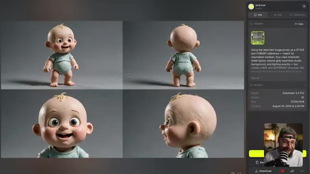

---

### ⏱️ `[00:08:57 - 00:09:20]` | Segment #20

**🔊 Audio (Transcription Intégrale Mot pour Mot en Français) :**
> et encore une fois j'aurais eu cette conversation en va-et-vient avec Claude, partageant mes générations et obtenant des prompts un peu modifiés pour les relancer dans Seedream 5.0 Pro. Et ce qu'il faut noter, bien sûr, c'est que j'utilise toujours cette première image comme référence pour toutes ces générations. Donc maintenant vous pouvez vraiment voir à quel point il était important de réussir cette première image.

**👁️ Analyse Visuelle d'Écran (gemini-3.5-flash-lite) :**
**Interface & Outils** : Interface sombre d'une application ou d'une plateforme Web affichant une grille de 4 images de modélisation de personnage sur fond gris neutre. Sur le côté droit, un panneau latéral contextuel affiche les détails de la génération, les métadonnées et un champ de prompt. En bas à droite, une petite incrustation vidéo en direct montre Jack face caméra avec son micro et sa casquette. En haut à droite, le profil "jackvsai - Author" avec des options d'information, d'édition et de commentaires.

**Contenu textuel & Code** : Texte du prompt visible : "Using the attached image purely as a STYLE and FORMAT reference for the claymation medium, four-view character-sheet layout, neutral grey seamless studio background, and lighting — but create a NEW character based on the person described below. (The second uploaded photo is a real-person...". Bouton "Copy" et "See all". Section "DETAILS" : Model : Seedream 5.0 Pro, Quality : 2k, Size : 2720x1536, Created : August 28, 2026 at 2:47 PM.

**Action / Démonstration** : Le curseur de la souris (flèche) survole le texte et le panneau latéral de droite pour consulter les paramètres de génération de Seedream 5.0 Pro et le prompt utilisé.

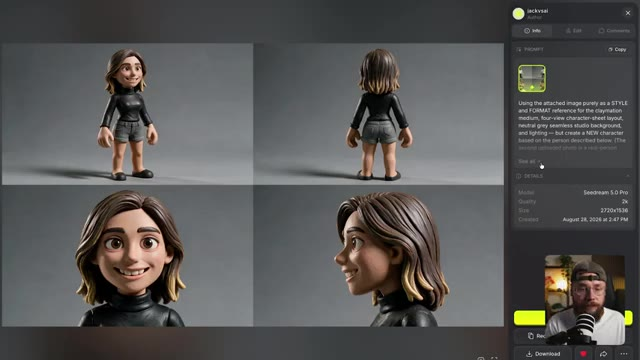

---

### ⏱️ `[00:09:20 - 00:09:54]` | Segment #21

**🔊 Audio (Transcription Intégrale Mot pour Mot en Français) :**
> Et vous pouvez voir que tous ces personnages ont l'air de faire partie du même monde. Et vous verrez que je vais en fait un peu plus loin en générant ces tenues alternatives pour nos personnages. J'utilise donc cette image originale avec un prompt pour me mettre dans ce genre de belle chemise. Je savais que je voulais une scène où moi et Leanne sortons pour une sorte de rendez-vous amoureux qui est ennuyeusement écourté, alors j'avais préparé cela pour cette scène particulière. Encore une fois, à mesure que l'on progresse ici, voici quelques conceptions initiales de ce que Leanne porterait pour ce rendez-vous.

**👁️ Analyse Visuelle d'Écran (gemini-3.5-flash-lite) :**
**Interface & Outils** : Interface sombre de type application web ou plateforme de génération par IA (avec un panneau latéral à droite contenant des onglets "Info", "Edit", "Comments", un champ de prompt, et des boutons en bas comme "Reuse", "Download", ainsi qu'une petite fenêtre vidéo incrustée montrant Jack face caméra avec son micro).

**Contenu textuel & Code** : Le panneau latéral affiche un prompt complet : "Using the attached image as the primary character reference — keep this exact same bearded man: same face, same brown beard, same gold wire glasses, same dark cap worn backwards, same claymation puppet identity and proportions. Only the outfit changes. CRITICAL — this must look like a real hand-sculpted PLASTICINE PUPPET, not a smooth CGI character, not a semi-realistic 3D render, not a painted resin collectible figure. The two non-negotiable signatures: (1) EYES are glossy, hard, convex plastic eyeballs pressed into the matte clay — a visibly harder, shinier, wetter material than the surrounding face...". La zone principale affiche une grille de 4 images montrant le personnage de Jack (style marionnette en pâte à modeler) sous différents angles (vue de face en pied, vue de dos en pied, et deux gros plans sur le visage de face et de profil).

**Action / Démonstration** : L'écran principal présente les différentes vues du personnage avec une nouvelle tenue (chemise blanche et pantalon noir) générées à partir de l'image de référence, tandis que le panneau de droite détaille les paramètres textuels et les instructions strictes pour conserver l'identité du personnage et le style plastique.

---

### ⏱️ `[00:09:54 - 00:10:31]` | Segment #22

**🔊 Audio (Transcription Intégrale Mot pour Mot en Français) :**
> ce n'est généralement pas le genre de vêtement qu'elle porterait, donc là encore, en utilisant Claude pour affiner le prompt et arriver sur une tenue qu'elle porterait réellement si nous devions sortir ensemble, puis nous avons une version d'Isaac en pyjama et aussi une version d'Ellis dans une sorte de pyjama de bébé, donc vous pouvez vraiment voir la quantité de planification et de préparation que vous pouvez investir dans vos projets pour obtenir ce genre de niveau de contrôle ultime et j'aime vraiment beaucoup la façon dont toutes ces générations sont sorties, en particulier le niveau de détail textural, on a vraiment l'impression que l'argile a été

**👁️ Analyse Visuelle d'Écran (gemini-3.5-flash-lite) :**
**Interface & Outils** : Interface sombre d'une application ou d'une plateforme Web de génération d'images par IA. L'écran est divisé en deux parties principales : à gauche, une grille affichant quatre variations de plans sous différents angles d'un personnage de bébé en argile (claymation) ; à droite, un panneau latéral de configuration et de détails (Prompt, Model, Quality, Size, Created). En bas à droite de ce panneau, une miniature vidéo incrustée montre le créateur Jack face caméra avec son micro.

**Contenu textuel & Code** : Dans le panneau de droite, on distingue la section « PROMPT » contenant un texte descriptif détaillé en anglais commençant par « Using the attached image as the primary character reference... », un bouton « Copy », une section « DETAILS » affichant le modèle utilisé (« Seedream 5.0 Pro »), la qualité (« 2k »), la résolution (« 2720x1536 ») et la date de création (« August 28, 2026 at 3:33 PM »). En haut à droite du panneau, le profil de l'utilisateur « jackvsai » est visible.

**Action / Démonstration** : La grille de gauche présente les quatre rendus visuels d'un personnage de bébé en stop-motion modélisé en pâte à modeler (argile texturée), sous différents angles de vue (face, dos, gros plan, profil), tandis que le panneau de droite détaille les paramètres de génération et les prompts textuels utilisés pour obtenir ce résultat.

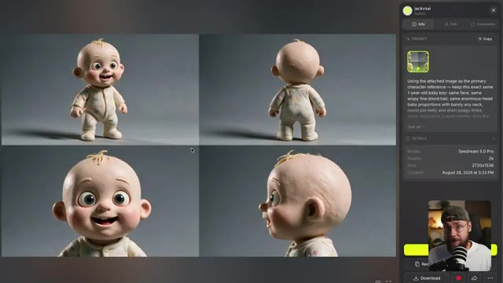

---

### ⏱️ `[00:10:31 - 00:10:52]` | Segment #23

**🔊 Audio (Transcription Intégrale Mot pour Mot en Français) :**
> modelés à la main, ce sont ces imperfections qui, selon moi, rendent ce style particulier vraiment spécial, et maintenant les choses sont devenues encore plus amusantes parce que j'ai commencé à générer les images des monstres et j'ai parcouru une tonne de designs différents ici. Encore une fois, en faisant très attention à ceux que je voulais réellement utiliser.

**👁️ Analyse Visuelle d'Écran (gemini-3.5-flash-lite) :**
**Interface & Outils** : Interface web d'une plateforme de création générative (type Midjourney/Runway ou plateforme intégrée de type Supercomputer), affichant une vaste grille de vignettes de monstres générés par IA en style stop-motion / argile (claymation). En bas à droite, une incrustation vidéo montre le présentateur (Jack) face caméra avec un micro et une casquette. En bas de l'écran, une barre de saisie de prompt (« Describe the scene you imagine ») avec divers paramètres de génération (modèle, qualité, format 16:9, etc.) et un bouton vert « Generate ».

**Contenu textuel & Code** : Dans la barre de prompt en bas : le champ de texte affiche « Describe the scene you imagine ». Les options associées incluent : le sélecteur de modèle « GPT Image 2 », un bouton qualité « High », un compteur de likes (« 2K »), le ratio d'aspect « 16:9 », et un multiplicateur de grille « 1 / 4 + ». Le bouton de génération jaune-vert affiche « Generate ➔ 8.5 ». La grille principale présente de multiples variations de créatures fantastiques et monstres modelés dans un style de type pâte à modeler ou argile sur fond gris neutre : monstres borgnes, créatures humanoïdes arboricoles, trolls à cornes, créatures lupines et bébés monstres menaçants vus sous différents angles (face, profil, dos).

**Action / Démonstration** : L'écran présente une grille riche de multiples concepts de monstres générés par IA, faisant défiler visuellement la grande variété de designs d'argile, tandis que le curseur de la souris survole certains éléments et que la vue incrustée montre le créateur parlant du processus de sélection minutieux.

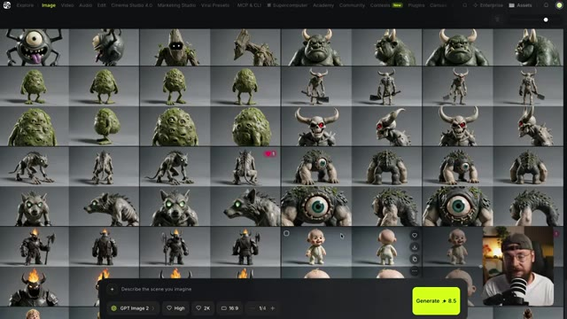

---

### ⏱️ `[00:10:53 - 00:11:16]` | Segment #24

**🔊 Audio (Transcription Intégrale Mot pour Mot en Français) :**
> Encore une fois, je mets mes designs préférés en favoris. J'ai adoré celui-ci, le loup-garou. Ce genre d'yeux vitreux est vraiment cool. On a juste toute une série de designs de monstres vraiment uniques et intéressants que je savais pouvoir utiliser tout au long du projet. Et maintenant, on va passer à la vitesse supérieure en combinant différentes images pour générer quelque chose de nouveau.

**👁️ Analyse Visuelle d'Écran (gemini-3.5-flash-lite) :**
**Interface & Outils** : Interface web d'un générateur d'images par IA basé sur un navigateur, avec une galerie de miniatures affichant des grilles de personnages et de monstres en 3D. Un panneau de configuration avec des boutons d'options et un champ de saisie de prompt est visible en bas. Une incrustation vidéo (picture-in-picture) montre le visage de Jack en bas à droite, portant une casquette et un micro-cravate.

**Contenu textuel & Code** : Dans la barre de menu supérieure, on distingue les onglets Explore, Image, Video, Audio, Edit, Cinema Studio 4.0, Marketing Studio, Viral Presets, MCP & CD, Supercomputer, Academy, Community, Contests, Plugins, et Creators. Dans le panneau de génération en bas, le champ de texte affiche le placeholder "Describe the scene you imagine". Des sélecteurs de modèles et de paramètres affichent "GPT Image 2", un cœur avec "High", "2K", le format "16:9", et un ratio de "1/4 +". Un gros bouton jaune-vert à droite indique "Generate ✨ 8.5". Sur plusieurs images de la grille, de petites icônes de cœur rouge indiquent les favoris.

**Action / Démonstration** : La caméra montre la grille de miniatures générées tandis que Jack commente et navigue visuellement parmi ses créations favorites, soulignant les différents monstres et loups-garous avant d'introduire l'étape suivante de combinaison d'images.

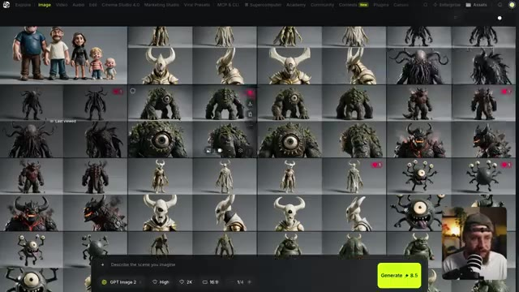

---

### ⏱️ `[00:11:16 - 00:11:56]` | Segment #25

**🔊 Audio (Transcription Intégrale Mot pour Mot en Français) :**
> Donc si je survole ces trois points ici, je peux cliquer sur réutiliser. Et ça va en quelque sorte reconstruire le processus que j'ai utilisé pour générer cette image ici, qui est une référence de taille bien pratique. Cela peut s'avérer très important lorsqu'il s'agit de générer vos vidéos. On y reviendra plus en détail un peu plus tard, mais vous verrez que j'ai référencé la fiche de personnage de moi-même, la fiche de personnage pour mon père, nous avons aussi Isaac ici ainsi qu'Ellis et ma femme Leanne également, donc nous les assemblons tous ensemble avec ce prompt pour créer cette référence de taille, avec une logique similaire ici à celle-là.

**👁️ Analyse Visuelle d'Écran (gemini-3.5-flash-lite) :**
**Interface & Outils** : Interface utilisateur web d'une plateforme de génération d'images par IA. L'écran principal affiche une image composée de quatre vues (character sheet / modèle d'argile ou stop-motion). Un panneau latéral à droite affiche les détails de la génération (« Source », « Type », « Format »), l'auteur (« jackvsai ») et, en bas à droite, une incrustation vidéo en direct (PiP) montrant Jack face caméra avec son micro.

**Contenu textuel & Code** : Le panneau de détails indique : « Source: Seedream 5.0 Pro », « Type: Image », « Format: WEBP ». L'image principale montre une planche de personnages style pâte à modeler (claymation) en quatre angles de vue différents.

**Action / Démonstration** : Le curseur de la souris survole l'interface ou les commandes, montrant la manipulation permettant de réutiliser les paramètres de génération (« reuse ») pour analyser la structure du prompt et la cohérence des échelles de taille des personnages.

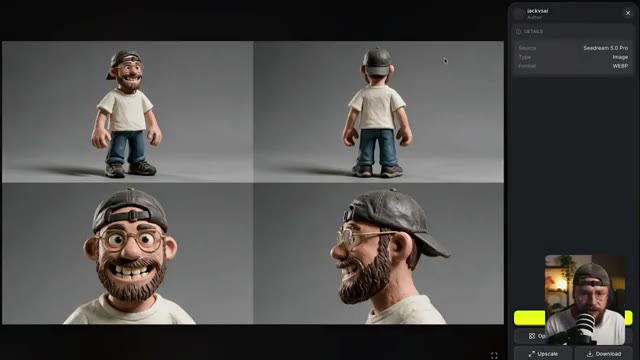

---

### ⏱️ `[00:11:56 - 00:12:34]` | Segment #26

**🔊 Audio (Transcription Intégrale Mot pour Mot en Français) :**
> des images sont générées de moi tenant l'épée. Encore une fois, nous fournissons un niveau de contexte aux outils d'IA. Vraiment important quand nous commençons à générer nos vidéos pour que les outils comprennent la différence de hauteur. Donc mon père est plus grand que moi. Je suis plus grand que Leanne. Nous voulons nous assurer, c'est très important, qu'Isaac soit plus grand qu'Ellis parce que sans cette connaissance, l'IA doit deviner et peut-être faire des choses étranges où je suis plus grand que mon père ou Ellis est plus grand qu'Isaac. Vous savez, le bébé est plus grand qu'un garçon de quatre ans. Ça n'a aucun sens, mais nous veillons en

**👁️ Analyse Visuelle d'Écran (gemini-3.5-flash-lite) :**
**Interface & Outils** : Interface sombre d'une application web de génération d'images par IA, dotée d'un panneau latéral droit (sidebar) affichant des informations techniques, un prompt textuel, des miniatures d'images de référence et des paramètres de génération. En bas à droite, une incrustation vidéo miniature montre Jack face caméra dans son studio avec un microphone.

**Contenu textuel & Code** : Le panneau de droite affiche le prompt de génération suivant : "Using the attached character reference sheets, create a single group HEIGHT-COMPARISON line-up of all five family characters, standing side by side in a row, all front-facing, on a plain neutral grey seamless studio background. This is a scale chart; every character stands on the exact". Les paramètres techniques visibles incluent : le modèle "Seedream 5.0 Pro", une qualité "2k", une résolution de taille "2720x1536", et une date de création "August 30, 2026 at 7:51 AM". Quatre petites images miniatures de référence des personnages sont affichées en haut du panneau. Dans l'image principale, on voit cinq personnages de style pâte à modeler (claymation) alignés par taille décroissante sur un fond gris neutre.

**Action / Démonstration** : L'image principale montre une image générée de comparaison de taille (height comparison line-up) entre les cinq personnages de la famille dans un style d'animation en volume. Dans l'encart en bas à droite, Jack parle face caméra en gesticulant légèrement pour expliquer l'importance de fournir ce contexte de hauteur à l'IA.

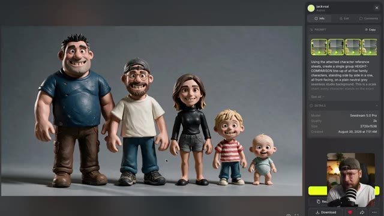

---

### ⏱️ `[00:12:34 - 00:13:10]` | Segment #27

**🔊 Audio (Transcription Intégrale Mot pour Mot en Français) :**
> En faisant toutes ces références, nous allons obtenir les résultats que nous voulons réellement. Et j'ai aussi continué à construire ces références de hauteur pour montrer que les monstres étaient souvent plus grands que moi, parfois nettement plus grands pour verrouiller ce sentiment d'échelle. Donc vous pouvez voir que le loup-garou est juste un peu plus grand mais si nous continuons à monter je veux dire regardez la différence de taille ici entre moi et ce monstre particulier vraiment cool design sur le côté droit. Maintenant, à ce stade, j'avais l'impression d'avoir réglé tout le côté des personnages et je voulais passer à la génération

**👁️ Analyse Visuelle d'Écran (gemini-3.5-flash-lite) :**
**Interface & Outils** : Interface sombre de type web/générateur d'IA avec un panneau latéral droit affichant les détails de la génération, un avatar utilisateur en haut à droite ("jackvsai"), et une incrustation vidéo en bas à droite montrant Jack face caméra avec son micro.

**Contenu textuel & Code** : Texte du prompt visible dans le panneau latéral : "Using the two attached character reference sheets, create a single side-by-side HEIGHT-COMPARISON of two characters, both front-facing, standing on the exact same flat ground line on a plain neutral grey seamless studio background. This is a scale chart showing their correct relative heights". Paramètres affichés : Modèle Seedream 5.0 Pro, Quality 2k, Size 2720x1536, Created August 30, 2026 at 8:02 AM.

**Action / Démonstration** : L'écran affiche une image générée montrant une comparaison de taille côte à côte entre l'avatar de Jack en pâte à modeler et une créature monstrueuse (loup-garou) sur un fond gris neutre de studio, tandis que Jack s'exprime en bas à droite.

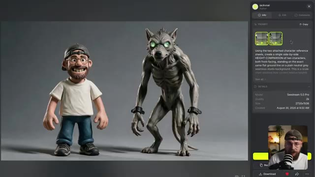

---

### ⏱️ `[00:13:10 - 00:13:37]` | Segment #28

**🔊 Audio (Transcription Intégrale Mot pour Mot en Français) :**
> certains emplacements importants qui figureraient tout au long du projet. Donc ici, nous avons ce pub britannique typique. Encore une fois, en utilisant cette première image comme référence, combinée avec un prompt qui aurait été rédigé avec Claude, et nous obtenons cette très belle génération ici. Nous avons également cette image ici de mon jardin, avec le bureau au fond, la corde à linge.

**👁️ Analyse Visuelle d'Écran (gemini-3.5-flash-lite) :**
**Interface & Outils** : Interface de type Midjourney ou plateforme Web de génération par IA, comportant une zone principale affichant une vidéo générée (un pub britannique) et un panneau latéral gris foncé sur la droite. Le panneau latéral contient l'onglet "Info", un champ de texte de prompt avec une miniature d'image de référence, un bloc de détails techniques ("DETAILS") et une petite incrustation vidéo en bas à droite montrant Jack face caméra avec son micro.

**Contenu textuel & Code** : Texte du prompt visible dans le panneau latéral : "Adapting from matte plasticine and model-making materials: visible thumbprints, fingerprints and sculpting-tool marks across surfaces, faint seam lines, subtle lumpiness and slight wonkiness, tiny specks of studio dust. The wood, brass, glass and fabric all rendered as handmade clay/miniature materials rather than real ones. Opaque, tactile, handcrafted. No CGI smoothness, no subsurface translucency. LIGHTING & PRESENTATION -- photographed as a real miniature set under soft studio lighting: soft midday daylight through the windows as a cool key, warm practical wall-light fill, gentle realistic shadow falloff. Cinematic 16:9 framing,". Paramètres de détails : Modèle, Qualité, Taille, Créé. Nom de l'auteur en haut : "jackvsai" avec un avatar jaune.

**Action / Démonstration** : La caméra de la vidéo générée effectue un léger mouvement de panoramique ou de zoom avant au sein du pub britannique, tandis que dans le coin inférieur droit, Jack apparaît dans un encadré vidéo en train de parler et de présenter le projet.

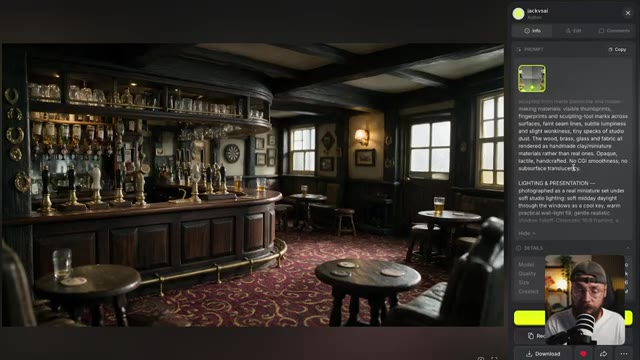

---

### ⏱️ `[00:13:37 - 00:13:56]` | Segment #29

**🔊 Audio (Transcription Intégrale Mot pour Mot en Français) :**
> Le niveau de détail ici est incroyable et c'est exactement ce qu'on s'attendrait à voir dans un projet en pâte à modeler (claymation). On a une rame de métro londonien. On a un canapé dans le salon. Vous voyez que je suis simplement en train de compiler tellement d'assets différents ici.

**👁️ Analyse Visuelle d'Écran (gemini-3.5-flash-lite) :**
**Interface & Outils** : Interface de génération d'images et de vidéos via un navigateur web, présentant une grille de prévisualisation avec de multiples assets générés. En bas à droite, incrustation vidéo montrant Jack face caméra dans son studio avec son microphone.

**Contenu textuel & Code** : Dans la barre de prompt en bas : "Describe the scene you imagine", avec les paramètres de modèle sélectionnés ("Seedream 5.0 Pro", ratio "16:9", compteur de jetons "2 / 4"). La grille contient divers visuels dans un style de type pâte à modeler (claymation) : cours extérieures de maisons, intérieurs de supermarchés, salons avec canapés, intérieurs de rames de métro, jardins de banlieue la nuit, pubs anglais et personnages fantastiques.

**Action / Démonstration** : Défilement et présentation d'une collection d'assets visuels générés par IA avec le modèle Seedream 5.0 Pro, tandis que Jack commente les détails de la texture en pâte à modeler et la diversité des décors créés.

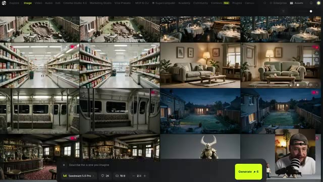

---

### ⏱️ `[00:13:56 - 00:14:15]` | Segment #30

**🔊 Audio (Transcription Intégrale Mot pour Mot en Français) :**
> Tu sais, on a même la soirée en amoureux aussi. Cette vue incroyable sur le centre de Londres. C'est exactement ce que je cherchais pour cette scène en particulier. Superbe génération. L'étape de pré-production est un véritable travail de passion, je pense, et beaucoup de créateurs finissent par la sauter ou par la bâcler.

**👁️ Analyse Visuelle d'Écran (gemini-3.5-flash-lite) :**
**Interface & Outils** : Une interface web de génération d'images/vidéos par IA (type Seedream ou plateforme propriétaire similaire). La majeure partie de l'écran affiche une grande image de prévisualisation. Sur la droite, un panneau latéral sombre affiche les détails de la génération (onglets Info, Edit, Comments). En bas à droite de ce panneau, une incrustation vidéo montre Jack face caméra avec son micro. En bas de l'écran principal, une barre de contrôle vidéo de lecture apparaît brièvement.

**Contenu textuel & Code** : Dans le panneau latéral droit, le prompt affiché sous l'icône de l'image est : "A still frame location reference: the empty interior of a fancy fine-dining restaurant at the top of a City of London skyscraper at night, no people present, in classic Aardman-style stop-motion claymation — a real hand-built miniature set, not CGI, not a digital render." Dans la section DETAILS sous le prompt : Model: Seedream 5.0 Pro | Quality: 2k | Size: 2720x1536 | Created: August 31, 2026 at 2:43 PM. En haut à droite, le nom d'auteur "jackvsai" avec son avatar.

**Action / Démonstration** : L'image générée s'affiche en grand sur l'écran principal tandis que l'on entend la voix off de Jack commentant son processus créatif de pré-production, avec sa caméra de streaming visible en bas à droite.

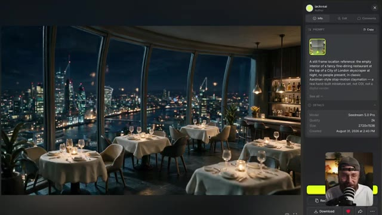

---

### ⏱️ `[00:14:15 - 00:14:36]` | Segment #31

**🔊 Audio (Transcription Intégrale Mot pour Mot en Français) :**
> Mais c'est tellement important de réussir cela parce que cela a une si forte influence quand vous commencez réellement à générer vos vidéos. Mais à ce stade, j'étais heureux d'avoir construit une tonne d'actifs différents de très haute qualité. Nous sommes prêts à passer à l'étape suivante du processus. Je pouvais réellement commencer à façonner les scènes elles-mêmes.

**👁️ Analyse Visuelle d'Écran (gemini-3.5-flash-lite) :**
**Interface & Outils** : Interface web de génération d'actifs visuels (similaire à une plateforme de type Seedream/Midjourney/Leonardo AI), affichant une grille d'images de production de haute qualité (décors divers : arrière-cour de maison, restaurant chic nocturne, allées de supermarché, salon cosy, intérieur de rame de métro). En bas, un panneau de prompt avec un sélecteur de modèle et de ratio d'aspect. En bas à droite, une pastille vidéo incrustée (picture-in-picture) montre Jack face caméra avec son micro et sa casquette.

**Contenu textuel & Code** : Dans la barre de prompt en bas : le champ de texte "Describe the scene you imagine", le modèle sélectionné "Seedream 5.0 Pro", un compteur de likes, le ratio "16:9", et un sélecteur de version ou d'images "2/4+". Le bouton principal de validation "Generate ✨ 6" est surligné en vert vif. Sur certaines imagettes de la grille, des icônes d'interaction, de favoris (cœurs) et des badges de statut apparaissent au survol de la souris.

**Action / Démonstration** : L'écran présente une vue d'ensemble de la bibliothèque d'actifs visuels (assets) préalablement générés et validés. Le curseur de la souris (flèche) survole légèrement l'une des vignettes du salon pour inspecter les options d'édition ou de sélection avant de passer à l'étape de génération vidéo (animation des scènes).

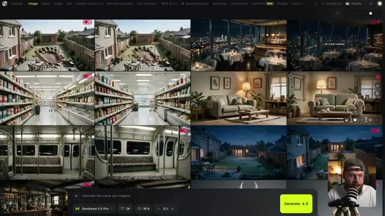

---

### ⏱️ `[00:14:36 - 00:15:03]` | Segment #32

**🔊 Audio (Transcription Intégrale Mot pour Mot en Français) :**
> Maintenant, plutôt que de me lancer directement dans la génération de vidéos, j'ai en fait commencé à créer ce que j'appellerais des images d'ancrage. Donc, une excellente ici de moi avec la famille dans ce pub qu'on a vu un peu plus tôt. On est tous en train de manger des fish and chips, et c'est super pour la scène. Si je survole celle-ci et que je sélectionne simplement « réutiliser », vous pouvez voir que j'ai combiné toutes ces feuilles de référence de personnages avec cette image fixe du lieu du pub.

**👁️ Analyse Visuelle d'Écran (gemini-3.5-flash-lite) :**
**Interface & Outils** : Interface sombre de type web/génération vidéo (Seedream 5.0 Pro) avec un panneau latéral droit affichant les métadonnées de l'image (section "REFERENCES" avec vignettes, modèle, taille 2720x1536), et un encart vidéo incrusté en bas à droite montrant Jack face caméra avec son micro.

**Contenu textuel & Code** : Texte affiché dans le panneau : "Model: Seedream 5.0 Pro", "Quality: 2k", "Size: 2720x1536", "Created: August 31, 2026 at 8:00 PM". Section "REFERENCES" contenant des vignettes de personnages en pâte à modeler (claymation) et de décors. Texte du prompt de référence : "@Image 1 — Jack: the bearded man — claymation plasticine figure, mid-brown sculpted full beard, gold round wire glasses, backwards dark cap, off-white tee, blue jeans. [ref: bearded man sheet]".

**Action / Démonstration** : Jack présente l'interface et survole une image générée ("image d'ancrage") représentant sa famille en pâte à modeler attablée dans un pub, montrant la combinaison des feuilles de référence et du décor fixe.

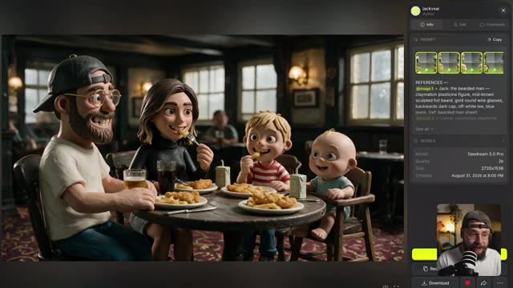

---

### ⏱️ `[00:15:03 - 00:15:27]` | Segment #33

**🔊 Audio (Transcription Intégrale Mot pour Mot en Français) :**
> et ce prompt pour obtenir un très beau résultat. Et ce que j'ai également généré, c'est cette image ici où l'on peut voir le monstre en train de prendre une pinte au bar et je l'ai vaincu il n'y a pas si longtemps dans une bataille. Donc on finit par avoir cet échange un peu gênant. Ce que je fais ici, c'est essentiellement pré-découper les scènes plutôt que de les laisser au hasard.

**👁️ Analyse Visuelle d'Écran (gemini-3.5-flash-lite) :**
**Interface & Outils** : Un panneau latéral sombre (sidebar) sur le côté droit de l'écran affichant les détails d'un projet de génération d'image (onglet "Info"), avec une vignette vidéo du présentateur (Jack) incrustée dans le coin inférieur droit de ce panneau. À gauche, l'image générée en grand format occupe la majeure partie de l'écran.

**Contenu textuel & Code** : Dans le panneau de droite, sous l'intitulé "REFERENCES", on peut lire le prompt : "@Image 1 = the beaten monster: a round dark grey-green creature with one big glossy central eye, several thin eye-stalk arms tipped with eyeballs, and a wide toothy mouth — comically battle-wounded, wrapped in white bandages with striking". Dans la section "DETAILS", les paramètres affichés sont : Model: Seedream 5.0 Pro, Quality: 2k, Size: 2720x1536, Created: August 31, 2026 at 8:04 PM. Le nom d'auteur visible en haut est "jackvsai".

**Action / Démonstration** : L'écran présente l'image générée d'un monstre borgne enveloppé de bandages et tenant une bière dans un pub, tandis que le panneau latéral détaille les paramètres de génération et que la miniature de Jack apparaît en bas à droite.

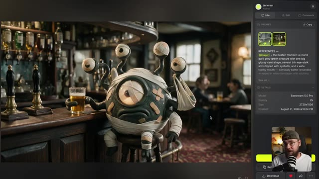

---

### ⏱️ `[00:15:27 - 00:15:48]` | Segment #34

**🔊 Audio (Transcription Intégrale Mot pour Mot en Français) :**
> Et je peux appuyer mes propos avec un excellent exemple montrant pourquoi ces images de référence sont si importantes. Donc, dans cette génération vidéo ici, j'ai simplement utilisé mes fiches de référence de personnages avec l'image fixe du décor du pub et un prompt bien rédigé de Claude. Laissez-moi donc vous montrer ce que j'ai obtenu avec cette approche.

**👁️ Analyse Visuelle d'Écran (gemini-3.5-flash-lite) :**
**Interface & Outils** : Interface web de génération vidéo « Seedance 2.5 » (sur fond sombre), comportant un panneau latéral gauche de contrôle (onglets Create Video, Edit Video, Motion Control), une zone centrale affichant le lecteur vidéo principal avec les commandes de lecture, et en bas à droite une incrustation vidéo (picture-in-picture) de Jack face caméra devant son micro.

**Contenu textuel & Code** : Modèle affiché : Seedance 2.5. Paramètres : 30s, format 16:9, résolution 1080p, Bitrate High. Section "REFERENCES" à droite avec le tag @image 1 décrivant le personnage (claymation plasticine figure...) et des miniatures de références associées. Le compteur de coût affiche 270 crédits sur le bouton "Generate".

**Action / Démonstration** : Jack présente l'interface du générateur vidéo Seedance 2.5, tout en illustrant le résultat d'une génération combinant des fiches de personnages, une image fixe de pub et un prompt rédigé par Claude, dont la vidéo s'affiche dans le lecteur central.

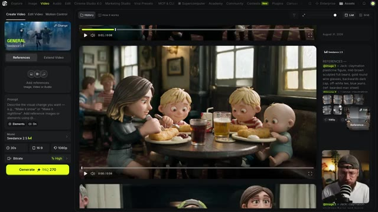

---

### ⏱️ `[00:15:49 - 00:16:18]` | Segment #35

**🔊 Audio (Transcription Intégrale Mot pour Mot en Français) :**
> Maintenant, comme vous pouvez le voir, il y a beaucoup de problèmes différents avec cette génération. Il y a deux Isaac assis à la table et en fait je manque à l'appel. Quand je lève maladroitement mon verre vers le monstre, je rencontre cette pinte de coca qui est tenue par un bras tout simplement décapité qui flotte juste sur la table.

**👁️ Analyse Visuelle d'Écran (gemini-3.5-flash-lite) :**
**Interface & Outils** : Capture vidéo principale montrant une génération de vidéo en stop-motion / pâte à modeler (claymation) se déroulant dans un pub rustique. Dans le coin inférieur droit, une incrustation (PiP - Picture-in-Picture) montre Jack face caméra avec son micro de studio, analysant le plan.

**Contenu textuel & Code** : Génération vidéo IA de style animation en pâte à modeler représentant des personnages attablés dans un pub sombre aux murs en bois sombre, avec des fenêtres en arrière-plan et un éclairage tamisé. On observe des artefacts typiques de l'IA générative : double personnage identique (les deux enfants blonds au centre), membres flottants déconnectés (le bras tenant la pinte de soda sans corps rattaché) et incohérences anatomiques.

**Action / Démonstration** : Lecture de la séquence vidéo générée par l'IA illustrant les bugs visuels et les hallucinations de l'outil, tandis que le créateur commente en direct les défauts d'intégrité spatiale et de cohérence des personnages.

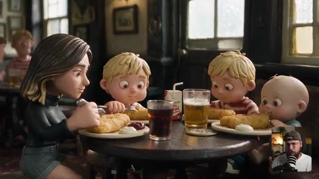

---

### ⏱️ `[00:16:18 - 00:16:54]` | Segment #36

**🔊 Audio (Transcription Intégrale Mot pour Mot en Français) :**
> Et le positionnement du monstre n'a pas non plus de sens physique, car il y a une seconde il était au bar et maintenant il est à une table. Il s'est en quelque sorte téléporté à travers la pièce. On ne peut pas le voir correctement parce qu'il est derrière l'une des versions d'Isaac. On peut donc constater qu'une grande partie de la logique et de la compréhension du monde s'effondre ici en utilisant cette méthode particulière. Cependant, si nous utilisons réellement nos images d'ancrage lors de notre génération vidéo, nous avons ce plan ici de moi et de la famille à la table, et puis cet autre plan où le

**👁️ Analyse Visuelle d'Écran (gemini-3.5-flash-lite) :**
**Interface & Outils** : Vue face caméra classique (style setup de créateur de contenu / podcast) avec Jack dans son studio, équipé d'un micro de studio et d'un bureau de streaming. Aucun logiciel ou interface de montage n'est affiché à l'écran pour le moment.

**Contenu textuel & Code** : Pas de texte, de prompt ou de paramètre technique textuel incrusté à l'écran. L'accent est mis sur l'analyse verbale et la gestuelle explicative de Jack.

**Action / Démonstration** : Jack est assis face à la caméra dans son studio, parlant de manière animée, gesticulant avec ses mains pour illustrer le problème de téléportation physique du monstre et la cohérence spatiale, tout en s'exprimant au micro.

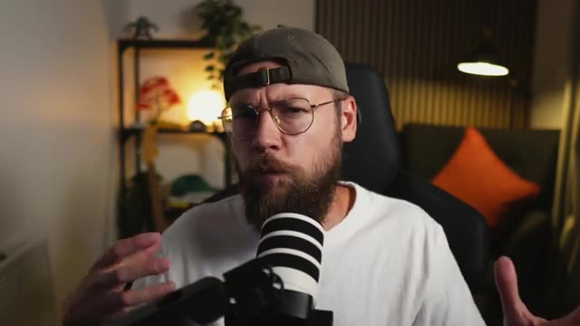

---

### ⏱️ `[00:16:54 - 00:17:13]` | Segment #37

**🔊 Audio (Transcription Intégrale Mot pour Mot en Français) :**
> des monstres assis au bar, nous laissons beaucoup moins de place au hasard. Et ce qui est bien, c'est que nous utilisons aussi moins de références d'images. J'ai donc simplement la feuille de référence du personnage de moi, le monstre, et ces deux images d'ancrage ainsi que globalement le même prompt qu'avant.

**👁️ Analyse Visuelle d'Écran (gemini-3.5-flash-lite) :**
**Interface & Outils** : Interface de l'outil de génération vidéo Seedance 2.5 affichée au centre de l'écran avec un panneau de configuration vertical noir. Vignette contextuelle active "Reference..." montrant des vignettes de personnages. En bas à droite, incrustation vidéo (PiP) montrant Jack face caméra avec son micro et sa casquette. En arrière-plan à gauche, un aperçu de la scène générée montrant un personnage de type bébé dans un pub.

**Contenu textuel & Code** : Texte du prompt visible dans l'interface Seedance 2.5 : "[00:00 - 00:03] Medium-wide, 35mm, eye-level, slow push in. A cosy traditional British pub. Four characters sit around one round wooden table loaded with plates of fish and chips. On the left, the bearded man — mid-brown full beard, gold..." Paramètres affichés : Durée "[ 8.0s", ratio d'aspect "[ 16:9", et indicateur de version "Seedance 2.5". Quatre vignettes de références visuelles sont également alignées sous le texte du prompt.

**Action / Démonstration** : Un curseur de souris survole et manipule une des vignettes de référence sous le bloc de prompt dans l'interface Seedance 2.5, tandis que l'on voit en arrière-plan à gauche la vidéo générée correspondante s'animer.

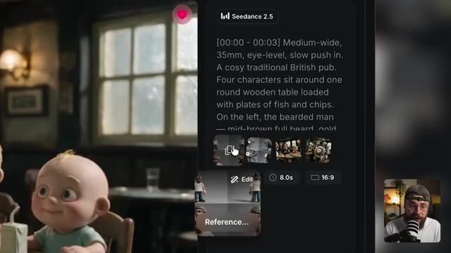

---

### ⏱️ `[00:17:13 - 00:17:48]` | Segment #38

**🔊 Audio (Transcription Intégrale Mot pour Mot en Français) :**
> Jetons un œil au résultat que j'ai obtenu avec ça. Vous pouvez voir à quel point ça fonctionne mieux et à quel point il est utile de pré-définir nos scènes sous forme de générations d'images avant de dépenser une tonne de crédits sur C-Dance, qui est cher et qui est le modèle vidéo que nous utilisons pour ce projet. Vous allez dépenser beaucoup moins de crédits en pré-définissant vos scènes sous forme d'images pour obtenir...

**👁️ Analyse Visuelle d'Écran (gemini-3.5-flash-lite) :**
**Interface & Outils** : Jack face caméra, assis à son bureau dans son studio, avec un microphone à condensateur blanc et noir monté sur un bras articulé au premier plan. En arrière-plan, on aperçoit une étagère en bois avec une plante verte et des lampes d'ambiance allumées, ainsi qu'un fauteuil noir doté d'un coussin orange vif.

**Contenu textuel & Code** : Aucun texte, prompt de génération ni paramètre technique n'est affiché à l'écran dans ce segment.

**Action / Démonstration** : Jack s'adresse directement aux spectateurs face caméra, gesticulant des deux mains de manière expressive pour illustrer ses propos sur l'économie de crédits et l'optimisation du processus de création vidéo.

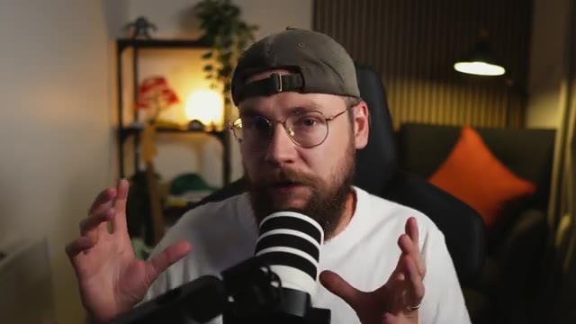

---

### ⏱️ `[00:17:48 - 00:18:25]` | Segment #39

**🔊 Audio (Transcription Intégrale Mot pour Mot en Français) :**
> juste avant de les emmener dans C-Dance et de commencer à animer les scènes. Donc j'aime vraiment beaucoup ce flux de travail. Je pense que ça vaut vraiment la peine d'être exploré dans vos propres projets. Je vais donc vous guider à travers un exemple de cela. Vous voulez réfléchir aux moments clés qui vont aider à raconter l'histoire de votre scène. Et je me suis dit que ce serait plutôt drôle d'avoir Ellis, le bébé, qui trouve ma grande épée et joue avec. Et je suis en train de faire du doom scrolling sur mon téléphone. Et puis je remarque qu'il a l'épée et je me précipite pour la lui reprendre. Encore une fois, c'est comme

**👁️ Analyse Visuelle d'Écran (gemini-3.5-flash-lite) :**
**Interface & Outils** : Jack face caméra, plan moyen serré, assis à son bureau avec un micro professionnel monté sur bras articulé au premier plan. L'arrière-plan montre une étagère décorée avec des objets rétro et une plante verte, ainsi qu'un fauteuil avec un coussin orange et une lampe d'appoint allumée.

**Contenu textuel & Code** : Aucun texte, prompt ou paramètre technique affiché à l'écran dans ce segment.

**Action / Démonstration** : Jack s'adresse directement aux spectateurs en gesticulant des mains pour illustrer ses propos, expliquant le processus créatif et l'élaboration de la scène avec le bébé et l'épée.

---

### ⏱️ `[00:18:25 - 00:19:03]` | Segment #40

**🔊 Audio (Transcription Intégrale Mot pour Mot en Français) :**
> subvertir une situation du quotidien. La plupart du temps, les enfants finissent par trouver des objets dangereux dans la maison malgré tous vos efforts pour les cacher. Évidemment, on exagère un peu tout ça pour créer un peu plus d'humour. Donc, en utilisant ce même chat Claude, j'ai téléchargé mes images de référence et j'ai décrit le type de scène que je voulais créer. J'ai donc commencé par le plan d'Ellis tenant la grande épée, j'ai pris le prompt que Claude m'a donné et je l'ai collé dans Higgsfield, bien sûr j'ai sélectionné la feuille de référence des personnages d'Ellis avec la référence

**👁️ Analyse Visuelle d'Écran (gemini-3.5-flash-lite) :**
**Interface & Outils** : Interface sombre d'une application de type LLM/Chatbot (Anthropic Claude). En bas à droite, une petite incrustation vidéo montre le visage du créateur (Jack) filmé en plan moyen serré face caméra avec son micro.

**Contenu textuel & Code** : Texte affiché dans le chat Claude : "Let's do another image generation prompt now. I want the bearded man Jack and Ellis to be in this particular scene. Let's start off with a shot where we show Ellis sitting down on the floor with his back to the washing machine, which isn't on. He's holding my massive great sword and smiling to himself. The floor is like a walnut vinyl plank, and the washing machine looks fairly modern. It's housed inside a cupboard under the stairs in a semi-tight hallway. To give you a bit of an understanding of the layout of the area..." Suivi de la réponse générée par l'IA détaillant un prompt complet de style stop-motion en pâte à modeler (claymation) pour le plan d'Ellis tenant la grande épée.

**Action / Démonstration** : Affichage de l'interface de discussion textuelle de Claude avec des images de référence uploadées en haut du bloc de message, tandis que le créateur commente vocalement le processus de prompt engineering et la préparation du transfert vers l'outil de génération vidéo Higgsfield.

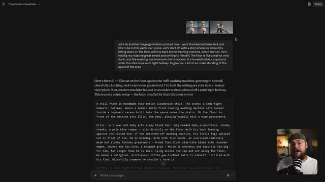

---

### ⏱️ `[00:19:03 - 00:19:37]` | Segment #41

**🔊 Audio (Transcription Intégrale Mot pour Mot en Français) :**
> de la grande épée elle-même, puis j'ai cliqué sur générer. Maintenant, au début, j'ai eu un blocage de modération où ça ne me laissait pas vraiment générer cette scène, probablement parce qu'on essaie de montrer un nourrisson tenant une arme, ce qui est logique, non ? J'ai juste relancé exactement le même prompt et les mêmes références, et ensuite ça a fonctionné. Donc le résultat que j'ai obtenu était parfait. J'ai donc cliqué sur cette icône de favori pour que ce soit bien organisé avec le reste de mes assets. Ensuite, je suis retourné sur Claude et j'ai téléchargé ma feuille de personnage et je lui ai demandé de m'écrire un prompt pour montrer le personnage.

**👁️ Analyse Visuelle d'Écran (gemini-3.5-flash-lite) :**
**Interface & Outils** : Interface web d'un outil de génération vidéo par IA sous forme de galerie (type interface de gestion d'assets, grille de miniatures vidéo) avec une fenêtre modale de suppression superposée. En bas à droite, incrustation vidéo montrant Jack face caméra, portant une casquette et un t-shirt blanc, avec un microphone de studio.

**Contenu textuel & Code** : Dans la grille de la galerie, plusieurs vignettes de générations vidéo classées par grilles (certaines marquées « Failed - Credits refunded »). Au centre, une boîte de dialogue contextuelle affiche : « Delete selected generations? Selected generations will be permanently deleted. This cannot be undone. » avec deux boutons « Cancel » et « Delete » en rouge.

**Action / Démonstration** : Une fenêtre pop-up de confirmation de suppression est ouverte au premier plan de l'interface, avec le curseur de la souris positionné et sur le point de cliquer sur le bouton rouge « Delete ». En arrière-plan, Jack commente les étapes de son flux de travail tout en gérant ses assets et en se préparant à interagir avec Claude.

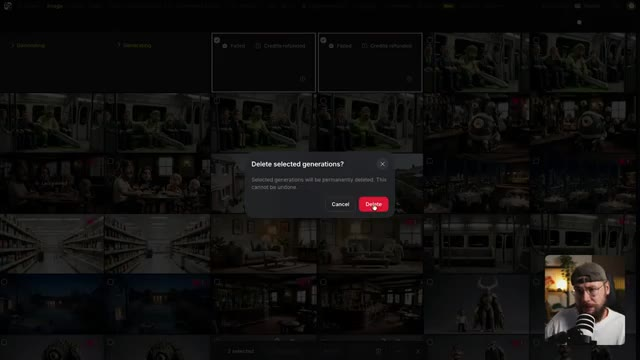

---

### ⏱️ `[00:19:37 - 00:20:03]` | Segment #42

**🔊 Audio (Transcription Intégrale Mot pour Mot en Français) :**
> assis à une table de salle à manger en train de tenir une tasse de café et de faire défiler compulsivement mon téléphone. J'ai donc pris ce prompt de Claude, je l'ai ramené sur Higgsfield et, surtout, j'ai utilisé cette image d'Ellis tenant la grande épée comme l'une des images de référence pour m'assurer que la maison ait l'air cohérente. Comme ça, on a l'impression de ne pas avoir deux maisons différentes pour différentes scènes.

**👁️ Analyse Visuelle d'Écran (gemini-3.5-flash-lite) :**
**Interface & Outils** : Capture d'écran montrant une interface de génération d'images et de vidéos par IA (style dashboard SaaS), avec un grand panneau de prévisualisation en grille présentant plusieurs vignettes d'images et de vidéos, le site web "Higgsfield" ou une plateforme similaire avec une barre de menu supérieure (Explore, Image, Video, Audio, Edit, Cinema Studio 4.0...), un menu déroulant pour le modèle d'IA ("Seedream 5.0 Pro"), un sélecteur de format ("16:9"), et un compteur de likes et de générations. En bas à droite, une incrustation vidéo (PiP) montre Jack face caméra avec son micro et ses lunettes.

**Contenu textuel & Code** : Texte du prompt visible dans une boîte noire superposée en bas à gauche : "Style: Classic Aardman-style stop-motion claymation — a physical, hand-sculpted plasticine puppet captured as a real miniature model, not a digital render. Surface: matte plasticine with a soft, slightly greasy sheen from handling. Visible thumbprints, fingerprints and sculpting-tool marks across the skin. Subtle surface lumpiness and faint seam lines where clay sections join. A few tiny specks of studio dust and lint clinging to the tacky clay. Eyes: glossy, hard, convex plastic eyeballs set into the clay — a distinctly harder, shinier material than the surrounding matte plasticine, wet-looking with a crisp white specular catch-light, small painted pupils, faint red-rimmed lower lids. Human character proportions: chunky exaggerated Aardman proportions — heavy brow, prominent nose, broad mouth, oversized hands. Capture: opaque clay with no subsurface translucency and no CGI smoothness; the tactile look of a small physical model under...". Bouton vert "Generate ⚡ 6" visible en bas à droite du bloc de prompt.

**Action / Démonstration** : L'écran présente une grille de résultats visuels générés par IA dans un style de stop-motion en pâte à modeler, tandis que la boîte de texte affiche un prompt détaillé et technique en cours de consultation ou de modification, et qu'en bas à droite Jack commente et explique son processus de création pour maintenir la cohérence visuelle entre les scènes.

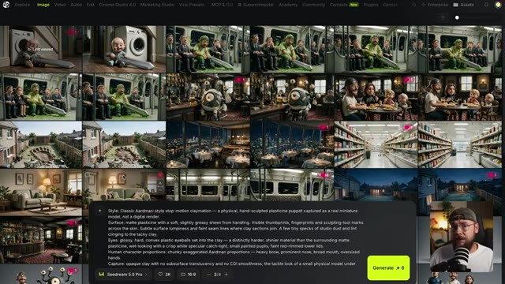

---

### ⏱️ `[00:20:03 - 00:20:40]` | Segment #43

**🔊 Audio (Transcription Intégrale Mot pour Mot en Français) :**
> Nous voulons que les personnages aient l'air d'être dans le même bâtiment même s'ils sont dans des plans séparés. Bien sûr, j'ai aussi pris les devants et utilisé la feuille de personnage de moi-même comme référence et avec tout configuré, j'ai cliqué sur générer. Encore une fois, j'ai obtenu deux superbes résultats ici, j'ai légèrement préféré le second donc je l'ai mis en favori et ensuite j'ai téléchargé mes deux images préférées sur mon ordinateur. J'ai ensuite déposé nos références d'ancrage dans Claude, décrit la scène que je voulais donner vie, donc nous utilisons maintenant l'IA pour nous écrire un prompt pour la génération vidéo. Pour être

**👁️ Analyse Visuelle d'Écran (gemini-3.5-flash-lite) :**
**Interface & Outils** : Interface sombre d'un outil de génération d'images par IA avec un panneau latéral droit affichant les détails du prompt, les miniatures et les boutons de téléchargement/favoris. Dans le coin inférieur droit, la webcam incrustée montre Jack face caméra avec son micro.

**Contenu textuel & Code** : Prompt visible : "A still frame in handmade stop-motion claymation style. The scene: a modern British dining room, where the bearded man Jack sits at a dining table, relaxed, scrolling on his phone with a coffee in his other hand". Détails techniques affichés : Modèle Seedream 5.0 Pro, Quality 2x, Size 2720x1536, date de création September 1, 2026 at 11:32 AM. Deux miniatures de génération en haut du panneau.

**Action / Démonstration** : Visualisation du résultat de génération d'image fixe montrant un personnage en pâte à modeler (claymation) assis à table avec un téléphone et une tasse, tandis que l'interface à droite affiche les détails techniques et les options de sauvegarde/favori.

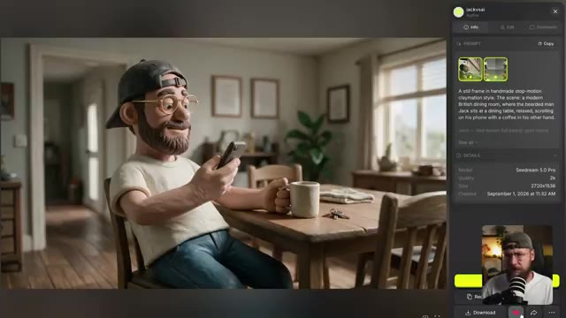

---

### ⏱️ `[00:20:40 - 00:21:17]` | Segment #44

**🔊 Audio (Transcription Intégrale Mot pour Mot en Français) :**
> Bien sûr, bon nombre de ces prompts sont conçus en utilisant des compétences personnalisées que j'ai créées avec Claude. Comme je le dis, ceux-ci seront disponibles de manière entièrement gratuite sur ma communauté School. Je demande à Claude un prompt multi-plans. Nous ne voulons pas seulement un long plan continu, nous voulons alterner entre différents angles de caméra. J'ai indiqué à Claude la durée souhaitée pour la scène et j'ai réfléchi aux angles de caméra à utiliser et à quel moment. J'essaie donc ici de me mettre dans l'état d'esprit d'un scénariste et d'un réalisateur plutôt que de simplement laisser Claude tout inventer par lui-même, car je sais que je peux

**👁️ Analyse Visuelle d'Écran (gemini-3.5-flash-lite) :**
**Interface & Outils** : Capture d'écran montrant l'interface sombre d'une application de type LLM ou éditeur de texte en plein écran, avec un encadré vidéo incrusté en bas à droite affichant Jack face caméra portant une casquette et un micro de studio.

**Contenu textuel & Code** : Texte affiché à l'écran : des blocs de script structurés par timecodes ([00:00 - 00:02], [00:02 - 00:04], [00:04 - 00:06], [00:06 - 00:08]) détaillant les plans, les focales (50mm, 40mm, 35mm), les mouvements de caméra (static, slight handheld follow) et les descriptions narratives détaillées des actions des personnages (Jack et le bébé Ellis). En haut à gauche, le titre "Claymation characters" est visible. En bas, une zone de saisie avec le texte "Write a message...".

**Action / Démonstration** : Jack est présenté en incrustation vidéo (picture-in-picture) parlant à sa communauté tout en illustrant ses propos avec l'affichage à l'écran du prompt multi-plans structuré généré par Claude.

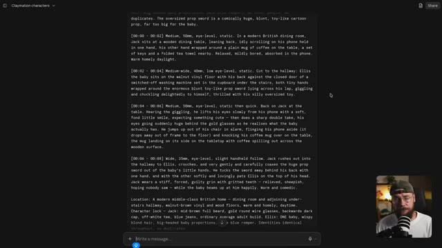

---

### ⏱️ `[00:21:17 - 00:21:51]` | Segment #45

**🔊 Audio (Transcription Intégrale Mot pour Mot en Français) :**
> imagine la scène mieux qu'une IA ne pourrait le faire. Donc, pendant que Claude écrivait ce prompt, je suis retourné sur Higgsfield dans l'onglet vidéo pour utiliser Seedance 2.5, et j'ai commencé à sélectionner toutes les références pertinentes que je voulais que C-Dance utilise pour ma génération vidéo. Donc bien sûr, nous avons les références ancrées d'Ellis assis à côté de la machine à laver avec la grande épée, moi-même en train de scroller sur mon téléphone, et ensuite nous voulons aussi donner à C-Dance la feuille de référence des personnages pour moi-même et Ellis.

**👁️ Analyse Visuelle d'Écran (gemini-3.5-flash-lite) :**
**Interface & Outils** : Interface web de la plateforme Higgsfield (onglet vidéo), comprenant un panneau latéral gauche de configuration de génération (avec les onglets "References" et "Extend Video"), un panneau central ouvrant une bibliothèque pop-up de médias ("Elements", "Image Generations", "Video Generations", "Audio Material") affichant des vignettes d'images et de logos, et en bas à droite une incrustation vidéo (picture-in-picture) montrant Jack face caméra devant son microphone.

**Contenu textuel & Code** : Modèle sélectionné : "Seedance 2.5". Paramètres visibles : durée de 8 secondes, format 16:9, résolution 1080p, Bitrate réglé sur "High", et coût de génération de 72 crédits sur le bouton jaune "Generate". Dans la bibliothèque pop-up centrale, plusieurs vignettes affichent la mention "Check eligibility". Un aperçu vidéo à droite montre un plan moyen-large dans un pub britannique avec des personnages en stop-motion/animation (un garçon et un bébé mangeant des fiches et des frites), accompagné du texte descriptif : "[00:00 - 00:03] Medium-wide, 35mm, eye-level, slow push in. A cosy traditional British pub...".

**Action / Démonstration** : L'utilisateur navigue dans l'interface de Higgsfield, ouvrant la bibliothèque pop-up de médias pour sélectionner et importer des images de référence (comme des portraits de personnages et des éléments visuels) destinées à alimenter le modèle Seedance 2.5 en vue de générer une vidéo personnalisée.

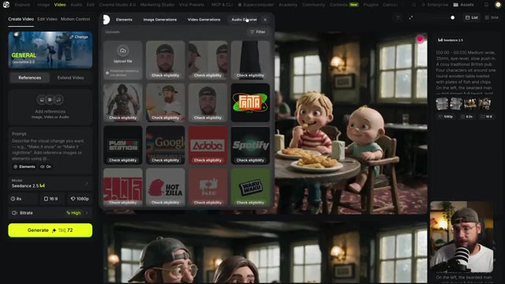

---

### ⏱️ `[00:21:51 - 00:22:35]` | Segment #46

**🔊 Audio (Transcription Intégrale Mot pour Mot en Français) :**
> aussi. Nous fournissons autant de contexte que possible pour le modèle vidéo. C'est pourquoi le travail de préparation était si important plus tôt. Avec cela, je suis retourné sur Claude, j'ai récupéré le prompt et je l'ai déposé dans Hicksfield. Vous pouvez voir à l'écran tous les paramètres que j'ai utilisés pour cette génération. Vous devez vous assurer que la durée correspond à la longueur de ce que vous recherchez, alors assurez-vous d'utiliser ce curseur, et avec cela j'étais prêt à lancer la génération et à jeter un œil aux résultats. Et comme vous pouvez le voir, c'est vraiment très bien réussi. Il n'y a pas de sortes de coupures dans

**👁️ Analyse Visuelle d'Écran (gemini-3.5-flash-lite) :**
**Interface & Outils** : Interface de l'outil de génération vidéo en ligne Hicksfield (panneau de configuration des paramètres à gauche, zone de visualisation des résultats et de la file d'attente à droite, incluant une incrustation vidéo montrant Jack face caméra avec son micro).

**Contenu textuel & Code** : Texte du prompt visible : « THE HALO CAST... exactly TWO characters: Jack (the bearded man in gold glasses and backwards cap, off-white tee, blue jeans) and Ellis (a 1-year-old baby, wispy blond hair, big-headed baby proportions, pale blue romper). No other people. No duplicates. The oversized prop sword is a comically huge, blunt, toy-like ». Paramètres affichés : Model « Seedance 2.5 », durée « 8s », format « 16:9 », résolution « 1080p », Bitrate « High », bouton de génération jaune « Generate » consommant des crédits (valeur barrée 128, remplacée par 72).

**Action / Démonstration** : Le curseur de la souris survole le panneau de configuration à gauche, montrant les différents réglages saisis, tandis que l'on aperçoit des aperçus de générations vidéo sur la droite et l'animateur Jack dans l'encadré en bas à droite.

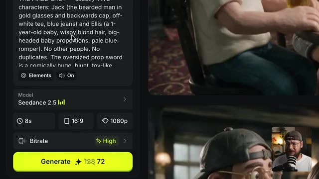

---

### ⏱️ `[00:22:35 - 00:23:01]` | Segment #47

**🔊 Audio (Transcription Intégrale Mot pour Mot en Français) :**
> logique. La continuité ne s'effondre pas en quelque sorte et c'est en grande partie grâce au fait que nous construisons réellement ces références d'ancrage et que nous les utilisons dans le flux de travail. Maintenant, j'étais prêt à aller un peu plus loin et à utiliser des références audio pour mettre ma propre voix dans les générations de vidéos. Mais jetons d'abord un coup d'œil rapide à quelques-unes des autres générations que j'ai assemblées en utilisant ce flux de travail.

**👁️ Analyse Visuelle d'Écran (gemini-3.5-flash-lite) :**
**Interface & Outils** : Vue caméra face (talking head) de Jack dans son studio, avec un microphone noir et blanc visible au premier plan, portant une casquette kaki à l'envers, des lunettes rondes et un t-shirt blanc. En arrière-plan, on aperçoit une étagère avec des objets décoratifs, une plante verte suspendue et un fauteuil sombre avec un coussin orange.

**Contenu textuel & Code** : Aucun texte, prompt ou paramètre technique visible à l'écran.

**Action / Démonstration** : Jack s'adresse directement à la caméra, gesticulant légèrement de la tête et des épaules tout en parlant.

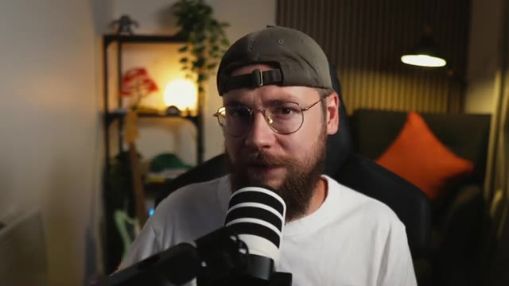

---

### ⏱️ `[00:23:01 - 00:23:20]` | Segment #48

**🔊 Audio (Transcription Intégrale Mot pour Mot en Français) :**
> On a celui-ci où l'on me voit essayer de tondre la pelouse. Encore une fois, nous prenons une tâche quotidienne très banale et nous la détournons en plaçant cette immense empreinte de monstre en plein milieu de la pelouse.

**👁️ Analyse Visuelle d'Écran (gemini-3.5-flash-lite) :**
**Interface & Outils** : Plan rapproché (médium close-up) de Jack face caméra dans son studio, assis dans un fauteuil de bureau, s'adressant directement au spectateur avec un microphone de studio orienté vers lui. L'arrière-plan montre une étagère garnie d'objets décoratifs, une plante verte, et un éclairage d'ambiance chaleureux. Aucune interface logicielle n'est affichée à l'écran.

**Contenu textuel & Code** : Aucun texte affiché à l'écran, aucun prompt de génération visible dans ce plan.

**Action / Démonstration** : Jack s'adresse directement à la caméra en parlant de sa vidéo, en effectuant de légers mouvements de tête et de corps pour accompagner son explication sur sa démarche artistique.

---

### ⏱️ `[00:23:20 - 00:23:52]` | Segment #49

**🔊 Audio (Transcription Intégrale Mot pour Mot en Français) :**
> Et comme vous l'avez probablement deviné maintenant, j'ai utilisé une image de référence ancre pour m'aider à obtenir le résultat que je recherchais. C'était donc l'une des images fixes que j'ai utilisées pour cette génération. Nous avons aussi ce plan ici de moi et mon père assis sur le canapé après une longue et difficile journée à chasser des monstres. Vraiment, vraiment sympa, voici encore l'image de référence ancre que j'ai construite pour cette génération en particulier. Une grande partie de l'humour

**👁️ Analyse Visuelle d'Écran (gemini-3.5-flash-lite) :**
**Interface & Outils** : L'interface affichée est celle de la plateforme de génération vidéo par IA "Seedance 2.5", intégrée dans un tableau de bord sombre de type studio créatif. Le panneau de gauche comprend les onglets "Create Video", "Edit Video", "Motion Control", la section des paramètres de génération ("Model: Seedance 2.5", durée 30s, format 16:9, résolution 1080p, débit "High"), un champ de prompt textuel et un gros bouton jaune "Generate" affichant un coût de 270 crédits. Au centre, la zone principale affiche les résultats vidéo et images de référence. Dans le coin inférieur droit, on aperçoit une incrustation vidéo (PiP) de Jack en webcam face caméra avec son micro.

**Contenu textuel & Code** : Dans le panneau latéral droit, on peut lire les détails de la génération : un texte descriptif du casting ("THE FIXED CAST – exactly TWO characters: Jack [bearded man, gold glasses, backwards dark cap, off-white tee, blue jeans] on the left, and his father [thickset, clean-shaven, short grey-flecked black hair, grey stubble]..."), ainsi que des indicateurs de format (1080p, 7.0s, 16:9) et des miniatures de prévisualisation des images sources utilisées.

**Action / Démonstration** : La vidéo montre l'interface de Seedance 2.5 en cours de navigation, affichant au centre un plan fixe du personnage de Jack et de son père assis sur un canapé, tenant des tasses avec de grandes épées plantées de part et d'autre, tandis que Jack commente en incrustation vidéo dans le coin inférieur droit.

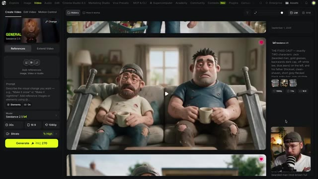

---

### ⏱️ `[00:23:52 - 00:24:24]` | Segment #50

**🔊 Audio (Transcription Intégrale Mot pour Mot en Français) :**
> vient du fait que mon père et moi sommes complètement en phase dans nos actions, alors vous savez, quand on entrechoque nos tasses de thé ou qu'on soupire, tout s'accorde parfaitement et j'ai dit à Claude que c'est exactement le type de performance que je voulais. Encore une fois, je ne laisse rien au hasard. J'ai une vision très claire de ce que je veux voir se produire et je communique cela à Claude tout au long du processus. Vous pouvez voir aussi qu'il a fallu pas mal de essais différents pour obtenir un point d'ancrage

**👁️ Analyse Visuelle d'Écran (gemini-3.5-flash-lite) :**
**Interface & Outils** : Une vidéo principale affichant une animation en stop-motion style pâte à modeler (claymation) de deux personnages assis sur un canapé, tenant chacun une tasse, avec deux grandes épées plantées de part et d'autre. En bas à droite de l'écran, une incrustation vidéo (PiP) montre Jack face caméra dans son studio avec son microphone.

**Contenu textuel & Code** : L'image générée en stop-motion présente deux hommes barbus aux traits de marionnettes en argile, vêtus de vêtements abîmés, assis sur un canapé beige dans un salon chaleureux avec une fenêtre en arrière-plan. Des épées de fantaisie style grandeur nature encadrent le canapé. Aucun texte d'interface logiciel n'est visible sur cette image fixe.

**Action / Démonstration** : La séquence montre l'affichage d'un clip vidéo généré par IA représentant une scène cinématique de deux personnages en pâte à modeler tenant des tasses de thé, tandis que l'animateur Jack commente sa méthode de direction artistique et d'itération avec l'assistant IA Claude dans le coin inférieur droit.

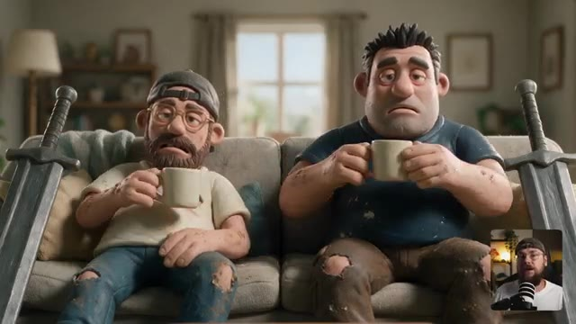

---

### ⏱️ `[00:24:24 - 00:25:14]` | Segment #51

**🔊 Audio (Transcription Intégrale Mot pour Mot en Français) :**
> référence que j'ai vraiment aimée pour cette scène particulière. Parfois c'est le cas, mais je préférerais de loin dépenser un paquet de crédits pour réussir une image, parce que ça sera tellement moins cher que de relancer des générations de vidéo encore, encore et encore jusqu'à ce que vous obteniez enfin ce que vous voulez. Autant régler les choses dès l'étape de génération d'images pour que ça se répercute sur vos générations de vidéos. On me voit aussi faire une rencontre assez intéressante au milieu de mes courses au supermarché. Cette génération est si bien réussie. Maintenant, encore une fois, vous pouvez voir qu'il m'a fallu

**👁️ Analyse Visuelle d'Écran (gemini-3.5-flash-lite) :**
**Interface & Outils** : Interface sombre d'une application de génération de vidéo par IA, probablement Seedance 2.5. La fenêtre principale affiche une galerie de vidéos générées avec des commandes de lecture. Sur le panneau de gauche se trouvent les options de configuration (« Create Video », « References », « Prompt », « Model », curseurs de durée et de résolution). Sur le panneau de droite, on aperçoit les détails du prompt principal (« THE FIXED CAST... »), des miniatures de contrôle, ainsi qu'une petite incrustation vidéo montrant Jack face caméra avec son micro. Le menu supérieur propose différentes sections (« Explore », « Image », « Video », « Audio », « Edit », « Cinemais Studio 4.0 », etc.).

**Contenu textuel & Code** : Modèle affiché : Seedance 2.5. Paramètres de génération configurés : durée 30s, format 16:9, résolution 1080p, débit (Bitrate) sur « High ». Coût indiqué pour la génération : 270 crédits (« 4510 270 »). Le prompt détaillé dans le panneau latéral décrit les personnages principaux (« THE FIXED CAST -- exactly TWO named characters: Jack (bearded man, gold glasses, backwards dark cap, off-white tee, blue jeans, ordinary average adult build) and the werewolf monster (lean feral... »).

**Action / Démonstration** : Navigation et présentation au sein de l'interface de génération vidéo. L'écran principal met en valeur un aperçu vidéo en cours de lecture montrant un personnage en pâte à modeler (style stop-motion) tenant un panier de courses dans les allées d'un supermarché. Jack commente les résultats à l'écran tout en montrant le processus et les choix de génération.

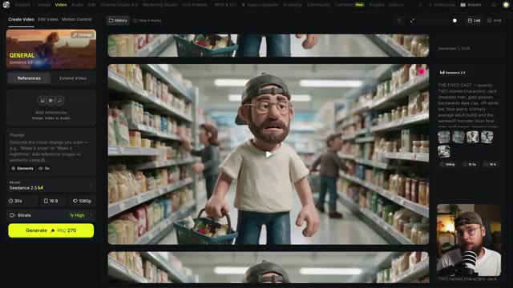

---

### ⏱️ `[00:25:14 - 00:25:46]` | Segment #52

**🔊 Audio (Transcription Intégrale Mot pour Mot en Français) :**
> un petit moment pour trouver une image de référence d'ancrage que j'aimais vraiment, donc j'ai utilisé celle-ci ici, encore une fois, nous consolidons cette notion d'échelle, l'idée que le monstre de type loup-garou est plus grand que moi et donc plus intimidant, et nous avons aussi en quelque sorte mis en place le gag où mon dos est appuyé contre ce congélateur pour que je puisse en quelque sorte projeter le loup-garou dedans ; si je ne donnais pas ce niveau de contexte à Seedance, il aurait eu du mal à comprendre exactement comment ce gag

**👁️ Analyse Visuelle d'Écran (gemini-3.5-flash-lite) :**
**Interface & Outils** : Interface utilisateur latérale d'un outil de génération vidéo (similaire à Seedream / Seedance 5.0 Pro) avec un panneau de configuration à droite affichant les détails du prompt, des vignettes d'images de référence, et une mini-fenêtre vidéo/webcam incrustée montrant Jack en bas à droite. Le cadre principal de gauche affiche une image fixe de style stop-motion en haute résolution représentant un homme adossé à un congélateur face à un loup-garou menaçant dans un supermarché.

**Contenu textuel & Code** : Dans le panneau de droite : le prompt visible indique "Ensure to use the @image 3 as a HEIGHT REFERENCE for the two characters — match the size difference between Jack and the werewolf monster exactly as shown, the werewolf noticeably taller than Jack." Les paramètres techniques affichés sous l'onglet "DETAILS" incluent le modèle (Seedream 5.0 Pro), la qualité (2k), la taille (2720x1536) et la date de création (September 1, 2026 at 1:26 PM). Trois vignettes de référence sont affichées au-dessus du prompt.

**Action / Démonstration** : Jack commente et analyse l'utilisation d'une image de référence pour verrouiller l'échelle et le contexte spatial des personnages dans l'outil de génération, tandis que l'image fixe du loup-garou et de Jack est affichée à l'écran avec le panneau d'options ouvert à droite.

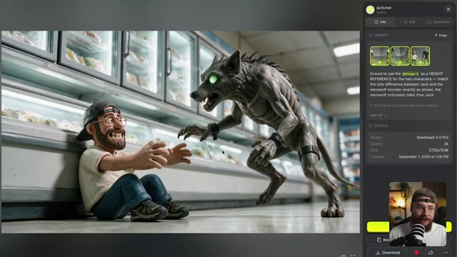

---

### ⏱️ `[00:25:46 - 00:26:20]` | Segment #53

**🔊 Audio (Transcription Intégrale Mot pour Mot en Français) :**
> travaille d'une sorte de perspective technique, mais nous lui donnons vraiment tous les blocs de construction pour qu'il puisse comprendre comment nous voulons que cette scène se déroule parce que c'est une scène tout à fait technique. Nous avons également cette très belle référence d'ancrage ici lorsque le loup-garou émerge pour la première fois dans le supermarché. La façon dont j'aime penser à ces références d'ancrage, c'est qu'elles se suffisent à elles-mêmes en quelque sorte. Elles racontent un peu une histoire juste en tant qu'image fixe. Je pense que c'est une bonne façon d'aborder ces éléments. Si vous pouvez regarder votre référence d'ancrage et qu'il y a quelque chose en elle qui

**👁️ Analyse Visuelle d'Écran (gemini-3.5-flash-lite) :**
**Interface & Outils** : Capture d'écran montrant à gauche un aperçu vidéo ou une image fixe générée représentant un monstre loup-garou dans un supermarché, et à droite un panneau latéral d'interface utilisateur (style dashboard de génération par IA) divisé en plusieurs sections : en haut le profil utilisateur « jackvsai » avec des onglets (Info, Edit, Comments), au milieu les sections « PROMPT » avec des vignettes d'images miniatures et un champ de texte étendu, une section « DETAILS » avec les paramètres techniques, et dans le coin inférieur droit, une incrustation vidéo montrant le présentateur (Jack) face caméra devant un microphone.

**Contenu textuel & Code** : Explications orales des concepts et des méthodes de création vidéo IA.

**Action / Démonstration** : Démonstration pédagogique et présentation du workflow.

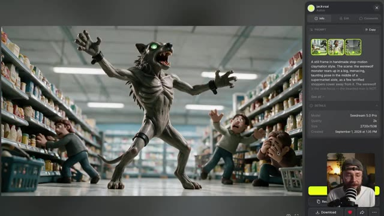

---

### ⏱️ `[00:26:20 - 00:27:01]` | Segment #54

**🔊 Audio (Transcription Intégrale Mot pour Mot en Français) :**
> captivant pour vous et qui crée un peu un fossé de curiosité, j'ai l'impression que ça fonctionne. C'est aussi, comme je l'ai dit, vraiment important qu'ils fournissent un tas de contexte à Seedance lorsque nous passons à l'animation. Et enfin, nous avons cette très belle génération ici de moi combattant ce monstre particulier dans un parc plutôt joli. Un si bon résultat que, mais pour obtenir le

**👁️ Analyse Visuelle d'Écran (gemini-3.5-flash-lite) :**
**Interface & Outils** : Interface sombre d'une application de génération de vidéo par IA avec un panneau latéral gauche pour les paramètres, une zone centrale affichant un lecteur vidéo avec un résultat de génération, et une incrustation vidéo en bas à droite montrant Jack face caméra avec son micro.

**Contenu textuel & Code** : Modèle affiché : Seedance 2.5. Paramètres : Durée 30s, Ratio 16:9, Résolution 1080p, Bitrate High. Prompt visible dans le panneau latéral droit décrivant un vaste parc britannique, des collines verdoyantes, des arbres, et une échelle gigantesque du monstre face à Jack.

**Action / Démonstration** : Le lecteur vidéo central affiche le résultat généré montrant un cyclope rocheux géant faisant face à un personnage minuscule (Jack) dans un parc herbeux, tandis que Jack parle en bas à droite.

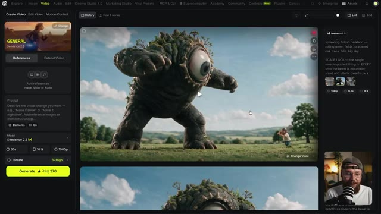

---

### ⏱️ `[00:27:01 - 00:27:38]` | Segment #55

**🔊 Audio (Transcription Intégrale Mot pour Mot en Français) :**
> La référence d'ancrage pour cette scène particulière a été vraiment assez difficile. Et cela s'est résumé principalement à essayer de fixer cette notion d'échelle. C'était donc la référence d'ancrage que j'ai fini par utiliser. La seule façon pour moi de réussir à faire fonctionner cela a été de prendre cette génération précédente ici et d'utiliser un prompt vraiment simple pour réduire fondamentalement la taille de mon personnage dans la scène. Vous pouvez voir qu'il y a même une coquille ici mais je veux dire que C-Dream a compris ce que j'essayais d'accomplir et au final ça a marché mais c'était tellement important d'obtenir cet ancrage.

**👁️ Analyse Visuelle d'Écran (gemini-3.5-flash-lite) :**
**Interface & Outils** : L'image affiche une interface logicielle de type studio de génération d'IA (similaire à Seedream). L'écran est divisé en deux parties : à gauche, le visualiseur principal affichant l'image générée en haute résolution ; à droite, un panneau latéral de configuration et d'informations. Dans le coin inférieur droit de ce panneau, une incrustation vidéo ronde (picture-in-picture) montre le visage de Jack (Jack vs AI) portant une casquette et s'exprimant devant un microphone.

**Contenu textuel & Code** : Dans le panneau de droite, sous l'onglet "Prompt", on aperçoit deux vignettes d'images de référence ("@image 1" et "@image 2") ainsi que le texte du prompt : "Expand @image 2 to show the monster's entire body using @image 1 as a character reference". Dans la section "Details" plus bas, les paramètres affichés sont : Model: Seedream 5.0 Pro, Quality: 2k, Size: 2720x1536, Created: September 1, 2026 at 4:57 PM. Sur l'image principale, on observe un monstre géant doté d'un œil unique central et d'un dos rocheux couvert d'arbres, attaqué dans un champ herbeux par un petit personnage de style figurine articulée brandissant une épée.

**Action / Démonstration** : L'image montre l'interface figée au moment de la présentation de la référence d'ancrage et du prompt d'agrandissement. Aucun mouvement n'est effectué à l'écran, mais l'incrustation vidéo indique que Jack commente et analyse en direct le résultat de la génération affichée.

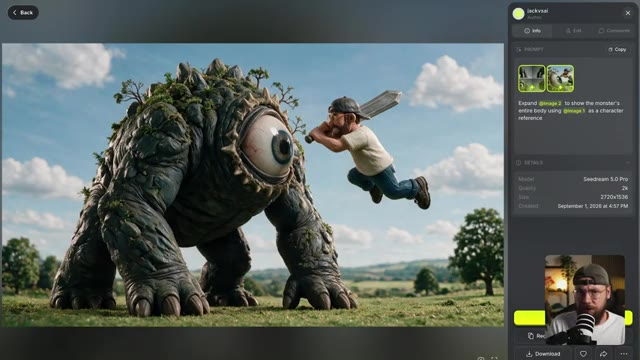

---

### ⏱️ `[00:27:38 - 00:28:16]` | Segment #56

**🔊 Audio (Transcription Intégrale Mot pour Mot en Français) :**
> de référence où l'on voit la différence d'échelle, pour que Seedance, lorsque nous sommes passés à l'animation, n'ait pas à deviner et n'ait pas la possibilité de se tromper à répétition pendant que nous gaspillons simplement des crédits dans la génération de vidéo sans obtenir les résultats que je voulais. Et pour être tout à fait clair et récapituler cela une fois de plus, pour obtenir les invites vidéo permettant d'animer réellement nos scènes, à chaque fois, je dépose les images de référence d'ancrage dans Claude, puis je décris ce que je veux qu'il se passe, ensuite Claude me donne cette invite très détaillée que je dépose dans Higgsfield et je lance.

**👁️ Analyse Visuelle d'Écran (gemini-3.5-flash-lite) :**
**Interface & Outils** : Interface de chat avec une IA textuelle (type Claude), affichée sur fond sombre au centre de l'écran, avec une vignette vidéo incrustée en bas à droite montrant Jack face caméra devant son micro.

**Contenu textuel & Code** : Historique de conversation affichant plusieurs blocs de texte. On y distingue notamment un prompt utilisateur (« Okay, let's architect a 15-second-long fight scene... »), une réponse de l'IA (« This is a great sequence... ») et un autre bloc de prompt détaillé spécifiant les références de taille et de design (« Ensure to use the attached images as HEIGHT and DESIGN REFERENCES... THE FIXED CAST... »), ainsi qu'une image miniature d'un monstre et d'un personnage en haut à droite.

**Action / Démonstration** : L'écran présente un historique de prompts textuels saisis dans l'outil de discussion avec l'IA pour structurer une séquence d'action complexe, tandis que le curseur de la souris reste immobile et que Jack parle dans l'encadré en bas à droite.

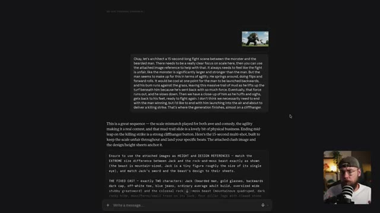

---

### ⏱️ `[00:28:16 - 00:28:39]` | Segment #57

**🔊 Audio (Transcription Intégrale Mot pour Mot en Français) :**
> grâce à Seedance 2.5 pour obtenir ces résultats. Mais comment pouvons-nous avoir un niveau de contrôle encore plus profond sur nos générations ? Ce que j'ai fait, c'est que j'ai utilisé ce microphone pour interpréter une partie des dialogues pour les scènes que je voulais générer. J'ai importé ces enregistrements dans Premiere Pro, puis je les ai simplement exportés sous forme de vidéos vides.

**👁️ Analyse Visuelle d'Écran (gemini-3.5-flash-lite) :**
**Interface & Outils** : Jack face caméra dans son studio, assis dans une chaise de bureau noire, avec un t-shirt blanc, une casquette et des lunettes rondes. Un microphone de type podcast à larges rayures noires et blanches est positionné devant lui. L'arrière-plan montre une étagère en bois garnie d'objets décoratifs, une plante verte suspendue, un panneau acoustique mural strié et une lampe allumée dégageant une lueur chaude. Aucun logiciel d'IA ou interface numérique spécifique n'est affiché à l'écran.

**Contenu textuel & Code** : Aucun texte à l'écran, aucun prompt textuel de génération, aucun paramètre technique visible.

**Action / Démonstration** : Jack s'adresse directement au spectateur face caméra en parlant. Ses mains esquissent des gestes mesurés pour accompagner son explication et il incline légèrement la tête.

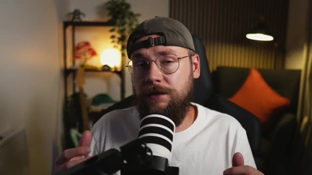

---

### ⏱️ `[00:28:39 - 00:28:57]` | Segment #58

**🔊 Audio (Transcription Intégrale Mot pour Mot en Français) :**
> Si vous vous demandez pourquoi j'utilise des vidéos vides au lieu d'un fichier audio comme un MP3, avec C-Dance 2, les vidéos vides comme références audio ont toujours mieux fonctionné. Je ne sais pas trop pourquoi. C'est une bizarrerie de l'outil. Donc je fais simplement cela pour C-Dance 2.5 également, essentiellement pour ne pas gaspiller de crédits.

**👁️ Analyse Visuelle d'Écran (gemini-3.5-flash-lite) :**
**Interface & Outils** : Plan rapproché de Jack face caméra, habillé d'un t-shirt blanc, coiffé d'une casquette à l'envers et portant des lunettes. Un microphone de studio est positionné devant lui. Le fond montre une pièce de vie chaleureuse, éclairée par une lampe d'appoint, avec une étagère garnie d'objets, une plante verte et un fauteuil foncé avec un coussin orange.

**Contenu textuel & Code** : Aucun texte à l'écran, interface logicielle ou paramètre technique visible dans ce plan, qui se concentre uniquement sur l'orateur en train d'expliquer son astuce technique.

**Action / Démonstration** : Jack s'adresse directement au public face caméra, fronçant légèrement les sourcils pour expliquer un détail technique lié à l'utilisation de vidéos vides comme références audio.

---

### ⏱️ `[00:28:58 - 00:29:30]` | Segment #59

**🔊 Audio (Transcription Intégrale Mot pour Mot en Français) :**
> Ensuite, j'ai utilisé Claude une fois de plus pour m'aider à concevoir un prompt décrivant la scène, je l'ai copié et collé dans Higgs Field. Ensuite, j'ai ajouté mes références. J'ai donc commencé par cette vidéo vide qui contient la référence audio pour mon dialogue. Puis j'ai sélectionné toutes les fiches de personnages pertinentes ainsi que les références d'ancrage. Ce qui est important aussi, c'est que j'ai parcouru le prompt et j'ai effectivement étiqueté cette référence audio chaque fois que c'était pertinent. Un peu déroutant, cela.

**👁️ Analyse Visuelle d'Écran (gemini-3.5-flash-lite) :**
**Interface & Outils** : Plan rapproché (medium shot) de Jack face caméra dans son studio, assis dans un fauteuil gaming noir. Il porte un t-shirt blanc, une casquette à l'envers et des lunettes rondes. Un microphone de type podcast noir et blanc se trouve devant lui. En arrière-plan, on aperçoit une étagère avec des objets décoratifs, une plante verte, une lampe sphérique allumée et un panneau mural acoustique lamellé en bois.

**Contenu textuel & Code** : Aucun texte, prompt ou paramètre technique affiché à l'écran dans ce plan.

**Action / Démonstration** : Jack s'exprime en direct face caméra en gesticulant légèrement des mains pour illustrer ses explications.

---

### ⏱️ `[00:29:30 - 00:30:06]` | Segment #60

**🔊 Audio (Transcription Intégrale Mot pour Mot en Français) :**
> c'est appelé video one parce que c'est cette vidéo vide mais vous voyez l'idée. Nous disons à C-Dance 2.5 exactement quand utiliser cette référence audio et en tapant réellement le dialogue que je dis aussi juste pour être vraiment clair avec l'outil vidéo. Je voulais que ce soit une scène assez longue donc j'ai augmenté la longueur de génération jusqu'à 30 secondes. C'est la super chose avec Sea Dance 2.5. Vous n'êtes plus limité à 15 secondes. Vous pouvez vraiment générer ces scènes assez longues et complexes. Tous les paramètres étaient bons. Donc j'ai cliqué sur générer.

**👁️ Analyse Visuelle d'Écran (gemini-3.5-flash-lite) :**
**Interface & Outils** : Interface sombre d'un outil de génération de vidéo par IA (probablement Seedance ou Sea Dance) avec des menus de configuration, des sélecteurs de durée, un format d'image et un aperçu vidéo en vignette. Une incrustation vidéo montre le visage de Jack avec un micro dans le coin inférieur droit.

**Contenu textuel & Code** : Texte du prompt visible : "Warm kitchen light, a resigned beat. Location: A modern, tasteful, well-kept middle-class British home — adjoining kitchen and dining room, daytime, warm homely light. Style: Classic Aardman-style stop-motion claymation — a physical, hand-sculpted plasticine puppet captured as a real miniature model, not a digital render. Surface: matte plasticine with a soft...". Paramètres visibles : Modèle "Seedance 2.5", durée réglée sur 5s, format 16:9, résolution 1080p, Bitrate réglé sur "High", et le bouton jaune de génération "Generate ✨ 45".

**Action / Démonstration** : Un curseur de souris survole et clique sur le bouton "Generate" de l'interface pour lancer la création de la vidéo après avoir ajusté les paramètres.

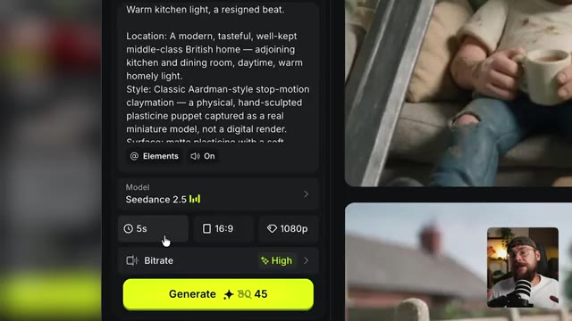

---

### ⏱️ `[00:30:06 - 00:30:31]` | Segment #61

**🔊 Audio (Transcription Intégrale Mot pour Mot en Français) :**
> Laisse-moi te montrer le résultat que j'ai obtenu. Qu'est-ce qu'il y a ? Tu dois trouver un meilleur endroit pour ranger cette fichue épée. Ce n'est pas sûr pour les enfants. Et pourquoi bon sang est-elle si grande ? Je ne sais pas.

**👁️ Analyse Visuelle d'Écran (gemini-3.5-flash-lite) :**
**Interface & Outils** : Lecteur vidéo intégré ou interface de montage style Premiere Pro affichant un plan cinématographique en format 16:9 au rendu 3D stylisé (claymation / animation style stop-motion).

**Contenu textuel & Code** : Plan moyen dans une cuisine lumineuse. Au premier plan, de profil, on aperçoit Jack avec sa casquette noire et ses lunettes. Face à lui se tient un personnage féminin modélisé sous forme de figurine en argile ou de poupée animée, aux cheveux bruns mi-longs, vêtue d'un col roulé noir et d'un short en jean. Elle a l'air furieuse, les dents serrées, et fait un geste théâtral de la main droite. En arrière-plan, sur le plan de travail de la cuisine, une épée surdimensionnée repose à l'horizontale.

**Action / Démonstration** : La caméra présente un plan fixe animé numériquement où le personnage féminin en argile gesticule de manière expressive et agacée en s'adressant à Jack, tandis que la scène se déroule de façon fluide grâce à l'IA générative vidéo.

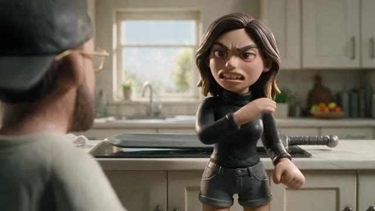

---

### ⏱️ `[00:30:31 - 00:30:57]` | Segment #62

**🔊 Audio (Transcription Intégrale Mot pour Mot en Français) :**
> C'est totalement impraticable. S'il te plaît, débarrasse-t-en. La maison est déjà assez en désordre comme ça. Comme vous pouvez le voir, cette méthode fonctionne vraiment très bien. Et ma propre voix a été naturellement intégrée à la scène. Et ce n'est pas comme si C-Dance avait juste pris mon accent. Ça a inséré ma réplique exacte dans la scène, en harmonisant le tout niveau timing et volume.

**👁️ Analyse Visuelle d'Écran (gemini-3.5-flash-lite) :**
**Interface & Outils** : Plan rapproché (medium close-up) de Jack face caméra dans son studio, parlant à travers un microphone de type podcast à rayures noires et blanches. Le décor en arrière-plan comprend une étagère garnie de plantes et d'objets, un fauteuil confortable avec un coussin orange vif et un éclairage d'ambiance tamisé.

**Contenu textuel & Code** : Aucun texte affiché à l'écran, ni interface logicielle, ni prompt technique. L'accent est mis sur Jack qui s'adresse directement au spectateur.

**Action / Démonstration** : Jack s'exprime face caméra en gesticulant légèrement pour appuyer ses propos, démontrant l'efficacité de l'outil d'intégration audio et vocale abordé dans la vidéo.

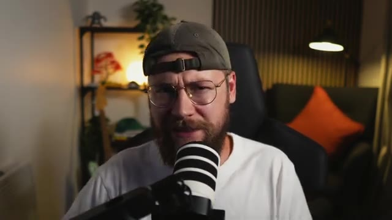

---

### ⏱️ `[00:30:57 - 00:31:35]` | Segment #63

**🔊 Audio (Transcription Intégrale Mot pour Mot en Français) :**
> D'un point de vue technique, c'est en réalité vraiment très impressionnant. Ce qui est intéressant aussi, c'est que nous avons la voix générée par l'IA que C-Dance a réellement donnée à Leanne, cette sorte d'accent britannique neutre. Disons que j'aime vraiment beaucoup la voix de Leanne dans cette scène. Ce que j'ai fait, c'est que j'ai téléchargé cette génération, j'ai glissé ce clip dans mon logiciel de montage, et j'ai découpé les répliques de dialogue de Leanne pour les exporter comme référence audio pour son personnage par la suite. Et utiliser cette méthode signifie que vous pouvez avoir des voix cohérentes pour autant de personnages

**👁️ Analyse Visuelle d'Écran (gemini-3.5-flash-lite) :**
**Interface & Outils** : L'interface affichée est celle du logiciel de montage vidéo Adobe Premiere Pro, organisée en panneaux standards (Panneau Projet/Bin en bas à gauche, Fenêtre de moniteur Source en haut à gauche, Fenêtre de moniteur Programme au centre-haut, Panneau Timeline au centre-bas, Panneau Propriétés/Effets à droite). Un encart vidéo miniature en bas à droite montre Jack face caméra, portant une casquette et s'exprimant devant un microphone.

**Contenu textuel & Code** : Dans le panneau Projet, on observe le nom de projet "Jack vs_AI_L.prproj/CLAYMOTION/Video Gen" ainsi qu'un chutier contenant un clip vidéo nommé "hf_20240902_131455_a7b63885...". Dans la timeline, un onglet de séquence actif est nommé "LIANNE_AUDIO_REF_SCENE_1". Les pistes vidéo (V1 à V5) et audio (A1 à A5) contiennent des clips découpés et juxtaposés avec leurs formes d'onde audio visibles.

**Action / Démonstration** : Manipulation d'un projet dans Adobe Premiere Pro : le clip vidéo généré par IA est importé dans le chutier puis placé dans la timeline, où le créateur effectue des coupes (outil rasoir) pour isoler et exporter spécifiquement la piste de dialogue audio du personnage de Leanne.

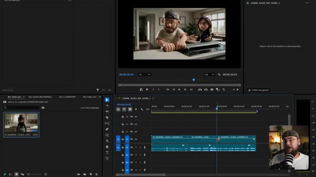

---

### ⏱️ `[00:31:35 - 00:31:56]` | Segment #64

**🔊 Audio (Transcription Intégrale Mot pour Mot en Français) :**
> comme vous en avez besoin. Donc pour la scène suivante, j'ai pris soin de charger cette référence audio de Leanne qui parle, que nous avions tirée de cette génération précédente. Et ensuite, j'ai téléchargé ma propre référence vocale une fois de plus et j'ai parcouru le prompt et étiqueté chacun là où c'était pertinent. Laissez-moi vous montrer le résultat que j'ai obtenu pour cette scène de rendez-vous galant.

**👁️ Analyse Visuelle d'Écran (gemini-3.5-flash-lite) :**
**Interface & Outils** : L'interface affichée est celle de la plateforme de génération vidéo Seedance 2.5 au sein d'un navigateur web. L'écran principal est divisé en plusieurs panneaux : un panneau latéral à gauche comportant les onglets "References" et "Extend Video", la sélection du modèle ("Seedance 2.5"), des curseurs de paramètres (durée 30s, format 16:9, résolution 1080p, débit binaire en mode "High"), et un bouton de génération jaune ("Generate - 480 270"). Au centre, le lecteur vidéo principal affiche la scène en cours de lecture avec une barre de progression verte. À droite, le panneau de configuration du projet affiche le prompt textuel principal, des vignettes de référence et des paramètres de sortie. Enfin, dans l'encadré inférieur droit, on aperçoit Jack en webcam, portant des lunettes, une casquette noire à l'envers et un tee-shirt blanc, s'exprimant devant un micro.

**Contenu textuel & Code** : Le panneau de droite affiche le prompt de génération principal : "THE FIXED CAST - exactly TWO characters: Jack (bearded man, gold glasses, backwards dark cap, off-white tee, blue jeans, ordinary average adult build) and Lianne (olive Mediterranean skin, dark brown hair with...". Le panneau de gauche contient un bloc de texte avec des descriptions de plans étiquetées par timecode : "[00:17 - 00:22] Close-up, 65mm, eye-level, static. On Jack, drunk and hunched, wine glass in hand. He replies, slurring his words: "Lianne, I've had one drink." (drunk, slurred, defensive, ensure his British voice matches." et "[00:22 - 00:26] Medium, 50mm, eye-level, static locked-off. Jack, still slurring the end of his sentence, slowly slides". En haut à gauche, la vignette "GENERAL" avec le modèle "Seedance 2.5" est visible. En haut à droite, le logo Seedance 2.5 est affiché avec la résolution 1080p et 30.0fps.

**Action / Démonstration** : L'écran présente la lecture en cours d'une vidéo générée montrant de dos un personnage féminin (Lianne) aux cheveux bruns mi-longs, vêtue d'une veste noire et d'un jean, se tenant dans une cuisine lumineuse devant un comptoir sur lequel repose une épée. Le curseur de la souris (flèche) est positionné au milieu du panneau gauche de description textuelle, tandis que la barre de lecture avance dans le lecteur vidéo central. Jack apparaît en bas à droite dans sa vignette webcam, gesticulant et expliquant son processus de création pour cette séquence de rendez-vous galant ("date night scene").

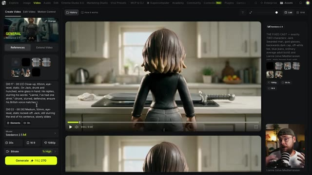

---

### ⏱️ `[00:31:56 - 00:32:15]` | Segment #65

**🔊 Audio (Transcription Intégrale Mot pour Mot en Français) :**
> C'est tellement agréable de sortir de la maison pour changer un peu. C'est notre première vraie soirée en amoureux depuis des mois et tu as bu une bouteille entière de vin. Tu as vraiment le droit de boire et de trucider ? Leanne, j'ai bu un seul verre. Je...

**👁️ Analyse Visuelle d'Écran (gemini-3.5-flash-lite) :**
**Interface & Outils** : Lecteur vidéo standard plein écran sans interface logicielle visible, affichant un plan cinématographique généré par IA dans un style de stop-motion/pâte à modeler.

**Contenu textuel & Code** : Plan américain dans un restaurant panoramique haut de gamme. Au premier plan, une femme coquinement coquin avec un chignon et une robe noire en pâte à modeler regarde droit devant elle d'un air blasé. À l'arrière-plan, de grandes baies vitrées donnent sur une ville illuminée la nuit, où une gigantesque créature lovecraftienne terrifiante aux tentacules multiples s'approche, provoquant la panique de clients en arrière-plan qui pointent du doigt et s'enfuient. Le style visuel imite précisément l'animation en volume (stop-motion) avec des textures de glaise, des imperfections de modelage et un éclairage de plateau de tournage miniature.

**Action / Démonstration** : La caméra réalise un léger travelling avant focalisé sur le visage stoïque de la femme au premier plan, contrastant fortement avec l'agitation chaotique et comique des clients paniqués et du monstre géant en arrière-plan.

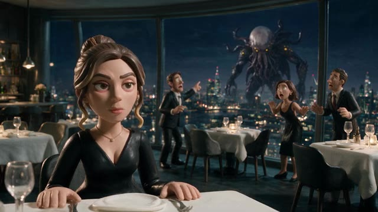

---

### ⏱️ `[00:32:15 - 00:32:34]` | Segment #66

**🔊 Audio (Transcription Intégrale Mot pour Mot en Français) :**
> Quelqu'un apporte un café à mon mari, s'il vous plaît. Encore une génération vraiment réussie ici. Et comme vous pouvez le voir, nous avons des voix cohérentes qui s'accordent avec cette génération précédente. Et je vais continuer pour vous montrer un autre exemple que j'ai assemblé en utilisant ce même flux de travail.

**👁️ Analyse Visuelle d'Écran (gemini-3.5-flash-lite) :**
**Interface & Outils** : Jack face caméra, dans son studio personnel, enregistré en plan moyen serré avec un micro studio visible au premier plan, devant une étagère décorée et un éclairage d'ambiance chaleureux.

**Contenu textuel & Code** : Aucun texte ni interface logicielle affichée à l'écran, l'image se concentre entièrement sur le présentateur de la chaîne Jack Vs. AI.

**Action / Démonstration** : Jack parle face caméra, gesticulant avec ses mains pour illustrer son propos tout en s'exprimant sur la cohérence vocale et les nouvelles générations de vidéos par IA.

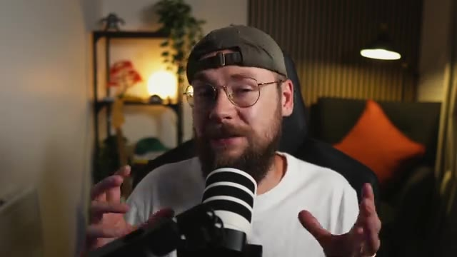

---

### ⏱️ `[00:32:34 - 00:32:54]` | Segment #67

**🔊 Audio (Transcription Intégrale Mot pour Mot en Français) :**
> Pour cela, une fois de plus, je m'appuie en quelque sorte sur les réalités d'être parent et ensuite je le détourne avec un rebondissement farfelu. S'il te plaît, on vient juste de endormir le bébé.

**👁️ Analyse Visuelle d'Écran (gemini-3.5-flash-lite) :**
**Interface & Outils** : Lecteur vidéo plein écran, sans interface logicielle apparente.

**Contenu textuel & Code** : Plan cinématographique en stop-motion style pâte à modeler (claymation) montrant un personnage barbu en peignoir et pantoufles, sortant prudemment de sa maison par une double porte vitrée dans un jardin de banlieue la nuit, tenant une grande épée en plastique ou en mousse. L'éclairage est nocturne avec un réverbère au loin.

**Action / Démonstration** : Le personnage avance prudemment vers l'avant de la scène en portant son épée, illustrant visuellement le concept de parentalité combiné à une situation absurde ou fantastique.

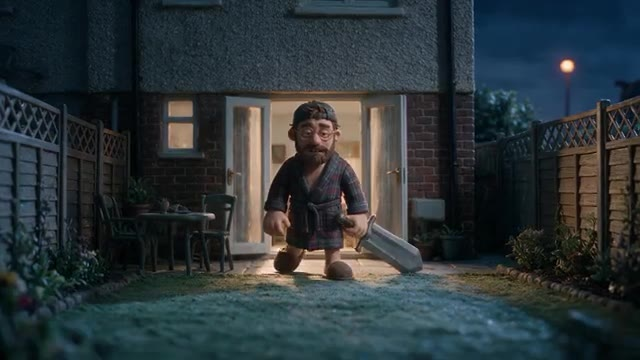

---

### ⏱️ `[00:33:01 - 00:33:21]` | Segment #68

**🔊 Audio (Transcription Intégrale Mot pour Mot en Français) :**
> Donc encore une fois, ce n'est pas une sorte d'imitation de ma voix. C'est exactement mon interprétation de ligne intégrée dans notre scène en pâte à modeler. Vraiment impressionnant. Maintenant, je veux brièvement aborder la manière dont vous pouvez réellement améliorer encore plus vos résultats. Et cela implique de les retoucher au montage.

**👁️ Analyse Visuelle d'Écran (gemini-3.5-flash-lite) :**
**Interface & Outils** : Lecteur vidéo plein écran affichant une séquence animée en stop-motion style pâte à modeler (claymation), avec en incrustation (picture-in-picture) en bas à droite la fenêtre de la webcam de Jack face caméra, portant une casquette et un micro studio.

**Contenu textuel & Code** : Aucun prompt textuel ni paramètre technique explicite affiché à l'écran. L'image se concentre sur le rendu visuel hyperréaliste d'un monstre en argile noire texturée avec des reflets brillants, des yeux globuleux aux pupilles mobiles, des cornes, et une lueur ardente de feu orange émanant du bas de la composition.

**Action / Démonstration** : La scène vidéo en pâte à modeler est en cours de lecture, montrant le gros plan du monstre articulé qui bouge ses yeux et sa mâchoire en synchronisation avec la voix off, tandis que l'incrustation de Jack en bas à droite reste fixe pendant qu'il parle.

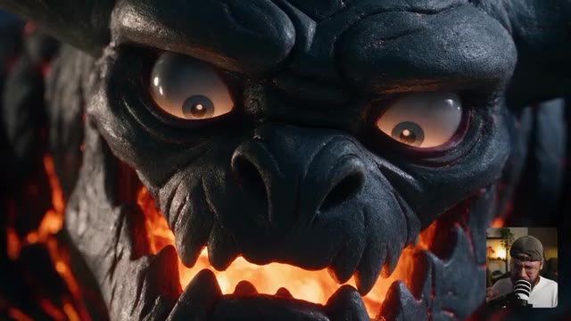

---

### ⏱️ `[00:33:21 - 00:33:56]` | Segment #69

**🔊 Audio (Transcription Intégrale Mot pour Mot en Français) :**
> Ce que je fais, c'est que je dépose ma génération brute sur une timeline vide dans Premiere. Ensuite, j'ajoute des points de coupe à chaque moment où la scène bascule vers un angle de caméra différent. Je superpose ensuite les clips, et cela me permet de construire des coupes en J ou en L où chaque plan se prolonge en quelque sorte sur celui qui le précède et le suit, et nous pouvons également resserrer les choses en éliminant un peu de cet espace vide gênant entre chaque plan. Vous remarquerez que j'ajoute également ces fondues à chacune des coupes sur la piste audio et

**👁️ Analyse Visuelle d'Écran (gemini-3.5-flash-lite) :**
**Interface & Outils** : Logiciel de montage Adobe Premiere Pro, affichant la timeline principale nommée "SWORD SCENE" avec plusieurs pistes vidéo (V1 à V4) et pistes audio (A1 à A4). Dans le coin inférieur droit, la webcam incrustée montre Jack face caméra en train de parler devant son micro.

**Contenu textuel & Code** : Noms des clips vidéo et audio bruts sur la timeline (ex: "hf_20260902_131655..."). Indicateur temporel affichant "00:00:05:13". Panneau audio avec le curseur "Adjust speed...". Courbes de volume et transitions en fondu visibles sur les clips audio.

**Action / Démonstration** : Manipulation de la timeline dans Premiere Pro avec le découpage des clips vidéo et audio sur différentes pistes pour créer des coupes superposées et l'application de transitions de fondu sur les pistes audio.

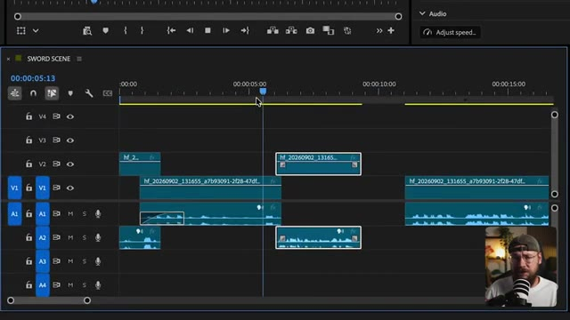

---

### ⏱️ `[00:33:56 - 00:34:25]` | Segment #70

**🔊 Audio (Transcription Intégrale Mot pour Mot en Français) :**
> encore une fois, cela va simplement relier chaque plan à celui qui le précède et le suit de manière beaucoup plus fluide que ce qu'on obtient directement avec Seedance 2.5. Pour vraiment replacer cela dans son contexte, laissez-moi d'abord vous montrer notre génération brute. Qu'est-ce qu'il y a ? Tu dois trouver un meilleur endroit pour garder cette stupide épée.

**👁️ Analyse Visuelle d'Écran (gemini-3.5-flash-lite) :**
**Interface & Outils** : Jack face caméra (plan rapproché poitrine, assis dans son studio habituel avec un t-shirt blanc, une casquette portée à l'envers, des lunettes et une barbe fournie, parlant directement dans un microphone de type podcast).

**Contenu textuel & Code** : Aucun texte, prompt ou paramètre technique textuel n'est affiché à l'écran dans ce plan.

**Action / Démonstration** : Jack s'exprime face caméra en faisant des mouvements de la tête et du visage pour ponctuer ses explications avant de basculer sur un autre visuel.

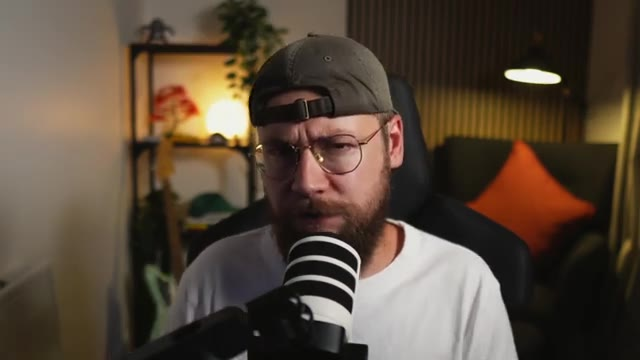

---

### ⏱️ `[00:34:26 - 00:34:44]` | Segment #71

**🔊 Audio (Transcription Intégrale Mot pour Mot en Français) :**
> Ce n'est pas sûr pour les enfants et pourquoi diable est-ce si grand ? Je ne sais pas. C'est complètement impraticable. S'il te plaît, débarrasse-t-en. La maison est déjà bien assez en désordre comme ça. Et maintenant, je vais vous montrer mon nouveau montage.

**👁️ Analyse Visuelle d'Écran (gemini-3.5-flash-lite) :**
**Interface & Outils** : Lecteur vidéo épuré avec bordures arrondies affichant un plan cinématographique en animation 3D style stop-motion / argile (claymation).

**Contenu textuel & Code** : Un personnage masculin de type cartoon stylisé en pâte à modeler, barbu, portant des lunettes et une casquette à l'envers, tient entre ses mains une grande épée factice au milieu d'un salon/salle à manger aux tons chaleureux, avec une table en bois, des chaises et une porte entrouverte en arrière-plan.

**Action / Démonstration** : Le personnage présente l'épée en la tenant horizontalement face caméra avec une expression grimaçante et hésitante dans un environnement intérieur.

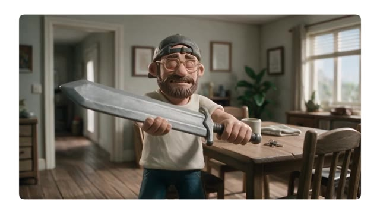

---

### ⏱️ `[00:34:44 - 00:35:09]` | Segment #72

**🔊 Audio (Transcription Intégrale Mot pour Mot en Français) :**
> C'est beaucoup plus agréable, n'est-ce pas ?

**👁️ Analyse Visuelle d'Écran (gemini-3.5-flash-lite) :**
**Interface & Outils** : Génération vidéo animée de type stop-motion / pâte à modeler affichée en plein écran.

**Contenu textuel & Code** : Animation montrant deux personnages en pâte à modeler (stop-motion style style Wallace et Gromit) dans une cuisine. Un homme barbu avec des lunettes et une casquette à l'envers, et une femme aux cheveux bruns, se tenant devant une table où est posée une grande épée grise futuriste ou fantastique.

**Action / Démonstration** : Les personnages observent et interagissent avec l'épée posée sur le plan de travail dans un style d'animation image par image très fluide et expressif.

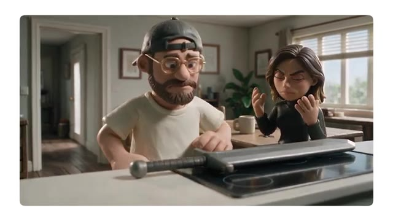

---

### ⏱️ `[00:35:09 - 00:35:29]` | Segment #73

**🔊 Audio (Transcription Intégrale Mot pour Mot en Français) :**
> Cette durée de génération initiale était de 30 secondes, et lorsque j'ai effectué mon montage, elle est descendue à 23 secondes. En perdant ces sept secondes supplémentaires, toute la scène paraît beaucoup plus rythmée et naturelle. Et je vous encourage à traiter vos générations d'IA comme des prises d'un plateau de tournage.

**👁️ Analyse Visuelle d'Écran (gemini-3.5-flash-lite) :**
**Interface & Outils** : Une incrustation vidéo (PiP - Picture-in-Picture) en bas à droite de l'écran montre Jack en gros plan face caméra dans son studio, portant une casquette et un t-shirt blanc, parlant devant son microphone. L'image principale affiche un plan vidéo généré par IA occupant la quasi-totalité de l'écran.

**Contenu textuel & Code** : Aucun texte textuel ou paramètre technique n'est affiché à l'écran. Visuellement, l'image montre un personnage féminin animé en argile (style stop-motion / claymation), l'air mécontent ou déterminé, habillé d'un col roulé noir. Le plan est situé dans une cuisine, avec un grand comptoir au premier plan sur lequel repose une épée. En arrière-plan, on aperçoit des meubles de cuisine blancs, un évier et une fenêtre lumineuse.

**Action / Démonstration** : Le plan vidéo principal est en cours de lecture, affichant le personnage animé dans la cuisine. En bas à droite, Jack parle à l'écran, illustrant ses propos sur l'importance du montage des clips vidéo générés par intelligence artificielle.

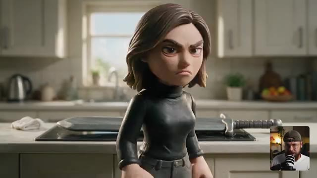

---

### ⏱️ `[00:35:29 - 00:35:53]` | Segment #74

**🔊 Audio (Transcription Intégrale Mot pour Mot en Français) :**
> Essayez de vous mettre dans l'état d'esprit d'un réalisateur. Ce n'est pas parce que vous avez une prise entière que vous devez l'utiliser en entier. Vous choisissez les moments qui fonctionnent vraiment bien. Une autre belle touche finale que nous pouvons ajouter au montage est l'utilisation d'un effet appelé « time posterization » [temporalité postérisée]. Maintenant, cela s'appelle peut-être différemment dans votre logiciel de montage, mais ce que nous faisons essentiellement, c'est réduire la fréquence d'images de la séquence.

**👁️ Analyse Visuelle d'Écran (gemini-3.5-flash-lite) :**
**Interface & Outils** : Logiciel de montage vidéo Adobe Premiere Pro affichant une interface multi-panneaux sombre avec les panneaux Contrôles d'effets, Moniteur de programme, Effets, Montage chronologique (Timeline) et un insert vidéo incrusté en bas à droite montrant Jack face caméra avec son micro.

**Contenu textuel & Code** : Dans le panneau Contrôles d'effets à gauche : paramètres de Mouvement (Position 960.0, 540.0, Échelle 100.0, Rotation 0.0, etc.), Opacité, et Remappage temporel (Vitesse 100,00 %). À l'écran, le moniteur de programme affiche un personnage animé en 3D (style stop-motion) parlant dans un intérieur. Dans la chronologie en bas, une piste violette "Adjustment Layer" est superposée à plusieurs clips vidéo bleus (AI_2026...). Dans le panneau des effets en bas à gauche, la barre de recherche montre un curseur clignotant et diverses catégories d'effets (Préréglages Lumetri, Effets audio : Amplification, Compresseur multibande, etc.).

**Action / Démonstration** : Le curseur de la souris survole la barre de recherche dans le panneau des effets en bas à gauche pour y saisir le nom d'un effet, tandis que la chronologie affiche la superposition d'un calque d'effet et que Jack s'exprime en bas à droite.

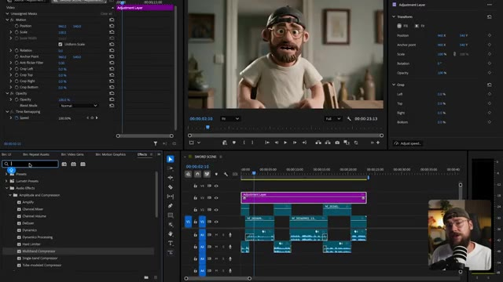

---

### ⏱️ `[00:35:54 - 00:36:20]` | Segment #75

**🔊 Audio (Transcription Intégrale Mot pour Mot en Français) :**
> Une génération brute tout droit sortie de C-Dance 2.5 arrive à 24 images par seconde. En utilisant le temps postérisé, je réduis cela de moitié pour descendre à 12 images par seconde. Et cela va vraiment exagérer ce style en stop-motion. Le spectateur va ressentir chaque image individuelle un peu plus et cela va en quelque sorte rendre les choses un peu moins parfaites et plus humaines dans le processus.

**👁️ Analyse Visuelle d'Écran (gemini-3.5-flash-lite) :**
**Interface & Outils** : La vidéo principale occupe tout l'écran et affiche un plan en stop-motion d'un personnage en peignoir et chaussons tenant une grande épée dans un jardin de banlieue. En bas à droite de l'écran, un encadré circulaire (picture-in-picture) montre Jack en plan rapproché, coiffé d'une casquette et portant des lunettes, parlant devant un micro avec un décor intérieur légèrement flouté en arrière-plan.

**Contenu textuel & Code** : Aucun texte, prompt ou menu d'interface n'est affiché à l'écran dans ce plan, à l'exception du rendu visuel de la vidéo générée dans le style d'animation en volume (stop-motion).

**Action / Démonstration** : La caméra présente un plan fixe en plein écran de la vidéo générée montrant le personnage s'avançant légèrement dans le jardin de sa maison, tandis que dans l'encadré en bas à droite, Jack s'exprime et gesticule face à la caméra.

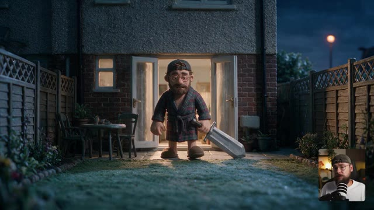

---

### ⏱️ `[00:36:20 - 00:36:40]` | Segment #76

**🔊 Audio (Transcription Intégrale Mot pour Mot en Français) :**
> C'est, bien sûr, tout à fait un choix de style. Vous aimerez peut-être le genre de mouvement fluide que l'on obtient directement avec Seedance 2.5. Une autre astuce que beaucoup de réalisateurs utilisant l'IA emploient est d'ajouter une couche de grain de pellicule par-dessus leurs générations. Je pense que c'est généralement plus important lorsqu'il s'agit de contenus photoréalistes.

**👁️ Analyse Visuelle d'Écran (gemini-3.5-flash-lite) :**
**Interface & Outils** : Interface du logiciel de montage Adobe Premiere Pro, comprenant un panneau de prévisualisation vidéo central, le panneau des Propriétés des effets (Effect Controls) à gauche avec les réglages de position, d'échelle et d'opacité, un panneau des Effets (Effects) en bas à gauche avec la recherche de l'effet de bruit ("Noise & Grain"), la timeline multi-pistes au centre en bas, et une incrustation vidéo (PiP) de Jack face caméra avec son micro en bas à droite.

**Contenu textuel & Code** : Dans le panneau de recherche des effets : "noise", sous-dossier "Noise & Grain" contenant l'effet "Noise". Sur la timeline, une piste vidéo violette intitulée "Adjustment Layer" est superposée au-dessus des clips vidéo bleus (nommés AI_2024... et AI_2024RM...). Dans la visionneuse, un plan cinématographique représente de dos un personnage de type figurine dans une cuisine.

**Action / Démonstration** : L'écran montre l'interface de montage d'Adobe Premiere Pro où l'utilisateur applique un effet de grain ou de bruit ("Noise") via un calque d'ajustement ("Adjustment Layer") superposé aux clips générés par IA, illustrant l'ajout d'une texture pellicule pour renforcer le réalisme.

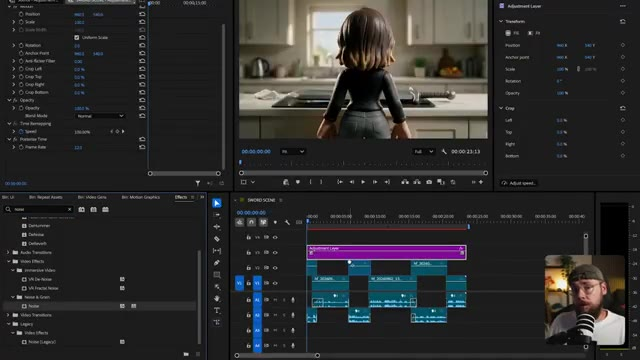

---

### ⏱️ `[00:36:40 - 00:37:02]` | Segment #77

**🔊 Audio (Transcription Intégrale Mot pour Mot en Français) :**
> Évidemment, avec notre style de type animation en pâte à modeler, c'est un peu plus indulgent, mais cela ajoute ce sens supplémentaire de texture. Le point que j'essaie de faire valoir est que vous ne devriez pas simplement prendre vos générations brutes de C-dance et les utiliser. Vous pouvez élever vos projets bien plus loin en y consacrant un tout petit peu plus de travail au montage. Et comme vous pouvez le voir, il ne s'agit pas toujours de faire quelque chose de techniquement complexe.

**👁️ Analyse Visuelle d'Écran (gemini-3.5-flash-lite) :**
**Interface & Outils** : Plan rapproché de Jack face caméra, parlant dans un microphone de studio professionnel. En arrière-plan, une étagère en bois avec une plante verte, une lampe sphérique allumée, et un coin salon chaleureux avec un coussin orange et une lampe sur pied.

**Contenu textuel & Code** : Aucun texte, prompt ou paramètre technique affiché à l'écran dans ce segment (plan de coupe sur le présentateur).

**Action / Démonstration** : Jack est assis face caméra, s'exprimant avec conviction et gesticulant légèrement pour appuyer ses explications sur le montage et l'amélioration des vidéos générées par IA.

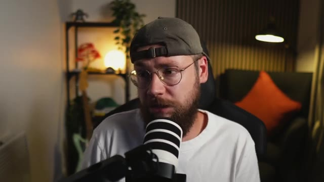

---

### ⏱️ `[00:37:02 - 00:37:27]` | Segment #78

**🔊 Audio (Transcription Intégrale Mot pour Mot en Français) :**
> de légères modifications dans le montage peuvent vraiment avoir un grand effet sur votre résultat final. Cela étant dit les gars, j'espère vraiment que vous avez apprécié la vidéo d'aujourd'hui. Nous avons exploré chaque étape de ce projet de stop-motion en pâte à modeler avec beaucoup de détails et, comme vous pouvez le voir, si vous suivez les étapes que je vous transmet, vous pouvez créer une tonne d'éléments réutilisables pour vos propres projets créatifs.

**👁️ Analyse Visuelle d'Écran (gemini-3.5-flash-lite) :**
**Interface & Outils** : Capture d'écran principale affichant une scène cinématique en stop-motion style pâte à modeler (claymation) se déroulant dans le wagon d'un métro. En bas à droite de l'écran, incrustation vidéo (PiP - Picture-in-Picture) de Jack face caméra, s'exprimant devant son microphone.

**Contenu textuel & Code** : Explications orales des concepts et des méthodes de création vidéo IA.

**Action / Démonstration** : Démonstration pédagogique et présentation du workflow.

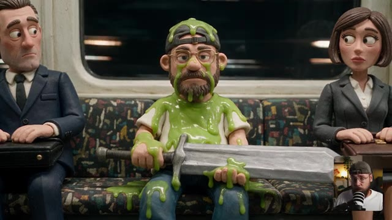

---

### ⏱️ `[00:37:27 - 00:37:50]` | Segment #79

**🔊 Audio (Transcription Intégrale Mot pour Mot en Français) :**
> Pour rappel, tous mes prompts et matériels sont disponibles de manière entièrement gratuite sur ma communauté School. Il y a un lien pour cela juste en dessous dans la description de la vidéo. Si vous avez apprécié ce tutoriel et que vous souhaitez me soutenir, n'hésitez pas à lâcher un pouce bleu sur la vidéo et pensez à vous abonner. Vous pouvez consulter ces vidéos pour aller plus ceci dit, je vous retrouve dans la prochaine.

**👁️ Analyse Visuelle d'Écran (gemini-3.5-flash-lite) :**
**Interface & Outils** : Capture vidéo principale montrant une animation générée par IA dans un style de stop-motion/pâte à modeler (claymation), représentant une famille attablée dans un pub. En bas à droite, incrustation vidéo (PiP - Picture-in-Picture) de Jack face caméra, portant une casquette à l'envers et des lunettes, assis devant un micro.

**Contenu textuel & Code** : Style visuel de type stop-motion en argile (claymation) très détaillé, représentant une famille de quatre personnes (père barbu avec casquette, mère, jeune garçon et bébé) mangeant des frites et du poisson pané autour d'une table en bois dans un pub traditionnel chaleureux. Dans l'encart miniature, Jack parle en direct depuis son studio équipé d'un micro de type podcast. Aucun texte incrusté ni paramètre technique affiché à l'écran.

**Action / Démonstration** : La vidéo principale présente une animation fluide de style claymation où la famille interagit joyeusement à table (mangeant, souriant). Dans le coin inférieur droit, Jack apparaît en incrustation, s'adressant directement au public avec des mouvements de tête et d'expressions faciales naturels pour conclure son tutoriel.

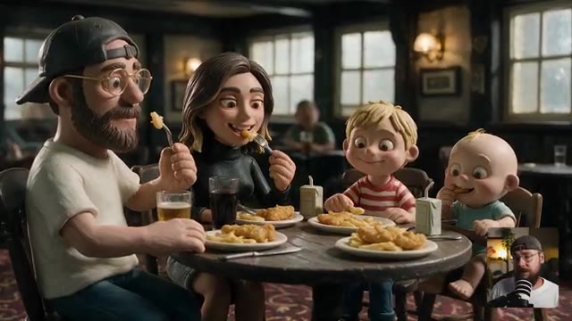

---
