# 🎬 Comment transformer GPT-6 Astra en votre propre studio 3D

> **Chaîne** : [Jack Vs. AI](https://www.youtube.com/@JackVsAI)  
> **Titre original** : `How to Turn GPT-6 Astra Into Your Own 3D Studio`  
> **Lien YouTube** : [https://www.youtube.com/watch?v=4WfAphCZXp0](https://www.youtube.com/watch?v=4WfAphCZXp0)  
> **Date de publication** : 2026-09-13  
> **Durée** : 16m 05s (`965s`)  
> **Identifiant vidéo** : `4WfAphCZXp0`  
> **Fiche Web Interactive** : [2026-09-13_YT-4WfAphCZXp0_Comment transformer GPT-6 Astra en votre propre studio 3D_by-whisper-v3-large-turbo+gemini-3.5-flash-lite.html](2026-09-13_YT-4WfAphCZXp0_Comment transformer GPT-6 Astra en votre propre studio 3D_by-whisper-v3-large-turbo+gemini-3.5-flash-lite.html)  
> **Captures d'écran clés** : `28 images sauvegardées`  
> **Modèles utilisés** : Audio: `large-v3-turbo` (Faster-Whisper int8 VPS) | Vision: `gemini-3.5-flash-lite` (Google AI Studio API)  

---

## 📌 Synthèse Exécutive & Outils

### 📌 Résumé
La vidéo de Jack présente une avancée majeure dans le domaine de la création vidéo par intelligence artificielle en combinant un assistant conversationnel de nouvelle génération, **GPT-6 Astra**, directement avec un logiciel de modélisation 3D de référence, **Blender**, via un plugin développé par **Higgsfield**. Alors que la 3D a traditionnellement la réputation d'être un domaine technique et intimidant pour les non-initiés, ce flux de travail novateur permet à n'importe quel créateur de contourner la courbe d'apprentissage abrupte de Blender. En dialoguant simplement en langage naturel avec Astra, l'utilisateur peut importer des images de référence, générer des modèles 3D low-poly ou texturés, appliquer un squelettage (*rigging*), concevoir des mouvements de caméra sur mesure et animer des personnages ou des objets complexes sans aucune compétence technique préalable.

Cette méthode s'articule autour de la création d'une « prévis » (pré-visualisation) basique mais rigoureuse, exportée ensuite sous forme de fichier vidéo MP4 HD à 24 images par seconde. Ce fichier sert de guide cinématique et structurel indispensable pour les modèles de génération vidéo par IA de pointe, tels que **Seedance 2.5**. En injectant à la fois l'image du personnage et la séquence animée de Blender dans Seedance 2.5, le modèle text-to-video et image-to-video se voit imposer des contraintes strictes. Cela garantit une cohérence visuelle absolue, un contrôle précis des mouvements de caméra et des performances d'animation fluides, tout en éliminant les aléas des générations purement aléatoires.

Pour les créateurs de contenu, les artistes VFX et les agences publicitaires, ce pont entre la 3D programmatique par IA et les générateurs vidéo résout l'un des plus grands défis de l'industrie : l'imprévisibilité et le coût en crédits des générations IA répétitives. En validant et en peaufinant l'animation en amont dans un environnement 3D contrôlé, les créateurs économisent un temps et un budget précieux. De plus, ce flux de travail ouvre la voie à des applications commerciales haut de gamme, telles que la présentation de produits technologiques complexes (à l'instar d'un iPhone Fold pliable), où la modification d'un design de personnage ou de produit peut être opérée instantanément tout en conservant exactement la même chorégraphie de caméra et la même dynamique d'animation.

### 🛠️ Outils, Modèles & Logiciels Présentés
* **GPT-6 Astra** : Assistant conversationnel IA avancé capable de prendre le contrôle direct de logiciels tiers pour interpréter des prompts textuels et exécuter des tâches de modélisation et d'animation 3D.
* **Blender** : Logiciel de création 3D open-source et entièrement gratuit, utilisé ici comme l'environnement central de pré-visualisation et d'animation piloté par l'IA.
* **Higgsfield (Plugin Blender)** : Passerelle logicielle officielle permettant d'intégrer et de connecter GPT-6 Astra à l'interface de Blender via un simple glisser-déposer de fichier zip et une connexion de compte.
* **Seedance 2.5** : Modèle de génération vidéo par IA de Higgsfield capable d'exploiter des images de référence et des vidéos d'animation 3D pour produire des clips finaux hautement contrôlés et fidèles aux consignes de mouvement.

### 🔑 Points Clés & Enseignements Stratégiques
* **Démocratisation de la 3D** : Ce flux de travail prouve qu'il n'est plus nécessaire de maîtriser des années de formation technique sur Blender pour concevoir des scènes 3D complexes, le langage naturel suffisant désormais à piloter l'outil.
* **Installation simplifiée** : L'intégration d'Astra dans Blender se résume à télécharger Blender, récupérer le plugin sur le site de Higgsfield, glisser-déposer le fichier ZIP dans l'application et se connecter.
* **Fenêtre de chat contextuelle** : Une fois le plugin actif, une interface conversationnelle apparaît en bas de l'écran de Blender, permettant de sélectionner le modèle IA (GPT-6 Astra) et de lui dicter les actions à réaliser.
* **Génération de modèles à partir d'images** : En glissant-déposant une image de personnage (comme un dinosaure), Astra est capable de l'analyser, d'identifier ses caractéristiques et de construire un modèle 3D modifiable correspondant.
* **Automatisation du *Rigging* (Squelettage)** : Astra prend en charge la création de structures squelettiques simplifiées indispensables pour animer des personnages, tout en nettoyant la scène des éléments inutiles (comme le cube par défaut).
* **Création de pré-visualisations (Prévis)** : L'objectif de la 3D par IA n'est pas de produire un rendu final photoréaliste, mais d'établir une base d'animation et de timing irréprochable avant de la passer à l'IA générative vidéo.
* **Maîtrise des mouvements de caméra** : Il est possible de dicter à Astra des chorégraphies de caméra complexes (plan large au démarrage, suivi d'un zoom rapide en contre-plongée lors d'un saut) avec un timing parfaitement synchronisé.
* **Alignement des spécifications techniques** : L'exportation de la séquence Blender doit impérativement correspondre aux standards du modèle vidéo cible, comme un format MP4 HD à 24 images par seconde.
* **Contrainte de modèle pour l'IA vidéo** : Fournir une référence de mouvement issue de Blender à Seedance 2.5 permet d'imposer des contraintes strictes au modèle, évitant ainsi les dérives visuelles et le gaspillage de crédits de génération.
* **Optimisation des coûts et des itérations** : Valider l'animation et le timing dans Blender avant la génération finale réduit drastiquement le gaspillage de ressources sur des essais infructueux.
* **Flexibilité de modification produit/personnage** : Ce workflow permet de modifier le design d'un personnage tout en conservant exactement la même animation de base en remplaçant simplement l'actif dans la scène 3D.
* **Applications publicitaires haut de gamme** : L'outil s'avère redoutable pour le design industriel et la publicité (comme la modélisation et le dépliage d'un smartphone futuriste à partir de plans schématiques), répondant parfaitement aux exigences professionnelles des clients.

---

## ⏱️ Chronologie & Transcription Complète Audio & Visuelle (Mot pour Mot)

### ⏱️ `[00:00:00 - 00:00:35]` | Segment #01

**🔊 Audio (Transcription Intégrale Mot pour Mot en Français) :**
> GPT-6 Astra vient de donner aux créateurs de vidéos par IA un avantage injuste, car vous pouvez désormais le relier à un programme 3D comme Blender. Décrivez simplement votre idée et regardez Astra lui donner vie. Et c'est dingue, car vous pouvez maintenant créer des mouvements de caméra personnalisés, des présentations de produits et même des animations de personnages sans aucune expérience de Blender. Dans la vidéo d'aujourd'hui, je vais vous montrer exactement comment configurer cela pour que vous puissiez pré-visualiser des scènes 3D et les utiliser pour contrôler vos vidéos par IA. Si vous aimez le contenu d'aujourd'hui, n'hésitez pas à lâcher un pouce bleu pour moi et à vous abonner. Allez, c'est parti...

**👁️ Analyse Visuelle d'Écran (gemini-3.5-flash-lite) :**
**Interface & Outils** : Fond graphique abstrait en dégradé bleu foncé et turquoise. En haut, du texte apparaît au centre. Au centre et en bas, deux fenêtres vidéo rectangulaires placées côte à côte sont reliées par une ligne turquoise horizontale avec un point lumineux en son milieu. La fenêtre de gauche affiche une modélisation 3D rudimentaire (low-poly) de cockpit de véhicule piloté par un personnage rose géométrique. La fenêtre de droite, encadrée d'une lueur turquoise, présente un rendu vidéo photoréaliste similaire mais détaillé, montrant un homme barbu pilotant le même type d'engin.

**Contenu textuel & Code** : Le texte incrusté à l'écran en haut se lit en blanc et passe au turquoise sur les mots "character animation" : "and even character animation". Aucune interface logicielle complexe n'est visible directement, hormis les deux écrans de comparaison (prévisualisation 3D technique à gauche versus résultat vidéo IA finalisé à droite).

**Action / Démonstration** : Présentation visuelle comparative montrant l'évolution d'une scène 3D basique (type Blender low-poly) vers une vidéo ultra-réaliste générée par intelligence artificielle grâce au pont logiciel avec GPT-6 Astra.

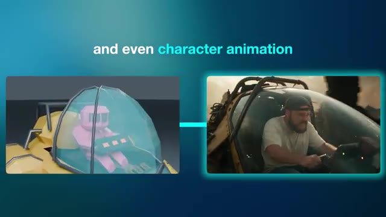

---

### ⏱️ `[00:00:35 - 00:01:08]` | Segment #02

**🔊 Audio (Transcription Intégrale Mot pour Mot en Français) :**
> dedans. Pour ceux d'entre vous qui découvrent la chaîne, je m'appelle Jack et j'ai une formation en publicité. Je suis artiste d'effets visuels depuis plus de 10 ans maintenant, ayant travaillé avec des marques comme BMW, Adidas et Google. Malgré cette formation technique, le monde de la 3D m'a toujours semblé complètement intimidant. Et cela fait de moi le candidat idéal pour tester ce flux de travail, car je n'ai littéralement jamais utilisé Blender auparavant, comme vous pourrez le constater au cours de cette vidéo.

**👁️ Analyse Visuelle d'Écran (gemini-3.5-flash-lite) :**
**Interface & Outils** : Jack face caméra, plan moyen serré, enregistré depuis son studio personnel. Il porte une casquette à l'envers, des lunettes et un t-shirt blanc, assis devant un micro de studio professionnel noir et blanc. En arrière-plan, on aperçoit une étagère en bois garnie de plantes et d'objets décoratifs, ainsi qu'un mur habillé de panneaux acoustiques lamellés verticaux.

**Contenu textuel & Code** : Aucun texte incrusté à l'écran, aucun prompt ni paramètre technique affiché.

**Action / Démonstration** : Jack s'adresse directement aux spectateurs en face caméra, s'exprimant avec assurance tout en bougeant légèrement les mains de manière expressive près du micro pour illustrer son propos.

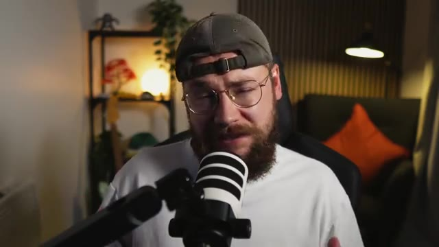

---

### ⏱️ `[00:01:08 - 00:01:42]` | Segment #03

**🔊 Audio (Transcription Intégrale Mot pour Mot en Français) :**
> Je mettrai un lien en bas dans la description vers Higgsfield, qui a eu la gentillesse de parrainer la vidéo d'aujourd'hui, et nous utiliserons leur plugin pour intégrer GPT-6 dans Blender. Jetons donc un œil à la configuration, heureusement c'est vraiment très simple. Tout d'abord, vous devez télécharger et installer Blender sur votre machine. La super nouvelle, c'est que c'est entièrement gratuit à télécharger et à utiliser. Ensuite, vous devez vous rendre sur higgsfieldai plugins slash blender et télécharger ce fichier également. Enfin, nous allons ouvrir Blender et glisser-déposer le

**👁️ Analyse Visuelle d'Écran (gemini-3.5-flash-lite) :**
**Interface & Outils** : Le bureau d'un ordinateur macOS est affiché avec le navigateur web de Blender en arrière-plan, le dossier des téléchargements ouvert montrant un fichier DMG (`blender-5.2.1-macos-arm64.dmg`), une fenêtre d'installation macOS au premier plan montrant le glisser-déposer de l'application Blender vers le dossier Applications, et une incrustation vidéo (PiP) en bas à droite montrant Jack face caméra avec son micro.

**Contenu textuel & Code** : Sur le site web de Blender, on peut lire : "Features", "Download", "Support", "Get Involved", "About", "Jobs", "Store", et le bouton "Donate". Dans le dossier des téléchargements, une longue liste de fichiers d'images JPEG, WebP, MP4 et PNG est visible, incluant notamment "blender-5.2.1-macos-arm64.dmg" (taille : 346.3 Mo, type : Disk Image, date d'ajout : Today at 14:10). Sur la fenêtre d'installation macOS, le logo de Blender apparaît au centre avec l'icône de l'application Blender et une flèche pointant vers le dossier Applications.

**Action / Démonstration** : Le curseur de la souris effectue un glisser-déposer de l'icône de l'application Blender vers le dossier Applications dans la fenêtre d'installation macOS ouverte par-dessus le dossier Téléchargements.

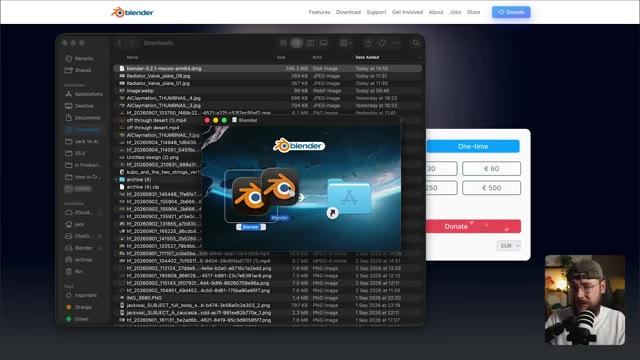

---

### ⏱️ `[00:01:42 - 00:02:02]` | Segment #04

**🔊 Audio (Transcription Intégrale Mot pour Mot en Français) :**
> fichier zip higgsfield depuis nos téléchargements dans l'application et il vous sera demandé de vous connecter à votre compte. Une fois connecté avec succès, vous verrez maintenant cette fenêtre de discussion en bas de votre Blender. Ici, vous pouvez choisir parmi une liste de chatbots IA à utiliser. Bien sûr, nous allons continuer et choisir GPT-6 Astra.

**👁️ Analyse Visuelle d'Écran (gemini-3.5-flash-lite) :**
**Interface & Outils** : L'interface affichée est celle du logiciel 3D Blender, complétée par une fenêtre de chat contextuelle et flottante de l'extension/application d'IA Higgsfield. En bas à droite de l'écran, on aperçoit une incrustation vidéo montrant le présentateur Jack (Jack Vs. AI) face caméra avec un micro.

**Contenu textuel & Code** : Dans la fenêtre de l'application Higgsfield intégrée à Blender, on peut lire les éléments suivants : une barre de navigation supérieure avec les onglets "Scene builder", "3D Model", "Character animation", "Image" et "Video". Au centre, un champ de saisie de texte affiche le texte par défaut "Describe the scene you imagine...". On aperçoit également un menu déroulant pour le choix du modèle (affichant "Claude Opus 5"), une zone de sélection d'espace de travail ("Workspace" avec les options "Personal" et "My Team 5"), un titre "New chat", ainsi qu'un gros bouton vert "GENERATE". La timeline classique de Blender est visible tout en bas.

**Action / Démonstration** : Le curseur de la souris survole et clique sur le menu déroulant du nom d'équipe ("My Team 5"), faisant apparaître une petite fenêtre contextuelle listant les espaces de travail ("Workspace") disponibles.

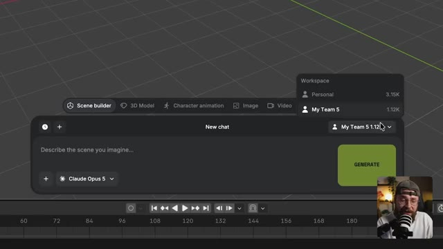

---

### ⏱️ `[00:02:02 - 00:02:23]` | Segment #05

**🔊 Audio (Transcription Intégrale Mot pour Mot en Français) :**
> Ce plugin permet à Astra de prendre le contrôle de Blender. Donc tout ce que vous avez à faire, c'est de taper votre prompt dans la fenêtre de chat et de regarder l'IA se mettre au travail. L'installation est donc vraiment aussi simple que ça. Commençons à créer. Je veux commencer par examiner un peu d'animation de personnages. Je vais aller glisser-déposer cette image que j'ai générée d'un personnage de dinosaure.

**👁️ Analyse Visuelle d'Écran (gemini-3.5-flash-lite) :**
**Interface & Outils** : Jack face caméra, vu en plan moyen serré, installé dans son studio personnel ou professionnel, équipé d'un micro de type podcast placé devant lui.

**Contenu textuel & Code** : Aucun texte ou paramètre technique visible à l'écran.

**Action / Démonstration** : Jack s'adresse directement aux spectateurs en face caméra, en gesticulant légèrement des mains pour illustrer son propos.

---

### ⏱️ `[00:02:23 - 00:02:42]` | Segment #06

**🔊 Audio (Transcription Intégrale Mot pour Mot en Français) :**
> Et maintenant, je peux simplement demander à Astra de créer un modèle low-poly du dinosaure dans l'image et cliquer sur générer. Donc Astra va procéder à l'analyse de l'image. Il reconnaît notre personnage comme un dinosaure sarcelle et indique qu'il va construire un modèle modifiable correspondant à ses caractéristiques.

**👁️ Analyse Visuelle d'Écran (gemini-3.5-flash-lite) :**
**Interface & Outils** : Plan rapproché (medium shot) de Jack face caméra, portant une casquette à l'envers, des lunettes et un t-shirt blanc, s'exprimant devant son micro dans son studio de création.

**Contenu textuel & Code** : Aucun texte ou interface logicielle visible à l'écran dans ce plan, l'attention étant portée entièrement sur Jack qui s'adresse à son audience.

**Action / Démonstration** : Jack s'exprime face caméra en gesticulant légèrement pour appuyer ses explications sur la fonctionnalité d'Astra qu'il vient de décrire.

---

### ⏱️ `[00:02:42 - 00:03:05]` | Segment #07

**🔊 Audio (Transcription Intégrale Mot pour Mot en Français) :**
> Astra ajoute maintenant plus de détails au personnage. Bon, nous avons maintenant notre modèle. Donc, ensuite, je vais demander à Astra de squeletter le dinosaur, de le centrer dans la scène et de supprimer le cube parce que nous n'avez pas besoin de cette forme. Et si vous vous demandez ce qu'est le squelettage, c'est essentiellement la construction d'un squelette simplifié pour notre personnage afin de nous permettre de l'animer.

**👁️ Analyse Visuelle d'Écran (gemini-3.5-flash-lite) :**
**Interface & Outils** : Interface du logiciel Blender combinée avec une surcouche d'intelligence artificielle (Astra / GPT 4 Astra). On observe la vue 3D principale au centre, le panneau "Scene Collection" et les propriétés de transformation (Transform) sur le côté droit, la timeline de lecture en bas, et une bulle de dialogue/prompt superposée avec des onglets de génération ("Scene builder", "3D Model", "Character animation", etc.). Une incrustation vidéo en bas à droite montre le présentateur (Jack) face caméra avec un micro.

**Contenu textuel & Code** : Dans le panneau de prompt inférieur, on peut lire : "@HERO_Dinosaur_Root Now rig the dinosaur, center him in the 3D scene". Au-dessus, une liste à puces décrivant le modèle 3D : "Low-poly dinosaur with 1,550 mesh faces", "Teal body, cream belly, coral plates, eyes, and claws", "Editable parts in HERO_Dinosaur, parented under your existing Empty", "Original reference and scene objects preserved", "The model's root is selected. The project remains unsaved.", "Low-poly dinosaur preview". Un bouton vert "GENERATE" est visible à droite de la zone de texte. Le modèle 3D d'un dinosaure stylisé et d'un cube gris est affiché dans l'espace 3D.

**Action / Démonstration** : Le curseur de la souris survole la zone de texte du prompt où l'instruction textuelle est en train d'être saisie ou vient d'être écrite pour demander à l'IA de poser l'armature (rig) sur le dinosaure et de le repositionner.

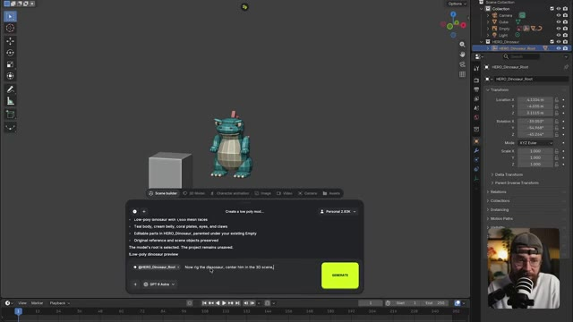

---

### ⏱️ `[00:03:05 - 00:03:23]` | Segment #08

**🔊 Audio (Transcription Intégrale Mot pour Mot en Français) :**
> Quelques minutes plus tard, nous avons maintenant notre structure de rigging. Passons donc au travail sur la description de l'animation. Et je veux commencer par quelque chose de vraiment simple. Je vais juste demander à Astra d'animer notre dinosaure en train de courir sur place. Et juste comme ça, nous avons notre personnage doté d'une structure et animé.

**👁️ Analyse Visuelle d'Écran (gemini-3.5-flash-lite) :**
**Interface & Outils** : Le logiciel de modélisation 3D Blender, avec une interface de dialogue superposée (type chatbot d'IA, "Astra") et une incrustation vidéo (PiP) de Jack face caméra dans le coin inférieur droit.

**Contenu textuel & Code** : Au centre, une fenêtre de dialogue d'IA avec des lignes de texte décrivant les modifications du modèle 3D et le prompt : "@RIG_Dinosaur - Nice, now let's animate a walk cycle, actually let's have the dinosaur running on the spot, I want the animation style to have lots of character and feel fluid, like a premium Pixar animation style". Un gros bouton jaune "GENERATE" est visible. À droite, le panneau de configuration Blender (Scene Collection, Transform, etc.).

**Action / Démonstration** : Le modèle 3D du dinosaure cyan et rouge est affiché dans Blender avec ses os de rigging apparents (les axes colorés). Le curseur de la souris survole ou s'apprête à cliquer sur le bouton de génération du prompt de l'assistant IA.

---

### ⏱️ `[00:03:24 - 00:03:45]` | Segment #09

**🔊 Audio (Transcription Intégrale Mot pour Mot en Français) :**
> Nous sommes essentiellement en train de construire ce que l'on appelle dans l'industrie une prévis. Ce n'est pas notre rendu final, ne vous inquiétez pas. Le plan est de prendre cette animation et de l'appliquer à notre image du personnage de dinosaure dans une petite minute. Maintenant, comme nous avons intégré Astra dans Blender, nous sommes capables d'avoir cette conversation aller-retour.

**👁️ Analyse Visuelle d'Écran (gemini-3.5-flash-lite) :**
**Interface & Outils** : Un affichage en plein écran montrant une image fixe en 3D d'un petit dinosaure bleu potelé aux plaques dorsales orange, avec un insert vidéo miniature en bas à droite (picture-in-picture) montrant Jack face caméra en train de parler devant un micro.

**Contenu textuel & Code** : L'image principale affiche un personnage de dinosaure mignon au style de dessin animé 3D texturé, posé sur un sol réfléchissant avec un fond bleu dégradé. L'insert vidéo montre Jack de profil-trois quarts, portant une casquette et des lunettes, parlant dans un microphone de studio.

**Action / Démonstration** : L'écran présente une image fixe du personnage 3D pendant que la voix off de Jack commente le processus de prévisualisation et d'intégration d'Astra dans Blender.

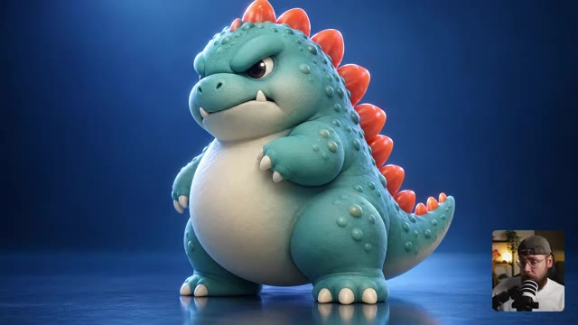

---

### ⏱️ `[00:03:45 - 00:04:04]` | Segment #10

**🔊 Audio (Transcription Intégrale Mot pour Mot en Français) :**
> Donc, allons-y pour rendre l'animation légèrement plus complexe. Je veux demander à ce que le dinosaure court plus vite. Ensuite, il s'arrête et saute, puis s'immobilise complètement. OK, maintenant nous avons notre animation légèrement plus complexe. Jetons donc un œil à l'animation de notre caméra.

**👁️ Analyse Visuelle d'Écran (gemini-3.5-flash-lite) :**
**Interface & Outils** : Logiciel de création 3D (semblable à Blender) intégrant des panneaux d'IA générative et de rigging de personnages, avec en incrustation vidéo (PiP) Jack face caméra dans le coin inférieur droit.

**Contenu textuel & Code** : Au centre, la vue 3D d'un dinosaure low-poly. Sous la scène 3D, une boîte de dialogue contextuelle affiche des instructions de prompt textuel (« Let's have him running faster, then he stops and jumps, and comes to a standstill ») et des consignes détaillées (« Springy compression, push-offs, and airborne strides », « Exaggerated arm swings and shoulder counter-rotation », etc.). Sur la droite, l'arborescence de la scène et le panneau des transformations. En bas, une timeline d'animation.

**Action / Démonstration** : Le curseur de la souris survole la zone de texte du prompt d'animation sous le modèle 3D du dinosaure.

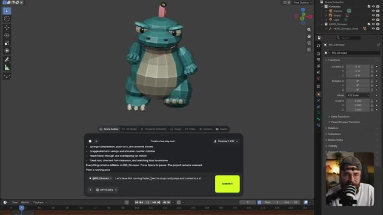

---

### ⏱️ `[00:04:04 - 00:04:27]` | Segment #11

**🔊 Audio (Transcription Intégrale Mot pour Mot en Français) :**
> Je veux commencer par un plan large lorsque notre dinosaure court, puis effectuer un zoom rapide en contre-plongée pour le moment où il saute. Ainsi, nous sommes sous lui lorsqu'il atterrit. Et c'est ce qui est génial avec Blender. Nous sommes capables d'animer nos personnages et nos mouvements de caméra. Donc, juste comme ça, nous avons notre caméra animée et cela fonctionne parfaitement en termes de timing.

**👁️ Analyse Visuelle d'Écran (gemini-3.5-flash-lite) :**
**Interface & Outils** : Jack face caméra dans son studio personnel, équipé d'un micro de podcast et portant une casquette et des lunettes. L'arrière-plan montre une étagère décorée et un fauteuil avec un coussin orange.

**Contenu textuel & Code** : Aucun texte, prompt ou paramètre technique affiché à l'écran dans ce plan, l'intervention étant purement verbale et explicative.

**Action / Démonstration** : Jack parle face caméra en gesticulant légèrement pour expliquer sa démarche artistique et technique concernant l'animation sous Blender.

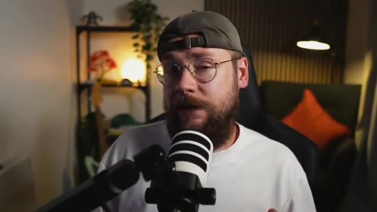

---

### ⏱️ `[00:04:27 - 00:04:50]` | Segment #12

**🔊 Audio (Transcription Intégrale Mot pour Mot en Français) :**
> Je suis content, donc je vais maintenant demander à Astra d'exporter cette séquence en MP4 HD à 24 images par seconde. Et c'est utile parce que la fréquence d'images de notre export Blender va correspondre au modèle de vidéo par IA que nous utiliserons dans une minute. Maintenant, sur la page d'accueil de Higgsfield AI, vous allez survoler l'onglet vidéo et sélectionner C-Dance 2.5.

**👁️ Analyse Visuelle d'Écran (gemini-3.5-flash-lite) :**
**Interface & Outils** : Jack face caméra, assis dans une pièce au décor chaleureux avec une étagère éclairée en arrière-plan et un coussin orange sur un fauteuil, parlant directement dans un microphone blanc monté sur un bras articulé.

**Contenu textuel & Code** : Aucun texte ou paramètre technique affiché à l'écran dans ce plan, Jack porte une casquette à l'envers et des lunettes rondes.

**Action / Démonstration** : Jack s'adresse directement au spectateur face caméra en bougeant légèrement les mains et en parlant.

---

### ⏱️ `[00:04:50 - 00:05:23]` | Segment #13

**🔊 Audio (Transcription Intégrale Mot pour Mot en Français) :**
> Je peux maintenant ajouter nos références. Il y a donc l'image de notre personnage de dinosaure et notre exportation animée low poly de Blender. Et pour le prompt, je vais simplement dire d'appliquer la performance et les mouvements de caméra de @Video 1. Nous étiquetons donc notre référence Blender ici sur le personnage dans @Image 1. J'ai également ajouté une brève description de la scène, incluant le mouvement de caméra. Et si vous voulez essayer mes prompts par vous-mêmes, vous les trouverez tous disponibles pour

**👁️ Analyse Visuelle d'Écran (gemini-3.5-flash-lite) :**
**Interface & Outils** : Interface sombre d'une application de génération vidéo par IA, affichant des zones de sélection de fichiers de référence, une boîte de saisie de prompt, des paramètres de modèle et de format, ainsi que des vignettes multimédias. En bas à droite, une incrustation vidéo montre le présentateur (Jack) filmé face caméra avec un micro et une casquette. Sur le côté droit de l'interface principale, un extrait vidéo en stop-motion montre un personnage en argile habillé en costume-cravate tenant une mallette.

**Contenu textuel & Code** : Dans la zone supérieure de l'interface, trois emplacements de référence : un vide avec une icône de plus, le deuxième contenant l'image d'un dinosaure bleu (@Image 1), et le troisième contenant une animation low-poly 3D (@Video 1). Dans la boîte de texte du prompt : "Apply the performance and camera moves from @Video 1 to the character in @Image 1. The scene starts with a wide shot as the monster walks in place, then a crash zoom toward his feet, as the monster jumps into the air and crashes back down. The scene ends with that same". Sous le prompt, deux boutons d'options : "@ Elements" et un contrôle audio réglé sur "On". Plus bas, le sélecteur de modèle indique "Seedance 2.5". Enfin, dans la barre de paramètres inférieure : durée "6s", format d'image "16:9", et résolution "1080p".

**Action / Démonstration** : Le créateur montre comment ajouter les références visuelles (l'image fixe du dinosaure et l'export 3D animé de Blender) dans l'interface de l'outil d'IA, tout en rédigeant le prompt textuel combinant ces éléments pour piloter la génération finale.

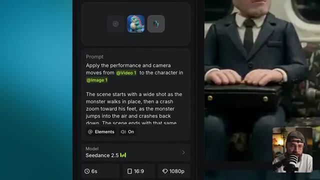

---

### ⏱️ `[00:05:23 - 00:06:00]` | Segment #14

**🔊 Audio (Transcription Intégrale Mot pour Mot en Français) :**
> Entièrement gratuit sur ma communauté School, le lien est juste en dessous dans la description également. Bon, je suis satisfait des paramètres, on peut donc lancer la génération et jeter un œil au résultat. C'est parti, Seedance 2.5 a pris notre animation Blender et l'a appliquée à l'image de notre personnage. Ce qui est génial, c'est que cela m'a permis de vraiment peaufiner l'animation lors de l'étape précédente avant de la passer dans Seedance 2.5. Ce qui signifie que l'on peut réduire nos coûts en évitant de gaspiller des

**👁️ Analyse Visuelle d'Écran (gemini-3.5-flash-lite) :**
**Interface & Outils** : Jack face caméra dans son studio, assis dans un fauteuil noir avec un t-shirt blanc, une casquette et des lunettes. Un microphone est placé devant lui. En arrière-plan, on aperçoit une étagère avec des objets décoratifs, une plante verte et une lampe allumée.

**Contenu textuel & Code** : Aucun texte ou paramètre technique affiché à l'écran dans ce segment (plan de coupe sur le présentateur).

**Action / Démonstration** : Jack s'exprime face caméra en parlant de l'outil Seedance 2.5 et de l'optimisation des coûts d'animation, tout en bougeant légèrement la tête et les mains pour appuyer ses propos.

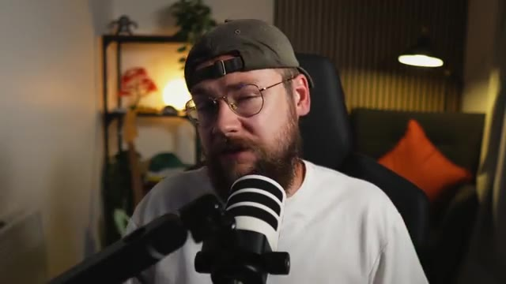

---

### ⏱️ `[00:06:00 - 00:06:37]` | Segment #15

**🔊 Audio (Transcription Intégrale Mot pour Mot en Français) :**
> plein de crédits sur des générations Seedance qui pourraient ne pas nous donner ce que nous cherchons. Ce qui est également très utile, c'est que nous pouvons apporter des modifications à notre design de personnage tout en utilisant notre prévisualisation Blender pour garantir que l'animation reste la même. Tout ce que nous avons à faire est de remplacer par cette nouvelle version de notre personnage et de cliquer sur générer, et nous obtenons un résultat comme celui-ci. Si vous n'utilisez pas de référence de mouvement comme notre exportation Blender, toutes vos générations C-dance risquent d'être légèrement différentes. Mais

**👁️ Analyse Visuelle d'Écran (gemini-3.5-flash-lite) :**
**Interface & Outils** : Interface sombre de l'outil de génération vidéo par IA "Seedance 2.5", affichant un panneau de configuration à gauche avec des onglets de paramètres ("References", "Extend Video"), une zone de texte pour le prompt, des options de sélection de modèle, des réglages de durée et de résolution, ainsi qu'une fenêtre contextuelle centrale de sélection d'images générées ("Image Generations", "Video Generations", "Audio Generations", "Liked") et une vue miniature en bas à droite montrant le présentateur Jack face caméra avec son micro.

**Contenu textuel & Code** : Texte du prompt visible dans la zone dédiée : "Apply the performance and camera moves from @Video 1 to the character in @Image 1. The scene starts with a wide shot as the monster walks in place, then a crash zoom toward his feet, as the monster jumps into the air and crashes back down. The scene ends with that same view at the low angle." Paramètres du modèle : "Seedance 2.5 LV4", durée de "6s", format d'image "16:9", résolution "1080p", réglage Bitrate sur "High", et bouton jaune de génération affichant un coût de "54" crédits.

**Action / Démonstration** : Le créateur navigue dans l'interface de Seedance pour remplacer l'ancienne version du personnage par un nouveau design (un petit monstre jaune semblable à un dinosaure) tout en conservant la référence de mouvement de la prévisualisation Blender, puis s'apprête à lancer la génération avec le bouton "Generate" pour maintenir une animation cohérente.

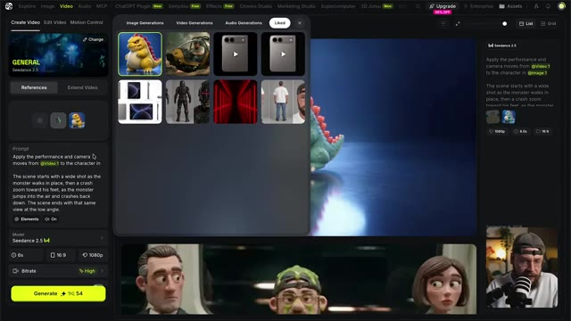

---

### ⏱️ `[00:06:37 - 00:06:58]` | Segment #16

**🔊 Audio (Transcription Intégrale Mot pour Mot en Français) :**
> Ce flux de travail impose une contrainte au modèle, vous donnant plus de contrôle en tant qu'utilisateur. Et je vois cela comme étant vraiment utile pour le travail avec des clients également. Disons que votre client adore l'animation d'un plan particulier mais souhaite apporter un changement au personnage. Ce flux de travail pourrait accomplir cela.

**👁️ Analyse Visuelle d'Écran (gemini-3.5-flash-lite) :**
**Interface & Outils** : Jack face caméra, installé dans son studio de création habituel avec éclairage d'ambiance chaleureux et étagère en arrière-plan.

**Contenu textuel & Code** : Aucun texte ni prompt technique affiché à l'écran dans ce plan.

**Action / Démonstration** : Jack s'adresse directement aux spectateurs en face caméra, parlant devant son micro principal et gesticulant légèrement pour appuyer ses explications.

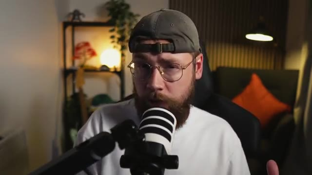

---

### ⏱️ `[00:06:58 - 00:07:34]` | Segment #17

**🔊 Audio (Transcription Intégrale Mot pour Mot en Français) :**
> Ensuite, je veux examiner un cas d'usage orienté vers la publicité. J'ai donc une nouvelle scène Blender vide et cette fois, je vais glisser-déposer cette image, qui est essentiellement un plan schématique de l'iPhone Fold, ou du moins ce à quoi il est censé ressembler selon les rumeurs. Au moment où j'enregistre ceci, Apple n'a pas encore révélé le téléphone, mais ils sont sur le point de le faire. Vous pourrez donc me dire dans les commentaires à quel point les fuites étaient réellement exactes. Je vais demander à Astra d'utiliser le plan pour construire un modèle précis de l'iPhone Fold et de lui donner également la possibilité d'effectuer des recherches supplémentaires.

**👁️ Analyse Visuelle d'Écran (gemini-3.5-flash-lite) :**
**Interface & Outils** : Jack face caméra dans son studio, assis devant un micro de type podcast, avec une étagère en arrière-plan éclairée par une lumière d'ambiance et une plante verte.

**Contenu textuel & Code** : Aucun texte, prompt ou paramètre technique visible à l'écran.

**Action / Démonstration** : Jack s'exprime face caméra en gesticulant légèrement des mains pour illustrer ses propos, tout en parlant de son projet de modélisation 3D sur Blender.

---

### ⏱️ `[00:07:34 - 00:08:05]` | Segment #18

**🔊 Audio (Transcription Intégrale Mot pour Mot en Français) :**
> ressent le besoin de le faire. Voyons donc si elle peut prendre ces dessins et mesures et construire un modèle réaliste de l'appareil. D'accord, on avance un peu là. C'est un peu basique, mais ça a l'air plutôt bien. Et maintenant, Astra pousse cela plus loin car elle a réellement ajouté des textures à l'appareil. Nous avons donc de la lumière qui frappe les bords et des reflets qui se comportent de manière réaliste sur les deux écrans. Et Astra a également ajouté les boutons latéraux, les haut-parleurs et le port de charge.

**👁️ Analyse Visuelle d'Écran (gemini-3.5-flash-lite) :**
**Interface & Outils** : Logiciel de modélisation 3D (Blender), avec une interface de génération par IA intégrée ("Scene builder" avec invite de commande Astra) et une incrustation vidéo montrant Jack face caméra en bas à droite.

**Contenu textuel & Code** : Texte de l'interface du générateur : "I'd like you to use...", consignes textuelles avec puces ("Folding animation; frame 1 open, 48 halfway, 68 closed.", "Original blueprint and existing scene objects preserved."), avertissement textuel sur le concept CAO, et champ de saisie avec le modèle "GPT-4 Astra". Panneau latéral de Blender affichant l'arborescence de la scène ("iPhone Fold") et les paramètres de transformation (Location, Rotation, Scale).

**Action / Démonstration** : Affichage à l'écran du modèle 3D texturé d'un smartphone pliable en cours de modélisation, tandis que Jack apparaît en bas à droite, observant attentivement le résultat s'afficher.

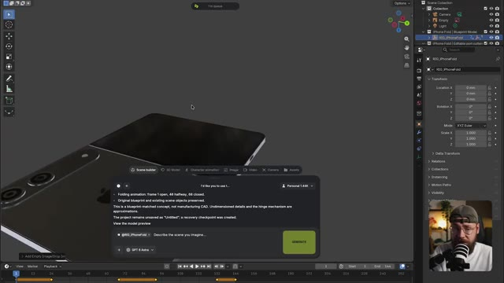

---

### ⏱️ `[00:08:05 - 00:08:29]` | Segment #19

**🔊 Audio (Transcription Intégrale Mot pour Mot en Français) :**
> À part le logo Apple lui-même, il a vraiment fait du très bon travail. Donc maintenant, je vais demander à Astra de gréer l'appareil pour que nous puissions réellement le faire plier et déplier de manière réaliste afin que nous puissions l'animer. OK, tout cela a donc été gréé selon Astra. Je vais donc maintenant envoyer ce brief pour que nous puissions réellement construire notre présentation de produit.

**👁️ Analyse Visuelle d'Écran (gemini-3.5-flash-lite) :**
**Interface & Outils** : Interface sombre d'un logiciel de création 3D et d'animation, comprenant un panneau supérieur d'outils avec les onglets "Scene builder", "3D Model", "Character animation", "Image", "Video", "Camera", et "Assets". Une grande fenêtre contextuelle de dialogue est ouverte au centre, avec une barre de prompt en bas comportant une sélection du modèle "GPT 6 Astra", un bouton "+" à gauche et un gros bouton rectangulaire "STOP" à droite. Une timeline d'animation avec des images clés est visible tout en bas de l'écran, et une vignette vidéo incrustée en bas à droite montre le présentateur Jack en train de parler.

**Contenu textuel & Code** : Dans la fenêtre contextuelle de discussion, le texte affiché indique : "The project remains unsaved as 'Untitled' ; a recovery checkpoint was created. View the model preview". Le message utilisateur est : "This looks great, can you rig it so that we can make it fold up and behave how the device is supposed to during folding and opening?". Des indications de statut affichent "Custom mcp." et un témoin jaune "Working for 7s • Custom mcp". Dans la zone de saisie du prompt, on lit "@RIG_IPhoneFold" suivi du texte indicatif "Describe the scene you imagine...".

**Action / Démonstration** : Le curseur de la souris (représenté par une flèche) se trouve au milieu de l'écran par-dessus l'interface du générateur d'IA. Le système est en train de traiter une requête de rigging 3D avec Astra, comme l'indique le compteur de temps (Working for 7s) et le bouton de génération transformé en "STOP".

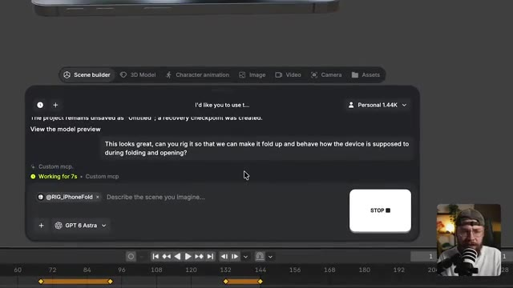

---

### ⏱️ `[00:08:29 - 00:08:56]` | Segment #20

**🔊 Audio (Transcription Intégrale Mot pour Mot en Français) :**
> Maintenant, les téléphones pliables peuvent être un domaine avec lequel les modèles vidéo par IA ont réellement du mal, car la conception des appareils est en réalité assez complexe. Bien sûr, ils possèdent un écran extérieur et un écran intérieur, et le mécanisme de pliage doit réellement avoir du sens. Même certains des meilleurs modèles vidéo par IA sur le marché peuvent s'embrouiller quant à ce qui devrait se trouver où sur le téléphone, surtout si nous leur demandons de le faire plier et déplier.

**👁️ Analyse Visuelle d'Écran (gemini-3.5-flash-lite) :**
**Interface & Outils** : Logiciel de modélisation 3D (Blender) avec une vue de modélisation 3D au centre, un panneau "Transform" et "Scene Collection" sur la droite, une barre d'outils à gauche, et une timeline en bas. Une fenêtre incrustée (type assistant ou IA intégrée "Scene builder" avec le modèle GPT 4 Astra) est visible en bas à gauche de la zone de travail. Une petite fenêtre vidéo avec Jack face caméra et son micro apparaît en bas à droite.

**Contenu textuel & Code** : Dans la fenêtre de dialogue "Scene builder" : un prompt utilisateur rédigé en anglais demandant de créer un "clean simple animatic, in the style of a premium Apple style product showcase...". Le modèle d'IA affiche les statuts "Reading", "Working for 10s", "Thinking". Des balises contextuelles telles que "@RIG_iPhoneFold" sont intégrées. Sur le panneau latéral droit, des paramètres de transformation 3D (Location, Rotation, Scale en XYZ Euler) et l'arborescence de la scène ("Collection", "Camera", "Empty", "Light", "iPhone Fold").

**Action / Démonstration** : Le logiciel 3D affiche un modèle de smartphone pliable semi-ouvert au centre de la grille de visualisation. Le curseur de la souris se trouve sur le plan de travail 3D tandis que le panneau de l'assistant IA en bas à gauche traite une requête de génération d'animation textuelle.

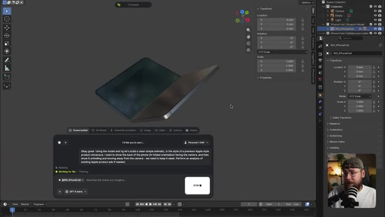

---

### ⏱️ `[00:08:56 - 00:09:22]` | Segment #21

**🔊 Audio (Transcription Intégrale Mot pour Mot en Français) :**
> Donc la théorie est qu'en construisant une prévis, nous pouvons donner à l'IA une compréhension claire du design et de la fonction de l'appareil afin d'éviter tout problème. C'est donc ce qu'on a obtenu en retour et ça a l'air plutôt bien, mais poussons le processus un peu plus loin. Je vais demander à Astra de conserver notre animation existante, mais d'en rajouter un bout à la fin où l'appareil se replie à nouveau et se rapproche de l'objectif.

**👁️ Analyse Visuelle d'Écran (gemini-3.5-flash-lite) :**
**Interface & Outils** : Logiciel de modélisation 3D (Blender) affiché en arrière-plan avec une hiérarchie de scène et des panneaux de transformation à droite. Au premier plan, une fenêtre de lecteur multimédia (QuickTime Player) affiche un fichier vidéo nommé « IPhoneFold_Showcase_Animatic.mp4 ». En bas à droite, une petite incrustation vidéo montre le présentateur (Jack) avec un casque et un micro.

**Contenu textuel & Code** : Le fichier vidéo ouvert se nomme « IPhoneFold_Showcase_Animatic.mp4 ». L'objet 3D affiché à l'écran est un concept d'iPhone pliable (iPhone Fold) de couleur grise avec le logo Apple à l'arrière.

**Action / Démonstration** : Le lecteur multimédia joue une animation 3D montrant l'arrière d'un iPhone pliable gris. L'interface Blender est visible en arrière-plan, tandis que Jack est incrusté en bas à droite, regardant attentivement l'écran.

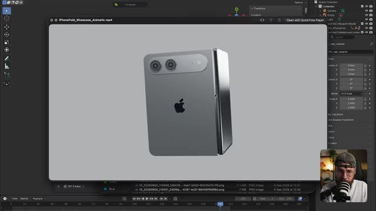

---

### ⏱️ `[00:09:22 - 00:09:49]` | Segment #22

**🔊 Audio (Transcription Intégrale Mot pour Mot en Français) :**
> D'accord, je pense que c'est ce qui manquait. Donc, ça a l'air plutôt bien maintenant. Retournons sur Higgsfield, nous pouvons maintenant générer notre vidéo finale. Sélectionnons donc notre export de fusion et cette maquette de produit comme références. Et nous pouvons utiliser un prompt très similaire à notre première génération ici. Disons donc : applique l'animation du produit et les mouvements de caméra de @video 1 au produit sur @image 1.

**👁️ Analyse Visuelle d'Écran (gemini-3.5-flash-lite) :**
**Interface & Outils** : L'interface affichée est celle de la plateforme web de génération vidéo "Higgsfield AI", avec un panneau latéral de configuration à gauche et une grande fenêtre contextuelle (pop-up) ouverte au centre montrant des onglets de médias ("Image Generations", "Video Generations", "Audio Generations", "Liked"). En bas à droite, une petite vignette vidéo montre le présentateur Jack en train de parler devant son microphone.

**Contenu textuel & Code** : Sur le panneau latéral gauche, on peut lire le modèle sélectionné ("Seedance 2.5"), les paramètres techniques réglés sur 5s, 16:9, 1080p, ainsi qu'un bouton jaune de génération affichant un coût de 270 crédits. La fenêtre pop-up centrale présente plusieurs vignettes d'images et de modèles 3D. Le fil d'actualité ou de droite montre le modèle Seedance 2.5 avec le prompt textuel suivant : "Apply the performance and camera moves from @video 1 to the character in @image 1. The scene starts with a wide shot as the monster walks in place, then a crash zoom toward his feet..."

**Action / Démonstration** : L'utilisateur navigue dans la fenêtre contextuelle au centre de l'écran pour sélectionner des images de référence (des maquettes de tablettes électroniques et des personnages 3D) en vue de les appliquer dans le générateur de vidéo.

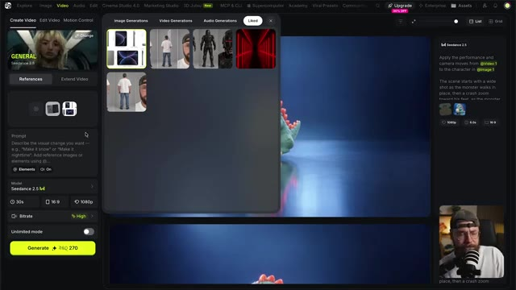

---

### ⏱️ `[00:09:49 - 00:10:23]` | Segment #23

**🔊 Audio (Transcription Intégrale Mot pour Mot en Français) :**
> Encore une fois, je vais simplement décrire un peu plus la scène pour que C-Dance ait un peu plus de contexte. Nous devons augmenter la durée car cette scène est plus longue que la première. Nous pouvons cliquer sur générer et examiner le résultat. Super. Donc, une fois de plus, C-Dance a appliqué notre référence de pellicule photo à l'animation Blender.

**👁️ Analyse Visuelle d'Écran (gemini-3.5-flash-lite) :**
**Interface & Outils** : Capture d'écran ou aperçu vidéo sur fond bleu dégradé avec un encadrement lumineux turquoise, présentant au centre l'image d'un smartphone gris plié doté d'un double capteur photo horizontal et du logo Apple. Un médaillon secondaire en haut à gauche reprend la même vue du téléphone.

**Contenu textuel & Code** : L'image montre un smartphone gris au design pliable fermé, arborant la pomme Apple au dos ainsi qu'un bloc optique horizontal à double objectif et flash, sur un fond sombre.

**Action / Démonstration** : L'écran présente un plan fixe du smartphone replié, tandis que le narrateur décrit l'ajustement de la durée de génération et l'application d'une référence visuelle sur une animation Blender via l'outil C-Dance.

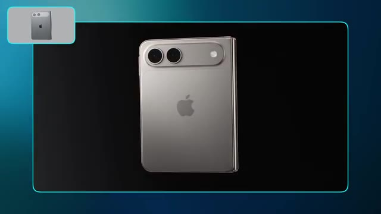

---

### ⏱️ `[00:10:23 - 00:10:56]` | Segment #24

**🔊 Audio (Transcription Intégrale Mot pour Mot en Français) :**
> Dans l'industrie des effets visuels, nous pourrions décrire cela comme une passe de beauté, et c'est un peu ce qui se passe ici. C'est pourquoi le logo Apple, par exemple, a été corrigé, et nous avons maintenant un fond d'écran sur l'écran de l'appareil. Je vois ce flux de travail comme vraiment utile si vous utilisez l'IA pour créer une présentation de produit pour vous-même ou votre client, et que vous avez besoin que la génération vidéo corresponde vraiment avec précision à ce à quoi ressemble le produit dans la vraie vie. Si nous n'avions pas notre exportation Blender, l'IA pourrait

**👁️ Analyse Visuelle d'Écran (gemini-3.5-flash-lite) :**
**Interface & Outils** : Jack face caméra, plan moyen serré, dans son studio de création habituel.

**Contenu textuel & Code** : Aucun texte ni prompt visible à l'écran. Décor en arrière-plan avec étagères, plantes et éclairage d'ambiance tamisé.

**Action / Démonstration** : Jack s'exprime face caméra en parlant dans un microphone de studio, en gesticulant légèrement pour appuyer ses explications sur le flux de travail de production.

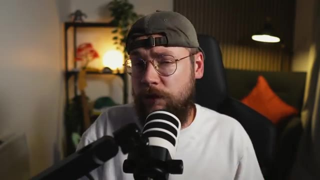

---

### ⏱️ `[00:10:56 - 00:11:29]` | Segment #25

**🔊 Audio (Transcription Intégrale Mot pour Mot en Français) :**
> commence à halluciner et à ajouter des boutons supplémentaires qui ne sont pas censés être là. Donc ouais, je vois pas mal d'applications utiles pour ça. Ensuite, je veux me concentrer un peu plus sur les mouvements de caméra. On va donc retourner dans Blender et cette fois, je veux déposer cette image de moi pilotant un vaisseau et je vais demander à Astra de créer un rendu low poly du vaisseau spatial, de la vitre du cockpit et du pilote. On a donc ce modèle très basique pour commencer. Maintenant, Blender est entré et a ajouté quelques

**👁️ Analyse Visuelle d'Écran (gemini-3.5-flash-lite) :**
**Interface & Outils** : Le logiciel de modélisation 3D Blender est affiché en arrière-plan, occupant la plus grande partie de l'écran. Une fenêtre de gestionnaire de fichiers du système d'exploitation (Finder macOS) est ouverte par-dessus Blender, affichant un dossier nommé "Image Gen". En bas à droite, une incrustation vidéo (PiP) montre Jack face caméra devant son micro.

**Contenu textuel & Code** : Dans la fenêtre de fichiers, on peut lire les dossiers de navigation (Recents, Shared, Applications, Desktop, Documents, Downloads, Jack Vs AI, 25.0, In Product..., How to Cr..., [flouté], GPT 6 AS...) et un fichier image listé sous le nom "hf_20260910_062559_d47e8a...". Dans l'espace de travail Blender, une image de prévisualisation représentant Jack pilotant un vaisseau futuriste est affichée, ainsi qu'une barre de saisie de prompt contextuelle en bas contenant le texte "Describe the scene you imagine...".

**Action / Démonstration** : Le curseur de la souris déplace et glisse une image depuis la fenêtre du Finder vers l'espace de travail 3D de Blender pour l'importer en tant qu'élément vide ("Add Empty Image/Drop Image").

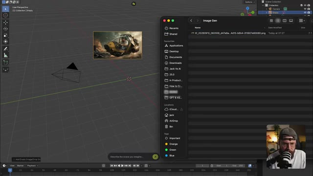

---

### ⏱️ `[00:11:29 - 00:11:50]` | Segment #26

**🔊 Audio (Transcription Intégrale Mot pour Mot en Français) :**
> des couleurs et des détails supplémentaires également. Super. Pour le mouvement de caméra, je veux une orbite qui fait le tour du vaisseau pendant qu'il vole, puis qui traverse la vitre du cockpit et se termine sur un gros plan de mon visage. Envoyons donc cela. Super. Nous avons donc l'orbite de la caméra.

**👁️ Analyse Visuelle d'Écran (gemini-3.5-flash-lite) :**
**Interface & Outils** : Interface du logiciel de modélisation 3D Blender, avec l'outillage de scène et l'arborescence des calques sur le panneau de droite. Au centre, superposition d'une interface de génération cloud / LLM (style Scene builder) dotée d'une zone de texte et d'un bouton de génération vert. En bas à droite, incrustation vidéo montrant Jack face caméra avec son micro.

**Contenu textuel & Code** : Dans la fenêtre de dialogue "Scene builder" : instructions textuelles décrivant le pilote ("Pilot: pink."), l'apparence du verre ("Glass: original colour and transparency unchanged."), et les détails de conception ("Details: angular cockpit front armour, framed footwell window, bumper, vents, sensor pods, bolts, engine bands, and rear roll cage."). Le modèle sélectionné en bas à gauche est "GPT 4 Astra". Le bouton à droite indique "GENERATE".

**Action / Démonstration** : Manipulation de l'interface 3D et des paramètres de la scène pour configurer le rendu visuel et préparer le mouvement de caméra orbital avant le lancement de la génération vidéo.

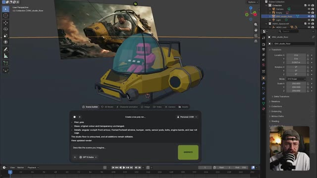

---

### ⏱️ `[00:11:50 - 00:12:22]` | Segment #27

**🔊 Audio (Transcription Intégrale Mot pour Mot en Français) :**
> Le vaisseau subit en quelque sorte des poches de turbulences et nous passons à travers la vitre pour terminer sur ce plan bien cadré de mon visage. Alors, sur Higgs field, ajoutons notre exportation Blender comme référence, une planche de personnages de moi-même et l'image de moi dans le vaisseau. Et la planche de personnages est importante ici, car sans elle, l'IA ne sait à quoi je ressemble que sous l'angle de moi pilotant le vaisseau. Cela va donner à C-Dance les informations dont il a besoin pour me recréer avec précision.

**👁️ Analyse Visuelle d'Écran (gemini-3.5-flash-lite) :**
**Interface & Outils** : L'interface affichée est celle de la plateforme web de génération vidéo « Higgsfield » (ou « Seance » / « Seedance 2.5 »). L'écran est divisé en plusieurs panneaux : un panneau latéral gauche pour les paramètres de génération vidéo et les références, une grande fenêtre contextuelle (pop-up) centrale affichant une galerie d'images et de vidéos générées avec des onglets (« Image Generations », « Video Generations », « Audio Generations », « Liked »), et un panneau latéral droit affichant les détails d'un projet. En bas à droite, on aperçoit une incrustation vidéo (webcam) montrant Jack en train de parler devant son micro.

**Contenu textuel & Code** : Le panneau de gauche affiche les sections « References », « Extend Video », un champ de prompt « Describe the visual change you want... » avec les options « @Elements » et « 🔊 On ». Les paramètres du modèle « Seedance 2.5 » incluent : une durée de 15s, un format d'image de 16:9, une résolution de 1080p, et un mode Bitrate réglé sur « High ». Le bouton de génération jaune indique « Generate ✨ 240 135 ». Dans le panneau contextuel central, plusieurs vignettes de médias sont visibles, notamment un personnage en armure futuriste, un couloir éclairé en rouge, et un personnage de dos.

**Action / Démonstration** : Le curseur de la souris (flèche blanche) se déplace au sein de la fenêtre contextuelle centrale et survole la grille des médias générés pour sélectionner des images de référence à importer dans le projet Seedance 2.5.

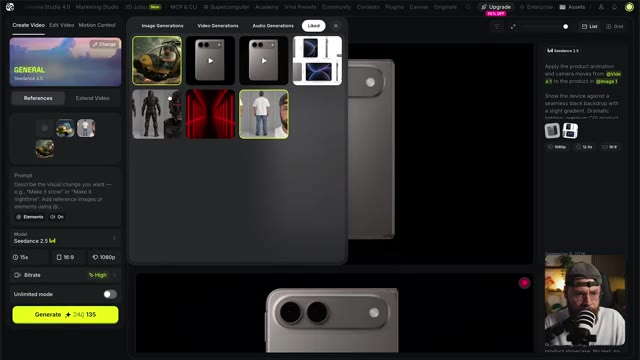

---

### ⏱️ `[00:12:22 - 00:12:55]` | Segment #28

**🔊 Audio (Transcription Intégrale Mot pour Mot en Français) :**
> En tant que personnage sous n'importe quel angle. Pour le prompt, c'est très similaire à ce que nous avons utilisé tout au long du projet mais j'ai juste ajouté un peu plus de détails ici et là. Nous disons à C-Dance de faire correspondre le personnage à ma feuille de référence. Nous décrivons le mouvement de caméra, un peu de ma performance, et davantage de détails sur la façon dont je veux que le vaisseau bouge, simplement parce que j'ai une vision vraiment claire en tête. Avec ça, tout est configuré, alors cliquons sur générer, et nous pourrons jeter un œil aux résultats.

**👁️ Analyse Visuelle d'Écran (gemini-3.5-flash-lite) :**
**Interface & Outils** : Interface sombre d'une application de génération vidéo par IA (Seedance 2.5), affichée en plein écran avec une vignette incrustée montrant Jack face caméra dans le coin inférieur droit.

**Contenu textuel & Code** : On aperçoit des vignettes d'images de référence en haut, un champ de prompt textuel contenant la description du mouvement du vaisseau ("The spacecraft bobs up and down..."), des boutons de configuration tels que "@ Elements", un paramètre audio sur "On", un menu déroulant du modèle "Seedance 2.5", ainsi que des paramètres de durée (15s), de format (16:9) et de résolution (1080p).

**Action / Démonstration** : Le curseur de la souris (représenté par une icône de main/pointeur) survole la zone de texte du prompt pour effectuer des ajustements ou préparer le lancement de la génération vidéo.

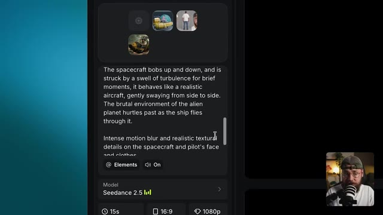

---

### ⏱️ `[00:13:10 - 00:13:48]` | Segment #29

**🔊 Audio (Transcription Intégrale Mot pour Mot en Français) :**
> D'accord, c'est plutôt une belle génération. J'ai l'impression que ces secousses de turbulences ne se comportent pas tout à fait comme je l'imaginais, mais cette dernière secousse est en fait vraiment sympa. Et le déplacement effectif à travers la couche de verre fonctionne très bien. Et comme je l'espérais, nous avons un très bon niveau de détail textuel sur ma peau. Nous avons ces cheveux rebelles, les perles de sueur, et ce sont toutes ces imperfections qui aident à ancrer la vidéo, à la faire paraître un peu plus réaliste. Maintenant, pour finir, parlons de mes impressions honnêtes après avoir utilisé ce flux de travail pour la première fois. Le premier point

**👁️ Analyse Visuelle d'Écran (gemini-3.5-flash-lite) :**
**Interface & Outils** : Capture vidéo principale montrant une scène générée par IA encadrée de bleu. Dans le coin supérieur gauche, un petit insert circulaire montre une maquette ou un storyboard 3D rose d'un cockpit. Dans le coin inférieur droit, une petite fenêtre incrustée montre Jack en gros plan face caméra avec un micro professionnel et une casquette.

**Contenu textuel & Code** : Génération vidéo cinématographique montrant un homme barbu avec des lunettes (Jack) aux prises avec de fortes secousses dans le cockpit d'un avion ou d'un vaisseau spatial, l'air tendu et concentré, avec des détails texturaux prononcés sur sa peau et ses vêtements.

**Action / Démonstration** : Lecture en cours d'une vidéo générée par IA montrant un plan subjectif ou en caméra embarquée dynamique à l'intérieur d'un cockpit, illustrant les turbulences et le passage à travers une vitre, tandis que le créateur commente la qualité du résultat.

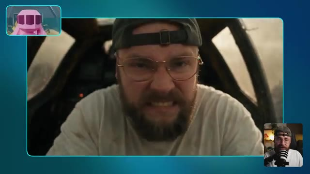

---

### ⏱️ `[00:13:48 - 00:14:23]` | Segment #30

**🔊 Audio (Transcription Intégrale Mot pour Mot en Français) :**
> Ce que je veux dire, c'est que vos exportations low poly depuis Blender vont avoir une influence profonde sur vos générations C-Dance. C'est évidemment ce à quoi vous vous attendriez, sinon quel serait l'intérêt même de faire ces générations en premier lieu, n'est-ce pas ? Mais en pratique, je pense que c'est à la fois bon et mauvais. Vous remarquerez avec mes exemples que l'animation est généralement assez basique et n'a parfois pas ce genre de fluidité ou de glissement haut de gamme auquel vous pourriez vous attendre. J'imagine que si vous passiez un peu plus de temps à avoir cette longue conversation de va-et-vient avec Astra,

**👁️ Analyse Visuelle d'Écran (gemini-3.5-flash-lite) :**
**Interface & Outils** : Plan rapproché de Jack face caméra, assis dans une pièce à l'ambiance chaleureuse et feutrée. Il est positionné devant son micro de studio sur pied et s'adresse directement aux spectateurs.

**Contenu textuel & Code** : Aucun texte incrusté, prompt ou paramètre technique affiché à l'écran dans ce segment. L'arrière-plan montre une étagère en bois garnie d'objets décoratifs, une plante verte, un fauteuil avec un coussin orange et une source d'éclairage tamisée.

**Action / Démonstration** : Jack parle en face caméra tout en s'exprimant avec les mains et en articulant pour appuyer ses propos sur la modélisation 3D et les animations générées par IA.

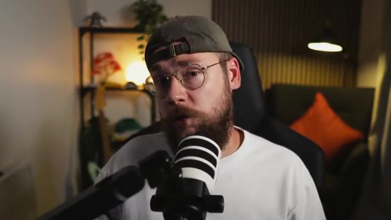

---

### ⏱️ `[00:14:23 - 00:15:01]` | Segment #31

**🔊 Audio (Transcription Intégrale Mot pour Mot en Français) :**
> Vous pourriez tout de même progresser vers un résultat plus haut de gamme. On observe parfois des imperfections issues des exportations Blender qui se répercutent sur vos générations Seedance. Ce genre de vilaine réflexion low poly sur le pli de l'iPhone en est un bon exemple. L'avantage de ce flux de travail, cependant, c'est que vous construisez effectivement une prévisualisation de votre scène avant de vous lancer dans Seedance. Faites attention toutefois à ne pas tomber dans le piège d'oublier que chaque fois que vous assignez des tâches à Astra, vous dépensez toujours des crédits. Je pense que c'est potentiellement

**👁️ Analyse Visuelle d'Écran (gemini-3.5-flash-lite) :**
**Interface & Outils** : Jack face caméra, assis dans son studio personnel, parlant dans un microphone de type podcast. En arrière-plan, on aperçoit une étagère avec des objets de décoration, des plantes vertes, un éclairage d'ambiance tamisé et un coussin orange.

**Contenu textuel & Code** : Aucun texte, prompt de génération ni paramètre technique n'est affiché à l'écran sur cette portion de vidéo.

**Action / Démonstration** : Jack s'adresse directement aux spectateurs en gesticulant des mains pour illustrer ses propos, expliquant les flux de travail entre Blender et les outils de génération vidéo par IA.

---

### ⏱️ `[00:15:01 - 00:15:37]` | Segment #32

**🔊 Audio (Transcription Intégrale Mot pour Mot en Français) :**
> c'est assez facile de se laisser prendre au jeu de ce genre de flux de travail, de s'enthousiasmer un peu trop et de se laisser emporter. Avant qu'on s'en rende compte, on a dépensé beaucoup plus de crédits qu'on ne le pensait. Cependant, cette méthode reste assez impressionnante techniquement. On a ces moments de temps en temps avec l'IA et la tech en général, où on se pose tranquillement dans son fauteuil en se disant, wow, les choses évoluent vraiment très vite. Et voir Astra prendre le contrôle de ma machine, créer des modèles, les configurer (rigguer), puis les animer a définitivement été l'un de ces moments. Sur ce,

**👁️ Analyse Visuelle d'Écran (gemini-3.5-flash-lite) :**
**Interface & Outils** : Le logiciel de modélisation 3D Blender est ouvert, affichant le viewport 3D principal avec l'objet 3D d'un téléphone pliable. L'arborescence (Scene Collection) apparaît en haut à droite avec les collections et objets (Camera, Empty, Light, iPhone Fold, RIG_IPhoneFold). Le panneau des propriétés de transformation (Transform : Location, Rotation, Scale) est visible dans le volet latéral droit. En bas, la timeline de Blender est affichée. Une interface contextuelle (fenêtre flottante) d'assistant IA (semblable à un plugin ou intégration de Blender) surmonte le viewport avec des onglets (« Scene builder », « 3D Model », etc.) et un champ de saisie de prompt (« Describe the scene you imagine... »). Enfin, un encadré vidéo incrusté (picture-in-picture) en bas à droite montre Jack face caméra avec son micro.

**Contenu textuel & Code** : Dans la boîte de dialogue de l'assistant IA, on peut lire un texte descriptif généré par l'IA ou saisi par l'utilisateur : « I'd like you to use... » suivi de listes à puces techniques comme « Folding animation: frame 1 open, 48 halfway, 68 closed. », « Original blueprint and existing scene objects preserved. », et un avertissement : « This is a blueprint-matched concept, not manufacturing CAD. Undimensioned details and the hinge mechanism are approximations. The project remains unsaved as "Untitled"; a recovery checkpoint was created. View the model preview ». Dans le champ de texte, le tag « @RIG_IPhoneFold » précède « Describe the scene you imagine... », avec un sélecteur de modèle « GPT-4 Astra » et un bouton vert « GENERATE ». Dans Blender, le panneau de transformation indique des valeurs de position et de rotation.

**Action / Démonstration** : La caméra 3D dans Blender zoome et tourne autour du modèle 3D du téléphone pliable texturé et positionné dans l'espace virtuel. Le curseur de la souris (représenté par une flèche blanche) se déplace dans le viewport au-dessus du modèle, tandis que l'interface de l'assistant IA reste active en surimpression au premier plan. Dans l'encadré en bas à droite, Jack s'exprime et gesticule face à sa caméra.

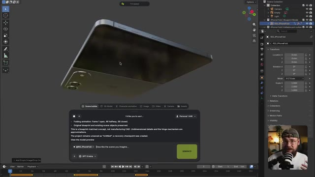

---

### ⏱️ `[00:15:37 - 00:15:54]` | Segment #33

**🔊 Audio (Transcription Intégrale Mot pour Mot en Français) :**
> a dit les gars, nous sommes arrivés à la fin du tutoriel d'aujourd'hui. Si vous l'avez apprécié, assurez-vous de lâcher un pouce bleu pour moi et pensez à vous abonner. Je vais aller de l'avant et partager quelques-unes de mes autres vidéos si vous souhaitez continuer à explorer tout ce qui est possible avec les derniers outils d'IA, et je vous retrouve les gars dans la prochaine.

**👁️ Analyse Visuelle d'Écran (gemini-3.5-flash-lite) :**
**Interface & Outils** : Fond uni abstrait aux nuances de bleu et de sarcelle (teal), sans interface logicielle ni élément de navigation visible.

**Contenu textuel & Code** : Aucun texte, prompt de génération ni paramètre technique affiché à l'écran.

**Action / Démonstration** : Plan fixe ou fondu enchaîné sur un arrière-plan purement esthétique marquant la conclusion de la vidéo, sans manipulation visible.

---
