# 🎬 Comment transformer n'importe quel produit en une marque incontournable grâce à l'IA

> **Chaîne** : [Jack Vs. AI](https://www.youtube.com/@JackVsAI)  
> **Titre original** : `How to Turn ANY Product Into a KILLER Brand with AI`  
> **Lien YouTube** : [https://www.youtube.com/watch?v=YzFZLpuUr0g](https://www.youtube.com/watch?v=YzFZLpuUr0g)  
> **Date de publication** : 2026-09-19  
> **Durée** : 16m 05s (`965s`)  
> **Identifiant vidéo** : `YzFZLpuUr0g`  
> **Fiche Web Interactive** : [2026-09-19_YT-YzFZLpuUr0g_Comment transformer n'importe quel produit en une marque incontournable grâce à _by-whisper-v3-large-turbo+gemini-3.5-flash-lite.html](2026-09-19_YT-YzFZLpuUr0g_Comment transformer n'importe quel produit en une marque incontournable grâce à _by-whisper-v3-large-turbo+gemini-3.5-flash-lite.html)  
> **Captures d'écran clés** : `31 images sauvegardées`  
> **Modèles utilisés** : Audio: `large-v3-turbo` (Faster-Whisper int8 VPS) | Vision: `gemini-3.5-flash-lite` (Google AI Studio API)  

---

## 📌 Synthèse Exécutive & Outils

### 📌 Résumé
La vidéo de Jack Vs. AI, « Comment transformer n'importe quel produit en une marque incontournable grâce à l'IA », explore une méthode révolutionnaire pour concevoir de toutes pièces une identité de marque haut de gamme sans disposer des budgets publicitaires traditionnels. En s'inspirant de stratégies marketing disruptives comme celle de la marque *Liquid Death*, Jack démontre comment l'intelligence artificielle générative permet de s'affranchir des contraintes techniques et financières habituelles pour créer un univers visuel percutant, inattendu et hautement engageant. 

Le workflow étape par étape s'appuie sur une synergie entre l'analyse textuelle et la génération visuelle de pointe. Jack commence par collecter des inspirations visuelles sur Pinterest avant d'utiliser un LLM (comme Claude) pour décortiquer ces références et générer des prompts de style précis. Ces prompts sont ensuite injectés dans des générateurs d'images sur OpenArt (notamment le modèle C-Dream 5.0 Pro) pour concevoir un personnage mascotte original, le décliner à l'aide de la fonction de recréation d'image, puis le plaquer instantanément sur divers supports (sachets de café, casquettes, t-shirts, devantures de magasins) grâce à la référence visuelle. 

Cette approche offre aux créateurs et aux petites entreprises un contrôle créatif total et leur permet de prototyper un écosystème de marque complet en quelques minutes seulement. En capitalisant sur la curiosité du consommateur et le design subversif, l'IA transforme radicalement le processus de création publicitaire, rendant accessible à tous ce qui nécessitait auparavant des agences internationales et des mois de travail sous Photoshop.

### 🛠️ Outils, Modèles & Logiciels Présentés
* **Claude** : Utilisé comme assistant textuel pour analyser des images de référence et rédiger des prompts de style détaillés axés sur l'esthétique globale plutôt que sur le sujet.
* **OpenArt** : Plateforme centralisée servant de hub principal pour accéder aux meilleurs générateurs d'images du marché et exploiter des fonctionnalités avancées comme la recréation d'image et le référencement visuel.
* **C-Dream 5.0 Pro** : Modèle d'image par IA favorisé par Jack pour sa capacité à générer des illustrations stylisées de haute qualité et à appliquer fidèlement des textures sur des mockups de produits.
* **Pinterest** : Outil de curation visuelle indispensable pour la phase initiale de recherche d'inspiration et la constitution de dossiers d'ambiance (*moodboards*).
* **ChatGPT / Grok / Gemini** : Mentionnés comme alternatives viables à Claude pour l'analyse d'images et la rétro-ingénierie de prompts de style.
* **OpenArt Arena** : Nouvelle fonctionnalité de la plateforme OpenArt permettant de comparer les performances de différents outils d'IA basées sur les votes d'experts (publicité, cinéma, animation, motion design).
* **Photoshop** : Évoqué comme l'outil traditionnel lourd et chronophage qu'utilisaient les publicitaires avant l'arrivée de l'IA générative pour composer des mockups.

### 🔑 Points Clés & Enseignements Stratégiques
* **Adopter une stratégie de marque disruptive** : Pour percer sur un marché saturé (comme le café), il faut subvertir les attentes du consommateur en associant des codes visuels inattendus, à l'instar de la marque *Liquid Death*.
* **Donner de la personnalité avec une mascotte** : L'intégration d'un personnage animalier atypique (comme un raton laveur ou un renard au style « vaurien attachant ») renforce l'empathie et rend la marque immédiatement mémorable.
* **Déléguer l'analyse stylistique aux LLM** : Plutôt que de rédiger des prompts de zéro, téléchargez une image de référence dans Claude, ChatGPT ou Gemini en lui demandant de se concentrer exclusivement sur le style artistique et non sur le sujet.
* **Séparer le sujet du style dans le prompting** : Structurez vos invites de manière modulaire (ex: `sujet: un renard` + `style: [prompt généré par l'IA]`) pour garder un contrôle précis sur chaque variable de la génération.
* **Itérer par cycles de comparaison** : Générez systématiquement plusieurs options en parallèle pour tester différents styles d'illustration et identifier rapidement ce qui ressort le mieux sur un fil d'actualité de réseau social.
* **Utiliser la recréation d'image pour pivoter** : Une fois un style validé, utilisez la fonction de recréation d'image d'OpenArt pour modifier uniquement le sujet (passer d'un raton laveur à un renard) tout en conservant la même patte graphique.
* **Intégrer le nom de la marque dans le processus créatif** : Associer des mots-clés forts et thématiques (comme « vermin ») dès la phase de génération visuelle renforce la cohérence globale de l'identité de marque.
* **Exploiter l'Image-to-Image pour le mock-up de produits** : Glissez votre illustration finale dans le champ de prompt de l'IA et demandez-lui de l'appliquer sur un sachet de café pour obtenir un rendu réaliste en quelques secondes, évitant ainsi de passer par Photoshop.
* **Créer un écosystème de marque global** : Ne vous limitez pas au produit principal ; déclinez l'identité visuelle sur des casquettes, des t-shirts, des packagings de livraison et des devantures de magasins pour prouver la viabilité et le « cool » de la marque.
* **Capitaliser sur la curiosité psychologique** : Le rôle de l'IA publicitaire n'est pas seulement de faire joli, mais de susciter un léger sentiment de curiosité chez le consommateur pour l'inciter à essayer un nouveau produit.
* **Se repérer grâce aux benchmarks communautaires** : Utilisez des plateformes de comparaison comme l'Arena d'OpenArt pour filtrer les meilleurs outils d'IA selon des catégories spécifiques (publicité, motion design, cinéma) et éviter de vous perdre dans la surabondance de logiciels.

---

## ⏱️ Chronologie & Transcription Complète Audio & Visuelle (Mot pour Mot)

### ⏱️ `[00:00:00 - 00:00:19]` | Segment #01

**🔊 Audio (Transcription Intégrale Mot pour Mot en Français) :**
> À qui tu fais croire ça ? Tu n'as pas le budget pour bâtir une marque comme celle-ci. Ta petite entreprise ne peut pas se permettre quelque chose d'aussi haut de gamme. Du moins, c'est ce que je t'aurais dit avant l'IA. Nous sommes au milieu d'une révolution créative et le pouvoir est vraiment entre tes mains. Tout ce que tu as à savoir, c'est quels sont les meilleurs outils d'IA et comment les utiliser.

**👁️ Analyse Visuelle d'Écran (gemini-3.5-flash-lite) :**
**Interface & Outils** : Jack face caméra dans un format vidéo horizontal aux coins arrondis, encadré sur un fond bleu dégradé. Des sous-titres dynamiques apparaissent en haut de l'écran.

**Contenu textuel & Code** : Texte incrusté en haut de l'image : "we're in the middle" (en lettres blanches avec le mot "middle" en surbrillance cyan). Jack porte des lunettes, une casquette verte à l'envers et tient une tasse blanche devant lui dans un salon.

**Action / Démonstration** : Jack est filmé en contre-plongée, tenant une tasse à café, regardant directement la caméra avec une expression sceptique ou interrogative tout en s'exprimant.

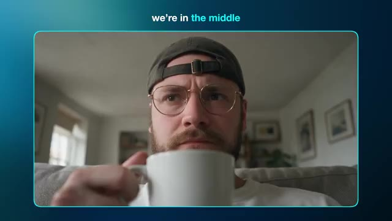

---

### ⏱️ `[00:00:19 - 00:00:38]` | Segment #02

**🔊 Audio (Transcription Intégrale Mot pour Mot en Français) :**
> Avec ça, vous pouvez créer toute une marque pour n'importe quelle entreprise imaginable sans vous ruiner tout en gardant un contrôle créatif total. Et c'est exactement ce que nous allons voir aujourd'hui. Je vais vous transmettre toutes mes connaissances pour vous mettre aux commandes. Et nous examinerons les techniques de prompting ainsi que la génération d'images et de vidéos.

**👁️ Analyse Visuelle d'Écran (gemini-3.5-flash-lite) :**
**Interface & Outils** : Jack face caméra au premier plan à gauche, avec un micro noir et blanc et un fond d'étagères. À l'arrière-plan à droite, une interface de génération vidéo par IA (similaire à Luma Dream Machine ou Runway Gen-3) affichée sur un écran sombre avec un panneau de contrôle latéral et une grille de médias (images et vidéos) sur le côté droit.

**Contenu textuel & Code** : Sur l'interface à l'écran : le menu "Text to Video" est sélectionné. Le modèle utilisé est "Seedance 2.5". Un champ "Add visual references" (Optionnel) est visible avec une miniature d'image et le texte "IMG_0029.png". Des options "Camera" et "Auto Polish" (activé) sont présentes. En bas, les options "Audio" (On) et un format 1:1 / 1080p sont configurés. La grille à droite montre diverses créations visuelles autour d'une marque de café fictive avec une mascotte de renard jaune sur fond bleu ("Vanguard Roast").

**Action / Démonstration** : Jack s'adresse directement au spectateur tout en parlant, face caméra, avec un mouvement de tête légèrement expressif pour illustrer ses propos sur la transmission de connaissances. L'interface d'IA en arrière-plan reste statique.

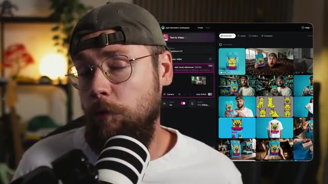

---

### ⏱️ `[00:00:39 - 00:00:58]` | Segment #03

**🔊 Audio (Transcription Intégrale Mot pour Mot en Français) :**
> Si vous avez apprécié le contenu d'aujourd'hui, assurez-vous de lâcher un pouce bleu pour moi et pensez à vous abonner. Bon, passons aux choses sérieuses. Pour ceux qui pourraient être nouveaux, je suis Jack et j'ai un parcours dans la publicité. Je suis artiste d'effets visuels depuis plus de 10 ans maintenant, ayant travaillé pour des marques mondiales comme BMW, Adidas et Google.

**👁️ Analyse Visuelle d'Écran (gemini-3.5-flash-lite) :**
**Interface & Outils** : Jack face caméra (plan rapproché poitrine, assis dans son studio). Un microphone de studio à large diaphragme est positionné au premier plan, légèrement flou. En arrière-plan, on aperçoit une étagère en bois garnie de plantes et d'objets décoratifs, une lampe d'appoint chaude, un canapé sombre avec un coussin orange et un mur texturé à lattes de bois vertical.

**Contenu textuel & Code** : Aucun texte incrusté à l'écran, aucun prompt ni interface logicielle visible dans ce plan de présentation.

**Action / Démonstration** : Jack s'adresse directement au spectateur face caméra, gesticulant avec ses mains pour appuyer ses propos tout en expliquant son parcours professionnel dans les effets visuels et la publicité.

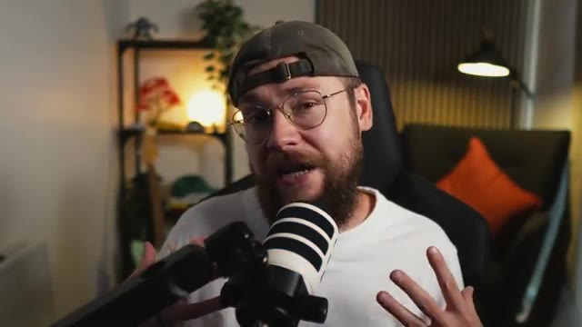

---

### ⏱️ `[00:00:58 - 00:01:20]` | Segment #04

**🔊 Audio (Transcription Intégrale Mot pour Mot en Français) :**
> La vidéo d'aujourd'hui marque la combinaison de mes connaissances issues de l'industrie publicitaire avec cette nouvelle approche incroyable propulsée par l'IA. Je mettrai un lien plus bas dans la description vers OpenArt, qui a eu la gentillesse de parrainer la vidéo d'aujourd'hui, et j'utiliserai leur plateforme pour accéder à ces outils d'IA. Pour ce projet, je vais créer une marque pour ma propre spécialité, les grains de café.

**👁️ Analyse Visuelle d'Écran (gemini-3.5-flash-lite) :**
**Interface & Outils** : Interface web de la plateforme OpenArt affichée à l'écran, avec un arrière-plan sombre légèrement flouté présentant une grille de créations artistiques. En incrustation (picture-in-picture) dans le coin inférieur droit, une petite fenêtre montre Jack face caméra, coiffé d'une casquette et portant des lunettes, parlant devant un micro de studio.

**Contenu textuel & Code** : Au centre de l'écran, le logo officiel de la plateforme « OpenArt » s'affiche en blanc, accompagné de la mention en rose « link in the description » juste en dessous. Aucun paramètre technique, prompt ou menu détaillé n'est visible sur cette vue d'écran d'introduction de sponsor.

**Action / Démonstration** : L'écran présente un titre d'introduction fixe mettant en avant le sponsor de la vidéo (« OpenArt ») tout en superposant la vue webcam de Jack dans le coin inférieur droit, qui s'exprime et gesticule légèrement en parlant à son audience.

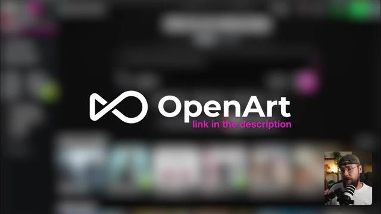

---

### ⏱️ `[00:01:20 - 00:01:57]` | Segment #05

**🔊 Audio (Transcription Intégrale Mot pour Mot en Français) :**
> Le problème, c'est que c'est un marché incroyablement saturé, alors comment allons-nous nous démarquer ? Eh bien, j'ai décidé de m'inspirer d'une autre marque qui a marqué les esprits dans un domaine extrêmement concurrentiel, il s'agit de l'eau en bouteille, ou dans ce cas-ci, en canette. Liquid Death est une véritable leçon magistrale sur la façon de subvertir les attentes du consommateur. Le branding est délibérément perturbateur parce qu'il regroupe toutes les choses qu'on n'associe pas à l'eau en un seul produit. Et je vais appliquer cette même logique à ma marque de café. La première étape pour moi consiste toujours à chercher l'inspiration et je

**👁️ Analyse Visuelle d'Écran (gemini-3.5-flash-lite) :**
**Interface & Outils** : Plan rapproché (medium close-up) de Jack face caméra, assis dans son studio personnel devant un micro de type podcast blanc et noir, portant une casquette verte à l'envers, des lunettes et un t-shirt blanc. En arrière-plan, on aperçoit une étagère en bois garnie d'objets de décoration, une plante verte, un fauteuil sombre avec un coussin orange et un éclairage d'ambiance chaleureux. Aucune interface logicielle n'est affichée à l'écran.

**Contenu textuel & Code** : Aucun texte à l'écran, aucun prompt ni paramètre technique visible dans ce segment, car il s'agit d'une séquence de type "talking head" où le présentateur s'adresse directement aux spectateurs.

**Action / Démonstration** : Jack est filmé en plan fixe face caméra, parlant tout en gesticulant des mains pour illustrer ses propos, exprimant sa réflexion sur la stratégie marketing de sa marque de café.

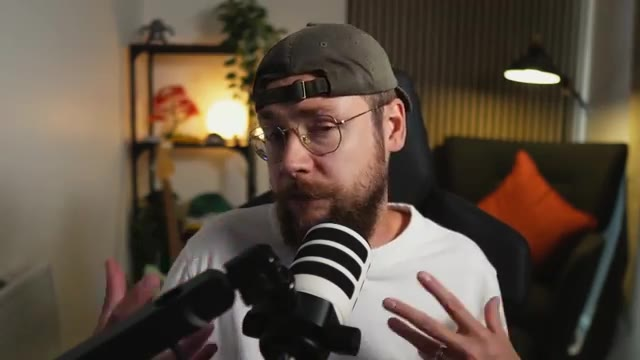

---

### ⏱️ `[00:01:57 - 00:02:33]` | Segment #06

**🔊 Audio (Transcription Intégrale Mot pour Mot en Français) :**
> je vous recommande d'aller jeter un œil à une plateforme comme Pinterest pour cela. Je savais dès le début que je voulais un personnage représentant mes grains de café parce que je pense que c'est un excellent moyen de donner plus de personnalité à votre produit. Je veux que le personnage soit inattendu et ait ce genre de qualité de vaurien attachant parce que cela englobe joliment toute cette approche disruptive. Donc nous pouvons chercher quelque chose comme des animaux de marque, par exemple, et tout ce qui me plaît ici, je vais aller le télécharger. Après un certain temps, j'ai assemblé tout ce dossier, qui contient une tonne de

**👁️ Analyse Visuelle d'Écran (gemini-3.5-flash-lite) :**
**Interface & Outils** : Écran de présentation aux tons bleus dégradés comportant une incrustation vidéo (PiP) en bas à droite montrant Jack face caméra, avec un microphone et un casque audio.

**Contenu textuel & Code** : Texte affiché à l'écran sous le titre "Character Brief" : "Unexpected can't feel like something obvious or boring" et "'Loveable rogue' fits with disruptive marketing approach".

**Action / Démonstration** : Présentation de diapositives de brief créatif sur fond bleu, tandis que Jack s'exprime en incrustation vidéo.

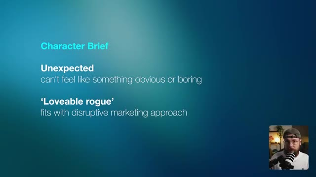

---

### ⏱️ `[00:02:33 - 00:02:52]` | Segment #07

**🔊 Audio (Transcription Intégrale Mot pour Mot en Français) :**
> différents exemples qui correspondent à l'ambiance que je souhaite obtenir, mais qui sont tout aussi uniques dans leurs propres styles. Sur ce, je vais passer sur Claude et démarrer une nouvelle conversation. Vous n'êtes pas obligé d'utiliser Claude. Vous pouvez utiliser ChatGPT, Grok ou Gemini si vous préférez. Le processus va être le même.

**👁️ Analyse Visuelle d'Écran (gemini-3.5-flash-lite) :**
**Interface & Outils** : L'écran affiche l'interface web de l'assistant IA Claude sur fond sombre, avec dans le coin inférieur droit une incrustation vidéo (PiP) montrant Jack dans son studio face caméra, portant une casquette à l'envers et un t-shirt blanc, penché et s'exprimant devant son microphone.

**Contenu textuel & Code** : Au centre de l'écran principal, on peut lire un message d'accueil : « Good evening, Jack » (Bonsoir, Jack), accompagné d'une icône en forme d'étoile stylisée. Au-dessous se trouve une boîte de saisie de texte avec le texte indicatif « How can I help you today? » (Comment puis-je vous aider aujourd'hui ?), intégrant divers boutons de contrôle dont un bouton « + », les modes « Chat » et « Cowork », l'indication de modèle « Opus 4.8 Medium », ainsi qu'une icône de microphone.

**Action / Démonstration** : Jack navigue vers l'interface de l'assistant Claude pour y démarrer une nouvelle conversation interactive, préparant l'étape suivante de son processus de création assistée par IA.

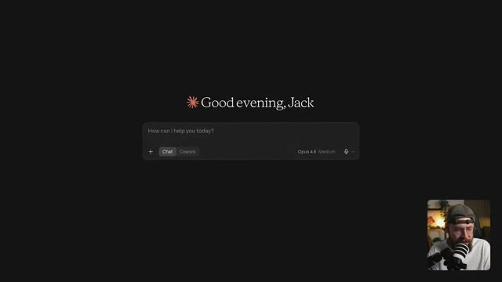

---

### ⏱️ `[00:02:52 - 00:03:13]` | Segment #08

**🔊 Audio (Transcription Intégrale Mot pour Mot en Français) :**
> Je vais télécharger l'une de mes images de référence et je vais dire à Claude, j'aimerais que tu m'aides à écrire un prompt de style pour obtenir ce style d'illustration. Concentre-toi sur le style global de l'illustration plutôt que sur le personnage lui-même. Et Claude va analyser l'image et m'écrire un prompt de style.

**👁️ Analyse Visuelle d'Écran (gemini-3.5-flash-lite) :**
**Interface & Outils** : Interface web de Claude par Anthropic affichée en plein écran avec un thème sombre, et une fenêtre incrustée en bas à droite montrant Jack face caméra face à son micro.

**Contenu textuel & Code** : Texte d'accueil « Good evening, Jack » au centre supérieur. Dans la boîte de dialogue centrale, une image de référence représentant un personnage animalier stylisé (un corbeau/oiseau en uniforme) est importée. Le texte partiel tapé dans le prompt indique : « I'd like you to help me write a style prompt to achieve this style of il ». Les boutons de sélection affichent « Chat », « Cowork », « Opus 4.8 Medium » et une icône de flèche de validation orange.

**Action / Démonstration** : Jack est en train de rédiger et de soumettre son prompt textuel dans l'interface de Claude, après y avoir joint une image de référence pour obtenir une analyse de style artistique.

---

### ⏱️ `[00:03:13 - 00:03:33]` | Segment #09

**🔊 Audio (Transcription Intégrale Mot pour Mot en Français) :**
> Maintenant, je vais aller sur OpenArt et, sur la page d'accueil, sélectionner l'onglet image. Dans le sélecteur de modèle, vous verrez que nous avons accès à tous les meilleurs générateurs d'images par IA du marché. Pour commencer, je vais choisir C-Dream 5.0 Pro car, au moment de l'enregistrement, c'est mon modèle d'image par IA préféré.

**👁️ Analyse Visuelle d'Écran (gemini-3.5-flash-lite) :**
**Interface & Outils** : Interface de la plateforme web OpenArt Pro sombre divisée en plusieurs panneaux verticaux : à gauche le menu de navigation principal (Brand Building, Home, Chat Mode, Director Mode, Video, Image, World, Character, Audio, MCP / CLI, Director Projects, Character & World, Brand kit, Media, Templates, Arena, Tutorials, Blog), au centre le panneau de configuration de création d'image (Create Image, modèle actif GPT Image 2.5, section "Describe your image", "Add visual references", "Auto Polish", sélecteur de mode "Sunburst", format "16:9 - 2k", qualité "Medium", bouton rose "Generate ⚡ 45"), à droite la fenêtre modale de sélection des modèles ("Models") affichant des suggestions recommandées ("Which model performs best", "GPT Image 2.5", "GPT Image 2") et une liste complète de modèles ("All models" : Drok Imagine, Seedream 5.0 Lite, Seedream 4.5, Kling 3.0 Omni, Nano Banana, Seedream 4.0, Qwen Image 3.0, Qwen Image 2, Kling O1). En bas à droite, incrustation vidéo montrant le présentateur Jack avec une casquette et un micro de studio.

**Contenu textuel & Code** : Texte des modèles et des options visibles dans la liste : "Select Multiple (Up to 4)", "Recommended", "All models", "All providers", "All features", "Search", "Drok Imagine - JAX's AURA-powered image model", "Seedream 5.0 Lite - Bytedance's lightweight 5.0 image model (2K/4K)", "Seedream 4.5 - Bytedance's advanced image model", "Kling 3.0 Omni - Kling's advanced image model", "Nano Banana - Google's standard image model", "Seedream 4.0 - Bytedance's standard image model", "Qwen Image 3.0 - Alibaba image generation with Standard and Pro scales", "Qwen Image 2 - Enhanced realism and improved text rendering", "Kling O1 - Multi reference & visual input mode".

**Action / Démonstration** : Le curseur de la souris (représenté par une flèche blanche) survole et parcourt la liste des différents modèles d'IA disponibles dans le menu modale de sélection "Models" sur la plateforme OpenArt.

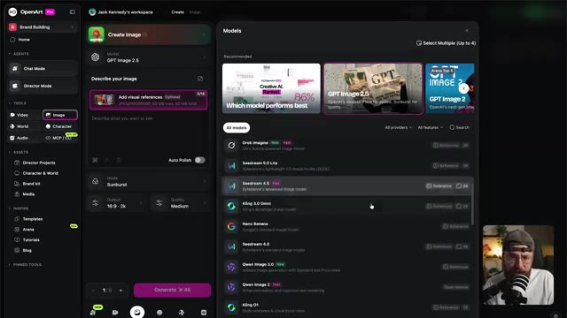

---

### ⏱️ `[00:03:33 - 00:03:53]` | Segment #10

**🔊 Audio (Transcription Intégrale Mot pour Mot en Français) :**
> Et pour mon prompt, je vais faire vraiment simple. Je vais taper sujet et dire un raton laveur. Et ensuite je vais taper style. Je retourne sur Claude, je copie mon prompt de style et je le colle dans OpenArt. Je vais générer deux images pour avoir un point de comparaison.

**👁️ Analyse Visuelle d'Écran (gemini-3.5-flash-lite) :**
**Interface & Outils** : Capture d'écran de l'interface du chatbot Claude (Anthropic) sur un navigateur web en mode sombre, avec une incrustation vidéo en bas à droite montrant Jack face caméra avec son micro et sa casquette.

**Contenu textuel & Code** : On peut lire en haut le prompt utilisateur : « I'd like you to help me write a style prompt to achieve this style of illustration, focus on the overall illustration style, rather than the character itself ». Le corps du texte généré par Claude détaille le module de style portable avec un bloc de texte en anglais décrivant les caractéristiques graphiques (Hand-inked editorial illustration, bold, energetic linework...) avec un bouton « Copy » visible au survol.

**Action / Démonstration** : Jack consulte le texte généré par Claude dans le navigateur web et s'apprête à copier le prompt de style dans son presse-papiers pour l'utiliser ensuite sur une autre plateforme de génération d'images.

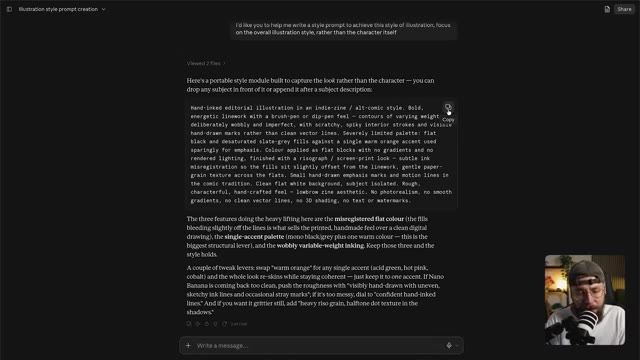

---

### ⏱️ `[00:03:54 - 00:04:19]` | Segment #11

**🔊 Audio (Transcription Intégrale Mot pour Mot en Français) :**
> Et je peux lancer la génération. Ok, celles-ci sont plutôt cool. J'adore le style style fait à la main, mais je ne suis pas sûr qu'elles soient assez disruptives. Je ne sais pas si ça va ressortir autant que je le veux sur un fil d'actualité de réseau social, par exemple. Donc ce que je vais faire, c'est retourner sur Claude, charger une de mes autres références et lui demander de créer un prompt de style pour celle-ci également.

**👁️ Analyse Visuelle d'Écran (gemini-3.5-flash-lite) :**
**Interface & Outils** : Plan rapproché de Jack (face caméra) dans son studio, assis devant un micro, avec un décor intérieur flou en arrière-plan comprenant des étagères et un éclairage d'ambiance.

**Contenu textuel & Code** : Aucun texte ou paramètre technique affiché à l'écran, plans parlés de Jack illustrant sa démarche créative.

**Action / Démonstration** : Jack s'exprime face caméra en gesticulant légèrement pour expliquer sa réflexion critique sur le style généré et sa décision de modifier son approche via l'assistant Claude.

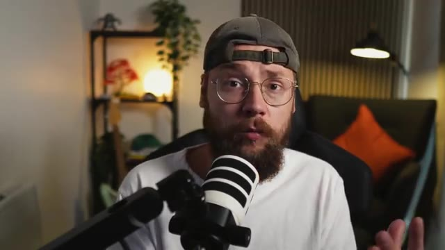

---

### ⏱️ `[00:04:19 - 00:04:38]` | Segment #12

**🔊 Audio (Transcription Intégrale Mot pour Mot en Français) :**
> Nous pouvons copier ceci et le coller dans OpenArt et cliquer à nouveau sur générer. Et essentiellement, je vais répéter cette méthode en boucle jusqu'à ce que je tombe sur quelque chose que j'aime vraiment. Comme vous pouvez le voir, j'ai accumulé une tonne d'options différentes, dont certaines me plaisent et d'autres qui sont un peu fades et basiques.

**👁️ Analyse Visuelle d'Écran (gemini-3.5-flash-lite) :**
**Interface & Outils** : Jack face caméra, dans son studio personnel. Il porte un t-shirt blanc, une casquette portée à l'envers et des lunettes de vue. Un microphone de studio à large membrane est positionné au premier plan, devant lui.

**Contenu textuel & Code** : L'arrière-plan montre une étagère garnie d'objets de décoration, de plantes et de lumières d'ambiance tamisées, ainsi qu'un canapé sombre avec un coussin orange vif et un panneau mural acoustique cannelé à droite.

**Action / Démonstration** : Jack s'adresse directement aux spectateurs en face caméra, tout en parlant et en gesticulant légèrement pour expliquer sa méthode itérative de génération d'images sur OpenArt.

---

### ⏱️ `[00:04:38 - 00:05:11]` | Segment #13

**🔊 Audio (Transcription Intégrale Mot pour Mot en Français) :**
> Pour moi, pourtant, ce genre de raton laveur vorace attire vraiment mon attention. Mais disons que nous voulons un personnage différent dans le même style. Ce que je peux faire, c'est ouvrir cette génération et cliquer sur l'icône de recréation d'image. Cela va importer notre prompt et je vais juste y apporter une légère modification en changeant l'animal du raton laveur au renard. Nous avons beaucoup de renards ici au Royaume-Uni et ils se situent définitivement à la frontière entre de sales nuisibles et quelque chose de bizarrement mignon d'une certaine

**👁️ Analyse Visuelle d'Écran (gemini-3.5-flash-lite) :**
**Interface & Outils** : Jack face caméra dans son studio, assis devant un micro de podcast monté sur un bras articulé, avec une étagère garnie de plantes et d'objets décoratifs en arrière-plan, ainsi qu'un canapé avec un coussin orange.

**Contenu textuel & Code** : Aucun texte, prompt ou paramètre technique textuel n'est affiché à l'écran.

**Action / Démonstration** : Jack s'exprime face caméra en parlant de sa sélection d'images et de la modification du prompt pour remplacer le raton laveur par un renard, tout en bougeant légèrement les mains et en regardant en direction de l'objectif.

---

### ⏱️ `[00:05:11 - 00:05:34]` | Segment #14

**🔊 Audio (Transcription Intégrale Mot pour Mot en Français) :**
> et c'est pourquoi je veux voir à quoi l'un d'eux ressemblerait dans ce style d'illustration. D'accord, je pense que le résultat est plutôt superbe. J'ai également utilisé ce prompt légèrement modifié pour ajouter le nom de ma marque, j'ai mentionné ce mot « vermin » plus tôt et ça me paraît tout simplement parfait. Voir cette œuvre d'art sur un sac de grains de café va être très différent de ce à quoi vous pourriez vous attendre.

**👁️ Analyse Visuelle d'Écran (gemini-3.5-flash-lite) :**
**Interface & Outils** : Interface web d'un générateur d'images/vidéos par IA (type Seedance / plateforme propriétaire) avec une fenêtre modale affichant l'image générée en grand format à gauche, et le panneau latéral de configuration et de prompt à droite. En bas à droite, incrustation vidéo miniature de Jack face caméra.

**Contenu textuel & Code** : Texte affiché dans le prompt : "SUBJECT: A logo that reads "VERMIN COFFEE" the word "VERMIN" is at the top "COFFEE" is underneath. STYLE: Bold, high-energy lowbrow cartoon illustration in a graffiti / skate-art style. Thick, confident black outlines with a slight kinetic roughness and punchy line-weight..." Paramètres techniques visibles sous "SETTINGS" : "Byte Plus Seedream 5.0 Pro", ratio "1:1", résolution "2K". Options disponibles : "Check IP Safety", "Upscale", "Frame to video", "Expand image", "Video Reference", "Image Reference", "Create variations", "Change camera angle". Boutons d'action : "Recreate" et "Use in Chat". Image principale : illustration style cartoon "lowbrow" / skate-art d'un animal agressif et hystérique avec des éclaboussures roses sur fond bleu cyan, avec le texte "VERMIN COFFEE".

**Action / Démonstration** : L'image finale générée est affichée en plein écran dans la visionneuse avec ses paramètres et son prompt associés visibles sur le panneau latéral droit, tandis que le créateur (Jack) commente le résultat visuel en incrustation vidéo en bas à droite.

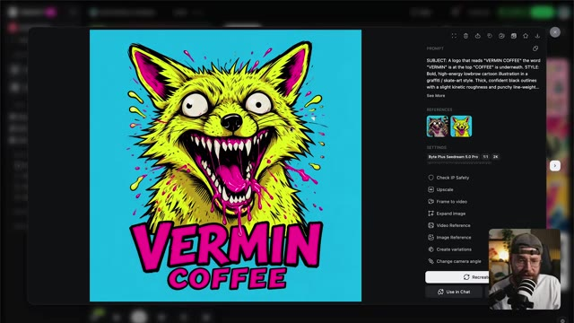

---

### ⏱️ `[00:05:34 - 00:05:54]` | Segment #15

**🔊 Audio (Transcription Intégrale Mot pour Mot en Français) :**
> Et c'est exactement ce que nous cherchons à faire. Le truc avec l'IA, c'est qu'on n'a pas besoin d'imaginer, on peut construire ça pour de vrai. Je vais donc glisser cette image et la déposer dans le champ du prompt. Et cela signifie que nous allons l'utiliser comme référence. Et ensuite, je vais utiliser ce prompt très simple pour placer l'illustration artistique sur un sachet de café.

**👁️ Analyse Visuelle d'Écran (gemini-3.5-flash-lite) :**
**Interface & Outils** : Interface web de la plateforme OpenArt Pro (« Jack Kennedy's workspace », panneau de création d'image « Create Image » avec sélection du modèle « Seedream 5.0 Pro », champ de prompt avec zone « Add visual references » permettant d'ajouter des références visuelles, sélecteur de format de sortie « 1:1 | 2K », bouton « Generate » à 60 crédits, menu latéral gauche avec « Brand Building », « Chat Mode », « Director Mode », outils « Video », « Image », « World », « Character », « Audio », « MCP / CLI », et dans le coin inférieur droit, la webcam incrustée montrant Jack face caméra avec son micro).

**Contenu textuel & Code** : Modèle affiché : Seedream 5.0 Pro. Zone de glisser-déposer de référence visuelle « Add visual references (Optional) » (indiquant les formats pris en charge : JPEG/PNG/WEBP, 30 MB max, 38MP max, etc.). Texte indicatif dans le champ de prompt : « What do you want to see? Example: "A cat sitting on a table, warm morning light..." ». Bouton d'optimisation automatique « Auto Polish » (désactivé). Paramètres de sortie : « 1:1 | 2K ». Bouton violet « Generate 60 ». Grille principale affichant de nombreuses illustrations colorées de style pop art et cartoon (renards, ratons laveurs, personnages stylisés aux couleurs vives rose, bleu, jaune).

**Action / Démonstration** : Jack fait glisser une image (représentant un raton laveur stylisé sur fond jaune) depuis la galerie située à droite et la dépose dans le champ de référence visuelle (« Add visual references ») de l'interface OpenArt Pro.

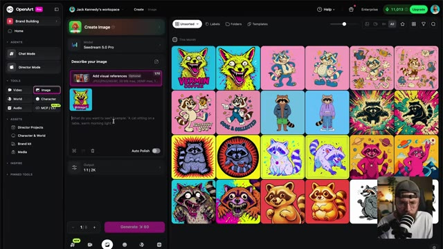

---

### ⏱️ `[00:05:55 - 00:06:16]` | Segment #16

**🔊 Audio (Transcription Intégrale Mot pour Mot en Français) :**
> Et regardez simplement le travail formidable que C-Dream a accompli en appliquant notre illustration. Avant l'IA, il aurait fallu passer par Photoshop pour obtenir quelque chose d'approchant. Nous avons obtenu ce résultat en quelques minutes, rien qu'en rédigeant un prompt. Et même si vous détestez ce style, vous ne pouvez pas me dire que vous ne seriez pas un tout petit peu curieux à propos du produit, n'est-ce pas ?

**👁️ Analyse Visuelle d'Écran (gemini-3.5-flash-lite) :**
**Interface & Outils** : Interface sombre d'une application ou d'un site web de génération d'images par IA, affichant une grande image centrale dans une fenêtre modale, un panneau de configuration des paramètres à droite, et un encart vidéo incrusté en bas à droite montrant Jack face caméra avec son micro.

**Contenu textuel & Code** : Texte du prompt : « Place this artwork onto a photo real coffee bean bag in a semi-profile orientation. Ensure the coffee bean pack colour matches the background colour of the reference image. Ensure the product is against a simple grey seamless background. » Dans la section "REFERENCES", une vignette carrée montre le dessin original d'un monstre canin jaune et rose. Paramètres visibles : modèle « BytePlus Seedream 5.0 Pro », format « 1:1 », résolution « 2K », date de création « 9/14/2026 14:19:29 ». Options : « Check IP Safety », « Upscale », « Frame to video », « Expand image », « Video Reference », « Image Reference », « Create variations », « Change camera angle ». Boutons en bas : « Recreate » et « Use in Chat ».

**Action / Démonstration** : L'écran présente le résultat généré montrant un sachet de café bleu turquoise floqué avec l'illustration du monstre, tandis que dans l'encart en bas à droite, Jack parle devant sa caméra.

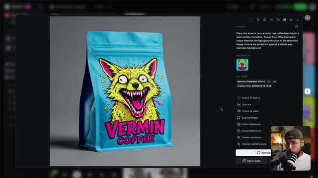

---

### ⏱️ `[00:06:16 - 00:06:39]` | Segment #17

**🔊 Audio (Transcription Intégrale Mot pour Mot en Français) :**
> Cette curiosité est exactement ce qui incite les consommateurs à essayer un nouveau produit. Et j'ai parlé un peu plus tôt de créer bien plus que le simple produit et de bâtir en fait tout un écosystème. Et nous pouvons commencer à nous en faire une idée maintenant. Je vais juste apporter une légère modification à notre invite ici en remplaçant sachet de grains de café par casquette de baseball.

**👁️ Analyse Visuelle d'Écran (gemini-3.5-flash-lite) :**
**Interface & Outils** : Jack face caméra dans son studio, avec un microphone monté sur bras articulé au premier plan.

**Contenu textuel & Code** : Aucun texte ou paramètre technique visible à l'écran.

**Action / Démonstration** : Jack s'exprime face caméra en gesticulant des mains pour illustrer son propos.

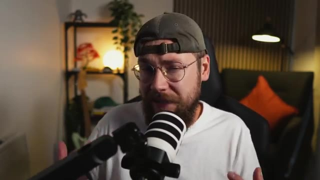

---

### ⏱️ `[00:06:39 - 00:06:58]` | Segment #18

**🔊 Audio (Transcription Intégrale Mot pour Mot en Français) :**
> Tout simplement, nous pouvons cliquer sur générer. Et maintenant, C-Dream a appliqué notre image de marque à un produit différent et les possibilités sont vraiment infinies avec cette approche. J'ai passé un peu plus de temps et j'ai créé tout un tas d'autres ressources en utilisant notre image de marque comme référence visuelle.

**👁️ Analyse Visuelle d'Écran (gemini-3.5-flash-lite) :**
**Interface & Outils** : Jack face caméra, dans son studio personnel, enregistré à hauteur de buste avec un micro de podcast professionnel disposé au premier plan.

**Contenu textuel & Code** : Décor de studio avec étagères en bois, plantes vertes, éclairages d'ambiance chaleureux et un canapé avec des coussins orange en arrière-plan.

**Action / Démonstration** : Jack s'adresse directement aux spectateurs en gesticulant des mains pour illustrer ses propos, dans un plan moyen fixe.

---

### ⏱️ `[00:06:58 - 00:07:31]` | Segment #19

**🔊 Audio (Transcription Intégrale Mot pour Mot en Français) :**
> Nous avons ce beau plan d'un café si je devais ouvrir une chaîne. Une variété de produits que la marque pourrait proposer à ses consommateurs. et j'ai inventé cette image ici pour montrer ce que ce serait si nous proposions un service de livraison à domicile. Et bien sûr, un peu plus de produits dérivés. Pour moi, si une marque a l'air cool sur un t-shirt, c'est que vous faites probablement quelque chose de bien. Maintenant, vous pourriez vous arrêter là parce que nous avons déjà une tonne d'actifs d'images fixes qui pourraient être utilisés pour des panneaux d'affichage, de l'impression et des médias sociaux. Mais nous pourrions

**👁️ Analyse Visuelle d'Écran (gemini-3.5-flash-lite) :**
**Interface & Outils** : Une interface logicielle de génération d'images par IA s'affiche au premier plan, avec un panneau latéral à droite comprenant des champs de prompt, des paramètres (Byte Plus Seedream 5.0 Pro, 16:9, 2K) et divers outils d'édition (Upscale, Frame to video, Expand image, etc.). En bas à droite, une incrustation vidéo montre Jack face caméra avec son micro et sa casquette.

**Contenu textuel & Code** : Le prompt visible dans l'interface indique : "Product photography of an oversized white t-shirt shown from the back, worn by a male model cropped to show the torso and the shirt (head partially visible, waist and jeans at the bottom), standing against a solid bold cyan process-blue background, even soft studio..." L'image générée montre un mannequin de dos portant un t-shirt blanc surdimensionné imprimé avec un monstre/animal jaune féroce et le texte "VERMIN COFFEE".

**Action / Démonstration** : Le curseur de la souris (représenté par une flèche blanche) se déplace dans le panneau de droite de l'interface, planant au-dessus des options, tandis que l'image principale présente le t-shirt généré par l'IA.

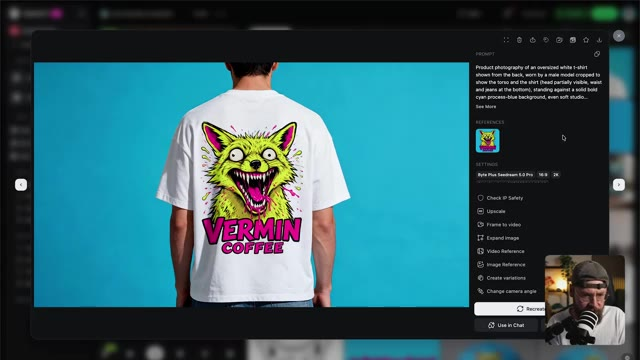

---

### ⏱️ `[00:07:31 - 00:08:09]` | Segment #20

**🔊 Audio (Transcription Intégrale Mot pour Mot en Français) :**
> d'aller aussi un peu plus loin en animant ces images pour leur donner vie. Avant de nous pencher sur notre génération de vidéos, je peux tout à fait comprendre que ces outils d'IA puissent paraître un peu déroutants, car il y a tellement de choix disponibles. Mais OpenArt a en fait conçu cette toute nouvelle plateforme appelée Arena, où vous obtenez une comparaison directe entre les outils proposés. En gros, des experts de premier plan ont comparé une tonne de résultats différents provenant d'outils d'IA, puis ont voté pour ceux qu'ils préféraient, et toutes ces données ont été regroupées pour construire la plateforme. Les résultats sont divisés

**👁️ Analyse Visuelle d'Écran (gemini-3.5-flash-lite) :**
**Interface & Outils** : Navigateur web affichant la plateforme "OpenArt Arena" avec un design épuré sur fond blanc. En bas à droite, incrustation vidéo (PiP) de Jack face caméra, portant une casquette et un t-shirt blanc, avec un micro professionnel visible.

**Contenu textuel & Code** : En haut à gauche, le logo et le nom "OpenArt Arena", suivis des onglets de navigation "Home", "Vision", et "Leaderboards". Au centre de l'écran, le titre principal s'affiche en gros caractères : "The global leaderboard". Un curseur de souris est visible au milieu de la page.

**Action / Démonstration** : Le navigateur présente la page d'accueil de la plateforme OpenArt Arena mettant en avant le classement mondial ("The global leaderboard"), tandis que Jack commente et explique le fonctionnement de l'outil depuis l'encadré vidéo en bas à droite.

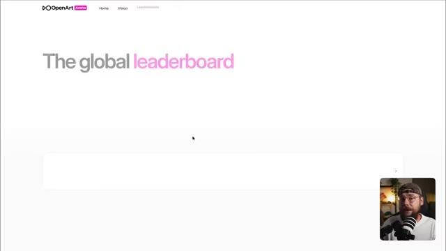

---

### ⏱️ `[00:08:09 - 00:08:47]` | Segment #21

**🔊 Audio (Transcription Intégrale Mot pour Mot en Français) :**
> dans différentes catégories. Donc nous avons la publicité, le cinéma, l'animation, le motion design, et la liste continue. Je pense que cela va être incroyablement utile pour les créateurs d'IA, surtout si vous débutez un peu avec ces outils. Maintenant, passons à la création de quelques ressources animées pour notre marque. Sur Claude, j'ai téléchargé une compétence personnalisée ainsi que l'image de notre produit et une feuille de référence de personnage pour notre renard illustré. J'ai rédigé cette description d'une idée que j'ai pour un contenu social que nous pouvons utiliser sur une plateforme comme TikTok ou Instagram. Je veux que le renard saute

**👁️ Analyse Visuelle d'Écran (gemini-3.5-flash-lite) :**
**Interface & Outils** : Jack face caméra, filmé de près dans son studio, assis dans un fauteuil noir avec un t-shirt blanc, une casquette verte portée à l'envers et des lunettes rondes, s'exprimant directement devant un microphone noir et blanc monté sur un bras articulé. En arrière-plan, on aperçoit une étagère en bois garnie d'objets décoratifs, d'une plante verte retombante, d'une lampe ronde allumée, ainsi qu'un canapé sombre agrémenté d'un coussin orange. L'éclairage général est chaleureux et tamisé, avec une lampe sur pied inclinée sur la droite.

**Contenu textuel & Code** : Aucun texte, prompt de génération ni paramètre technique visible à l'écran.

**Action / Démonstration** : Jack s'adresse directement au spectateur en parlant face caméra, effectuant de légers mouvements de la tête et des mains pour appuyer ses explications.

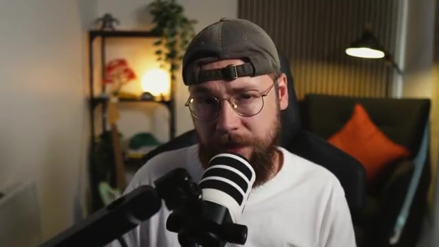

---

### ⏱️ `[00:08:47 - 00:09:23]` | Segment #22

**🔊 Audio (Transcription Intégrale Mot pour Mot en Français) :**
> hors du sac de grains de café, donne un coup de balayage sur l'écran et provoque sa fissure. L'idée étant que si quelqu'un fait défiler les réseaux sociaux et qu'il semble y avoir une fissure sur l'écran de son téléphone, cela va le forcer à s'arrêter et à prêter attention. Encore une fois, nous nous appuyons sur cette idée de marketing perturbateur. Claude va se mettre au travail et nous élaborer un prompt en utilisant la compétence personnalisée que j'ai téléchargée comme cadre, et cette compétence sera disponible entièrement gratuitement sur ma communauté School également. De retour sur OpenArt, je vais basculer sur l'onglet vidéo et vous verrez que

**👁️ Analyse Visuelle d'Écran (gemini-3.5-flash-lite) :**
**Interface & Outils** : Jack face caméra, dans son studio, avec un micro professionnel visible au premier plan, une étagère éclairée en arrière-plan et une lampe de bureau.

**Contenu textuel & Code** : Aucun texte ou paramètre technique affiché à l'écran dans ce plan.

**Action / Démonstration** : Jack s'adresse directement à son audience, gesticulant légèrement de la main gauche pour illustrer son propos sur le concept de marketing perturbateur.

---

### ⏱️ `[00:09:23 - 00:09:49]` | Segment #23

**🔊 Audio (Transcription Intégrale Mot pour Mot en Français) :**
> pour le modèle, j'ai sélectionné C-Dance 2.5. Maintenant, je vais faire glisser mon image de produit et notre feuille de référence de personnage pour donner plus de contexte à l'IA. Je peux ensuite retourner sur Claude, copier le prompt et le déposer dans OpenArt. Je vais passer à un ratio d'aspect 1 par 1, une résolution de 1080p, et nous voulons une durée de 15 secondes.

**👁️ Analyse Visuelle d'Écran (gemini-3.5-flash-lite) :**
**Interface & Outils** : Capture d'écran montrant principalement l'interface de l'assistant IA Claude (affichant un prompt textuel structuré par séquences temporelles pour la création d'une vidéo avec un renard), avec un encart vidéo incrusté en bas à droite montrant Jack face caméra, portant une casquette et un t-shirt clair, devant son microphone.

**Contenu textuel & Code** : Le texte principal visible dans l'interface Claude est un prompt vidéo chronologique divisé en segments de 00:00 à 00:15 détaillant les plans de caméra (Medium shot, close-up), les optiques (50mm, 35mm), les mouvements (slow push-in, tilting low), et l'action d'un paquet de café Vermin Coffee et d'un personnage de renard dans un style pop-art. En haut à gauche, le titre du projet est "Fox character video prompt creation". En bas, la boîte de saisie affiche "Write a message...".

**Action / Démonstration** : L'écran affiche le prompt détaillé rédigé sur l'interface de Claude, tandis que le spectateur entend Jack expliquer les prochaines étapes de son workflow (sélection du modèle C-Dance 2.5, ajout d'images de référence, et configuration des paramètres dans OpenArt).

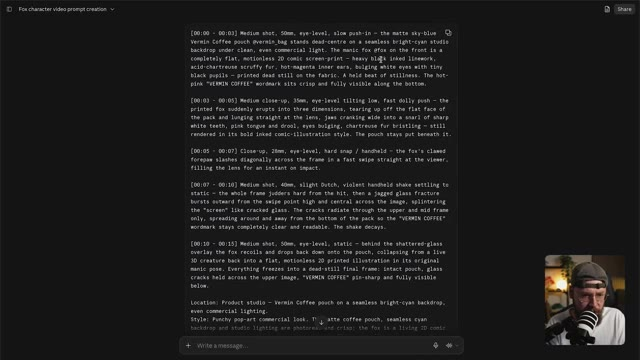

---

### ⏱️ `[00:09:49 - 00:10:08]` | Segment #24

**🔊 Audio (Transcription Intégrale Mot pour Mot en Français) :**
> Sur ce, allons-y, lançons la génération et jetons un coup d'œil aux résultats. Super, je peux tout à fait voir ce genre de contenu bien fonctionner sur les réseaux sociaux. Et le point clé à retenir, c'est que vous pouvez construire quelque chose comme ça entièrement par vous-même.

**👁️ Analyse Visuelle d'Écran (gemini-3.5-flash-lite) :**
**Interface & Outils** : Plan rapproché (medium close-up) de Jack face caméra dans son studio de création, assis sur un fauteuil de bureau ergonomique noir. L'arrière-plan montre une étagère en métal garnie d'objets décoratifs, de plantes vertes et d'une source lumineuse ronde chaleureuse, ainsi qu'un canapé sombre agrémenté d'un coussin orange vif et d'un lampadaire sur pied orientable. Un micro professionnel à bras articulé est positionné au premier plan, devant lui.

**Contenu textuel & Code** : Aucun texte textuel ou paramètre d'interface numérique affiché à l'écran dans ce plan, uniquement le décor du studio et le présentateur.

**Action / Démonstration** : Jack est filmé de face en train de s'adresser directement aux spectateurs, parlant de manière animée avec des expressions faciales dynamiques pour conclure sa démonstration sur la création de vidéos par IA.

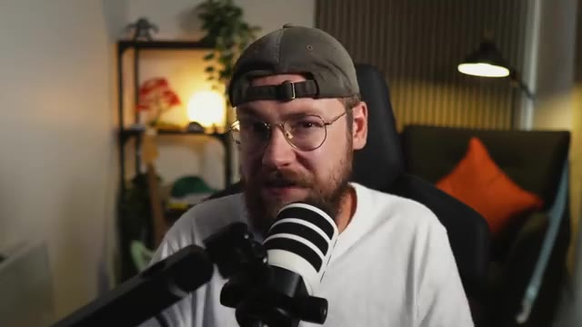

---

### ⏱️ `[00:10:08 - 00:10:37]` | Segment #25

**🔊 Audio (Transcription Intégrale Mot pour Mot en Français) :**
> Si vous possédez une petite entreprise ou si vous y travaillez, vous n'avez plus besoin d'externaliser votre processus créatif. Tout ce que vous avez à faire, c'est de vous familiariser avec ces outils et vous pouvez vraiment donner vie à n'importe quelle idée. Passons maintenant à quelque chose d'un peu plus complexe, cependant. J'ai commencé une nouvelle discussion sur Claude et j'y ai téléchargé cette même compétence personnalisée, puis quelques images générées qui véhiculent ce genre de moments clés que je veux voir se dérouler dans ma vidéo.

**👁️ Analyse Visuelle d'Écran (gemini-3.5-flash-lite) :**
**Interface & Outils** : Plan moyen (medium shot) de Jack face caméra dans son studio, assis devant un micro, portant une casquette, des lunettes et un t-shirt blanc. L'arrière-plan montre une étagère décorée et un canapé avec un coussin orange.

**Contenu textuel & Code** : Aucun texte, prompt ou paramètre technique visible à l'écran dans ce plan.

**Action / Démonstration** : Jack s'adresse directement au spectateur en parlant de manière animée, gesticulant des mains pour appuyer ses explications concernant l'utilisation des outils d'IA et de l'assistant Claude.

---

### ⏱️ `[00:10:37 - 00:11:11]` | Segment #26

**🔊 Audio (Transcription Intégrale Mot pour Mot en Français) :**
> Et ces deux images ont été construites en combinant des références pertinentes, notamment ces photos que j'ai de moi-même avec un prompt également rédigé par Claude. Je vais envoyer ceci pour que Claude se mette au travail et l'idée est que je suis assis, ayant l'air un peu ennuyé dans mon salon en train de boire une tasse de café assez fade, quand soudain, un énorme torrent de grains de café traverse les fenêtres. Je suis submergé, je ressors et je tiens le paquet de café Vermin. Donc, de retour sur Open Art, je vais

**👁️ Analyse Visuelle d'Écran (gemini-3.5-flash-lite) :**
**Interface & Outils** : Interface de l'assistant IA Claude dans un navigateur web avec un thème sombre, comportant un espace de discussion (chat), un champ de saisie de message en bas ("Write a message..."), un bouton de partage en haut à droite ("Share"), un titre en haut à gauche ("Coffee beans flood commercial video prompt"), un aperçu des fichiers joints sous forme de miniatures d'images avec un fichier Markdown, et dans le coin inférieur droit, un encadré vidéo (caméra de Jack en direct avec micro).

**Contenu textuel & Code** : Texte du prompt visible dans la bulle de chat de Claude : "Use the attached MD file to write a 15 second video prompt for this scene... A bearded man sits on his sofa in an average-looking living room. He is holding a plain white, cheap-looking mug and takes a swig from the mug, he kind of winces as if it's cheap tasting coffee. The scene looks grey, and he looks bored and drab. Suddenly, the room starts to shake. A close-up on the bearded man as he reacts. A low rumbling sound. The shake gets more and more erratic until suddenly a sea of coffee beans smashes through the windows, surging into the room. Before he knows it, he is in a sea of coffee beans, with only his head sticking up and out. He tenses, using all of his energy, and forces one arm up and out of the thick sea of coffee beans, and in his hand is a bag of Vermin Coffee. He looks at the bag and says, 'What the [flouté] in a neutral British accent.'" Texte sous le fichier attaché : "Seedance_2... Skill_NEW.md" et "Reading a file 5s >".

**Action / Démonstration** : Jack est en train d'utiliser l'interface de l'assistant Claude pour lui soumettre un fichier Markdown et un prompt détaillé décrivant la scène publicitaire du café, afin que l'IA génère ou affine le scénario textuel et le prompt vidéo pour son projet.

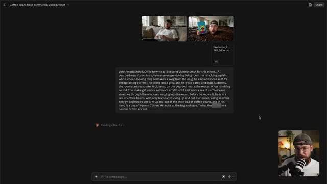

---

### ⏱️ `[00:11:11 - 00:11:37]` | Segment #27

**🔊 Audio (Transcription Intégrale Mot pour Mot en Français) :**
> faites glisser ces moments clés pour servir de référence aux côtés de cette feuille de référence de personnage de moi-même afin que l'IA sache à quoi je ressemble sous tous les angles. Nous allons retourner sur Claude, copier notre invite et la coller dans OpenArk. Ce que vous pouvez également faire, c'est étiqueter vos références. Ici, je vais étiqueter la feuille de personnage de moi-même pour que l'IA comprenne exactement comment je veux qu'elle utilise la référence.

**👁️ Analyse Visuelle d'Écran (gemini-3.5-flash-lite) :**
**Interface & Outils** : Interface sombre d'une application web (semblable à Claude ou une interface de LLM), avec un panneau textuel central affichant un prompt détaillé découpé par séquences temporelles. En bas à droite, une petite incrustation vidéo montre Jack face caméra portant une casquette et des lunettes. En haut à droite, un bouton "Share". En bas, une barre de saisie de texte "Write a message...".

**Contenu textuel & Code** : Texte affiché à l'écran comprenant un prompt de génération de vidéo publicitaire divisé par timecodes : [00:00 - 00:03] Medium shot, 50mm... ; [00:03 - 00:05] Close-up... ; [00:05 - 00:08] Wide... ; [00:08 - 00:10] Medium wide... ; [00:10 - 00:13] Medium close-up... ; [00:13 - 00:15] Close-up... ; ainsi que des sections descriptives "Location", "Style", "Character lock".

**Action / Démonstration** : Le document textuel contenant le prompt détaillé est affiché à l'écran, tandis que l'intervenant (Jack) parle à l'écran dans l'encadré en bas à droite, expliquant le processus d'utilisation des feuilles de référence et de l'intégration des prompts dans l'outil d'IA vidéo.

---

### ⏱️ `[00:11:37 - 00:12:10]` | Segment #28

**🔊 Audio (Transcription Intégrale Mot pour Mot en Français) :**
> Sur ce, nous allons changer le format d'image pour du 16 par 9 parce que je veux un rendu panoramique plus cinématographique ici. Et maintenant, nous pouvons cliquer sur générer et jeter un œil à ce que nous obtenons. C'est donc un très beau résultat ici.

**👁️ Analyse Visuelle d'Écran (gemini-3.5-flash-lite) :**
**Interface & Outils** : La vidéo montre le résultat d'une génération vidéo par IA au format 16:9 dans une fenêtre encadrée, mettant en scène un personnage masculin (Jack).

**Contenu textuel & Code** : Le plan affiche Jack de face, portant des lunettes et une casquette à l'envers, tenant une tasse blanche près de son visage dans un intérieur domestique flou (salon avec des cadres aux murs).

**Action / Démonstration** : La vidéo se lance et montre le résultat animé généré par l'IA, où le personnage lève légèrement les yeux en tenant sa tasse.

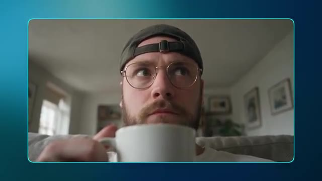

---

### ⏱️ `[00:12:10 - 00:12:43]` | Segment #29

**🔊 Audio (Transcription Intégrale Mot pour Mot en Français) :**
> Vous remarquerez que j'ai également ajouté un écran de fin avec le produit à la fin de notre génération initiale. J'ai même généré un Londonien assez effrayant qui lit à haute voix le nom de la marque et le slogan comme une vidéo séparée et j'ai pris la voix off à partir de cela. Donc, comme vous pouvez le voir, il est possible de combiner plusieurs générations pour obtenir le résultat final que vous recherchez. Et tout comme la constitution de notre bibliothèque d'images de marque, vous pouvez vraiment vous lâcher avec la génération de vidéo pour créer une collection d'actifs animés également.

**👁️ Analyse Visuelle d'Écran (gemini-3.5-flash-lite) :**
**Interface & Outils** : La vidéo principale occupe la majeure partie de l'écran, avec une incrustation (picture-in-picture) en bas à droite montrant Jack face caméra dans son studio, équipé d'un micro et portant une casquette à l'envers. Le tout est présenté sur un fond dégradé bleu-vert.

**Contenu textuel & Code** : L'image principale montre une scène surréaliste générée par IA : Jack émergeant d'une mer de grains de café à l'intérieur d'une pièce, tenant dans sa main un sachet de café bleu vif arborant une illustration de chien au design effrayant et le texte "VERMIN COFFEE".

**Action / Démonstration** : Jack présente à l'écran le résultat final d'une vidéo composée de plusieurs éléments générés par IA assemblés, montrant le plan final avec le produit et le personnage au milieu des grains de café.

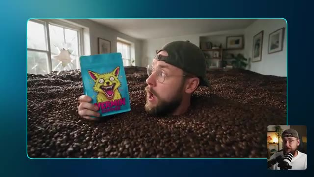

---

### ⏱️ `[00:12:43 - 00:13:07]` | Segment #30

**🔊 Audio (Transcription Intégrale Mot pour Mot en Français) :**
> Tout ici a été construit en utilisant exactement le même processus consistant à utiliser Claude pour rédiger nos prompts et à combiner cela avec des références d'images pertinentes pour générer nos vidéos. Nous avons quelques angles de l'extérieur de notre chaîne de cafés. Quelques scènes se déroulant à la maison pour que le consommateur puisse réellement imaginer notre produit s'intégrer dans sa journée.

**👁️ Analyse Visuelle d'Écran (gemini-3.5-flash-lite) :**
**Interface & Outils** : Interface sombre d'une application de génération de vidéo par IA avec un panneau latéral de contrôle à droite. En bas à droite, incrustation vidéo (picture-in-picture) de Jack face caméra, coiffé d'une casquette et portant un micro professionnel.

**Contenu textuel & Code** : Le lecteur vidéo affiche un plan extérieur d'un café auvergnat stylisé avec une devanture bleue vif et une enseigne représentant un monstre canin jaune agressif avec le texte "VERMIN COFFEE". Des clients font la queue devant l'entrée ouverte. Dans le panneau latéral : Prompt visible (« Filmed handheld on a phone by a person standing in the café... »), section "REFERENCES" avec une miniature d'image, section "SETTINGS" (« Byte Plus Seedance 2.0, 5s, 16:9, 1080p, Audio On »), Asset ID (« FJZRWxQiOe3EmGoWn7Ua »), et des options comme "Check IP Safety", "Upscale", "Dub Video", "Grab a frame", ainsi que les boutons "Recreate" et "Use in Chat".

**Action / Démonstration** : La vidéo se lit dans le lecteur (barre de progression à 0:00 / 0:05), montrant l'animation fluide de la scène extérieure du café tandis que le panneau latéral détaille les paramètres de génération de l'outil d'IA.

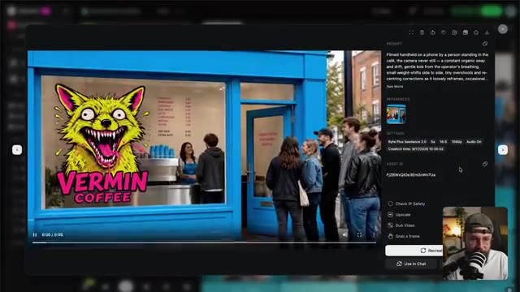

---

### ⏱️ `[00:13:07 - 00:13:27]` | Segment #31

**🔊 Audio (Transcription Intégrale Mot pour Mot en Français) :**
> ce plan de latte art vraiment satisfaisant. SeaDarts a fait un super travail en concevant ça. Et ce plan de moi présentant le produit à la caméra dans la réserve de Vermin Coffee. Il y a tellement d'options différentes ici. Certaines sont assez stylisées et d'autres sont beaucoup plus réalistes.

**👁️ Analyse Visuelle d'Écran (gemini-3.5-flash-lite) :**
**Interface & Outils** : Interface web d'un outil de génération vidéo par IA (interface sombre avec panneau latéral de configuration). On y voit une grande fenêtre de prévisualisation vidéo principale affichant le plan généré, et en bas à droite une petite incrustation vidéo (picture-in-picture) montrant Jack en train de parler face caméra avec un micro et un décor de bureau.

**Contenu textuel & Code** : Panneau latéral (PROMPT) : "Slow, gentle dolly push-in toward the man holding the Vermin Coffee pack. The primary camera move: a smooth, restrained forward glide, the bearded man in the backwards cap and glasses growing slowly in frame as the shelves of blue Vermin packs behind him fall..." [SETTINGS] : BytePlus Seedance 2.0, 5s, 16:9, 1080p, Audio On. Creation time : 9/17/2026 13:08:50. [ASSET ID] : WR8ai4pKrqPKqWV6H4. Boutons d'action visibles : Check IP Safety, Upscale, Dub Video, Grab a frame, Recreate, Use in Chat.

**Action / Démonstration** : L'interface affiche le résultat d'une vidéo générée par l'IA représentant un homme barbu tenant un sachet de café "Vermin Coffee" bleu dans une réserve. Le panneau de droite détaille les paramètres et le prompt textuel utilisés pour créer cette génération vidéo.

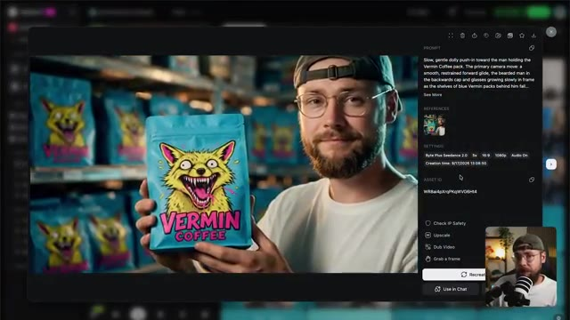

---

### ⏱️ `[00:13:28 - 00:13:48]` | Segment #32

**🔊 Audio (Transcription Intégrale Mot pour Mot en Français) :**
> Et cela signifie simplement qu'ils vont s'adapter à une variété de cas d'utilisation pour le marketing de votre marque. Maintenant, avant de terminer, il y a autre chose que je veux vous montrer, et ce sont toutes les générations qui n'ont pas été retenues. Et vous ne pouvez probablement pas vous empêcher de penser à tous les crédits que j'ai dépensés pour des ressources que nous n'allons même pas utiliser.

**👁️ Analyse Visuelle d'Écran (gemini-3.5-flash-lite) :**
**Interface & Outils** : Jack face caméra dans son studio, assis dans un fauteuil noir avec un microphone professionnel positionné au premier plan. L'arrière-plan présente une étagère en bois garnie d'objets décoratifs, une plante verte et une lampe de bureau allumée. Aucune interface logicielle n'est visible sur cette image.

**Contenu textuel & Code** : Aucun texte, prompt de génération ou paramètre technique n'est affiché à l'écran.

**Action / Démonstration** : Jack est filmé en plan moyen, s'adressant directement au public avec des expressions faciales et des gestes naturels pour introduire la section suivante de sa vidéo.

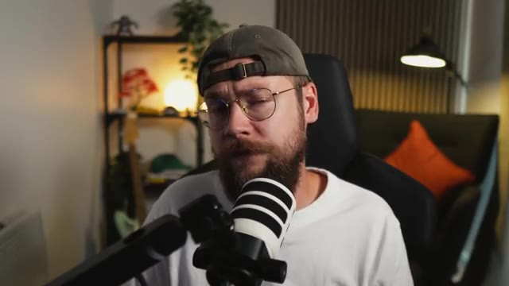

---

### ⏱️ `[00:13:48 - 00:14:08]` | Segment #33

**🔊 Audio (Transcription Intégrale Mot pour Mot en Français) :**
> Il y a deux raisons pour lesquelles je vous montre ceci, et toutes deux proviennent d'un souci d'honnêteté. L'IA n'est pas bon marché, mais elle est nettement moins coûteuse que d'embaucher une équipe créative ou une agence de publicité pour concevoir ces éléments à votre place. Et je peux l'affirmer en toute confiance en tant qu'initié de l'industrie.

**👁️ Analyse Visuelle d'Écran (gemini-3.5-flash-lite) :**
**Interface & Outils** : Interface logicielle sombre de génération de vidéo par IA (probablement BytePlus Seedance 2.0). La fenêtre principale affiche le lecteur vidéo avec la génération en cours. Le panneau latéral droit contient les sections Prompt, References, Settings et Asset ID. En bas à droite de l'écran, une incrustation vidéo (PiP) montre Jack face caméra dans son studio.

**Contenu textuel & Code** : Le prompt visible dans le panneau latéral est : "Slow, gentle dolly push-in toward the cup as the barista finishes the latte art. The primary action: the barista pours the last of the steamed milk from the stainless steel jug in one smooth continuous stream into the Vermin Coffee cup, drawing out a clean rosetta - the...". La section "REFERENCES" affiche une miniature de l'image de référence. Les paramètres ("SETTINGS") indiquent : "BytePlus Seedance 2.0", "5s", "16:9", "1080p", "Audio On", avec la date et l'heure de création "Creation time: 9/17/2026 10:43:18". L'identifiant d'actif est "sw0TI9HRuZ5JcJYRIP1a". Des boutons d'action sont également visibles : "Check IP Safety", "Upscale", "Dub Video", "Grab a frame", "Recreate" et "Use in Chat".

**Action / Démonstration** : La vidéo générée est lue dans la visionneuse principale : un gros plan montre une main tenant un gobelet en papier bleu et jaune arborant le logo "Vermin Coffee", contenant un café latte avec un motif de latte art en forme de cœur ou de rosette parfaitement exécuté. Le curseur de la souris survole l'interface près des options de recréation et de gestion des assets.

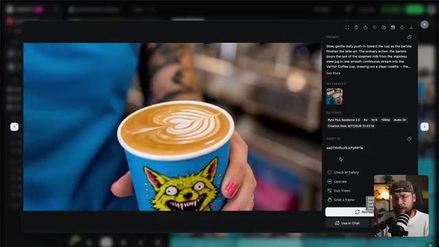

---

### ⏱️ `[00:14:08 - 00:14:46]` | Segment #34

**🔊 Audio (Transcription Intégrale Mot pour Mot en Français) :**
> Si vous vous entraînez simplement, envisagez de passer à un modèle vidéo plus ancien comme C-Dance 2 ou même de baisser votre résolution à 480 ou 720p. Cela va vraiment vous aider à réduire votre consommation de crédits. Je tiens également à souligner que l'IA ne se résume pas à cliquer sur quelques boutons pour obtenir instantanément le résultat souhaité. C'est un processus d'essais et d'erreurs où vous sélectionnez les meilleures générations plutôt que d'utiliser tout ce que vous avez obtenu. Beaucoup de créateurs d'IA tombent dans le piège de sentir qu'ils doivent utiliser tout ce pour quoi ils ont dépensé des crédits. Et en fin de compte, c'est ce qui conduit

**👁️ Analyse Visuelle d'Écran (gemini-3.5-flash-lite) :**
**Interface & Outils** : Interface sombre d'une application de génération vidéo par IA en mode relecture/inspection de projet, avec un volet latéral de paramètres à droite, un lecteur vidéo central affichant l'aperçu du plan généré, et une pastille vidéo incrustée en bas à droite montrant Jack face caméra.

**Contenu textuel & Code** : Dans le panneau de droite, le prompt visible indique : "[00:00 - 00:03] Medium shot, 50mm, eye-level, slow push in – @Image3 sits slumped on a beige sofa in an ordinary living room, full auburn beard, gold thin wire-frame round glasses, dark charcoal cap worn backwards, white crew-neck tee. He lifts a plain cheap...". La section "REFERENCES" montre 3 vignettes d'images sources. Les paramètres techniques affichés sont : "Byte Plus Seedance 2.5", durée "15s", ratio "16:9", résolution "1080p", "Audio On", date de création "9/16/2026 12:47:02", et l'Asset ID "xOwAP0i6vIpSwm5WQ5f". Des options de post-traitement sont également visibles ("Check IP Safety", "Upscale", "Dub Video", "Grab a frame") ainsi que les boutons "Recreate" et "Use in Chat".

**Action / Démonstration** : Le lecteur vidéo central affiche l'animation générée montrant Jack émergeant d'un océan de grains de café avec un sachet coloré à côté de lui, tandis que le volet de droite détaille les métadonnées et que Jack commente ses choix de production et la gestion des crédits dans la petite pastille vidéo en bas à droite.

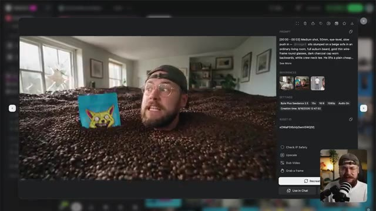

---

### ⏱️ `[00:14:46 - 00:15:06]` | Segment #35

**🔊 Audio (Transcription Intégrale Mot pour Mot en Français) :**
> ...à la bouillie numérique ("AI slop"), car cela réduit vraiment la qualité globale de votre production. Le point clé à retenir ici, cependant, est qu'une seule personne est désormais capable de construire toute une marque en n'utilisant rien d'autre que son ordinateur portable. Et ce que je trouve le plus puissant avec l'IA, c'est que vous êtes fermement aux commandes.

**👁️ Analyse Visuelle d'Écran (gemini-3.5-flash-lite) :**
**Interface & Outils** : Interface sombre d'une application Web de génération de vidéo par IA, affichant un panneau de prévisualisation central et un panneau de configuration latéral droit comportant les champs PROMPT, REFERENCES, SETTINGS et ASSET ID, avec en bas à droite une incrustation vidéo (PiP) de Jack face caméra parlant dans un microphone.

**Contenu textuel & Code** : Dans le champ PROMPT : "Slow dolly camera move in". Section REFERENCES avec une miniature d'image. Section SETTINGS : "Byte Plus Seedance 2.0", "5s", "16:9", "1080p", "Audio On". "Creation time: 9/17/2026 13:08:35". Section ASSET ID : "3UDv52eZfcOKWBUVDixy". Boutons d'action sous les paramètres : "Check IP Safety", "Upscale", "Dub Video", "Grab a frame", "Recreate", "Use in Chat".

**Action / Démonstration** : Visualisation de l'interface d'un outil de génération vidéo par IA affichant un plan vidéo montrant une main tenant un sachet de café bleu marqué "Vermin Coffee" au-dessus d'une boîte ouverte, tandis que Jack s'exprime en incrustation vidéo.

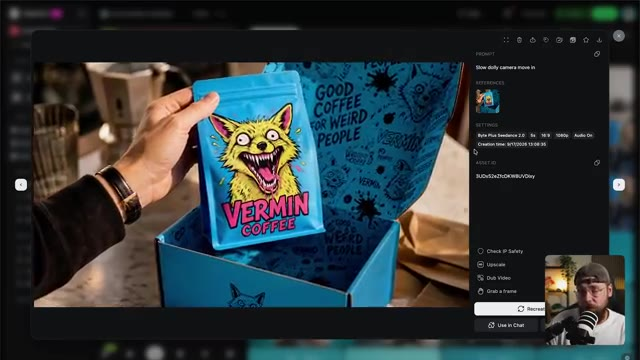

---

### ⏱️ `[00:15:06 - 00:15:24]` | Segment #36

**🔊 Audio (Transcription Intégrale Mot pour Mot en Français) :**
> Si vous êtes chef d'entreprise et que vous en avez assez de devoir communiquer vos idées à une équipe créative externe, avec tous les allers-retours et les maux de tête que cela entraîne, l'intelligence artificielle vous permet désormais de réaliser l'ensemble du processus vous-même et, ce faisant, de gagner à la fois du temps et de l'argent.

**👁️ Analyse Visuelle d'Écran (gemini-3.5-flash-lite) :**
**Interface & Outils** : Une interface web de génération de vidéo par IA, avec un panneau de prévisualisation vidéo au centre gauche, un panneau latéral droit détaillant les paramètres, un lecteur vidéo en bas avec barre de progression (0:05 / 0:05), et un encart vidéo en bas à droite montrant Jack face caméra avec son micro.

**Contenu textuel & Code** : Le prompt visible dans le panneau latéral est : « Slow, gentle dolly push-in toward the man holding the Vermin Coffee pack. The primary camera move: a smooth, restrained forward glide, the bearded man in the backwards cap and glasses growing slowly in frame as the shelves of blue Vermin packs behind him fall... ». Dans les paramètres (SETTINGS), on lit : « Byte Plus Seedance 2.0 », « 5s », « 16:9 », « 1080p », « Audio On », et « Creation time: 9/17/2026 13:08:50 ». L'Asset ID est « WR8ai4px/qKpWVG6H4 ». Des options d'action sont affichées : « Check IP Safety », « Upscale », « Dub Video », « Grab a frame », ainsi que les boutons « Recreate », « Use in Chat ». La vidéo montre un homme barbu portant une casquette à l'envers et des lunettes, tenant un sachet de café bleu étiqueté « VERMIN COFFEE » avec l'illustration d'un renard jaune aux crocs acérés.

**Action / Démonstration** : La vidéo se lit en boucle dans l'interface de prévisualisation (la barre indique 0:05 sur 0:05), tandis que le panneau latéral affiche les métadonnées de génération et les paramètres techniques du plan vidéo généré.

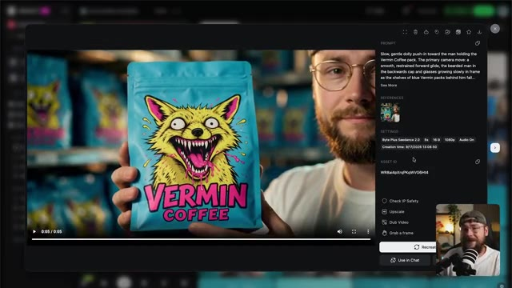

---

### ⏱️ `[00:15:24 - 00:15:45]` | Segment #37

**🔊 Audio (Transcription Intégrale Mot pour Mot en Français) :**
> Cela étant dit, les gars, nous sommes arrivés à la fin du tutoriel d'aujourd'hui. Si vous l'avez apprécié, n'hésitez pas à lâcher un pouce bleu pour moi et pensez à vous abonner. Si vous souhaitez aller plus loin, vous pouvez consulter ma communauté School gratuite. Il y aura un post là-bas qui contient absolument tous les prompts que j'utilisés tout au long de cette vidéo afin que vous puissiez les utiliser pour vos propres projets créatifs.

**👁️ Analyse Visuelle d'Écran (gemini-3.5-flash-lite) :**
**Interface & Outils** : Navigateur web affichant la plateforme communautaire « School » (Skool) nommée « Jack Vs. AI Workflows », avec un bandeau supérieur de navigation (Community, Classroom, Calendar, Members, Map, Leaderboards, About), un fil d'actualité central avec des publications épinglées, une barre latérale droite affichant les informations du groupe (« Jack Vs. AI - skool.com/jack-vs-ai-workflows-8360 »), les statistiques (19k membres, 70 en ligne), ainsi qu'une petite fenêtre vidéo en incrustation (PiP) dans le coin inférieur droit montrant Jack face caméra avec son micro.

**Contenu textuel & Code** : Publications visibles dans le fil : 1) « How to Turn GPT-6 Astra Into Your Own 3D Studio (Prompts) » par Jack Kennedy avec la mention « 🔴 NEW VIDEO IS LIVE! 🤖 GPT-6 Astra can now take control of Blender - so you can describe a camera move, a product animation or a full character rig in plain English and... » ; 2) « The Half NOBODY Teaches... (New Course in the Classroom) » ; 3) « My A-Z of AI Video Production Course is LIVE! ». Dans le panneau latéral droit, la description indique : « Whether you're cutting ads, building short films, or pushing AI video to its limits, this is where you sharpen the skills that actually transfer. ». Section « Suggested communities » visible en bas à droite avec des miniatures (Origins Ecommerce, God Tier Ecom, etc.).

**Action / Démonstration** : Capture d'écran fixe de l'interface de la plateforme communautaire Skool, avec le curseur de la souris (pointeur) positionné au centre du premier post de Jack Kennedy, illustrant la navigation sur la page de la communauté pour présenter l'emplacement des ressources partagées.

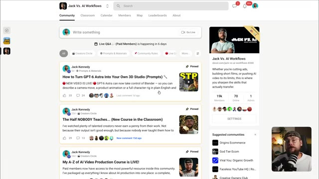

---

### ⏱️ `[00:15:45 - 00:15:54]` | Segment #38

**🔊 Audio (Transcription Intégrale Mot pour Mot en Français) :**
> Je vais partager une partie de mon contenu récent si vous souhaitez continuer à explorer tout ce qui est possible avec les derniers outils d'IA, et je vous retrouve dans la prochaine.

**👁️ Analyse Visuelle d'Écran (gemini-3.5-flash-lite) :**
**Interface & Outils** : Écran de transition uni ou fond flou monochrome aux tons bleu-vert, sans interface logicielle active visible.

**Contenu textuel & Code** : Aucun texte affiché, ni prompt, ni paramètre technique visible à l'écran.

**Action / Démonstration** : Transition visuelle épurée, affichant un fond abstrait et uni alors que la vidéo arrive sur ses derniers mots de conclusion.

---
