# 🎬 Comment créer des clips vidéo IA avec Seedance 2.5 (La meilleure méthode)

> **Chaîne** : [Jack Vs. AI](https://www.youtube.com/@JackVsAI)  
> **Titre original** : `How to Make AI Music Videos with Seedance 2.5 (Best Method)`  
> **Lien YouTube** : [https://www.youtube.com/watch?v=mNESr8Hjq0s](https://www.youtube.com/watch?v=mNESr8Hjq0s)  
> **Date de publication** : 2026-09-26  
> **Durée** : 23m 09s (`1389s`)  
> **Identifiant vidéo** : `mNESr8Hjq0s`  
> **Fiche Web Interactive** : [2026-09-26_YT-mNESr8Hjq0s_Comment créer des clips vidéo IA avec Seedance 2.5 (La meilleure méthode)_by-whisper-v3-large-turbo+gemini-3.5-flash-lite.html](2026-09-26_YT-mNESr8Hjq0s_Comment créer des clips vidéo IA avec Seedance 2.5 (La meilleure méthode)_by-whisper-v3-large-turbo+gemini-3.5-flash-lite.html)  
> **Captures d'écran clés** : `38 images sauvegardées`  
> **Modèles utilisés** : Audio: `large-v3-turbo` (Faster-Whisper int8 VPS) | Vision: `gemini-3.5-flash-lite` (Google AI Studio API)  

---

## 📌 Synthèse Exécutive & Outils

### 📌 Résumé
Dans cette vidéo, Jack explore un workflow de production hybride et novateur pour créer de A à Z un clip musical entièrement généré par IA. En combinant des enregistrements audio de sa propre voix (capturant la mélodie brute et l'intention humaine) avec des outils de pointe comme Suno, Claude, OpenArt et Seedance 2.5, il démontre qu'il est possible d'injecter une véritable substance émotionnelle dans un projet automatisé. L'approche repose sur un subtil équilibre entre l'expression organique et la puissance de calcul des réseaux de neurones, prouvant que l'intervention humaine (comme le chant personnel ou l'itération minutieuse) reste la clé d'un résultat artistique marquant.

La méthode de Jack se structure en trois grands piliers : la planification textuelle et l'écriture des paroles via Claude, la composition musicale sur mesure avec Suno à partir d'une maquette vocale, et enfin la conception visuelle rigoureuse. Plutôt que de s'en remettre entièrement au hasard des générateurs vidéo, il utilise OpenArt et le modèle GPT Image 2.5 pour concevoir des feuilles de personnages (*character sheets*) cohérentes et des photogrammes clés (*key frames*). Cette étape préparatoire garantit que Seedance 2.5 dispose de toutes les informations visuelles nécessaires pour animer les scènes sans jamais deviner, assurant une continuité stylistique et narrative irréprochable.

Pour les créateurs de contenu, ce tutoriel offre une feuille de route inestimable qui s'applique à tous les styles visuels, de l'animation stylisée au photoréalisme. En évitant la précipitation dans le prompting et en acceptant d'itérer à plusieurs reprises avec les intelligences artificielles, les créateurs apprennent à dompter l'imperfection inhérente à l'IA. Le résultat final illustre parfaitement le potentiel des flux de travail hybrides : un clip musical professionnel, doté d'une identité forte, capable de rivaliser avec des productions traditionnelles tout en démocratisant des techniques de pointe.

### 🛠️ Outils, Modèles & Logiciels Présentés
* **Claude** : Utilisé comme assistant stratégique et textuel pour coécrire les paroles de la chanson, affiner les concepts narratifs, rédiger les *prompts* de style et décrire l'apparence des personnages secondaires.
* **Suno** : Plateforme de génération musicale dopée à l'IA qui permet d'importer une maquette vocale personnelle et d'utiliser une fonction de reprise pour transformer un enregistrement amateur en un morceau de qualité professionnelle.
* **OpenArt** : Plateforme de création artistique par IA servant ici d'environnement central pour générer les concepts visuels, les feuilles de personnages et les photogrammes clés du clip.
* **GPT Image 2.5** : Modèle d'image utilisé au sein d'OpenArt pour produire des visuels précis, texturés et conformes aux descriptions esthétiques complexes exigées par le réalisateur.
* **Seedance 2.5** : Moteur d'animation et de synchronisation labiale par IA qui donne vie aux images fixes et aux feuilles de personnages, garantissant la fluidité et le respect des designs initiaux sans phase de devinette.
* **Premiere Pro** : Logiciel de montage vidéo mentionné pour l'assemblage final des séquences animées et de la piste audio (bien que la démonstration se concentre principalement sur les phases de génération).
* **Flux** : Évoqué dans l'écosystème technique global des modèles de génération d'images et de traitement visuel.

### 🔑 Points Clés & Enseignements Stratégiques
* **L'approche hybride audio** : Enregistrer sa propre voix (même de manière imparfaite) et l'injecter dans Suno comme maquette permet de conserver une âme humaine, une mélodie originale et une charge émotionnelle que l'IA seule ne peut inventer.
* **Le dialogue itératif avec le LLM** : Ne jamais se contenter des premiers résultats de Claude ; multiplier les allers-retours textuels permet d'affiner les thématiques, d'isoler les refrains des couplets et d'obtenir des paroles dotées de véritables subtilités narratives.
* **L'importance du prompt de style musical** : Associer les paroles à un *style prompt* précis (inspiré par exemple de morceaux de référence comme *This Is America* de Childish Gambino) est indispensable pour guider Suno vers l'ambiance sonore exacte recherchée.
* **La conception rigoureuse des feuilles de personnages** : Avant de générer la moindre vidéo, il est impératif de créer des *character sheets* sous tous les angles via OpenArt afin de fournir à Seedance 2.5 un référentiel visuel stable et complet.
* **Proscrire le hasard dans la génération vidéo** : Plutôt que de balancer des prompts bruts directement dans les outils d'animation, il est beaucoup plus efficace de figer les moments clés sous forme d'images fixes (*key frames*) pour garder le contrôle total de la narration.
* **La décomposition modulaire des prompts** : Structurer ses descriptions visuelles en trois blocs distincts (le sujet/personnage, le style pictural global, et le cadre de la feuille de personnage) garantit des résultats constants et précis.
* **L'itération visuelle par étapes** : En cas de résultat décevant sur OpenArt, il ne faut pas hésiter à réinjecter l'image et le contexte dans Claude pour ajuster la pose, les éléments environnants ou la palette chromatique avant de relancer une génération.
* **La dissociation de la narration textuelle et visuelle** : Il est tout à fait possible (et souvent très artistique) d'avoir un décalage ou une relecture visuelle originale qui s'éloigne légèrement du sens littéral des paroles, à l'instar des meilleurs clips musicaux de l'industrie.
* **L'utilisation de la communauté pour le partage des ressources** : S'appuyer sur des plateformes communautaires (comme le groupe Skool de Jack) permet de récupérer gratuitement des structures de prompts complexes et d'accélérer sa courbe d'apprentissage technique.
* **La patience au service de la qualité** : Le succès d'un clip vidéo par IA réside dans le temps passé en amont sur la planification, le design et le raffinage des assets, transformant une simple suite d'effets aléatoires en une œuvre cohérente et professionnelle.

---

## ⏱️ Chronologie & Transcription Complète Audio & Visuelle (Mot pour Mot)

### ⏱️ `[00:00:00 - 00:01:36]` | Segment #01

**🔊 Audio (Transcription Intégrale Mot pour Mot en Français) :**
> J'ai fait ce clip musical entier en n'utilisant rien d'autre que l'IA. Tenez, jetez un œil. Bon, j'ai été sérieusement impressionné par ce résultat. Ce qui est vraiment intéressant, c'est que j'ai utilisé un hybride

**👁️ Analyse Visuelle d'Écran (gemini-3.5-flash-lite) :**
**Interface & Outils** : Illustration stylisée (type concept art / cell shading) montrant Jack face caméra, représenté torse nu avec des bracelets technologiques lumineux et une casquette à l'envers, sur un fond texturé aux tons gris et bruns.

**Contenu textuel & Code** : Aucun texte, prompt ou paramètre technique n'est affiché à l'écran pour le moment.

**Action / Démonstration** : Jack (représenté ici en illustration animée/stylisée) se met la main sur le visage dans un geste de découragement ou d'exaspération, avant de s'apprêter à introduire son processus de création par IA.

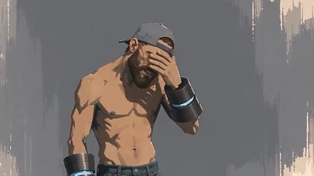

---

### ⏱️ `[00:01:36 - 00:01:58]` | Segment #02

**🔊 Audio (Transcription Intégrale Mot pour Mot en Français) :**
> approche où je me suis enregistré en train d'interpréter la mélodie et le refrain, puis j'ai injecté cela dans Suno pour générer la piste finale. J'ai utilisé Claude pour le prompting et pour m'aider avec certaines paroles, et toute l'animation ainsi que la synchronisation labiale ont été réalisées avec Seedance 2.5. Dans ce tutoriel, je vais vous guider à travers l'ensemble du flux de travail afin que vous appreniez à créer votre propre clip vidéo par IA.

**👁️ Analyse Visuelle d'Écran (gemini-3.5-flash-lite) :**
**Interface & Outils** : Interface sombre de l'assistant textuel Claude affichée au centre de l'écran, avec une esthétique de design épurée et moderne sur fond bleu-vert.

**Contenu textuel & Code** : Texte des paroles de chanson générées (incluant des sections comme "[Chorus - airy falsetto]" et "[Verse 1 - laid-back rap]") ainsi qu'un champ de saisie de prompt affichant la requête "make this song a hit", avec des options de modèle ("Opus 3.5 Medium"). Le texte "prompting and lyrics" apparaît en bas à droite.

**Action / Démonstration** : L'interface présente le contenu textuel et les paroles de la chanson élaborées via l'outil d'intelligence artificielle textuelle pour illustrer la phase de création des paroles et du prompting.

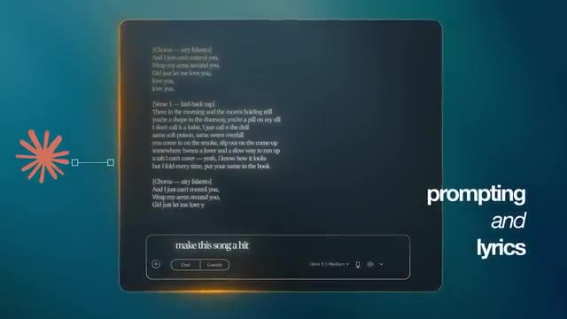

---

### ⏱️ `[00:01:58 - 00:02:36]` | Segment #03

**🔊 Audio (Transcription Intégrale Mot pour Mot en Français) :**
> Et ce qui est génial, c'est que ce processus fonctionne pour n'importe quel style, que vous vouliez faire une animation comme moi ou plutôt quelque chose de photoréaliste. Si vous voulez suivre, vous trouverez un lien dans la description vers Open Art où j'ai construit ce projet, et un grand merci à eux pour avoir parrainé la vidéo d'aujourd'hui. Bien, entrons dans le vif du sujet. La première étape consiste à commencer à réfléchir au concept derrière votre chanson. Pour moi, j'ai en quelque sorte procédé à l'envers ici parce que j'ai déposé les paroles du refrain que j'avais déjà écrites dans Claude et je lui ai demandé de m'aider à écrire les parties des couplets. Vous remarquerez qu'il y a eu un peu d'aller-retour ici où je demande à Claude de ne pas toucher au refrain mais de faire

**👁️ Analyse Visuelle d'Écran (gemini-3.5-flash-lite) :**
**Interface & Outils** : Écran de titre animé en infographie 3D sur fond sombre bleu-vert, avec des néons circulaires lumineux et épurés en arrière-plan.

**Contenu textuel & Code** : Texte typographique centralisé et épuré avec un grand chiffre "1" en dégradé bleu clair, suivi des mots "Concept" en blanc et "and lyrics" en plus petit dessous.

**Action / Démonstration** : Animation de transition montrant un titre de chapitre s'affichant à l'écran, marquant le début de la première grande étape du tutoriel dédiée au concept et aux paroles de la chanson.

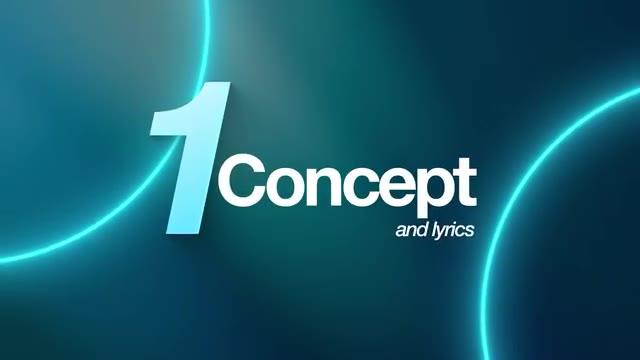

---

### ⏱️ `[00:02:36 - 00:03:08]` | Segment #04

**🔊 Audio (Transcription Intégrale Mot pour Mot en Français) :**
> les paroles des couplets sont plus abstraites. C’est là que le concept a commencé à entrer en jeu, car j'avais cette idée que la chanson devait parler d’une relation toxique alimentée par la drogue, et je me rapprochais peu à peu de ce que je cherchais. J’ai donc décidé de balancer beaucoup plus d’informations à Claude sur ce que j’imaginais. Je lui demandais donc ce genre de refrain en falsetto, accompagné d'un rap plus décontracté pendant les couplets. Je demandais un morceau qu'on pourrait imaginer entendre à la radio,

**👁️ Analyse Visuelle d'Écran (gemini-3.5-flash-lite) :**
**Interface & Outils** : Une interface de type assistant conversationnel en mode sombre (probablement Claude) s'affiche en grand sur l'écran. En haut à gauche, un titre de discussion (« Frank Ocean-Inspired Suno music prompt ») est visible. En bas de l'écran, une barre de saisie (« Write a message... ») est présente. Dans le coin inférieur droit, une petite fenêtre incrustée montre le présentateur (Jack) avec un casque et un micro.

**Contenu textuel & Code** : Le texte d'une conversation avec l'IA est affiché à l'écran, comprenant notamment un long prompt décrivant le style musical désiré : « With the below style prompt, can we make it even more stripped back... Slow, hazy alt-R&B / bedroom soul, 70-80 BPM... » ainsi que la réponse de l'IA avec un « Style prompt » affiché plus bas. Le curseur de la souris est visible sur la page.

**Action / Démonstration** : La vue montre l'interface de discussion avec l'IA défilant lentement pour révéler les différents échanges de prompts et de réponses concernant la création de la musique inspirée par Frank Ocean, pendant que Jack parle en voix off et apparaît en miniature dans le coin inférieur droit.

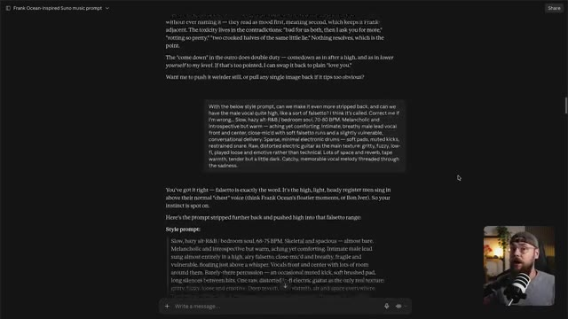

---

### ⏱️ `[00:03:08 - 00:03:44]` | Segment #05

**🔊 Audio (Transcription Intégrale Mot pour Mot en Français) :**
> mais qui paraissait tout de même un peu sombre et possédait une vraie substance émotionnelle. Et cette information supplémentaire, tous ces éléments réunis, ont donné à Claude une compréhension suffisante de ce que je voulais pour produire les paroles finales qui ont été utilisées dans le morceau. Une fois que vous avez vos paroles, la prochaine chose dont vous avez besoin est votre prompt de style, et celui-ci indique en fait à Suno comment vous voulez que votre chanson sonne. Encore une fois, il y a eu cet élément d'aller-retour où j'ai finalement orienté Claude vers le morceau de Childish Gambino, This Is America. C'est de là que vient ce mélange de gospel et de rap

**👁️ Analyse Visuelle d'Écran (gemini-3.5-flash-lite) :**
**Interface & Outils** : Jack face caméra, dans son studio personnel, portant des lunettes et une casquette à l'envers, parlant devant un microphone sur pied. Un éclairage d'ambiance chaleureux est visible en arrière-plan avec des étagères contenant divers objets.

**Contenu textuel & Code** : Textes graphiques superposés à l'écran : "2 Key Pillars" en bleu turquoise, suivis de "song lyrics" et "written by myself and Claude" en blanc.

**Action / Démonstration** : Jack s'exprime face caméra en expliquant son processus de création musicale assistée par IA, avec un montage épuré mettant en avant les points clés à l'écran.

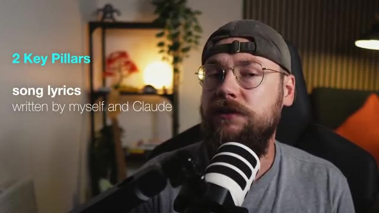

---

### ⏱️ `[00:03:44 - 00:04:23]` | Segment #06

**🔊 Audio (Transcription Intégrale Mot pour Mot en Français) :**
> venait finalement. Donc avec ça, l'étape de planification était terminée. J'avais ces deux éléments clés pour ma chanson, les paroles et le style prompt. La clé ici est de ne pas se précipiter dans cette partie du processus. Ne vous contentez pas des premiers résultats que Claude vous donne, car ils vont probablement cuser. Donc avec ça, j'étais prêt à passer sur Suno et c'est là que les choses deviennent vraiment intéressantes, car sur Suno, vous avez maintenant l'option de télécharger votre propre fichier audio. J'ai donc téléchargé un enregistrement de moi en train de chanter la chanson. Très mal, je dois l'ajouter. Je ne suis pas un bon chanteur, mais j'ai l'impression

**👁️ Analyse Visuelle d'Écran (gemini-3.5-flash-lite) :**
**Interface & Outils** : Écran de transition graphique avec un fond bleu foncé, traversé par des cercles lumineux néon bleu turquoise.

**Contenu textuel & Code** : Texte affiché en relief et typographie moderne au centre de l'écran : un grand chiffre "2" bleu clair, suivi du mot "Suno" et du mot "generation" écrit plus petit en italique en dessous.

**Action / Démonstration** : Animation graphique de transition avec des cercles lumineux et affichage du titre de section lié à l'utilisation de Suno.

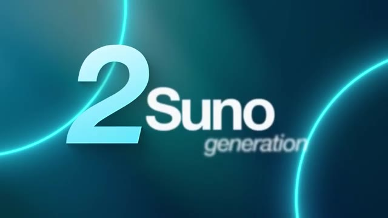

---

### ⏱️ `[00:04:23 - 00:04:43]` | Segment #07

**🔊 Audio (Transcription Intégrale Mot pour Mot en Français) :**
> Je suis un auteur-compositeur convenable. Je peux trouver des paroles et des mélodies intéressantes. J'ai donc introduit cela dans l'IA pour essentiellement affiner. Vous pouvez réellement marquer votre enregistrement comme une maquette de chanson. Et si vous choisissez l'option de reprise, Suno va effectivement recréer votre chanson de manière aussi professionnelle que possible.

**👁️ Analyse Visuelle d'Écran (gemini-3.5-flash-lite) :**
**Interface & Outils** : L'écran affiche l'interface sombre du logiciel de génération musicale Suno, organisée en trois grands panneaux verticaux. À gauche, les options d'importation audio ("Browse", "Upload", "Record"). Au centre, l'onglet "Library" avec une fenêtre modale d'importation de fichier audio ("I Just Can't..."). À droite, les détails de la piste avec la pochette, les tags de style, les paroles de la chanson et, dans l'angle inférieur droit, l'incrustation vidéo miniature ("Picture-in-Picture") du créateur Jack face caméra devant son micro.

**Contenu textuel & Code** : Dans la fenêtre modale centrale, le champ de description textuelle indique : "e.g. Short piano chord progression, slow tempo, recorded on a phone". Juste en dessous, une grille d'options de tags audio est proposée : "+ Full Song", "+ Song Demo", "+ Voice", "+ Instrument Stem", "+ Loop", "+ Rhythm / Percussion", "+ Sample", "+ Spoken Word", "+ Sound Effect", "+ Field Recording / Ambience". En bas de la modale figurent les boutons "Back" et "Continue". Dans le panneau de droite, sous la pochette et le titre "I Just Can't", le texte descriptif des styles et les paroles structurées ("[Chorus]", "[Verse 1]") sont partiellement visibles.

**Action / Démonstration** : Le curseur de la souris (représenté par une flèche blanche) survole la zone centrale de la fenêtre modale de Suno au moment où l'option "+ Song Demo" est mise en avant pour taguer l'enregistrement audio importé. Simultanément, l'incrustation vidéo montre Jack s'exprimant face à sa caméra.

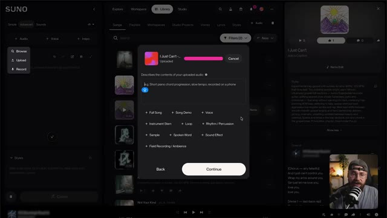

---

### ⏱️ `[00:04:43 - 00:05:43]` | Segment #08

**🔊 Audio (Transcription Intégrale Mot pour Mot en Français) :**
> J'ai ensuite inséré les paroles ainsi que ce fameux prompt de style si important. Et il y a aussi tout un tas d'autres paramètres disponibles. En général, je laisse la plupart d'entre eux par défaut, mais cela peut être pratique de choisir le genre de votre vocaliste et la durée de votre chanson également. Donc, avec cela, j'ai lancé quelques générations et je suis finalement arrivé à ceci. Et honnêtement, c'est mon morceau préféré que j'ai créé avec Suno jusqu'à présent. Et je pense

**👁️ Analyse Visuelle d'Écran (gemini-3.5-flash-lite) :**
**Interface & Outils** : Interface web de l'outil de génération musicale Suno, affichée en mode sombre (dark mode). L'écran est divisé en deux parties : un panneau de configuration à gauche (« Simple », « Advanced », « Sounds », options « Lyrics » et « Styles ») et la bibliothèque principale de morceaux (« Songs », « Playlists », « Workspaces », etc.) occupant le reste de l'écran. En bas à droite, une incrustation vidéo (PiP) montre le présentateur (Jack) face caméra, avec un microphone sur pied. Une barre de lecture audio est visible tout en bas de la fenêtre.

**Contenu textuel & Code** : Paramètres et textes visibles dans l'interface de Suno : menu « Advanced » actif avec le modèle v6 sélectionné. Dans la zone « Lyrics », le champ textuel est vide avec l'indication « Start writing lyrics, or leave this empty for instrumental ». Dans la zone « Styles », on peut lire le prompt de style suivant : « odd time signatures, neue deutsche härte, old school hip-hop, oao, virtuoso guitar ». Dans la liste des morceaux générés à droite, on aperçoit plusieurs titres dont « I Just Can't » (v5.5, cover) et plusieurs pistes nommées « Not Your Kind » accompagnées de leurs prompts descriptifs (ex: « Downtempo modern soul-funk, -90-100 BPM, minimal, hypnotic, and slightly melancholic... »).

**Action / Démonstration** : Le curseur de la souris (représenté par une flèche blanche) se déplace et clique dans l'interface de la bibliothèque de morceaux de Suno pour naviguer entre les différentes pistes musicales générées.

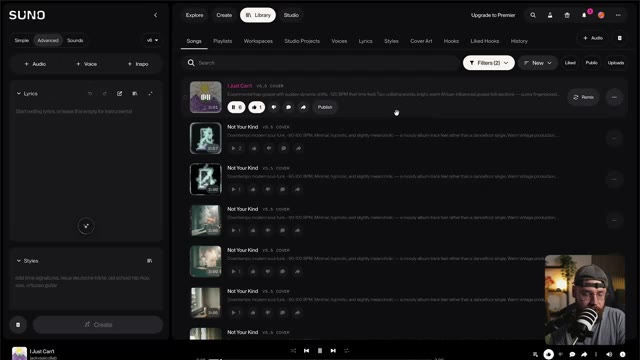

---

### ⏱️ `[00:05:43 - 00:06:22]` | Segment #09

**🔊 Audio (Transcription Intégrale Mot pour Mot en Français) :**
> c'est en grande partie parce que la mélodie elle-même venait de moi. Comme je le dis, je ne suis pas un bon chanteur et je ne vais pas vous faire subir l'enregistrement que j'ai fait de la chanson, mais je pense que d'avoir cet élément humain présent au sein de la production par IA est vraiment important et c'est un super exemple et une approche vraiment unique et intéressante. Donc avec la chanson préparée, j'étais prêt à commencer à construire mes visuels et ce processus commence par le design des personnages. Je voulais faire quelque chose d'inattendu pour ce clip musical alors j'ai opté pour ce style d'animation et j'avais cette idée d'un personnage avec des capacités surhumaines

**👁️ Analyse Visuelle d'Écran (gemini-3.5-flash-lite) :**
**Interface & Outils** : Jack face caméra, plan moyen (medium shot) tourné dans son studio personnel équipé pour le podcasting. Il est assis dans un fauteuil gaming noir, s'exprimant devant un microphone sur bras articulé placé au premier plan.

**Contenu textuel & Code** : Aucun texte textuel incrusté (pas de sous-titres, pas d'interface logicielle visible). En arrière-plan : une étagère murale en bois et métal noir éclairée par une petite lampe sphérique orange chaleureuse, agrémentée de plantes vertes (notamment une liane/pothos), d'une mini-figurine décorative, et d'un pan de mur en lattes de bois acoustiques verticales à droite. Une lampe sur pied au design industriel éclaire l'angle arrière droit du studio, près d'un fauteuil doté d'un coussin orange vif.

**Action / Démonstration** : Jack s'adresse directement aux spectateurs en gesticulant légèrement des mains pour illustrer son propos, tout en parlant de son processus de création musicale et visuelle.

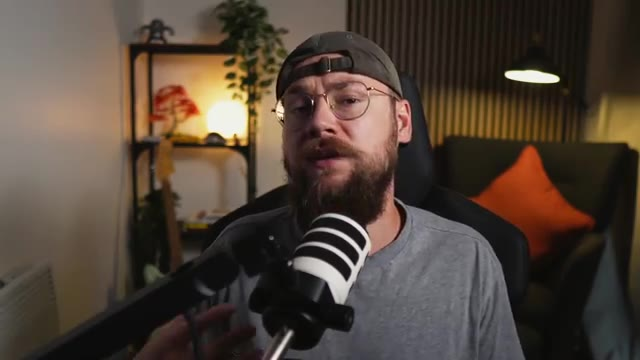

---

### ⏱️ `[00:06:22 - 00:06:56]` | Segment #10

**🔊 Audio (Transcription Intégrale Mot pour Mot en Français) :**
> qui a été capturé par ces scientifiques et qui d'une manière ou d'une autre émoussent ses pouvoirs et mènent toutes ces expériences sur lui. Il faut bien l'admettre, c'est une histoire assez différente du concept des paroles, mais c'est le cas de certains des meilleurs clips musicaux. Je me suis donc dirigé vers OpenArt, j'ai sélectionné l'onglet image sur le côté gauche, puis j'ai choisi GPT Image 2.5 comme modèle. Ensuite, j'ai téléchargé deux images de référence qui englobaient parfaitement ce genre de concept art pictural que je recherchais. Et puis j'ai déposé

**👁️ Analyse Visuelle d'Écran (gemini-3.5-flash-lite) :**
**Interface & Outils** : Interface web de la plateforme OpenArt Pro ("Jack Kennedy's workspace") affichée en mode sombre, avec un panneau de navigation latéral à gauche comprenant des sections pour les outils (Video, Image, World, Character, Audio), les agents (Chat Mode, Director Mode) et les actifs (Director Projects, Media). Dans le coin inférieur droit, une petite incrustation vidéo montre Jack face caméra avec son micro.

**Contenu textuel & Code** : Texte principal affiché à l'écran : "What are we making today?" avec les boutons "Agents" et "Tools". Dans la barre de saisie : "Film my perfume bottle on a" et un sélecteur "Chat Mode". Des suggestions rapides en dessous : "Create product ads", "Design a film poster", "Music for my film". En bas, la section "Direct Your Video" avec des vignettes de prévisualisation. Le logo "OpenArt Pro" est visible en haut à gauche.

**Action / Démonstration** : Le curseur de la souris (représenté par une main) clique sur l'onglet "Image" situé dans la section "TOOLS" du panneau latéral gauche de l'interface OpenArt.

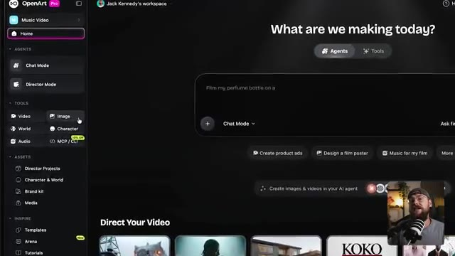

---

### ⏱️ `[00:06:56 - 00:07:14]` | Segment #11

**🔊 Audio (Transcription Intégrale Mot pour Mot en Français) :**
> ce très long prompt. Maintenant, je ne vais pas lire tout le truc en entier, mais si vous voulez essayer l'un de mes prompts, vous pouvez y accéder de manière totalement gratuite sur ma communauté Skool. Vous trouverez également un lien pour cela en bas dans la description. Mais essentiellement, nous pouvons diviser le prompt en trois sections principales.

**👁️ Analyse Visuelle d'Écran (gemini-3.5-flash-lite) :**
**Interface & Outils** : Navigateur web affichant la plateforme communautaire Skool ("Jack Vs. AI Workflows"). En bas à droite, une incrustation vidéo (caméra de Jack en direct avec micro).

**Contenu textuel & Code** : Interface Skool affichant plusieurs publications épinglées par "Jack Kennedy" : "How to Turn GPT-6 Astra Into Your Own 3D Studio (Prompts)", "The Half NOBODY Teaches... (New Course in the Classroom)", et "My A-Z of AI Video Production Course is LIVE!". Dans la barre latérale droite, la carte de profil de la communauté "Jack Vs. AI Workflows" avec les statistiques (19k membres, 70 en ligne), ainsi qu'une section "Suggested communities".

**Action / Démonstration** : Le curseur de la souris (flèche) est visible et survole la page principale de la communauté Skool au centre de l'écran, tandis que Jack parle dans l'incrustation vidéo en bas à droite.

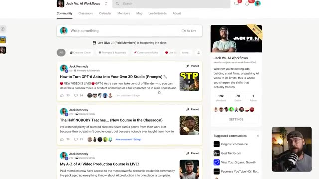

---

### ⏱️ `[00:07:15 - 00:07:35]` | Segment #12

**🔊 Audio (Transcription Intégrale Mot pour Mot en Français) :**
> D'abord, les sujets, cette version de moi torse nu et plutôt musclée. Ensuite, le style qui renforce cette esthétique brute et picturale. Et enfin, un cadre de feuille de personnage qui va montrer notre sujet sous tous les angles afin que, lorsque nous générerons nos vidéos plus tard, Seedance n'ait jamais à deviner.

**👁️ Analyse Visuelle d'Écran (gemini-3.5-flash-lite) :**
**Interface & Outils** : Interface vidéo éducative sur fond bleu dégradé avec un encart incrusté en bas à droite montrant le présentateur (Jack) face à sa caméra dans son studio, micro-cravate visible.

**Contenu textuel & Code** : Titre principal en haut à gauche : « prompt breakdown ». Texte détaillé affiché à l'écran divisé en plusieurs sections descriptives : « SUBJECT: a slim caucasian man... », « STYLE: flat gouache... », « CHARACTER SHAPE: balanced medium build... », et les instructions pour la « Character reference sheet — four views on a neutral grey background... » comprenant VIEW 1, VIEW 2, VIEW 3 et VIEW 4.

**Action / Démonstration** : Affichage fixe et détaillé des différents blocs du prompt à l'écran, tandis que le présentateur commente les choix esthétiques et techniques pour la génération de la feuille de personnage dans Seedance.

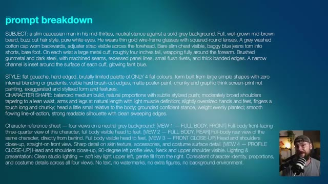

---

### ⏱️ `[00:07:35 - 00:07:59]` | Segment #13

**🔊 Audio (Transcription Intégrale Mot pour Mot en Français) :**
> Et c'est ce que j'ai obtenu en retour, exactement ce que je cherchais. Et nous avons même ces menottes métalliques, l'idée étant que ce sont elles qui l'empêchent d'utiliser ses capacités. Maintenant, je savais que j'avais besoin d'un autre personnage qui allait libérer le héros. J'ai donc en fait supprimé ces références initiales et fait glisser celle du personnage principal pour l'utiliser à la place.

**👁️ Analyse Visuelle d'Écran (gemini-3.5-flash-lite) :**
**Interface & Outils** : Plan rapproché (medium shot) de Jack face caméra dans son studio, assis dans une chaise de bureau noire, portant une casquette à l'envers et des lunettes cerclées de métal, avec un microphone sur pied noir et blanc placé juste devant lui au premier plan. L'arrière-plan montre une étagère en métal garnie de plantes et d'objets décoratifs, un éclairage d'ambiance chaleureux et un fauteuil avec un coussin orange.

**Contenu textuel & Code** : Aucun texte, prompt ou paramètre technique affiché à l'écran dans ce segment (séquence de type "talking head" où Jack s'adresse directement aux spectateurs).

**Action / Démonstration** : Jack s'adresse directement à la caméra, gesticulant légèrement de manière naturelle tout en parlant, le micro occupant une position centrale au premier plan.

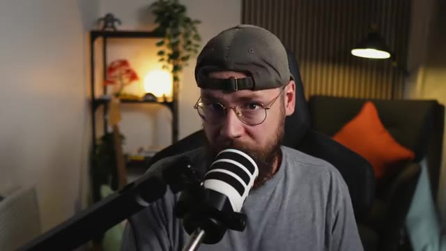

---

### ⏱️ `[00:07:59 - 00:08:22]` | Segment #14

**🔊 Audio (Transcription Intégrale Mot pour Mot en Français) :**
> Je suis retourné sur Claude et je lui ai décrit l'apparence que je voulais pour ce nouveau personnage. Donc cette actrice principale qui est une technicienne de laboratoire qui se sent un peu coupable de retenir ce type captif. J'ai copié ça de Claude et tout ce que j'avais à faire était de remplacer la description du sujet dans mon prompt existant, d'appuyer sur générer, et voilà ce que j'ai obtenu.

**👁️ Analyse Visuelle d'Écran (gemini-3.5-flash-lite) :**
**Interface & Outils** : Interface sombre de l'assistant conversationnel Claude affichée en plein écran sur fond sombre, avec en bas à droite un encadré vidéo incrusté (picture-in-picture) montrant le créateur Jack face caméra avec son micro. Le coin supérieur droit comporte un bouton de partage « Share », et le coin supérieur gauche affiche le titre de la conversation « Character description for Mediterranean woman ». Le bas de l'interface contient une zone de saisie de texte « Write a message... ».

**Contenu textuel & Code** : Le premier bloc de texte affiché est un prompt utilisateur : « I currently have the below prompt. I'd like you to use it as inspiration and write me a description for a different character. I'd like this character to be an attractive Mediterranean-looking woman in her early 30s with dark long hair with blonde balayage in it. She is wearing a long white lab coat. Current prompt below... » suivi d'une description détaillée d'un homme caucasien barbu en blouse de laboratoire et menottes métalliques high-tech. Le deuxième bloc est la réponse textuelle générée par l'IA (Claude) : une description physique complète et soignée de la femme méditerranéenne en blouse blanche, conservant les mêmes détails techniques pour les menottes lumineuses afin de maintenir la cohérence de l'univers visuel.

**Action / Démonstration** : La vue montre l'écran d'un ordinateur affichant une conversation en cours avec l'outil d'IA textuelle Claude, illustrant le processus itératif de rédaction du prompt de description de personnage avant de le transférer dans l'outil de génération vidéo. Un curseur de souris en forme de flèche est visible vers le bas de la fenêtre de discussion, au-dessus du champ de saisie de texte.

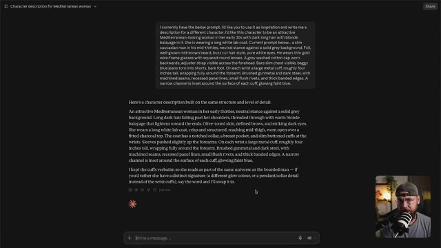

---

### ⏱️ `[00:08:22 - 00:08:42]` | Segment #15

**🔊 Audio (Transcription Intégrale Mot pour Mot en Français) :**
> Encore une fois, exactement ce que je cherchais. Je savais aussi que je devais créer une feuille de personnage pour ces scientifiques tordus. J'ai donc veillé à générer cela également en utilisant le même processus. La prochaine étape pour moi est de construire des moments clés sous forme d'images. Et j'aime penser à cela comme à des photogrammes de films qui découpent chaque scène.

**👁️ Analyse Visuelle d'Écran (gemini-3.5-flash-lite) :**
**Interface & Outils** : Jack face caméra dans son studio personnel, équipé d'un micro de baladodiffusion orienté vers lui. L'arrière-plan présente une étagère en bois garnie de décorations, une plante verte, une guitare, un fauteuil avec un coussin orange vif et un éclairage d'ambiance tamisé. Aucune interface logicielle n'est affichée à l'écran.

**Contenu textuel & Code** : Aucun texte, prompt de génération ni paramètre technique n'est affiché à l'écran.

**Action / Démonstration** : Jack est filmé en plan moyen serré, face à la caméra, en train de parler et d'expliquer son processus de création tout en gesticulant légèrement pour appuyer ses propos.

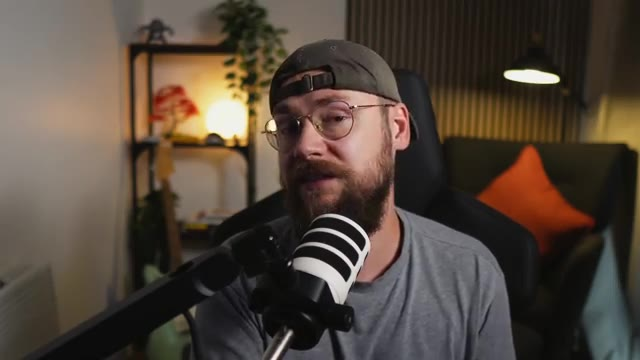

---

### ⏱️ `[00:08:43 - 00:09:09]` | Segment #16

**🔊 Audio (Transcription Intégrale Mot pour Mot en Français) :**
> Maintenant, j'aurais pu simplement balancer mes feuilles de personnages dans C-Dance avec un prompt et espérer que les résultats correspondent à ce que j'avais imaginé. Mais j'préfère largement passer un peu plus de temps lors de l'étape de génération d'images pour que chaque scène ait l'air correcte plutôt que de jouer aux dés avec la génération vidéo. Donc, à nouveau, je suis retourné sur Claude, j'ai téléchargé ma feuille de personnage et j'ai décrit cette scène initiale du personnage dans la forêt.

**👁️ Analyse Visuelle d'Écran (gemini-3.5-flash-lite) :**
**Interface & Outils** : Un personnage stylisé en animation 2D/3D (un homme barbu torse nu avec une casquette et des brassards technologiques) affiché au premier plan sur fond gris texturé, avec une incrustation vidéo (PiP) de Jack face caméra parlant dans un microphone en bas à droite de l'écran.

**Contenu textuel & Code** : Illustration détaillée d'un personnage de type cyberpunk/manga aux traits anguleux, montrant son torse musclé, sa barbe fournie, ses lunettes et sa casquette à l'envers, ainsi que des gants/brassards futuristes.

**Action / Démonstration** : Le personnage animé est affiché à l'écran tandis que l'incrustation vidéo montre Jack s'exprimant et gesticulant légèrement face caméra pour illustrer son processus créatif.

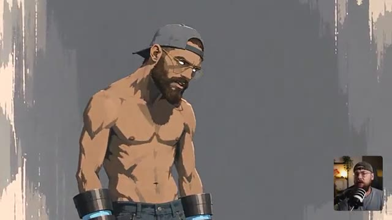

---

### ⏱️ `[00:09:09 - 00:09:30]` | Segment #17

**🔊 Audio (Transcription Intégrale Mot pour Mot en Français) :**
> L'idée, c'est qu'en fait, c'est la fin de l'histoire, quand il s'est échappé du laboratoire et qu'il a blessé toutes ces gens, et qu'il est en quelque sorte horrifié par ce qu'il a fait. J'ai donc pris ce prompt, je suis retourné sur Open Art et je l'ai exécuté via GPT Image 2.5. Et bien que le résultat fût bon, ce n'était pas vraiment ce que j'avais imaginé.

**👁️ Analyse Visuelle d'Écran (gemini-3.5-flash-lite) :**
**Interface & Outils** : Interface sombre d'un grand modèle de langage (type ChatGPT) affichée dans un navigateur web avec une disposition à deux colonnes, incluant une vue PiP (Picture-in-Picture) de Jack face caméra en bas à droite.

**Contenu textuel & Code** : Texte affiché dans le chat contenant des instructions de génération et des descriptions de scènes avec des balises comme « High angle (looking down) » et « Low angle (looking up) ». Un titre de discussion est visible en haut à gauche : « Bearded man in forest clearing after battle ».

**Action / Démonstration** : Le curseur de la souris survole un bouton « Copy » (copier) situé dans le coin supérieur droit d'un bloc de texte contenant un prompt descriptif détaillé.

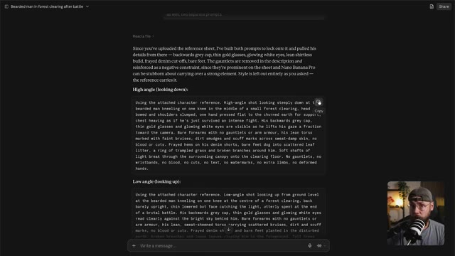

---

### ⏱️ `[00:09:30 - 00:10:03]` | Segment #18

**🔊 Audio (Transcription Intégrale Mot pour Mot en Français) :**
> Donc, une fois de plus, nous avons ce processus d'itération où je suis retourné vers Claude et j'ai demandé quelques modifications. J'ai décrit davantage la pose du personnage et j'ai demandé à voir plus de la zone environnante et à en faire un vert beaucoup plus luxuriant plutôt que ce brun terne que nous avions auparavant. Et l'exécution de ce prompt m'a apporté ce que je cherchais, cette fameuse scène d'ouverture pour le clip vidéo. J'ai donc répété ce processus plusieurs fois pour constituer une collection d'images qui montrent ces moments clés.

**👁️ Analyse Visuelle d'Écran (gemini-3.5-flash-lite) :**
**Interface & Outils** : Jack face caméra dans son studio, assis devant un microphone sur pied.

**Contenu textuel & Code** : Aucun texte ou prompt affiché à l'écran dans cette vue.

**Action / Démonstration** : Jack s'adresse directement aux spectateurs en gesticulant légèrement pour expliquer sa méthode d'itération des prompts.

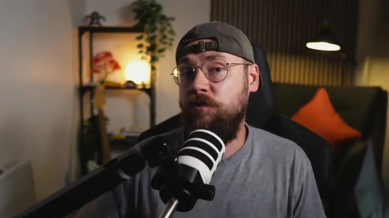

---

### ⏱️ `[00:10:03 - 00:10:38]` | Segment #19

**🔊 Audio (Transcription Intégrale Mot pour Mot en Français) :**
> de l'histoire. Nous avons le héros piégé dans cette cellule en verre et les scientifiques qui observent depuis leur poste d'observation. Ce beau gros plan sur ces mêmes scientifiques, là encore en pensant vraiment à raconter une histoire avec une seule image. On peut voir que la femme scientifique, elle est différente de ces types. Elle ne se sent pas à l'aise avec tout ce qui se passe. Nous avons quelques images de la scène de la chaise. J'essaie vraiment de faire en sorte que le spectateur déteste ces scientifiques ici. Et puis nous avons notre héros debout devant la porte blindée sur le point de s'échapper. Et ces vraiment super

**👁️ Analyse Visuelle d'Écran (gemini-3.5-flash-lite) :**
**Interface & Outils** : Interface sombre d'une application de génération d'images par IA avec panneau latéral droit pour le prompt, les images de référence et les paramètres. Une petite fenêtre vidéo de Jack (face caméra avec un micro) est incrustée dans le coin inférieur droit.

**Contenu textuel & Code** : Le prompt visible dans le panneau latéral indique : "SCENE: Using the attached character reference... woman. Close-up shot pushed in on the observation booth, viewed from outside through thick fortified — six scientists in white lab coats gathered close together at the control console, lit from below a...". Deux images miniatures sont affichées dans "REFERENCES". Les paramètres indiquent "GPT Image 2.5 Sunburst" avec le format "16:9". Le menu déroulant contient des options telles que "Check IP Safety", "Upscale", "Frame to video", "Expand image", "Video Reference", "Image Reference", "Create variant" et "Change style".

**Action / Démonstration** : L'écran principal affiche l'image d'un groupe de six scientifiques dans un poste d'observation, tandis que Jack apparaît en bas à droite en train de parler et d'animer sa vidéo.

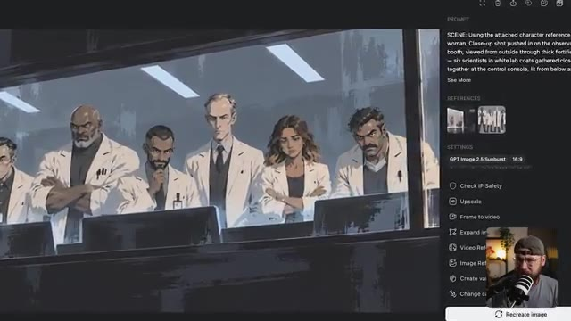

---

### ⏱️ `[00:10:38 - 00:11:04]` | Segment #20

**🔊 Audio (Transcription Intégrale Mot pour Mot en Français) :**
> des plans de lui en train de semer le chaos maintenant qu'il est enfin libre d'utiliser ses capacités. Essentiellement, j'ai généré des images de tous les moments que je ne voulais pas laisser au hasard. Si j'ai une idée précise de l'apparence que je veux donner à quelque chose, je m'en occupe pendant l'étape de génération d'images plutôt que de lutter contre C-Dance plus tard. Et sur ce, j'étais enfin prêt à passer à la génération de vidéo.

**👁️ Analyse Visuelle d'Écran (gemini-3.5-flash-lite) :**
**Interface & Outils** : Interface sombre d'une application de génération d'images et de vidéos par IA (similaire à Midjourney ou une plateforme propriétaire), avec une grande fenêtre modale centrale affichant une image générée. Sur la droite, un panneau de contrôle complet avec l'onglet "PROMPT", des vignettes de références ("REFERENCES"), des paramètres techniques ("SETTINGS"), et des options de post-traitement et de conversion ("Check IP Safety", "Upscale", "Frame to video", "Expand image", "Video Reference", "Image Reference", "Create variations", "Change camera angle"). Un encart incrusté en bas à droite montre le présentateur Jack face caméra dans son studio avec son micro et sa casquette.

**Contenu textuel & Code** : Texte du prompt visible dans le panneau latéral droit : « SCENE: Using the attached character references — the bearded man from the first reference, the woman from the second. Wide shot with the glass enclosure large and dominant in the foreground: the bearded man in his backwards grey cap, thin gold glasses and glowing white... » [voir la suite avec "See More"]. Dans la section des paramètres (SETTINGS) : modèle "GPT Image 2.5 Sunburst", format d'image "16:9". Trois petites images de référence sont affichées dans la section "REFERENCES".

**Action / Démonstration** : La fenêtre modale présente une image détaillée d'un homme barbu enfermé dans une grande cage en verre dans une pièce sombre, avec des scientifiques qui l'observent en arrière-plan. L'interface est fixe, le créateur commente vocalement le processus de génération d'images et l'utilisation de références avant de passer à l'étape vidéo.

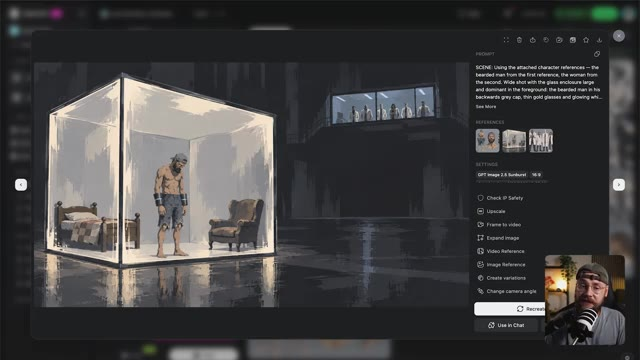

---

### ⏱️ `[00:11:04 - 00:11:29]` | Segment #21

**🔊 Audio (Transcription Intégrale Mot pour Mot en Français) :**
> Et c'est là que les choses deviennent vraiment amusantes. Maintenant, il y a une petite quantité de préparation à faire ici. Essentiellement, ce que vous voulez faire, c'est retourner sur Suno et télécharger les pistes séparées (« stems ») pour votre morceau. Cela signifie que vous aurez les pistes vocales et instrumentales sous forme de fichiers audio séparés. Vous voulez ensuite les importer dans votre logiciel de montage et les découper en sections qui semblent naturelles plutôt que de couper au milieu d'un couplet, par exemple.

**👁️ Analyse Visuelle d'Écran (gemini-3.5-flash-lite) :**
**Interface & Outils** : Navigateur web affichant l'interface de la plateforme de génération musicale Suno (section Workspaces > My Workspace), avec une fenêtre modale centrale de séparation audio (« Extract Stems and MIDI »). Une incrustation vidéo en bas à droite montre le présentateur Jack dans son studio face à un microphone.

**Contenu textuel & Code** : Fenêtre modale Suno intitulée « Extract Stems and MIDI », affichant le titre de la chanson « I Just Can't » avec les options de séparation : « Auto split », « Split from mix », « Advanced split (New) ». Bouton orange « Extract ». Pistes séparées visibles : « Lead Vocal » (en rose) et « Everything but Lead Vocal ». Menu déroulant ouvert montrant les options de téléchargement : « MP3 Audio (Small files, fast download) » et « WAV Audio (Large files, high quality) ».

**Action / Démonstration** : Le curseur de la souris survole les options de téléchargement d'une piste vocale isolée (« Lead Vocal ») dans la fenêtre d'extraction des stems de Suno, affichant le menu contextuel pour choisir entre les formats MP3 et WAV.

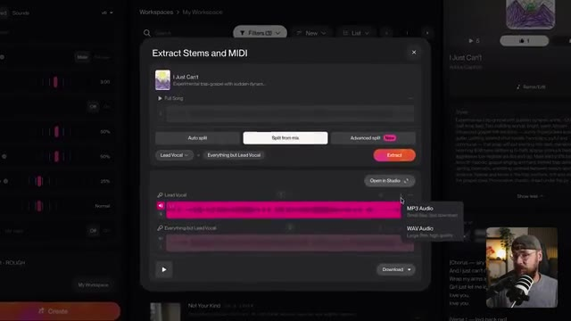

---

### ⏱️ `[00:11:30 - 00:12:08]` | Segment #22

**🔊 Audio (Transcription Intégrale Mot pour Mot en Français) :**
> Maintenant, vous pouvez faire ces sections aussi courtes que vous le souhaitez, mais vous ne voulez pas dépasser 30 secondes parce que c'est la longueur maximale que Seedance 2.5 peut générer. Vous voulez également écarter la piste instrumentale afin que chacune de ces sections ressemble à ceci. Vous voulez ensuite exporter chacun de ces courts clips non pas comme des fichiers audio mais comme des vidéos vierges.

**👁️ Analyse Visuelle d'Écran (gemini-3.5-flash-lite) :**
**Interface & Outils** : Le logiciel de montage Adobe Premiere Pro est affiché à l'écran, divisé en plusieurs panneaux : le panneau de visualisation des sources en haut à gauche, le moniteur de programme au centre, le panneau des propriétés en haut à droite, le chutier (bin) des fichiers audio et vidéo en bas à gauche, et la timeline multipiste (vidéo et audio) en bas au centre, avec une miniature incrustée de Jack dans le coin inférieur droit.

**Contenu textuel & Code** : Le panneau du chutier affiche plusieurs clips audio/vidéo nommés "Suno Stems PART 1", "Suno Stems PART 2", etc., stockés dans un dossier "2.5 MUSIC VIDEOStems". La timeline montre des pistes audio vertes superposées et synchronisées.

**Action / Démonstration** : Le curseur de la souris survole la timeline du projet Premiere Pro, illustrant la manipulation et l'organisation des pistes audio de Suno en vue de leur exportation ultérieure au format vidéo vierge.

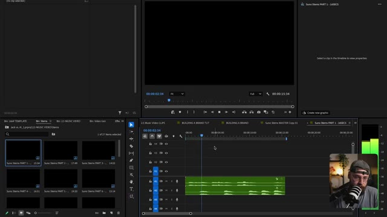

---

### ⏱️ `[00:12:08 - 00:12:35]` | Segment #23

**🔊 Audio (Transcription Intégrale Mot pour Mot en Français) :**
> à la place, parce que cela fonctionne mieux pour la synchronisation labiale avec C-Dance. Maintenant, de retour sur OpenArt, vous voulez basculer sur l'onglet vidéo avec Seedance 2.5 sélectionné comme modèle. Vous voulez ensuite importer l'une de ces vidéos vierges comme référence. J'utilise aussi la fiche de personnage et l'image fixe de la scène comme références d'images. Ainsi, nous fournissons à C-Dance autant de contexte que possible.

**👁️ Analyse Visuelle d'Écran (gemini-3.5-flash-lite) :**
**Interface & Outils** : Interface web de la plateforme OpenArt Pro, affichant le panneau de configuration principal pour la génération vidéo avec l'outil « Text to Video », une modale centrale « Add visual references » ouverte sur l'onglet « Video » avec un statut de chargement (« Uploading... »), et en bas à droite, une incrustation vidéo montrant Jack face caméra avec son micro et sa casquette.

**Contenu textuel & Code** : Modèle sélectionné : « Seedance 2.5 ». Dans la modale « Add visual references », un avertissement orange : « Character + Image ≤ 30 files • Video ≤ 10 files • Audio ≤ 10 files ». Sous-onglets actifs dans la modale : « Characters & Worlds », « Image », « Video », « Audio », avec les sous-catégories « Creations », « Uploads », « Favorites ». Une vignette vidéo noire en cours de téléversement affiche le texte « Uploading... ». Le bouton rose inférieur indique « Generate • 846 ».

**Action / Démonstration** : L'utilisateur est en train de téléverser une vidéo de référence vierge (pour la synchronisation labiale) dans l'onglet « Video » de la modale des références visuelles sur OpenArt Pro, tout en préparant les autres paramètres de génération avec le modèle Seedance 2.5.

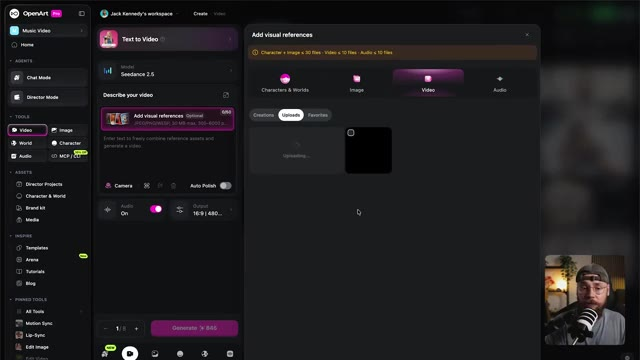

---

### ⏱️ `[00:12:35 - 00:13:28]` | Segment #24

**🔊 Audio (Transcription Intégrale Mot pour Mot en Français) :**
> Le haut du prompt décrit essentiellement la scène et l'action que je voulais voir se produire. Et vous voulez toujours vous assurer d'écrire toutes les paroles à la fin du prompt pour que tout soit vraiment clair pour C-Dance. Il n'a pas à deviner à aucun moment. Avec cela, j'ai sélectionné 16 par 9 comme format d'image, 1080p pour la résolution, et ensuite je me suis assuré que la durée correspondait à la longueur de notre clip vidéo vierge. J'ai cliqué sur générer, et c'est ce que j'ai obtenu en retour. Donc un résultat plutôt cool, mais comme vous pouvez le voir, C-Dance a définitivement pris quelques libertés créatives

**👁️ Analyse Visuelle d'Écran (gemini-3.5-flash-lite) :**
**Interface & Outils** : Interface utilisateur web de l'outil de génération vidéo par IA C-Dance, affichant un panneau de configuration des paramètres de sortie ("Output") et une vue en incrustation ("picture-in-picture") de Jack s'exprimant face caméra dans le coin inférieur droit.

**Contenu textuel & Code** : Dans le panneau de configuration des paramètres de sortie : option de format d'image ("Aspect ratio") avec les ratios 9:16, 3:4, 1:1, 4:3, 16:9 (sélectionné) et 21:9 ; option de résolution avec 480p, 720p et 1080p (sélectionné) ; option de durée ("Duration") réglée sur "16s". En arrière-plan à gauche, le panneau de saisie du prompt textuel affichant un extrait descriptif et des paroles de chanson. En bas, le bouton violet "Generate ✨ 845".

**Action / Démonstration** : Le curseur de la souris survole les paramètres de sortie de l'interface C-Dance tandis que le panneau modal des réglages (ratio, résolution, durée) est ouvert.

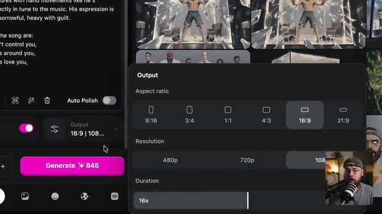

---

### ⏱️ `[00:13:28 - 00:14:06]` | Segment #25

**🔊 Audio (Transcription Intégrale Mot pour Mot en Français) :**
> en ajoutant du piano et même des voix supplémentaires, mais cela n'a en fait aucune importance. L'essentiel est que la performance et la synchronisation labiale soient parfaitement calées sur notre chanson. Et nous n'avons pas vraiment besoin de l'audio de C-Dance. Nous pouvons simplement le couper et le superposer à notre chanson. Je vais vous expliquer exactement comment monter tout cela dans un instant. Mais d'abord, laissez-moi vous montrer quelques exemples supplémentaires. Nous avons cette séquence d'action vraiment cool ici. Évidemment, nous jouons un peu avec la structure narrative. La première scène montrait le personnage honteux de ce qu'il est

**👁️ Analyse Visuelle d'Écran (gemini-3.5-flash-lite) :**
**Interface & Outils** : L'image montre une interface logicielle sombre de génération de vidéo par IA, similaire à une plateforme web de type Seedance 2.5 (ou Byte Plus Seedance). Au centre, un lecteur vidéo affiche la frame en cours de lecture. Sur la droite, un panneau de configuration complet présente la zone de prompt, les vignettes de référence, les paramètres techniques, l'ID d'actif, et des options d'édition (Check IP Safety, Upscale, Dub Video, Grab a frame, Recreate, Use in Chat). En bas à droite, une petite incrustation vidéo (PiP) montre Jack face caméra, portant une casquette à l'envers, des lunettes et une barbe, avec un microphone de studio professionnel.

**Contenu textuel & Code** : Le prompt visible dans le panneau de droite commence par : « A painterly animated multi-shot sequence shows a bearded man in a backwards grey cap, thin gold glasses and glowing white eyes, shirtless in frayed denim shorts, kneeling alone in a sunlit green forest clearing, singing softly to himself. The sequence opens on a wide high-... ». Les vignettes de référence sous « REFERENCES » incluent une image noire, un portrait du personnage et un paysage forestier. Dans la section « SETTINGS », on lit : « Byte Plus Seedance 2.5 », « 10s », « 16:9 », « 1080p », « Audio On », et la date de création « Creation time: 9/22/2026 16:20:22 ». L'identifiant « ASSET ID » est « QO1VIHIQSvQfDrg4p6b5 ». Le bouton du bas indique « Recreate » et « Use in Chat ».

**Action / Démonstration** : L'interface présente la lecture d'une vidéo animée montrant un gros plan très serré sur l'œil grand ouvert d'un personnage de style anime, aux yeux brillants et au trait peint. La vidéo est en pause ou en cours de lecture dans le lecteur central de l'application de génération, tandis que le panneau latéral détaille les réglages et que Jack apparaît en incrustation vidéo en bas à droite pour commenter les séquences.

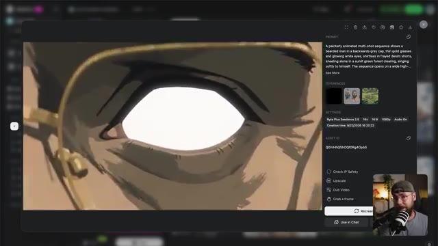

---

### ⏱️ `[00:14:06 - 00:14:38]` | Segment #26

**🔊 Audio (Transcription Intégrale Mot pour Mot en Français) :**
> c'est fait et maintenant on voit vraiment ce que c'était. Vous allez remarquer qu'il n'y a pas de synchronisation labiale pendant cette scène malgré le fait que j'aie demandé à ce qu'elle soit ajoutée. Et il y a deux raisons pour lesquelles j'ai quand même fini par utiliser cette génération. Un, j'ai juste trouvé ça vraiment cool. Seed Arts a vraiment bien intégré tous ces moments clés dans la scène. Mais aussi, j'ai appris quelque chose de cet exemple que je voulais vous faire remarquer, et c'est que s'il y a trop d'action en même temps, Seedance souvent

**👁️ Analyse Visuelle d'Écran (gemini-3.5-flash-lite) :**
**Interface & Outils** : Interface web de Seedance 2.5 sous forme de visionneuse vidéo modale, avec un panneau latéral droit affichant les détails du prompt, les références visuelles, les paramètres de génération et les boutons d'action. En bas à droite de l'écran, un retour caméra en direct de Jack avec son micro.

**Contenu textuel & Code** : Prompt de génération : "A painterly animated multi-shot sequence shows a bearded man in a backwards grey cap, thin gold glasses and glowing white eyes, bare-armed and shirtless in frayed denim shorts, barefoot, walking into a long white semi-futuristic hallway in a secret underground lab. Th...". Paramètres : Byte Plus Seedance 2.5, 18s, 16:9, 1080p, Audio On. Date de création : 9/22/2025 16:51:33. Quatre images de référence visibles dans le panneau.

**Action / Démonstration** : Le lecteur vidéo Seedance affiche la lecture d'une séquence animée dans un style pictural où un homme barbu projette en l'air un soldat armé par télékinésie dans un couloir aseptisé.

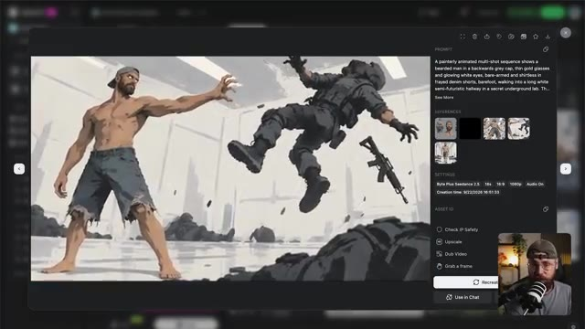

---

### ⏱️ `[00:14:38 - 00:15:12]` | Segment #27

**🔊 Audio (Transcription Intégrale Mot pour Mot en Français) :**
> donne la priorité à cela par rapport à la synchronisation labiale. Évidemment, c'est une scène d'action très complexe, donc je pense que si vous surchargez le modèle vidéo, vous risquez de ne pas obtenir la synchronisation labiale. Cela contraste joliment avec la scène où notre héros est piégé dans sa cellule. Parce que cette scène est plutôt simpliste, il erre simplement à l'intérieur de ce cube de verre, la synchronisation labiale devient prioritaire. Même dans cette scène suivante où le héros subit des expériences, parce qu'il est littéralement attaché à un

**👁️ Analyse Visuelle d'Écran (gemini-3.5-flash-lite) :**
**Interface & Outils** : Interface sombre d'une application de génération de vidéo par IA avec un panneau latéral à droite contenant les paramètres et le prompt, et une incrustation vidéo miniature de Jack dans le coin inférieur droit.

**Contenu textuel & Code** : Le prompt visible est : "A painterly animated multi-shot sequence shows a bearded man in a backwards grey cap, thin gold glasses and glowing white eyes, wearing metallic gauntlets on both forearms, shirtless in frayed denim shirts, barefoot, pacing restlessly inside his sealed glass...". Les paramètres affichés incluent "Byte Plus Seedance 2.5", "14s", "16:9", "1080p", "Audio On" et l'ID d'actif "UHYJJ32jFNxZnRjl1PM".

**Action / Démonstration** : La vidéo du personnage animé s'affiche dans le lecteur principal à l'écran tandis que le présentateur (Jack) commente la synchronisation labiale et la complexité des scènes dans l'encadré vidéo en bas à droite.

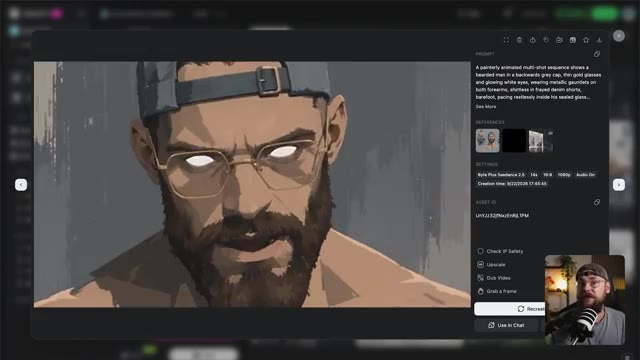

---

### ⏱️ `[00:15:12 - 00:15:45]` | Segment #28

**🔊 Audio (Transcription Intégrale Mot pour Mot en Français) :**
> chaise, encore une fois la synchronisation labiale fonctionne vraiment bien. J'ai initialement testé le fait de faire électrocuter le héros à plusieurs reprises. Et bien que ce soit un bon résultat, cela signifiait que chaque fois qu'il recevait une décharge, il s'arrêtouit de chanter, ce qui paraissait un peu étrange dans le contexte de la chanson. C'est donc un exemple très littéral de cette sorte de bataille entre l'action et la synchronisation labiale. Évidemment, j'essaie vraiment de repousser les limites ici en termes de narration. Je n'aime jamais faciliter la tâche à ces outils. Mais un élément clé

**👁️ Analyse Visuelle d'Écran (gemini-3.5-flash-lite) :**
**Interface & Outils** : Interface utilisateur d'un outil de génération vidéo par IA (probablement hébergé sur le web). La fenêtre modale principale montre un aperçu vidéo centré. Sur le côté droit, un panneau latéral rassemble les sections "PROMPT", "REFERENCES", "SETTINGS", et "ASSET ID" avec plusieurs options de post-traitement en bas (Check IP Safety, Upscale, Dub Video, Grab a frame). En bas à droite, une incrustation vidéo (PiP) affiche le visage de Jack dans son studio, coiffé d'une casquette et portant des lunettes, parlant devant un microphone.

**Contenu textuel & Code** : Le prompt visible dans le panneau de droite indique : "A painterly animated multi-shot sequence shows a bearded man in a backwards grey cap, thin gold glasses and glowing white eyes, shirtless in frayed denim shorts, barefoot, strapped down into a heavy clinical examination chair in a bright, sterile white laboratory,...". Sous "SETTINGS", on peut lire : "Byte Plus Seedance 2.5", le modèle utilisé, ainsi que les paramètres "17s", "16:9", "1080p", "Audio On", et la date de création "Creation time: 9/23/2026 07:15:15". L'Asset ID est également affiché ("N1OfEWz4NlENT2cnQFgvL"). Dans l'aperçu vidéo, on voit la main d'un homme attachée par des sangles à un accoudoir, traversée par des arcs électriques.

**Action / Démonstration** : La vidéo se lit dans l'interface montrant les éclairs autour de la main du personnage attaché sur la chaise clinique. Jack apparaît dans l'encadré en bas à droite, gesticulant et expliquant ses tests de synchronisation labiale face à sa webcam.

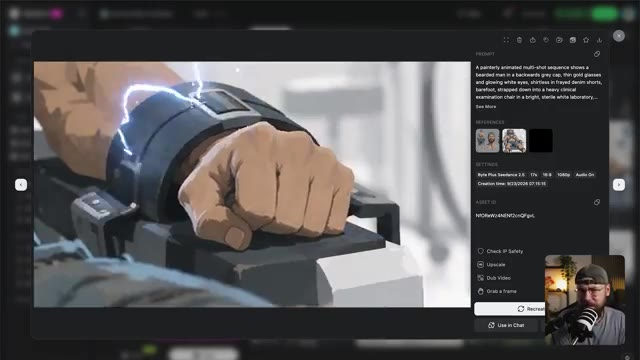

---

### ⏱️ `[00:15:45 - 00:16:07]` | Segment #29

**🔊 Audio (Transcription Intégrale Mot pour Mot en Français) :**
> L'enseignement ici est que si la synchronisation labiale est votre priorité, essayez de garder vos scènes assez simples et vous aurez alors beaucoup plus de chances d'obtenir le résultat que vous recherchez. Maintenant, jetons un coup d'œil à la façon dont nous assemblons réellement la séquence. J'utilise Premiere Pro, mais vous pouvez vraiment utiliser n'importe quel logiciel de montage que vous souhaitez. Pour commencer, j'ai superposé chacune de nos pistes audio.

**👁️ Analyse Visuelle d'Écran (gemini-3.5-flash-lite) :**
**Interface & Outils** : Écran de titre animé affichant une transition de chapitre sur fond sombre.

**Contenu textuel & Code** : Texte à l'écran : "6 Editing techniques" (6 techniques de montage), avec le chiffre "6" en gros caractères bleus lumineux, le mot "Editing" en blanc au milieu, et "techniques" en plus petit en dessous.

**Action / Démonstration** : Animation graphique de transition avec des cercles lumineux néon bleu s'entrecroisant sur un fond dégradé sombre, annonçant la section sur les techniques de montage.

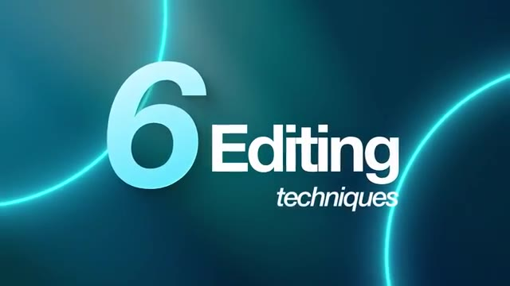

---

### ⏱️ `[00:16:07 - 00:16:57]` | Segment #30

**🔊 Audio (Transcription Intégrale Mot pour Mot en Français) :**
> Donc nous avons la voix principale, les chœurs et la piste instrumentale tout en bas. Et ensuite tout ce que vous avez à faire est de déposer votre génération C-Dance par-dessus la piste audio. Nous pouvons ensuite nous débarrasser de tout audio qui accompagnait la génération C-Dance puisque bien sûr nous utilisons uniquement la musique créée par Suno. Et de manière générale c'est aussi simple que ça parce que C-Dance fait un travail vraiment formidable pour préserver le timing et produire cette synchronisation labiale vraiment efficace. Maintenant laissez-moi vous présenter quelques-uns des autres the tricks de montage que j'ai utilisés tout au long de ce

**👁️ Analyse Visuelle d'Écran (gemini-3.5-flash-lite) :**
**Interface & Outils** : Jack face caméra, plan moyen serré, enregistré dans son studio personnel avec des étagères en arrière-plan, une lampe design et un coussin orange sur un fauteuil. Jack porte une casquette à l'envers, des lunettes et un t-shirt gris, et parle directement devant un microphone de studio blanc et noir monté sur un bras articulé.

**Contenu textuel & Code** : Aucun texte textuel ou paramètre technique visible à l'écran, plans de tournage brut sans interface logicielle.

**Action / Démonstration** : Jack s'adresse directement aux spectateurs en face caméra, gesticulant légèrement pour expliquer sa méthodologie de montage et l'intégration des pistes audio issues de Suno et C-Dance.

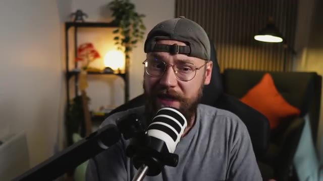

---

### ⏱️ `[00:16:57 - 00:17:28]` | Segment #31

**🔊 Audio (Transcription Intégrale Mot pour Mot en Français) :**
> processus pour vraiment élever le résultat final. Pour la première scène, j'ai ajouté cette piste audio ici, et c'est une sorte d'ambiance de forêt. On peut entendre des oiseaux chanter. C'est très discret dans le mixage, mais ça aide vraiment à ajouter un peu plus d'atmosphère. Et ensuite, nous avons cette très belle transition à travers l'œil du héros. Donc ce qui se passe, c'est que lorsque l'on obtient cette image entièrement blanche, elle devient une image fixe qui fait lentement un fondu enchaîné vers la scène suivante.

**👁️ Analyse Visuelle d'Écran (gemini-3.5-flash-lite) :**
**Interface & Outils** : Logiciel de montage vidéo Adobe Premiere Pro, divisé en plusieurs panneaux : un panneau Source en haut à gauche, un moniteur Programme au centre, un panneau Audio en haut à droite, un panneau Projet/Bibliothèque en bas à gauche, une timeline multipiste en bas au centre, un vu-mètre audio en bas à droite, ainsi qu'une petite fenêtre incrustée affichant Jack face caméra avec son micro.

**Contenu textuel & Code** : Dans la timeline, on aperçoit plusieurs pistes vidéo (V1) et audio (A1 à A4), une piste de calque d'effet (Adjustment Layer), ainsi qu'un fichier audio nommé « ambient-spring-forest-323801.mp3 » placé sur une piste audio. Dans le panneau de projet, des dossiers nommés « 2.5 MUSIC VIDEO », « Video Gen », « Stems », et « Recordings » sont visibles, ainsi que des miniatures de clips. Dans la fenêtre incrustée, Jack porte une casquette et s'exprime devant un micro de studio.

**Action / Démonstration** : Le curseur de la timeline est positionné autour de 00:00:14:39, illustrant la manipulation des pistes audio et la création de transitions visuelles (fondu enchaîné et image fixe) au sein du montage de la vidéo générée par IA.

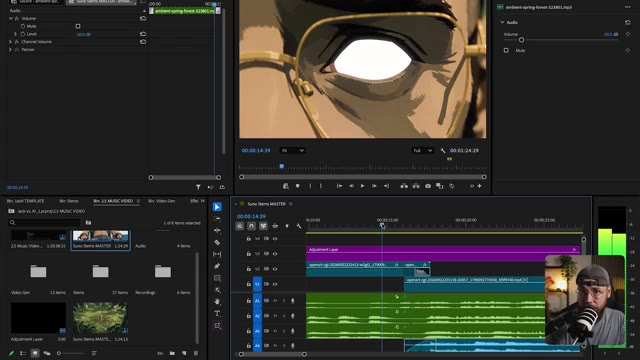

---

### ⏱️ `[00:17:28 - 00:17:52]` | Segment #32

**🔊 Audio (Transcription Intégrale Mot pour Mot en Français) :**
> J'ai décidé d'ajouter un nœud de correction colorimétrique ici pour ramener cela en noir et blanc, afin de vraiment vendre l'idée que nous jouons avec la structure narrative et de montrer au spectateur que cela se produisait dans le passé. Et cela signifie que lorsque j'ajoute le titre qui indique "Il y a deux jours", ce jaune est vraiment percutant par rapport à la scène en noir et blanc elle-même.

**👁️ Analyse Visuelle d'Écran (gemini-3.5-flash-lite) :**
**Interface & Outils** : Interface du logiciel de montage Adobe Premiere Pro, divisée en plusieurs panneaux : le panneau des options d'effet (à gauche), le moniteur de programme affichant un plan en noir et blanc d'un homme musclé au centre, le panneau des propriétés de transformation (à droite), le panneau du projet/bina (en bas à gauche) et la timeline complète avec les pistes audio et vidéo (en bas au centre), incluant une incrustation vidéo (PiP) du créateur Jack parlant devant son micro en bas à droite.

**Contenu textuel & Code** : Panneau des options d'effet montrant les paramètres de transformation (Scale à 100.0, Rotation à 0.0, Opacity à 100.0%), le panneau Lumetri Color, ainsi que les pistes audio (Volume, Mute, Level à -5.0 dB). Dans le moniteur de programme, un plan graphique en noir et blanc d'un personnage principal barbu au centre, entouré d'ennemis en train de voler ou de chuter, avec l'heure 00:00:23:34. Sur la timeline, des couches de réglage (Adjustment Layer) et des clips audio/vidéo nommés "openart-cg" sont disposés sur les pistes V1, A1, A2, A3.

**Action / Démonstration** : Le logiciel Adobe Premiere Pro est en cours d'utilisation, affichant la lecture d'une séquence vidéo dynamique où un clip d'action en noir et blanc est manipulé et monté sur la timeline, tandis que Jack apparaît dans l'encart vidéo en bas à droite en train de commenter son processus de montage et de correction colorimétrique.

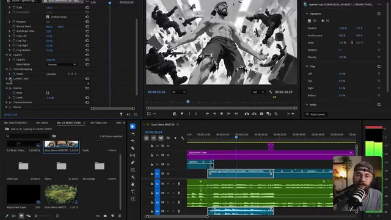

---

### ⏱️ `[00:17:52 - 00:18:25]` | Segment #33

**🔊 Audio (Transcription Intégrale Mot pour Mot en Français) :**
> J'ai aussi intégré chaque partie du texte avec les voix pour obtenir un timing intéressant. Même la scène suivante tombe exactement sur le beat, et cette idée de synchronisation rythmique est une technique que j'utilise tout au long de ce clip musical. Ensuite, j'ai inséré ce plan de coupe qui montre les scientifiques dans une sorte de salle d'observation. De retour sur Open Art, j'ai décidé de générer quelques séquences sans aucune synchronisation labiale, qui sont simplement là pour enrichir l'histoire.

**👁️ Analyse Visuelle d'Écran (gemini-3.5-flash-lite) :**
**Interface & Outils** : Jack face caméra dans son studio personnel, éclairé par une lampe d'appoint orange à l'arrière-plan, un meuble de rangement avec des plantes vertes et des objets décoratifs, un fauteuil confortable avec un coussin orange et un microphone sur pied placé devant lui.

**Contenu textuel & Code** : Aucun texte, prompt ou paramètre technique affiché à l'écran dans ce plan.

**Action / Démonstration** : Jack s'adresse directement aux spectateurs en face caméra, parlant de ses techniques de montage et de synchronisation rythmique pour son clip musical réalisé par intelligence artificielle.

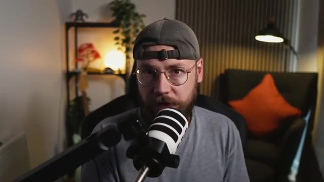

---

### ⏱️ `[00:18:25 - 00:18:59]` | Segment #34

**🔊 Audio (Transcription Intégrale Mot pour Mot en Français) :**
> Un tout petit peu plus. C'est un moment vraiment rapide mais important car il nous présente les méchants de l'histoire, mais il montre aussi au spectateur que la femme scientifique n'est pas heureuse de ce qui se passe et cela annonce bien ce qui va se passer plus tard. Maintenant, encore une fois, j'ai un peu joué avec le timing de ce clip pour que lorsque la femme scientifique ferme les yeux, cela tombe exactement sur le temps fort. Laissez-moi vous montrer. Ensuite, nous avons la séquence du héros attaché à la chaise.

**👁️ Analyse Visuelle d'Écran (gemini-3.5-flash-lite) :**
**Interface & Outils** : Jack face caméra dans son studio, avec un micro-cravate ou un micro de bureau orienté vers lui, une étagère en arrière-plan avec des plantes et des objets de décoration, ainsi qu'un fauteuil avec un coussin orange et une lampe sur pied.

**Contenu textuel & Code** : Aucun texte affiché à l'écran, pas de prompt ni de paramètre technique visible dans ce plan.

**Action / Démonstration** : Jack est assis face caméra, parlant en direct au spectateur avec un ton analytique, gesticulant légèrement pour appuyer ses explications sur le montage et la synchronisation rythmique.

---

### ⏱️ `[00:18:59 - 00:19:19]` | Segment #35

**🔊 Audio (Transcription Intégrale Mot pour Mot en Français) :**
> Et encore une fois, nous avons ici un très beau plan de coupe des scientifiques. Le but étant vraiment de faire détester ces types au spectateur. Plus tard, nous avons une autre séquence sans synchronisation labiale où la femme scientifique en a enfin assez de tolérer cette situation.

**👁️ Analyse Visuelle d'Écran (gemini-3.5-flash-lite) :**
**Interface & Outils** : Interface logicielle de montage vidéo professionnel (Adobe Premiere Pro), divisée en plusieurs panneaux : le panneau des effets et des options d'effet à gauche, le moniteur de prévisualisation source/programme au centre, les propriétés de transformation à droite, le panneau de gestion des chutiers (Project/Bin) en bas à gauche, la timeline multi-pistes au centre en bas, et une incrustation vidéo miniature (PiP) de Jack face caméra avec son micro en bas à droite.

**Contenu textuel & Code** : Dans le panneau de gauche et de droite, des paramètres de contrôle vidéo et d'effets visuels sont affichés : échelle (Scale), rotation, point d'ancrage (Anchor Point), opacité, mode de fusion (Blend Mode), réremappage temporel (Time Remapping) avec une vitesse à 0,00 %, volume audio à -5,0 dB, ainsi que des paramètres de recadrage (Crop Left, Crop Top, Crop Right, Crop Bottom). Dans la timeline, on aperçoit des pistes vidéo (V1, V2, V3) avec notamment un calque d'ajustement (Adjustment Layer) violet, des pistes audio (A1, A2, A3, A4) en vert avec des formes d'onde détaillées, et un timecode affichant 00:00:56:04. La fenêtre du chutier liste des éléments tels que « Jack vs. AI_1.prproj », « 2.5 MUSIC VIDEO », « Suno Stems MASTER », « Video Gen », « Stems » et « Recordings ». Dans le moniteur vidéo principal, on aperçoit le plan de coupe d'un scientifique au style animé/dessin, portant des lunettes et une blouse blanche.

**Action / Démonstration** : Le logiciel de montage affiche la timeline en cours de lecture ou de navigation, avec le curseur temporel positionné autour de 00:00:45:00. Les différentes pistes audio et vidéo sont agencées pour le montage du projet, tandis que Jack apparaît en incrustation vidéo dans le coin inférieur droit, s'exprimant face à sa caméra.

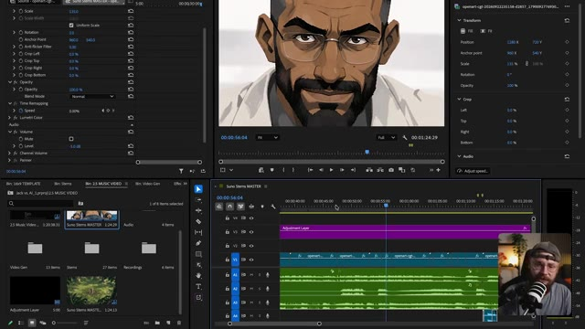

---

### ⏱️ `[00:19:20 - 00:19:44]` | Segment #36

**🔊 Audio (Transcription Intégrale Mot pour Mot en Français) :**
> Elle tape le code pour libérer notre héros de ces menottes. Et quand je lis cette séquence, remarquez à quel point l'action s'accorde bien avec ce joli petit riff vocal descendant. Je trouve que cela ajoute un peu plus de drame à ce qui se passe. Ensuite, nous avons la séquence où le héros peut enfin utiliser à nouveau ses capacités.

**👁️ Analyse Visuelle d'Écran (gemini-3.5-flash-lite) :**
**Interface & Outils** : Logiciel de montage vidéo Adobe Premiere Pro, divisé en quatre panneaux principaux : le moniteur Source en haut à gauche (vide), le moniteur de Programme en haut au centre affichant la vidéo d'une femme de dos dans une salle de contrôle, le panneau des Propriétés à droite, le panneau Projet (ou Navigateur de médias) en bas à gauche avec le dossier « Bin: 2.5 MUSIC VIDEO », la timeline multipiste (V1-V6, A1-A4) en bas au centre, le vumètre audio à droite, et l'incrustation vidéo de Jack face caméra avec son micro dans le coin inférieur droit.

**Contenu textuel & Code** : Dans la timeline, on aperçoit des pistes vidéo avec des clips (« Adjustment Layer », « openart-cgh... ») et plusieurs pistes audio vertes superposées. Dans le panneau de projet, les sous-dossiers affichent « Video Gen », « Stems », « Recordings », avec des clips miniatures (« 2.5 Music Video... », « Suno Stems MASTER »). Aucun prompt textuel ou paramètre de génération n'est directement lisible sur l'image.

**Action / Démonstration** : Jack manipule le projet de montage sous Adobe Premiere Pro, positionnant la tête de lecture sur la timeline pour lancer la lecture de la séquence vidéo où la femme tape le code, synchronisant l'image avec la piste audio affichée.

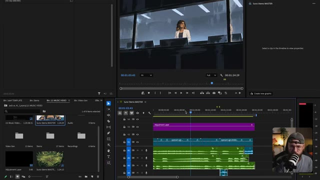

---

### ⏱️ `[00:19:45 - 00:20:21]` | Segment #37

**🔊 Audio (Transcription Intégrale Mot pour Mot en Français) :**
> Il brise simplement la vitre de chaque côté de la cellule, puis sort en homme libre. La synchronisation labiale fonctionne vraiment très bien ici, en particulier ce mouvement de bouche à la fin où il exécute cette petite vocalise. C'est donc plutôt impressionnant de voir que C-Dance comprend la synchronisation labiale au-delà de simples mots et peut même ajouter une interprétation pour ces phrases musicales. J'ai également ajouté ce calque d'effet, qui applique une collection d'effets à tous les clips vidéo situés en dessous. Nous avons donc cette couleur Lumetri qui introduit

**👁️ Analyse Visuelle d'Écran (gemini-3.5-flash-lite) :**
**Interface & Outils** : Logiciel de montage vidéo Adobe Premiere Pro, divisé en plusieurs panneaux : le panneau Projet/Média en bas à gauche, le panneau Moniteur Source/Programme en haut, le panneau Timeline (Suno Stems MASTER) en bas au centre avec différentes pistes vidéo et audio (V1, V2, A1 à A4) et un calque d'ajustement mauve, et un encadré vidéo incrusté en bas à droite montrant le présentateur (Jack) face caméra avec un micro.

**Contenu textuel & Code** : Dans le chutier, on aperçoit des dossiers nommés "Video Gen", "Stems", "Recordings", "2.5 MUSIC VIDEO", "Jack vs. AI_1.prproj". Sur la timeline, un clip "Adjustment Layer" est positionné sur la piste V2 au-dessus des clips vidéo "opener..." et "opener-cgi-20240...". Le moniteur du haut affiche la lecture d'une séquence vidéo montrant un personnage barbu avec des yeux blancs brillants au milieu de panneaux de verre brisés, avec les timecodes "00:01:19:54" et "00:01:24:29".

**Action / Démonstration** : Le curseur de lecture de la timeline se déplace au centre (autour de 00:01:13:00 / 00:01:15:00) pendant que le moniteur de programme affiche la vidéo du personnage chantant ou vocalisant avec une synchronisation labiale précise.

---

### ⏱️ `[00:20:21 - 00:20:55]` | Segment #38

**🔊 Audio (Transcription Intégrale Mot pour Mot en Français) :**
> Un peu plus de saturation et de contraste sur les visuels, juste pour leur donner un peu plus de punch. Et si je zoomez ici, nous avons ce masque flou qui fait exactement ce à quoi vous vous attendez. Il accentue la netteté de notre image. Avec C-Dance 2.5, on plafonne à une résolution de 1080p, ce qui peut paraître un peu doux. C'est pourquoi j'ai ajouté ceci pour rendre les détails un peu plus nets. Et enfin, j'ai ajouté cette couche de grain de pellicule et j'utilise cette astuce tout le temps.

**👁️ Analyse Visuelle d'Écran (gemini-3.5-flash-lite) :**
**Interface & Outils** : Jack face caméra dans son studio, assis devant un micro de podcast monté sur un bras articulé, portant une casquette et des lunettes rondes. L'arrière-plan montre une étagère décorée avec une plante verte, un éclairage d'ambiance et un fauteuil sombre avec un coussin orange.

**Contenu textuel & Code** : Aucun texte ou paramètre technique visible à l'écran dans ce plan.

**Action / Démonstration** : Jack s'exprime face caméra en parlant des techniques d'étalonnage et de post-production (saturation, contraste, masque flou et grain de pellicule).

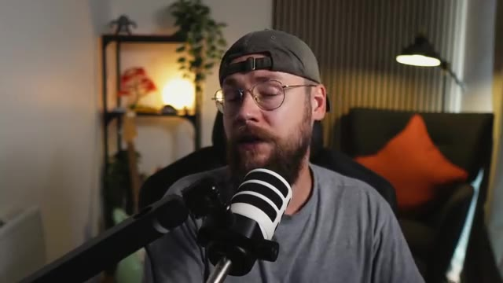

---

### ⏱️ `[00:20:55 - 00:21:30]` | Segment #39

**🔊 Audio (Transcription Intégrale Mot pour Mot en Français) :**
> Ça apporte juste un tout petit peu plus de texture aux visuels. C'est particulièrement utile si vous travaillez sur des vidéos IA photoréalistes. Elles peuvent donner l'impression d'être un peu trop brillantes, et le grain de pellicule salit un peu l'image, la rendant plus naturelle et imparfaite. Ceci étant dit, les gars, nous sommes arrivés à la fin du tutoriel d'aujourd'hui. Si vous l'avez apprécié, n'hésitez pas à lâcher un pouce bleu pour moi et à vous abonner. Si vous souhaitez creuser davantage, vous pouvez consulter ma communauté School gratuite. Il y aura un post là-bas avec tous les prompts que j'ai utilisés pendant...

**👁️ Analyse Visuelle d'Écran (gemini-3.5-flash-lite) :**
**Interface & Outils** : Vue caméra face (talking head) de Jack dans son studio, équipé d'un micro sur pied orienté vers lui. En arrière-plan, on aperçoit une étagère avec une plante et des objets de décoration, ainsi qu'un fauteuil avec un coussin orange.

**Contenu textuel & Code** : Aucun texte, prompt ou paramètre technique n'est affiché à l'écran dans ce plan.

**Action / Démonstration** : Jack s'adresse directement à la caméra en parlant, gesticulant légèrement des mains pour accentuer ses propos en fin de tutoriel.

---

### ⏱️ `[00:21:30 - 00:22:46]` | Segment #40

**🔊 Audio (Transcription Intégrale Mot pour Mot en Français) :**
> cette vidéo si vous vouliez les prendre et les utiliser pour vos propres projets créatifs. Terminons en jetant un dernier coup d'œil à ce segment du clip musical, et vous me direz si vous aimeriez voir l'intégralité de la vidéo terminée et voir où l'histoire se poursuit ensuite. Fais grimper une note que je ne peux pas régler ouais je sais à quoi ça ressemble mais je me fais avoir à chaque fois

**👁️ Analyse Visuelle d'Écran (gemini-3.5-flash-lite) :**
**Interface & Outils** : Le lecteur vidéo du navigateur ou de la plateforme de visionnage affiche le clip vidéo en plein écran au format 16:9, sans interface logicielle visible.

**Contenu textuel & Code** : Une illustration stylisée en noir et blanc de style bande dessinée ou concept art montrant un homme musclé torse nu, portant une casquette et un short déchiré, au centre d'une explosion ou d'une onde de choc. Des soldats en tenue tactique et des armes (fusils d'assaut) sont projetés dans les airs autour de lui, dans une composition dynamique en contre-plongée.
[CONTENU_TEXTE] Aucun texte ni prompt de génération apparent sur cette image, qui correspond au visionnage final de la séquence animée du clip musical.

**Action / Démonstration** : La vidéo du clip musical est jouée en continu pour présenter la conclusion de la séquence, illustrant l'action chaotique et explosive générée par l'intelligence artificielle.

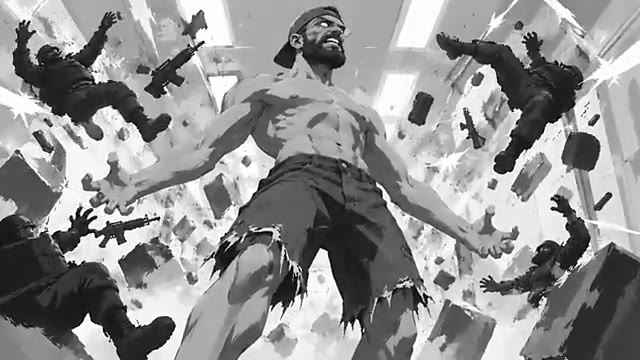

---

### ⏱️ `[00:22:46 - 00:23:03]` | Segment #41

**🔊 Audio (Transcription Intégrale Mot pour Mot en Français) :**
> Mets ton cou dedans Ils te contrôlent Je t'aime Je t'aime

**👁️ Analyse Visuelle d'Écran (gemini-3.5-flash-lite) :**
**Interface & Outils** : Plan fixe de style illustration numérique / animation stylisée, sans interface logicielle visible.

**Contenu textuel & Code** : Le personnage de Jack, barbu, torse nu, portant une casquette et un jean, avec des yeux blancs brillants (effet surnaturel ou IA), se tient au centre d'une pièce aux murs gris texturés, avec un lit visible en bas à gauche du cadre.

**Action / Démonstration** : Jack fait face à la caméra dans un plan moyen, les bras légèrement écartés et les paumes ouvertes vers le haut, adoptant une posture théâtrale et aliénée en lien avec le propos de la voix off.

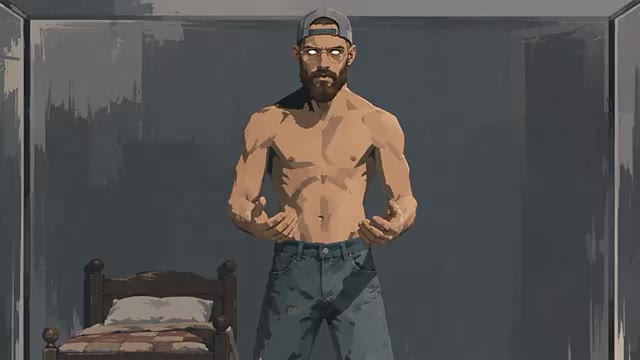

---
